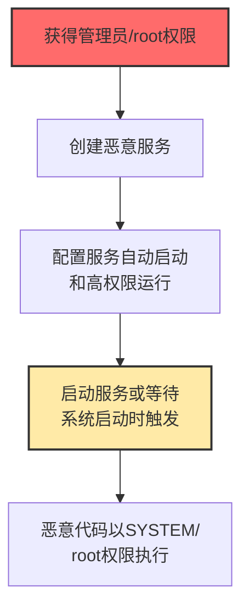

# 系统服务 (T1569)

## 一句话通俗理解

**攻击者创建或修改系统服务来执行恶意代码——因为服务开机自启、权限高、不引人注目，是完美的"卧底"。**

## 难度等级

⭐️⭐️ 中级（需要一定基础）

需要了解Windows/Linux/macOS的服务管理机制。

## 技术描述

系统服务是操作系统用来管理后台进程的机制。Windows有服务控制管理器（SCM），Linux有systemd，macOS有launchd。这些服务通常在系统启动时自动运行，具有较高的权限。攻击者通过创建恶意服务或修改现有服务来执行恶意代码，实现持久化和权限提升。

**通俗解释：**
系统服务就像酒店的"24小时值班经理"——他们一直在后台工作，从开业（开机）到打烊（关机），而且他们拥有可以打开所有房间的"总钥匙"（高权限）。攻击者收买（创建或修改）了这个值班经理，让他为攻击者做事。

**技术原理：**
1. 服务以特定的用户身份运行（通常为SYSTEM或root）
2. 服务可以配置为系统启动时自动启动
3. 服务可以在崩溃时自动重启（增强可靠性）
4. 服务通常不受用户会话的影响（即使用户注销也会继续运行）

**用途与影响：**
用于持久化（确保恶意代码在系统重启后继续运行）、权限提升（以SYSTEM/root权限执行）、隐蔽执行（服务运行在后台不引起注意）。

## 子技术列表

**该技术共有 3 个子技术：**

| 子技术ID | 中文名称 | 通俗解释 |
|----------|----------|----------|
| T1569.001 | Launchctl | macOS的服务管理工具，用于加载/卸载Launch Agent和Daemon |
| T1569.002 | 服务执行 | 利用Windows服务或Linux systemd服务执行恶意代码 |
| T1569.003 | Systemctl | Linux的服务管理工具，用于控制systemd服务 |

## 攻击流程



## 真实案例

### 案例1：勒索软件利用Windows服务实现持久化（2024）

- **时间**: 2024年
- **目标**: 全球企业
- **攻击组织**: Black Basta、LockBit等
- **手法**: 勒索软件使用`sc create`命令创建名称伪装为合法服务的恶意服务，指向勒索软件可执行文件。服务以SYSTEM权限运行且在系统启动时自动执行。
- **影响**: 勒索软件持久化难以清除
- **参考链接**: [CISA AA24-131A](https://www.cisa.gov/news-events/cybersecurity-advisories/aa24-131a)

### 案例2：Linux挖矿恶意软件利用systemd持久化（2024-2025）

- **时间**: 2024-2025年
- **目标**: Linux云服务器
- **攻击组织**: Kinsing、TeamTNT
- **手法**: 挖矿恶意软件创建systemd服务单元文件运行挖矿程序，使用合法服务名称伪装，使用systemctl enable确保开机启动。
- **影响**: 数十万云服务器被用于挖矿
- **参考链接**: [AquaSec Kinsing分析](https://www.aquasec.com/blog/kinsing-malware-container-vulnerability/)

### 案例3：macOS恶意软件利用LaunchDaemon持久化（2024）

- **时间**: 2024年
- **目标**: macOS用户
- **手法**: 创建恶意LaunchDaemon plist文件放置在/Library/LaunchDaemons/，配置为系统启动时以root权限执行恶意二进制文件，不会触发Gatekeeper警告。
- **影响**: macOS用户数据泄露
- **参考链接**: [Objective-See macOS持久化](https://objective-see.com/blog/blog_0x48.html)

## 红队视角

> ⚠️ **免责声明**：以下内容仅用于合法的安全测试、渗透测试和教育目的。未经授权对他人系统进行测试是违法行为。

### 常用工具

| 工具名称 | 用途 | 平台 | 链接 |
|----------|------|------|------|
| sc.exe | Windows服务管理工具 | Windows | 系统自带 |
| systemctl | Linux systemd管理工具 | Linux | 系统自带 |
| launchctl | macOS服务管理工具 | macOS | 系统自带 |

## 蓝队视角

### 检测方法

- 监控事件ID 7045（新服务安装）和4688（sc.exe执行）
- 检查系统中是否存在签名异常的第三方服务
- 定期审计/etc/systemd/system/和/Library/LaunchDaemons/目录

## 缓解措施

### 优先级1：关键措施

**措施名称：** 限制服务创建权限

**具体实施步骤：**
1. 仅允许管理员创建和修改系统服务
2. 通过组策略将服务管理权限委派给特定安全管理员
3. 定期审查具有服务创建权限的用户和组

**措施名称：** 启用Windows事件日志

**具体实施步骤：**
1. 启用事件ID 7045（新服务安装）的日志记录
2. 监控事件ID 4688（sc.exe进程创建）和4688（powershell New-Service）
3. 配置SIEM系统聚合和分析服务相关事件

### 优先级2：重要措施

**措施名称：** 使用WDAC/AppLocker

**具体实施步骤：**
1. 配置应用程序白名单策略，阻止未经授权的服务二进制文件执行
2. 对系统关键目录（%SystemRoot%、%ProgramFiles%）实施默认允许策略
3. 定期审查AppLocker策略日志中的拦截事件

**措施名称：** 监控系统服务变更

**具体实施步骤：**
1. 使用Sysmon监控服务注册表项变更（事件ID 13-注册表修改）
2. 监控服务DLL和可执行文件的文件系统变更
3. 部署完整性监控工具（如AIDE/Tripwire）检测服务文件篡改

### 优先级3：建议措施

**措施名称：** 定期审计已安装服务

**具体实施步骤：**
1. 建立月度审计流程，对比基线检查新增或修改的服务
2. 使用PowerShell脚本导出服务清单并自动比对
3. 对第三方服务进行厂商签名验证

### MITRE ATT&CK 缓解措施映射

| 缓解措施ID | 缓解措施名称 | 适用性 | 说明 |
|------------|-------------|--------|------|
| M1026 | 特权账户管理 | 适用 | 限制服务创建和修改权限至管理员账户 |
| M1029 | 系统审计日志 | 适用 | 启用事件ID 7045和4688的服务监控 |
| M1038 | 执行防护 | 适用 | 使用WDAC/AppLocker控制服务二进制执行 |
| M1045 | 软件限制 | 适用 | 使用Sysmon监控服务注册表和文件变更 |
| M1022 | 限制文件权限 | 适用 | 定期审计并验证已安装服务的完整性 |

## 检测建议

### 网络层检测

**检测方法：** 监控新创建的系统服务产生的异常网络连接，特别是服务以SYSTEM权限运行并建立到外部C2服务器的出站通信。

**具体规则/命令示例：**
```
# 检测新服务启动后的外连
suricata -r traffic.pcap --rule "alert tcp $HOME_NET any -> $EXTERNAL_NET $HTTP_PORTS (msg:\"New Service Network Connection\"; flow:to_server; sid:1000024;)"

# 检测服务账户的非标准网络活动
zeek -r traffic.pcap conn.log | grep -f service_account_sid.txt | grep -v "known_service"
```

### Windows事件ID

- 事件ID 7045：新服务安装
- 事件ID 4688：进程创建（监控sc.exe执行）

### Sigma规则示例

```yaml
title: New Service Creation - Suspicious
status: experimental
description: Detects creation of new Windows services
logsource:
    category: process_creation
    product: windows
detection:
    selection:
        Image|endswith: '\sc.exe'
        CommandLine|contains: 'create'
    condition: selection
level: medium
tags:
    - attack.t1569
```

## 动手实验

> ⚠️ **重要提示**：所有实验必须在隔离的实验室环境中进行，禁止对未授权的真实系统进行测试。

### 实验1：Windows服务操作

```cmd
sc create TestService binPath= "C:\temp\test.exe" start= auto
sc query TestService
sc delete TestService
```

### 实验2：Linux systemd服务操作

```bash
# 创建服务单元文件
sudo cat > /etc/systemd/system/test.service << EOF
[Unit]
Description=Test Service
[Service]
ExecStart=/tmp/test.sh
Restart=always
[Install]
WantedBy=multi-user.target
EOF

sudo systemctl enable test.service
sudo systemctl start test.service
```

## 术语解释

| 术语 | 英文原名 | 通俗解释 |
|------|----------|----------|
| SCM | Service Control Manager | Windows的"服务总管" |
| systemd | System Daemon | Linux的"系统管家" |
| launchd | Launch Daemon | macOS的"服务启动器" |
| LaunchDaemon | Launch Daemon | macOS"系统级服务员"（root权限） |
| LaunchAgent | Launch Agent | macOS"用户级服务员"（用户权限） |
| systemctl | System Control | Linux的"服务遥控器" |

## 参考资料

- [MITRE ATT&CK T1569官方页面](https://attack.mitre.org/techniques/T1569/)
- [Windows服务安全加固](https://docs.microsoft.com/windows/security/threat-protection/security-hardening/)
- [systemd安全特性](https://www.freedesktop.org/wiki/Software/systemd/)
- [macOS持久化机制](https://objective-see.com/blog/blog_0x48.html)
