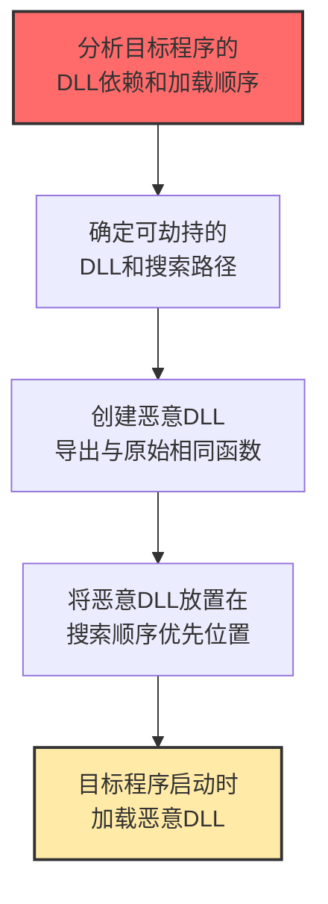

# 劫持执行流 (T1574)

## 一句话通俗理解

**攻击者利用程序加载DLL时的"搜索顺序"漏洞，让程序"不小心"加载恶意的DLL——就像在图书馆里，把假书放在真书前面的位置。**

## 难度等级

⭐️⭐️⭐️ 高级（需要深入技术知识）

需要深入理解操作系统和应用程序的模块加载机制。

## 技术描述

劫持执行流是指攻击者通过修改系统或应用程序查找和加载可执行代码的方式，使得恶意代码被提前执行或替代合法代码。Windows在加载DLL时会按照特定顺序搜索目录，攻击者利用这个特性，在合法DLL之前的位置放置恶意同名DLL，让程序"误加载"恶意版本。

**通俗解释：**
图书馆的书架上有一排书（DLL的搜索路径）。管理员会按顺序从第一本开始找需要的书（搜索顺序）。攻击者把一本假书放在真书应该出现的位置前面——管理员先找到了假书，就拿走了，根本不会看到后面的真书。程序加载DLL也是同样的道理。

**技术原理：**
1. Windows加载DLL时按特定顺序搜索：应用程序目录 → 系统目录 → Windows目录 → PATH目录
2. 攻击者在应用程序目录中放置与系统DLL同名的恶意DLL
3. 由于应用程序目录优先于系统目录，程序会先加载恶意版本
4. 恶意DLL导出与原始DLL相同的函数，同时添加恶意功能

**用途与影响：**
用于持久化（每次程序启动时恶意DLL被加载）、权限提升（在合法进程中执行）、防御规避（恶意代码在受信任进程中运行）、绕过应用程序白名单（DLL侧加载使用签名程序）。

## 子技术列表

**该技术共有 14 个子技术：**

| 子技术ID | 中文名称 | 通俗解释 |
|----------|----------|----------|
| T1574.001 | DLL搜索顺序劫持 | 在合法DLL之前放置恶意同名DLL |
| T1574.004 | dylib劫持 | macOS版本的DLL劫持 |
| T1574.005 | 可执行安装程序文件权限弱点 | 利用安装程序文件的权限漏洞 |
| T1574.006 | 动态链接器劫持 | 劫持操作系统的动态链接器 |
| T1574.007 | PATH劫持 | 在PATH环境变量目录中放置恶意程序 |
| T1574.008 | 搜索顺序劫持 | 更广泛的搜索顺序利用 |
| T1574.009 | 未引用路径劫持 | 利用服务路径中未加引号的空格 |
| T1574.010 | 服务权限劫持 | 利用服务的权限配置漏洞 |
| T1574.011 | 服务注册表权限弱点 | 利用服务注册表键的权限漏洞 |
| T1574.012 | COR_PROFILER劫持 | 利用.NET性能分析器环境变量 |
| T1574.013 | KernelCallbackTable劫持 | 劫持进程的内核回调表 |
| T1574.014 | AppDomainManager劫持 | 劫持.NET的AppDomain管理器 |

## 攻击流程



## 真实案例

### 案例1：韩国APT组织利用DLL搜索顺序劫持进行持久化（2024）

- **时间**: 2024年
- **目标**: 韩国政府和企业
- **手法**: 多个韩国APT组织使用DLL搜索顺序劫持作为首选持久化技术。将恶意DLL放置在应用程序目录中，让合法程序加载恶意版本，继承程序的信任级别。
- **影响**: 政府和企业数据长期泄露
- **参考链接**: [Mandiant DLL劫持分析](https://www.mandiant.com/resources/blog/apt-dll-hijacking)

### 案例2：未引用服务路径权限提升（2024）

- **时间**: 2024年
- **目标**: Windows企业环境
- **手法**: 利用Windows服务配置中未用引号括起来的路径提升权限。攻击者在路径的第一个目录中放置恶意可执行文件，当服务启动时先执行攻击者文件。
- **影响**: 权限提升到SYSTEM
- **参考链接**: [Exploit-DB未引用路径](https://www.exploit-db.com/docs/english/47013-unquoted-service-path-enumeration-and-privilege-escalation-windows.pdf)

### 案例3：LockBit利用DLL侧加载执行恶意载荷（2024）

- **时间**: 2024年
- **目标**: 全球企业
- **攻击组织**: LockBit
- **手法**: LockBit使用DLL侧加载技术，将恶意DLL与合法签名可执行文件一起打包。当用户执行合法程序时自动加载同目录下的恶意DLL，绕过应用程序白名单。
- **影响**: 勒索软件成功部署
- **参考链接**: [TrendMicro LockBit分析](https://www.trendmicro.com/en_us/research/24/a/lockbit-ransomware-analysis.html)

## 红队视角

> ⚠️ **免责声明**：以下内容仅用于合法的安全测试、渗透测试和教育目的。未经授权对他人系统进行测试是违法行为。

### 常用工具

| 工具名称 | 用途 | 平台 | 链接 |
|----------|------|------|------|
| Dependency Walker | DLL依赖分析工具 | Windows | https://www.dependencywalker.com/ |
| Process Monitor | 进程活动监控（查看DLL加载） | Windows | https://docs.microsoft.com/en-us/sysinternals/downloads/procmon |

## 蓝队视角

### 检测方法

- 使用Sysmon监控DLL加载事件，检测来自非标准路径的DLL
- 使用Process Monitor分析进程启动时的DLL加载顺序
- 监控服务路径中包含未引号路径的创建事件

## 缓解措施

### 优先级1：关键措施

**措施名称：** 应用程序控制策略

**具体实施步骤：**
1. 启用Windows Defender Application Control（WDAC）或AppLocker，限制DLL加载来源
2. 配置仅允许从受信任路径（如System32、Program Files）加载DLL
3. 实施DLL加载验证策略，阻止从用户可写目录加载DLL

### 优先级2：重要措施

**措施名称：** 服务体系加固—防止未引用服务路径劫持

**具体实施步骤：**
1. 扫描所有Windows服务路径，确保路径中的空格被引号正确括起来
2. 修复所有包含未引用路径的服务配置
3. 限制`HKLM\SYSTEM\CurrentControlSet\Services`的写入权限

**配置示例：**
```bash
# 扫描未引用服务路径
wmic service get name,pathname | findstr /V "\"" | findstr " "

# 检查可写目录中的DLL
icacls "C:\Program Files\VulnerableApp" | findstr "BUILTIN\\Users"
```

### MITRE ATT&CK 缓解措施映射

| 缓解措施ID | 缓解措施名称 | 适用性 | 说明 |
|------------|-------------|--------|------|
| M1022 | 应用程序控制 | 适用 | 使用WDAC或AppLocker控制DLL加载 |
| M1025 | 保护注册表 | 适用 | 保护服务注册表项 |
| M1018 | 用户账户控制 | 部分适用 | 限制应用程序目录的写入权限 |

## 检测建议

### 网络层检测

**检测方法：** 监控通过SMB协议进行DLL分发的网络流量，检测从共享文件夹加载DLL的异常行为。

**具体规则/命令示例：**
```bash
# 检测SMB上的可疑DLL传输
tcpdump -i eth0 port 445 and not net local_net -w smb_dll.pcap

# 监控从网络共享加载DLL的NetApp事件
zeek -r traffic.pcap smb_files.log | grep "\.dll"
```

### 主机层检测

**检测方法：** 监控DLL加载事件，检测从可写用户目录、临时目录等非标准位置加载DLL的行为。

**Windows事件ID：**
- 7（Sysmon DLL加载）- 监控所有DLL加载事件，关注非标准路径
- 1（Sysmon进程创建）- 监控进程启动时的命令行参数
- 4688（进程创建）- 配合事件ID 7关联分析

**Linux日志：**
- （不适用，DLL劫持为Windows特有技术）

**具体命令示例：**
```bash
# 使用Process Monitor筛选DLL加载事件
# Procmon.exe /BackingFile dll_load.pml /Column "Process Name","Image Path"

# 使用Sysmon查询来自Temp目录的DLL加载
Get-WinEvent -FilterHashtable @{LogName='Microsoft-Windows-Sysmon/Operational'; ID=7} | Where-Object {$_.Properties[2].Value -match "Temp|Downloads|AppData"} | Select-Object TimeCreated, Message -First 20

# 检测未引用服务路径
Get-WmiObject win32_service | Where-Object { $_.PathName -notmatch '^"' -and $_.PathName -match '\s' } | Select-Object Name, PathName
```

### 应用层检测

**Sigma规则示例：**

```yaml
title: DLL Load from Suspicious Directory
status: experimental
description: Detects DLL loaded from writeable user directories
logsource:
    category: image_load
    product: windows
detection:
    selection:
        ImageLoaded|contains:
            - '\AppData\Local\Temp\'
            - '\Users\*\Downloads\'
            - '\Users\*\AppData\Roaming\'
    condition: selection
level: medium
tags:
    - attack.t1574
```

## 动手实验

> ⚠️ **重要提示**：所有实验必须在隔离的实验室环境中进行，禁止对未授权的真实系统进行测试。

### 实验1：检测未引用服务路径

```powershell
Get-WmiObject win32_service | Where-Object {
    $_.PathName -notmatch '^"' -and $_.PathName -match '\s'
} | Select-Object Name, PathName
```

## 术语解释

| 术语 | 英文原名 | 通俗解释 |
|------|----------|----------|
| DLL劫持 | DLL Hijacking | 让程序加载"假DLL"的技术 |
| DLL侧加载 | DLL Side-loading | 把恶意DLL和合法程序放一起，程序启动时自动加载 |
| 未引用路径 | Unquoted Service Path | 路径中有空格但没加引号，系统会"猜"哪里是路径 |
| COR_PROFILER | COR Profiler | .NET的"性能监控"环境变量 |
| 代理DLL | Proxy DLL | 既转发原始功能又添加恶意代码的"双面DLL" |

## 参考资料

- [MITRE ATT&CK T1574官方页面](https://attack.mitre.org/techniques/T1574/)
- [DLL搜索顺序劫持分析](https://www.exploit-db.com/docs/english/40564-dll-hijacking.pdf)
- [未引用服务路径漏洞](https://www.exploit-db.com/docs/english/47013-unquoted-service-path-enumeration-and-privilege-escalation-windows.pdf)
- [LockBit勒索软件分析](https://www.trendmicro.com/en_us/research/24/a/lockbit-ransomware-analysis.html)
