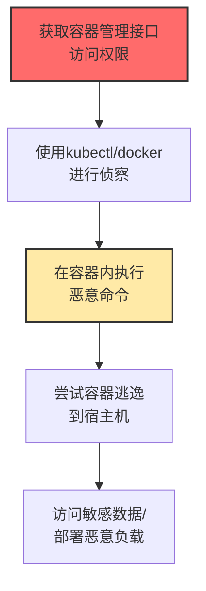

# 容器管理命令 (T1609)

## 一句话通俗理解

**攻击者利用kubectl、docker等容器管理工具执行恶意操作——就像拿到了数据中心的万能钥匙，可以操控所有服务器。**

## 难度等级

⭐️⭐️ 中级（需要一定基础）

需要了解Docker、Kubernetes等容器技术的基本操作。

## 技术描述

容器管理命令是指攻击者利用容器编排平台（如Kubernetes、Docker Swarm）或容器运行时的命令行接口来执行恶意操作。攻击者在获得容器环境访问权限后，可以使用kubectl、docker CLI等工具来部署恶意容器、在容器内执行命令、访问敏感数据，甚至逃逸到宿主机。

**通俗解释：**
容器环境就像一个大型的"集装箱码头"（Kubernetes集群），而kubectl和docker CLI就是管理这个码头的"调度系统"。攻击者拿到调度系统的密码后，可以往码头里放假的集装箱（恶意容器），或者让码头工人（容器）去做非法的事情。

**技术原理：**
1. Kubernetes通过API服务器管理所有资源，kubectl是与API服务器通信的CLI工具
2. Docker daemon提供REST API来管理容器
3. 这些管理接口通常需要认证，但配置错误可能导致未授权访问
4. 攻击者使用`kubectl exec`在容器中执行命令，`docker run`部署新容器

## 攻击流程



## 真实案例

### 案例1：runc容器逃逸漏洞CVE-2024-21626 "Leaky Vessels"（2024）

- **时间**: 2024年
- **目标**: 所有使用runc的容器环境
- **手法**: 安全研究人员发现runc中存在严重的容器逃逸漏洞（CVE-2024-21626，CVSS 8.6）。攻击者通过构造特殊容器镜像，利用文件描述符泄漏访问宿主机文件系统。影响了所有主流容器平台。
- **影响**: 全球容器环境面临逃逸风险
- **参考链接**: [Wiz Leaky Vessels分析](https://www.wiz.io/blog/leaky-vessels-runc-docker-cve-2024-21626)

### 案例2：NVIDIA容器工具包逃逸漏洞CVE-2024-0132（2024）

- **时间**: 2024年
- **目标**: 运行AI/ML工作负载的容器环境
- **手法**: NVIDIA容器工具包存在容器逃逸漏洞（CVSS 9.0），攻击者通过构造OCI镜像逃逸容器获得宿主机文件系统读写权限。
- **影响**: AI工作负载环境面临严重威胁
- **参考链接**: [Wiz NVIDIA漏洞分析](https://www.wiz.io/blog/wiz-research-uncovers-exploit-critical-nvidia-ai-vulnerability)

### 案例3：Kubernetes RBAC配置错误导致集群接管（2024-2025）

- **时间**: 2024-2025年
- **目标**: 使用Kubernetes的企业
- **手法**: 大量Kubernetes集群存在RBAC配置错误。攻击者利用过度授权的服务账户，使用kubectl exec获得Pod shell，然后利用容器逃逸漏洞获得宿主机权限。
- **影响**: 企业容器集群被完全控制
- **参考链接**: [K8s RBAC最佳实践](https://kubernetes.io/docs/concepts/security/rbac-good-practices/)

## 红队视角

> ⚠️ **免责声明**：以下内容仅用于合法的安全测试、渗透测试和教育目的。未经授权对他人系统进行测试是违法行为。

### 常用工具

| 工具名称 | 用途 | 平台 | 链接 |
|----------|------|------|------|
| kubectl | Kubernetes管理命令行工具 | 跨平台 | https://kubernetes.io/docs/reference/kubectl/ |
| docker | 容器管理命令行工具 | 跨平台 | https://docker.com |
| crictl | CRI兼容的容器运行时CLI | Linux | 系统自带 |

### 实战技巧

- 使用kubectl exec在目标Pod中执行命令
- 利用kubectl run创建临时恶意容器
- 通过配置错误的RBAC角色进行权限提升

## 蓝队视角

### 检测方法

- 启用Kubernetes审计日志，监控所有kubectl命令
- 监控容器管理API的调用频率和来源IP
- 使用Falco等运行时安全工具检测容器内异常行为

## 缓解措施

### 优先级1：关键措施

**措施名称：** RBAC最小权限策略

**具体实施步骤：**
1. 创建最小权限的RBAC角色绑定，避免使用cluster-admin角色
2. 定期审计ServiceAccount的权限范围，删除不需要的权限
3. 对kubectl exec、kubectl run等高危命令设置审批流程

### 优先级2：重要措施

**措施名称：** 容器管理网络安全隔离

**具体实施步骤：**
1. 保护Kubernetes API Server和Docker daemon端口（6443/2375）不暴露在公网
2. 实施网络策略（NetworkPolicy）限制Pod的出入站流量
3. 启用TLS认证和客户端证书验证

**配置示例：**
```bash
# 检查暴露的Kubernetes API Server
kubectl get endpoints kubernetes -o yaml

# 检查当前RBAC绑定，查找过度授权的ServiceAccount
kubectl get clusterrolebindings -o json | jq '.items[] | select(.roleRef.name=="cluster-admin")'

# 检查匿名访问是否启用
kubectl auth can-i --list --as=system:anonymous
```

### MITRE ATT&CK 缓解措施映射

| 缓解措施ID | 缓解措施名称 | 适用性 | 说明 |
|------------|-------------|--------|------|
| M1026 | 特权账户管理 | 适用 | 严格管理RBAC角色绑定 |
| M1030 | 网络分段 | 适用 | 隔离容器管理网络 |
| M1042 | 禁用功能或服务 | 适用 | 禁用特权容器和匿名访问 |

## 检测建议

### 网络层检测

**检测方法：** 监控Kubernetes API Server（端口6443）和Docker daemon（端口2375/2376）的网络访问流量，检测来自异常源IP的管理请求。

**具体规则/命令示例：**
```bash
# 监控Docker API的异常访问
tcpdump -i eth0 port 2375 or port 2376 -w docker_api.pcap

# 监控Kubernetes API Server的未授权请求
tcpdump -i eth0 port 6443 and not host trusted-cidr -w k8s_api.pcap
```

### 主机层检测

**检测方法：** 启用Kubernetes审计日志和容器运行时审计，监控所有容器管理命令的执行。

**Windows事件ID：**
- （不适用，容器管理命令通常运行在Linux系统上）

**Linux日志：**
- `/var/log/kubernetes/audit.log` - Kubernetes审计日志
- `/var/log/syslog` - Docker daemon操作日志
- `/var/log/containers/` - 容器运行时日志

**具体命令示例：**
```bash
# 查看Kubernetes审计日志中的kubectl exec事件
grep '"kubectl exec"' /var/log/kubernetes/audit.log | jq '.user.username, .objectRef.resource, .requestURI'

# 使用Falco检测容器内异常命令执行
falco -r /etc/falco/falco_rules.yaml | grep "kubectl exec"

# 查看Docker API访问日志
journalctl -u docker | grep "POST /v1.\|containers/create\|exec/create"
```

### 应用层检测

**Sigma规则示例：**

```yaml
title: Kubernetes Pod Execution via Kubectl
status: experimental
description: Detects kubectl exec or run commands in audit logs
logsource:
    category: process_creation
    product: linux
detection:
    selection:
        CommandLine|contains:
            - 'kubectl exec'
            - 'kubectl run'
            - 'kubectl --namespace'
    condition: selection
level: medium
tags:
    - attack.t1609
```

## 动手实验

> ⚠️ **重要提示**：所有实验必须在隔离的实验室环境中进行，禁止对未授权的真实系统进行测试。

### 实验1：Kubernetes安全检查

```bash
kubectl auth can-i --list
kubectl get clusterrolebindings -o json | jq '.items[] | select(.roleRef.name=="cluster-admin")'
kubectl auth can-i --list --as=system:anonymous
```

## 术语解释

| 术语 | 英文原名 | 通俗解释 |
|------|----------|----------|
| kubectl | Kubernetes Control | K8s的"遥控器"命令行工具 |
| Docker | Docker | 最流行的"集装箱"（容器）平台 |
| RBAC | Role-Based Access Control | 基于角色的"门禁系统" |
| Pod | Pod | Kubernetes的"最小工作单元" |
| 容器逃逸 | Container Escape | 从容器"越狱"到宿主机的技术 |

## 参考资料

- [MITRE ATT&CK T1609官方页面](https://attack.mitre.org/techniques/T1609/)
- [Leaky Vessels漏洞分析](https://www.wiz.io/blog/leaky-vessels-runc-docker-cve-2024-21626)
- [NVIDIA容器工具包漏洞](https://www.wiz.io/blog/wiz-research-uncovers-exploit-critical-nvidia-ai-vulnerability)
- [K8s RBAC最佳实践](https://kubernetes.io/docs/concepts/security/rbac-good-practices/)
