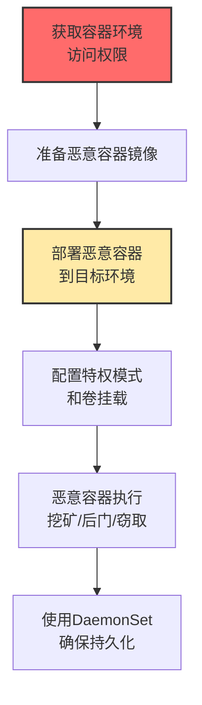

# 部署容器 (T1610)

## 一句话通俗理解

**攻击者向Kubernetes集群部署恶意容器来运行挖矿、后门等恶意负载——就像在你的数据中心里偷偷放了一台自己的服务器。**

## 难度等级

⭐️⭐️ 中级（需要一定基础）

需要了解容器编排平台的操作方式。

## 技术描述

部署容器是指攻击者将恶意容器镜像部署到目标环境中来执行恶意代码。攻击者可以利用暴露的Docker API、Kubernetes API服务器或被盗的凭证来部署恶意容器。这些容器可以运行挖矿软件、后门程序、数据窃取工具，甚至可以配置为特权容器来逃逸到宿主机。

**通俗解释：**
攻击者找到你数据中心的一个空角落（没有认证的容器管理接口），放了一台自己的电脑（恶意容器）进去。这台电脑连接着你的电（计算资源）、网络（带宽）和空调（散热）。你不仅要为它的电费买单，它还在偷偷帮你干坏事（挖矿）。

**技术原理：**
1. 容器编排平台（Kubernetes、Docker Swarm）允许用户部署和管理容器
2. 攻击者通过API或CLI创建Pod/容器，指定要运行的镜像
3. 容器镜像可以从公共仓库（如Docker Hub）拉取
4. 攻击者可以使用DaemonSet确保镜像在集群每个节点上运行
5. 特权容器可以访问宿主机的设备和文件系统

## 攻击流程



## 真实案例

### 案例1：Kinsing僵尸网络持续攻击容器环境（2024-2025）

- **时间**: 2024-2025年
- **目标**: 全球云原生应用和容器环境
- **攻击组织**: Kinsing
- **手法**: Kinsing利用暴露的Docker API、Kubernetes API服务器漏洞或配置错误获得访问。部署运行加密货币挖矿软件的容器，利用DaemonSet确保在集群每个节点上都运行挖矿容器。
- **影响**: 数十万节点被用于加密货币挖矿
- **参考链接**: [AquaSec Kinsing分析](https://www.aquasec.com/blog/kinsing-malware-container-vulnerability/)

### 案例2：TeamTNT利用暴露的Docker API部署挖矿容器（2024）

- **时间**: 2024年
- **目标**: 暴露Docker daemon的云服务器
- **攻击组织**: TeamTNT
- **手法**: 系统性地扫描暴露的Docker daemon API端口（2375/2376），获得未授权访问后部署恶意容器。使用标准Ubuntu基础镜像规避扫描，容器配置为特权模式并挂载宿主机根文件系统。
- **影响**: 大量云服务器被用于挖矿
- **参考链接**: [AquaSec TeamTNT分析](https://www.aquasec.com/blog/container-security-tnt-container-attack/)

### 案例3：CRI-O容器逃逸漏洞CVE-2024-5321（2024）

- **时间**: 2024年
- **目标**: 使用CRI-O的Kubernetes集群
- **手法**: CRI-O容器运行时中存在严重容器逃逸漏洞（CVSS 9.9），攻击者可通过竞态条件在容器创建过程中操纵挂载点访问宿主机文件系统。
- **影响**: Kubernetes集群面临沦陷风险
- **参考链接**: [CRI-O安全公告](https://github.com/cri-o/cri-o/security/advisories)

## 红队视角

> ⚠️ **免责声明**：以下内容仅用于合法的安全测试、渗透测试和教育目的。未经授权对他人系统进行测试是违法行为。

### 常用工具

| 工具名称 | 用途 | 平台 | 链接 |
|----------|------|------|------|
| kubectl | Kubernetes容器管理 | 跨平台 | https://kubernetes.io/docs/reference/kubectl/ |
| docker | Docker容器管理 | 跨平台 | https://docker.com |
| ctr/nerdctl | containerd容器管理 | Linux | 系统自带 |

### 实战技巧

- 使用`docker run -v /:/host`挂载宿主机文件系统
- 使用`--privileged`参数创建特权容器
- 通过kubectl创建DaemonSet在所有节点部署恶意容器

## 蓝队视角

### 检测方法

- 监控容器创建事件，特别关注特权容器和宿主机挂载
- 监控镜像拉取来源，阻止来自未知仓库的镜像
- 启用Kubernetes准入控制器（PSP/OPA Gatekeeper）

## 缓解措施

### 优先级1：关键措施

**措施名称：** 限制特权容器和危险卷挂载

**具体实施步骤：**
1. 使用Pod Security Standards（PSS）或OPA Gatekeeper准入控制器限制特权容器
2. 阻止容器以root用户运行或使用hostNetwork/hostPID模式
3. 限制危险卷挂载（如宿主机的`/var/run/docker.sock`、`/`根目录）

### 优先级2：重要措施

**措施名称：** 容器镜像安全准入控制

**具体实施步骤：**
1. 配置镜像白名单，只允许从受信任的镜像仓库拉取
2. 使用镜像签名验证（如Cosign/Docker Content Trust）确保镜像完整性
3. 部署镜像扫描工具（如Trivy、Clair）在部署前扫描镜像漏洞

**配置示例：**
```bash
# 检查特权容器
docker inspect --format='{{.Name}} {{.HostConfig.Privileged}}' $(docker ps -q)

# 使用kubectl查找所有特权Pod
kubectl get pods --all-namespaces -o json | jq '.items[] | select(.spec.containers[].securityContext.privileged==true) | .metadata.name'

# OPA Gatekeeper限制特权容器的约束模板示例
kubectl get constraints | grep privileged
```

### MITRE ATT&CK 缓解措施映射

| 缓解措施ID | 缓解措施名称 | 适用性 | 说明 |
|------------|-------------|--------|------|
| M1030 | 网络分段 | 适用 | 保护容器管理接口不暴露在公网 |
| M1018 | 用户账户控制 | 适用 | 实施RBAC最小权限 |
| M1042 | 禁用功能或服务 | 适用 | 限制特权容器和危险卷挂载 |

## 检测建议

### 网络层检测

**检测方法：** 监控容器镜像拉取流量、容器管理API（Docker daemon端口2375/2376、Kubernetes API端口6443）的异常访问。

**具体规则/命令示例：**
```bash
# 监控异常容器镜像拉取流量
tcpdump -i eth0 port 443 -A | grep "registry\.docker\.io\|registry-1\.docker\.io"

# 检测外部对Kubernetes API Server的容器创建请求
tcpdump -i eth0 port 6443 -A | grep "POST /api/v1/namespaces/\|POST /apis/apps/v1/"
```

### 主机层检测

**检测方法：** 监控容器部署相关进程创建（docker run、kubectl run）、镜像拉取事件和特权容器创建。

**Windows事件ID：**
- （不适用，容器管理命令通常运行在Linux系统上）

**Linux日志：**
- `/var/log/kubernetes/audit.log` - Kubernetes审计日志
- `/var/log/docker.log` / `journalctl -u docker` - Docker daemon日志
- `/var/log/audit/audit.log` - Linux审计日志

**具体命令示例：**
```bash
# 查看Kubernetes审计日志中的容器部署事件
grep '"Create.*Pod\|DeployContainer\|CreateContainer"' /var/log/kubernetes/audit.log | jq '.objectRef.name, .user.username'

# 查看Docker容器创建日志
journalctl -u docker | grep "POST /containers/create"

# 检测特权容器的部署
kubectl get events --all-namespaces --field-selector reason=Created -o wide | grep "privileged"
```

### 应用层检测

**Sigma规则示例：**

```yaml
title: Malicious Container Deployment
status: experimental
description: Detects container deployment with suspicious parameters
logsource:
    category: process_creation
    product: linux
detection:
    selection:
        CommandLine|contains|all:
            - 'docker run'
            - '-v /'
            - '--privileged'
    condition: selection
level: high
tags:
    - attack.t1610
```

## 动手实验

> ⚠️ **重要提示**：所有实验必须在隔离的实验室环境中进行，禁止对未授权的真实系统进行测试。

### 实验1：检查Docker daemon安全配置

```bash
# 检查Docker daemon是否暴露
curl -s http://localhost:2375/version
# 检查特权容器
docker inspect --format='{{.HostConfig.Privileged}}' $(docker ps -q)
```

### 实验2：Kubernetes安全检查

```bash
# 检查是否有特权Pod
kubectl get pods --all-namespaces -o json | jq '.items[] | select(.spec.containers[].securityContext.privileged==true)'
```

## 术语解释

| 术语 | 英文原名 | 通俗解释 |
|------|----------|----------|
| 容器镜像 | Container Image | 包含应用程序和环境的"模板文件" |
| DaemonSet | DaemonSet | K8s保证"每个节点都运行一个"的控制器 |
| 特权容器 | Privileged Container | 拥有"宿主机root权限"的危险容器 |
| 准入控制 | Admission Control | K8s的"安检系统" |

## 参考资料

- [MITRE ATT&CK T1610官方页面](https://attack.mitre.org/techniques/T1610/)
- [Kinsing恶意软件分析](https://www.aquasec.com/blog/kinsing-malware-container-vulnerability/)
- [TeamTNT容器攻击分析](https://www.aquasec.com/blog/container-security-tnt-container-attack/)
- [K8s安全最佳实践](https://kubernetes.io/docs/concepts/security/overview/)
