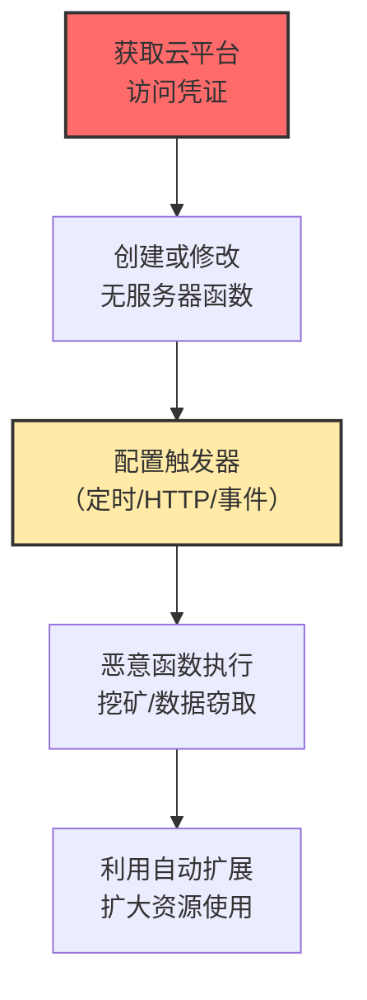

# 无服务器执行 (T1648)

## 一句话通俗理解

**攻击者利用AWS Lambda、Azure Functions等"无服务器"平台来执行恶意代码——你为攻击者的挖矿账单买单，还毫不知情。**

## 难度等级

⭐️⭐️ 中级（需要一定基础）

需要了解云平台的无服务器计算服务和IAM配置。

## 技术描述

无服务器执行是指攻击者利用云平台的无服务器计算服务（如AWS Lambda、Azure Functions、Google Cloud Functions）来执行恶意代码。无服务器平台允许开发者在不管理服务器的情况下运行代码，攻击者可以利用被盗的云凭证或配置错误来部署恶意函数，用于挖矿、数据窃取、命令控制等目的。

**通俗解释：**
无服务器就像"共享充电宝"——你不需要自己买充电宝（服务器），按使用次数付费就行。攻击者偷了你的共享充电宝账号，租了大量的充电宝来给自己的设备充电（挖矿），而你收到了天价的账单。

**技术原理：**
1. 无服务器函数由事件触发（HTTP请求、定时器、文件上传等）
2. 函数运行在短暂的、自动扩展的容器中
3. 函数按使用量计费（执行次数、执行时间）
4. 攻击者使用被盗凭证创建恶意函数，配置定时触发器持续运行

## 攻击流程



## 真实案例

### 案例1：EMERALDWHALE大规模窃取云凭证（2024）

- **时间**: 2024年
- **目标**: 暴露Git配置的云环境
- **手法**: 攻击者利用暴露的Git配置和错误配置的云服务，窃取了超过15,000个云凭证。这些凭证被用于在AWS Lambda等无服务器平台上部署挖矿函数，利用Lambda的自动扩展特性消耗大量计算资源。
- **影响**: 15,000+云凭证被盗
- **参考链接**: [Sysdig EMERALDWHALE分析](https://sysdig.com/blog/emeraldwhale-15000-cloud-credentials-stolen/)

### 案例2：Azure Functions滥用进行加密货币挖矿（2024）

- **时间**: 2024年
- **目标**: 使用Azure的企业
- **手法**: 攻击者获得Azure订阅访问权限后，创建恶意的Azure Function由定时触发器激活，定期执行加密货币挖矿算法。利用Azure的多个区域部署函数分散资源使用。
- **影响**: 受害者产生巨额云费用
- **参考链接**: [CISA网络安全公告](https://www.cisa.gov/news-events/cybersecurity-advisories)

### 案例3：利用Lambda函数URL进行数据外泄（2024）

- **时间**: 2024年
- **目标**: 使用AWS的企业
- **手法**: 攻击者利用AWS Lambda的函数URL功能，创建恶意数据外泄函数。当接收到HTTP请求时，从S3或其他AWS服务中读取敏感数据并返回给请求者。
- **影响**: 云数据被批量窃取
- **参考链接**: [AWS安全博客](https://aws.amazon.com/blogs/security/)

## 红队视角

> ⚠️ **免责声明**：以下内容仅用于合法的安全测试、渗透测试和教育目的。未经授权对他人系统进行测试是违法行为。

### 常用工具

| 工具名称 | 用途 | 平台 | 链接 |
|----------|------|------|------|
| AWS CLI | AWS命令行管理工具 | 跨平台 | https://aws.amazon.com/cli/ |
| Azure CLI | Azure命令行管理工具 | 跨平台 | https://docs.microsoft.com/cli/azure/ |
| CloudMapper | AWS环境侦察工具 | 跨平台 | https://github.com/duo-labs/cloudmapper |

## 蓝队视角

### 检测方法

- 监控CloudTrail中Lambda函数创建和更新事件
- 检测函数日志的篡改和删除行为
- 监控异常的函数执行频率和触发器调用来源

## 缓解措施

### 优先级1：关键措施

**措施名称：** IAM最小权限策略

**具体实施步骤：**
1. 为Lambda/Azure Functions函数分配最小必要权限的IAM执行角色
2. 限制函数只能访问特定资源（如特定S3桶、特定数据库）
3. 禁用函数在VPC外访问内部资源，使用VPC配置隔离执行环境

### 优先级2：重要措施

**措施名称：** 无服务器函数代码完整性保护

**具体实施步骤：**
1. 对函数代码使用版本控制和代码签名验证
2. 配置函数代码加密（AWS KMS/Azure Key Vault）
3. 部署函数之前进行安全扫描，检测依赖库漏洞

**配置示例：**
```bash
# 检查Lambda函数的IAM执行角色
aws lambda get-function --function-name function-name --query 'Configuration.Role'

# 列出所有Lambda函数及其最新修改时间
aws lambda list-functions --query 'Functions[*].[FunctionName,Runtime,LastModified]' --output table

# 检查审计日志中的函数创建事件
aws cloudtrail lookup-events --lookup-attributes AttributeKey=EventName,AttributeValue=CreateFunction --max-results 10
```

### MITRE ATT&CK 缓解措施映射

| 缓解措施ID | 缓解措施名称 | 适用性 | 说明 |
|------------|-------------|--------|------|
| M1026 | 特权账户管理 | 适用 | 最小权限IAM策略 |
| M1032 | MFA | 适用 | 对所有管理账户启用MFA |
| M1017 | 用户培训 | 适用 | 教育团队保护云凭证 |

## 检测建议

### 网络层检测

**检测方法：** 监控无服务器函数触发的出站网络流量、函数URL调用请求，检测异常的数据外泄或挖矿通信。

**具体规则/命令示例：**
```bash
# 检测Lambda函数异常出站流量（挖矿池通信）
tcpdump -i eth0 port 3333 or port 8888 or host pool.miner.com -w lambda_outbound.pcap

# 监控Lambda函数URL的异常调用来源
tcpdump -i eth0 host lambda-url.amazonaws.com -A | grep "GET /2015-03-31/functions"
```

### 主机层检测

**检测方法：** 监控云平台审计日志中的无服务器函数创建、代码更新和配置修改事件。

**Windows事件ID：**
- （不适用，无服务器函数在云平台运行）

**Linux日志：**
- （不适用，无服务器执行依赖云审计日志）

**具体命令示例：**
```bash
# 查看AWS CloudTrail中的Lambda函数更新事件
aws cloudtrail lookup-events --lookup-attributes AttributeKey=EventName,AttributeValue=UpdateFunctionCode --max-results 20

# 检查Azure Activity Log中的恶意函数创建
az monitor activity-log list --resource-provider Microsoft.Web --query "[?eventName.value=='CreateFunction']" --output table

# 检查函数执行日志的删除行为（攻击者常用掩盖手段）
aws cloudtrail lookup-events --lookup-attributes AttributeKey=EventName,AttributeValue=DeleteLogGroup --max-results 10
```

### 应用层检测

**Sigma规则示例：**

```yaml
title: Suspicious Lambda Function Update
status: experimental
description: Detects updates to Lambda function code outside maintenance window
logsource:
    category: cloud_audit
    product: aws
detection:
    selection:
        eventSource: 'lambda.amazonaws.com'
        eventName:
            - 'UpdateFunctionCode'
            - 'CreateFunction'
            - 'UpdateFunctionConfiguration'
    condition: selection
level: medium
tags:
    - attack.t1648
```

## 动手实验

> ⚠️ **重要提示**：所有实验必须在隔离的实验室环境中进行，禁止对未授权的真实系统进行测试。

### 实验1：检查AWS Lambda函数

```bash
aws lambda list-functions --query 'Functions[*].[FunctionName,Runtime,LastModified]' --output table
aws lambda get-function --function-name function-name --query 'Configuration.Role'
```

## 术语解释

| 术语 | 英文原名 | 通俗解释 |
|------|----------|----------|
| 无服务器 | Serverless | 不需要管服务器的"云端代码运行"服务 |
| Lambda | AWS Lambda | AWS的"无服务器代码运行器" |
| Azure Functions | Azure Functions | Azure的"无服务器代码运行器" |
| 触发器 | Trigger | 启动函数执行的"开关" |
| IAM | Identity and Access Management | 云平台的"门禁系统" |

## 参考资料

- [MITRE ATT&CK T1648官方页面](https://attack.mitre.org/techniques/T1648/)
- [EMERALDWHALE攻击分析](https://sysdig.com/blog/emeraldwhale-15000-cloud-credentials-stolen/)
- [AWS Lambda安全最佳实践](https://aws.amazon.com/blogs/security/securing-aws-lambda/)
- [Azure Functions安全](https://learn.microsoft.com/en-us/azure/azure-functions/security-concepts)
