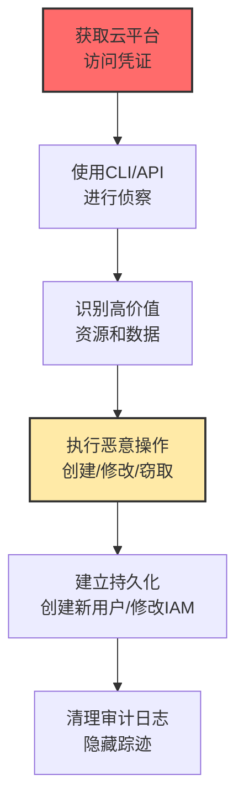

# 云管理命令 (T1651)

## 一句话通俗理解

**攻击者利用AWS CLI、Azure PowerShell等云管理工具执行恶意操作——就像用你的云账号密码登录后，为所欲为。**

## 难度等级

⭐️⭐️ 中级（需要一定基础）

需要了解云平台的CLI工具和IAM配置。

## 技术描述

云管理命令是指攻击者利用云服务提供商（AWS、Azure、GCP）的命令行接口（CLI）、API或管理控制台来执行恶意操作。攻击者在获得云凭证后，可以启动虚拟机、修改安全组、创建快照、执行脚本或部署容器，实现持久化、横向移动、资源滥用或数据外泄。

**通俗解释：**
云平台就像一栋大型写字楼，AWS CLI和Azure PowerShell是这栋楼的"总管理员门禁卡"。攻击者偷到了这张卡，就可以进入任何房间、打开任何保险柜、启动任何设备。他还可以给大楼添加新的房间（创建资源），或者把房间里的东西搬走（数据外泄）。

**技术原理：**
1. 云服务提供商提供CLI工具和API来管理所有云资源
2. 攻击者通过窃取凭证或利用配置错误获得访问
3. CLI工具使用API密钥或OAuth令牌进行身份认证
4. 一旦认证成功，攻击者可以执行任何授权的操作

## 攻击流程



## 真实案例

### 案例1：利用泄露的AWS凭证进行大规模挖矿（2024）

- **时间**: 2024年
- **目标**: 使用AWS的企业
- **手法**: 攻击者通过GitHub代码泄露、钓鱼或配置错误获取AWS凭证后，使用AWS CLI启动大量EC2实例进行加密货币挖矿。执行aws ec2 run-instances在多个可用区启动GPU实例，利用自动扩展特性扩大挖矿规模。
- **影响**: 受害者产生巨额AWS账单
- **参考链接**: [AWS安全博客](https://aws.amazon.com/blogs/security/)

### 案例2：利用Azure CLI进行横向移动和数据窃取（2024）

- **时间**: 2024年
- **目标**: 使用Azure的企业
- **手法**: 攻击者获得Azure AD凭证后，使用Azure PowerShell和CLI在订阅内横向移动。执行az vm list、az storage account list枚举资源，使用az vm run-command在虚拟机上执行命令，az storage blob download下载存储账户数据。
- **影响**: 企业云数据被批量窃取
- **参考链接**: [Azure安全文档](https://learn.microsoft.com/en-us/azure/security/)

### 案例3：Capital One数据泄露事件（持续影响）

- **时间**: 2019年（影响持续）
- **目标**: Capital One金融机构
- **手法**: 攻击者利用配置错误的AWS IAM角色和WAF漏洞获得AWS环境访问权限。使用AWS CLI执行aws s3 ls、aws s3 cp等命令窃取超过1亿条客户记录。
- **影响**: 史上最大金融机构数据泄露之一
- **参考链接**: [司法部Capital One案](https://www.justice.gov/usao-wdva/pr/seattle-woman-charged-capital-one-data-breach)

## 红队视角

> ⚠️ **免责声明**：以下内容仅用于合法的安全测试、渗透测试和教育目的。未经授权对他人系统进行测试是违法行为。

### 常用工具

| 工具名称 | 用途 | 平台 | 链接 |
|----------|------|------|------|
| AWS CLI | AWS命令行管理工具 | 跨平台 | https://aws.amazon.com/cli/ |
| Azure CLI | Azure命令行管理工具 | 跨平台 | https://docs.microsoft.com/cli/azure/ |
| gcloud | GCP命令行管理工具 | 跨平台 | https://cloud.google.com/sdk/gcloud |

## 蓝队视角

### 检测方法

- 启用CloudTrail/Azure Activity Log/GCP Audit Log记录所有管理操作
- 检测异常地理位置的API调用
- 监控高风险命令（如停止虚拟机、删除资源、修改IAM策略）

## 缓解措施

### 优先级1：关键措施

**措施名称：** 强制多因素认证（MFA）

**具体实施步骤：**
1. 对所有云管理账户（AWS IAM、Azure AD、GCP Cloud Identity）强制启用MFA
2. 配置条件访问策略，要求管理操作必须来自受信设备
3. 禁用长期访问密钥，使用临时凭证（AWS STS、Azure Managed Identity）

### 优先级2：重要措施

**措施名称：** IAM最小权限策略

**具体实施步骤：**
1. 实施最小权限原则，每个管理用户只分配工作所需的权限
2. 使用IAM角色而非用户级凭证来管理云资源
3. 定期审计IAM策略，移除未使用的权限和访问密钥

**配置示例：**
```bash
# 检查AWS IAM用户是否启用了MFA
aws iam list-users --query 'Users[*].[UserName]' --output text | while read user; do echo "$user: $(aws iam list-mfa-devices --user-name $user --query 'length(MFADevices)')"; done

# 检查未使用的访问密钥
aws iam list-access-keys --user-name username

# 查看CloudTrail审计日志中的StopInstances事件
aws cloudtrail lookup-events --lookup-attributes AttributeKey=EventName,AttributeValue=StopInstances --max-results 10
```

### MITRE ATT&CK 缓解措施映射

| 缓解措施ID | 缓解措施名称 | 适用性 | 说明 |
|------------|-------------|--------|------|
| M1032 | MFA | 适用 | 强制所有管理账户启用MFA |
| M1026 | 特权账户管理 | 适用 | 最小权限IAM策略 |
| M1047 | 审计 | 适用 | 启用CloudTrail/Azure Activity Log |

## 检测建议

### 网络层检测

**检测方法：** 监控云API调用网络流量，检测来自异常地理位置或IP的CLI管理命令执行。

**具体规则/命令示例：**
```bash
# 检测来自非预期地区的AWS API调用
tcpdump -i eth0 host ec2.amazonaws.com or host s3.amazonaws.com -A -w cloud_api.pcap

# 检测Azure管理API的异常来源
tcpdump -i eth0 host management.azure.com -A | grep -E "PUT|POST|DELETE"
```

### 主机层检测

**检测方法：** 启用云审计日志（CloudTrail/Azure Activity Log/GCP Audit Log），监控CLI/API管理命令的执行模式。

**Windows事件ID：**
- （不适用，云管理命令通过云API执行，不在本地产生事件日志）

**Linux日志：**
- （不适用，云审计日志在云平台集中管理）

**具体命令示例：**
```bash
# 查看CloudTrail中的重要IAM变更事件
aws cloudtrail lookup-events --lookup-attributes AttributeKey=EventName,AttributeValue=PutRolePolicy --max-results 20

# 检查Azure Activity Log中的资源删除事件
az monitor activity-log list --resource-provider Microsoft.Compute --query "[?eventName.value=='Delete Virtual Machine']" --output table

# 检测最近24小时内的高风险AWSCLI调用
aws cloudtrail lookup-events --start-time $(date -d '24 hours ago' +%Y-%m-%dT%H:%M:%SZ) --query 'Events[?contains(EventName, `Delete`) || contains(EventName, `Terminate`) || contains(EventName, `CreateAccessKey`)]'
```

### 应用层检测

**Sigma规则示例：**

```yaml
title: Suspicious AWS CLI Admin Command
status: experimental
description: Detects AWS CLI commands that modify critical infrastructure
logsource:
    category: cloud_audit
    product: aws
detection:
    selection:
        eventName:
            - 'StopInstances'
            - 'TerminateInstances'
            - 'DeleteBucketPolicy'
            - 'PutBucketPolicy'
            - 'CreateAccessKey'
    condition: selection
level: high
tags:
    - attack.t1651
```

## 动手实验

> ⚠️ **重要提示**：所有实验必须在隔离的实验室环境中进行，禁止对未授权的真实系统进行测试。

### 实验1：AWS安全检查

```bash
aws iam list-access-keys --user-name username
aws iam list-attached-user-policies --user-name username
aws cloudtrail lookup-events --max-results 10
```

### 实验2：Azure安全检查

```bash
az role assignment list --output table
az monitor activity-log list --max-events 10 --output table
```

## 术语解释

| 术语 | 英文原名 | 通俗解释 |
|------|----------|----------|
| AWS CLI | AWS Command Line Interface | AWS的"命令行遥控器" |
| Azure PowerShell | Azure PowerShell | Azure的"PowerShell遥控器" |
| CloudTrail | CloudTrail | AWS的"监控摄像头" |
| CSPM | Cloud Security Posture Management | 云安全的"体检医生" |
| IAM | Identity and Access Management | 云平台的"门禁系统" |

## 参考资料

- [MITRE ATT&CK T1651官方页面](https://attack.mitre.org/techniques/T1651/)
- [AWS安全最佳实践](https://aws.amazon.com/blogs/security/security-best-practices-for-iam/)
- [Azure安全基准](https://learn.microsoft.com/en-us/azure/security/benchmarks/overview)
- [GCP安全基础](https://cloud.google.com/security/foundations)
