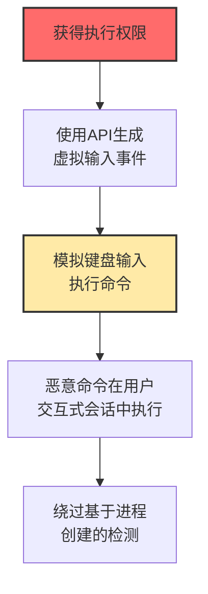

# 输入注入 (T1674)

## 一句话通俗理解

**攻击者伪造键盘和鼠标输入来控制你的电脑——就像有人远程操控你的手在键盘上打字。**

## 难度等级

⭐️⭐️ 中级（需要一定基础）

需要了解操作系统提供的输入合成API。

## 技术描述

输入注入是指攻击者通过合成输入设备事件（如键盘按键或鼠标移动）来控制受害系统。攻击者利用操作系统提供的API来生成虚拟的输入事件，这些事件会被系统视为来自实际的键盘或鼠标。这种技术可以绕过基于进程创建的检测，因为没有创建新进程。

**通俗解释：**
想象一下，你的电脑上有一个隐身人（恶意代码），他虽然没有自己的手，但他可以控制你的手（通过输入合成API）在键盘上打字。你以为是自己在打字，其实是"幽灵"在操控。这就是输入注入的本质——模拟用户的输入操作。

**技术原理：**
1. 操作系统提供API（如Windows的SendInput、.NET的SendKeys）来编程生成输入事件
2. 这些事件被操作系统当作真实的键盘/鼠标输入处理
3. 攻击者可以模拟用户执行各种操作：打开运行对话框、输入命令、按回车等
4. 因为不创建新进程，基于进程创建的检测规则会失效

## 攻击流程



## 真实案例

### 案例1：USB橡皮鸡（Rubber Ducky）攻击持续活跃（2024-2025）

- **时间**: 2024-2025年
- **目标**: 政府和企业用户
- **手法**: USB橡皮鸡是一种伪装成普通USB闪存驱动器的恶意设备。插入计算机后被识别为USB键盘，自动发送预编程按键序列执行恶意命令。攻击者在公共场所"丢失"这些设备，或通过物理接触目标设备使用。
- **影响**: 凭证被窃取，后门被安装
- **参考链接**: [Hak5 USB Rubber Ducky](https://shop.hak5.org/products/usb-rubber-ducky)

### 案例2：利用PowerShell SendKeys进行横向移动（2024）

- **时间**: 2024年
- **目标**: Windows企业网络
- **手法**: 攻击者在获得远程桌面访问后，使用PowerShell的`[System.Windows.Forms.SendKeys]::SendWait()`生成键盘输入。模拟用户操作打开运行对话框、输入命令并执行，在禁用了WinRM或PowerShell远程处理的系统上仍然可以执行命令。
- **影响**: 即使在限制环境下也能执行命令
- **参考链接**: [Microsoft SendKeys文档](https://docs.microsoft.com/en-us/dotnet/api/system.windows.forms.sendkeys)

### 案例3：利用AppleScript在macOS上进行自动化攻击（2024）

- **时间**: 2024年
- **目标**: macOS用户
- **手法**: macOS恶意软件利用AppleScript的keystroke命令生成键盘输入，自动执行恶意操作。可以打开终端、输入命令、访问网站下载载荷，整个过程通过合成输入事件完成，不创建新进程。
- **影响**: macOS用户被远程控制
- **参考链接**: [Apple AppleScript文档](https://developer.apple.com/library/archive/documentation/LanguagesUtilities/Conceptual/MacAutomationScriptingGuide/index.html)

## 红队视角

> ⚠️ **免责声明**：以下内容仅用于合法的安全测试、渗透测试和教育目的。未经授权对他人系统进行测试是违法行为。

### 常用工具

| 工具名称 | 用途 | 平台 | 链接 |
|----------|------|------|------|
| Rubber Ducky | USB HID攻击设备 | 跨平台 | https://shop.hak5.org/products/usb-rubber-ducky |
| PowerShell SendKeys | Windows GUI自动化 | Windows | 系统自带 |
| osascript (AppleScript) | macOS GUI自动化 | macOS | 系统自带 |

### 实战技巧

- 使用USB Rubber Ducky快速输入恶意PowerShell命令
- 利用SendKeys绕过应用程序限制，在锁屏状态下输入
- 使用AppleScript的keystroke命令自动执行恶意操作

## 蓝队视角

### 检测方法

- 监控异常高的键盘输入速度
- 检测USB设备的即插即用事件
- 监控SendKeys和AppleScript等GUI自动化API的调用

## 缓解措施

### 优先级1：关键措施

**措施名称：** USB设备访问控制

**具体实施步骤：**
1. 使用组策略禁用非授权USB设备的安装和使用
2. 配置Windows设备安装限制，仅允许已批准的HID设备
3. 对USB端口实施物理安全控制（端口锁、胶封等）

### 优先级2：重要措施

**措施名称：** GUI自动化API监控

**具体实施步骤：**
1. 监控SendKeys、SendInput、pyautogui等GUI自动化API的调用
2. 配置Windows Defender Attack Surface Reduction（ASR）规则阻止可疑的脚本自动化
3. 限制PowerShell和脚本运行时对Windows Forms的访问

**配置示例：**
```bash
# 查看USB设备连接历史
wevtutil qe Microsoft-Windows-DriverFrameworks-UserMode/Operational /q:"Event[System[EventID=2003]]" /c:20 /f:text

# 监控SendKeys调用
Get-WinEvent -FilterHashtable @{LogName='Microsoft-Windows-Sysmon/Operational'; ID=1} | Where-Object {$_.Properties[10].Value -match "SendKeys|SendKeysWait"} | Select-Object TimeCreated, Message

# 检查当前连接的HID设备
Get-PnpDevice | Where-Object {$_.Class -eq 'HIDClass'} | Select-Object FriendlyName, Status
```

### MITRE ATT&CK 缓解措施映射

| 缓解措施ID | 缓解措施名称 | 适用性 | 说明 |
|------------|-------------|--------|------|
| M1034 | 设备控制 | 适用 | 限制USB设备连接 |
| M1017 | 用户培训 | 适用 | 教育用户关于物理安全 |
| M1035 | 限制设备发现 | 适用 | 禁用不必要的USB端口 |

## 检测建议

### 网络层检测

**检测方法：** 监控USB Rubber Ducky等HID注入设备通过模拟键盘触发的命令可能产生的网络连接（如PowerShell下载、C2通信）。

**具体规则/命令示例：**
```bash
# 检测攻击设备可能触发的C2连接
tcpdump -i eth0 host suspicious-c2.com or port 4444 or port 443 -w injection_c2.pcap

# 监控异常短时间内的DNS查询爆发（脚本自动化下载的典型特征）
tcpdump -i eth0 port 53 -c 100 -A | grep -E "\.exe|\.ps1|\.dll|powershell"
```

### 主机层检测

**检测方法：** 监控键盘输入的速度异常、USB设备即插即用事件、GUI自动化API的调用。

**Windows事件ID：**
- 2003（USB设备插入）- DriverFrameworks-UserMode日志
- 1（Sysmon进程创建）- 监控包含SendKeys的命令行
- 4688（进程创建）- 监控PowerShell脚本自动化

**Linux日志：**
- `/var/log/auth.log` - USB设备接入日志
- `/var/log/syslog` - HID设备事件

**具体命令示例：**
```bash
# 检测USB设备插入事件
wevtutil qe Microsoft-Windows-DriverFrameworks-UserMode/Operational /q:"Event[System[EventID=2003]]" /c:5 /f:text

# 监控SendKeys调用命令
wevtutil qe Microsoft-Windows-Sysmon/Operational /q:"Event[System[EventID=1]]" /c:20 /f:text | findstr "SendKeys"

# 查看新增的HID设备
Get-PnpDevice -PresentOnly | Where-Object {$_.Class -eq 'HIDClass' -and $_.InstanceId -like "*USB*"} | Format-Table FriendlyName, InstanceId
```

### 应用层检测

**Sigma规则示例：**

```yaml
title: Suspicious Input Injection via Script
status: experimental
description: Detects programmatic keyboard input injection scripts
logsource:
    category: process_creation
    product: windows
detection:
    selection:
        CommandLine|contains:
            - 'SendKeys'
            - 'SendKeysWait'
            - 'keyboard.SendKeys'
    condition: selection
level: medium
tags:
    - attack.t1674
```

## 动手实验

> ⚠️ **重要提示**：所有实验必须在隔离的实验室环境中进行，禁止对未授权的真实系统进行测试。

### 实验1：PowerShell SendKeys测试

```powershell
Start-Process notepad
Start-Sleep -Seconds 2
[System.Windows.Forms.SendKeys]::SendWait("Hello from SendKeys!")
```

### 实验2：USB设备监控

```powershell
Get-PnpDevice | Where-Object {$_.Class -eq 'HIDClass'} | Select-Object FriendlyName, Status
Get-WinEvent -FilterHashtable @{LogName='Microsoft-Windows-DriverFrameworks-UserMode/Operational'; ID=2003} -MaxEvents 10
```

## 术语解释

| 术语 | 英文原名 | 通俗解释 |
|------|----------|----------|
| 输入注入 | Input Injection | 通过API假装用户按键盘/点鼠标 |
| USB橡皮鸡 | USB Rubber Ducky | 伪装成U盘的"自动打字机" |
| SendKeys | SendKeys | .NET中模拟"按键盘"的API |
| DuckyScript | DuckyScript | USB橡皮鸡的"编程语言" |

## 参考资料

- [MITRE ATT&CK T1674官方页面](https://attack.mitre.org/techniques/T1674/)
- [USB Rubber Ducky](https://shop.hak5.org/products/usb-rubber-ducky)
- [PowerShell SendKeys文档](https://docs.microsoft.com/en-us/dotnet/api/system.windows.forms.sendkeys)
