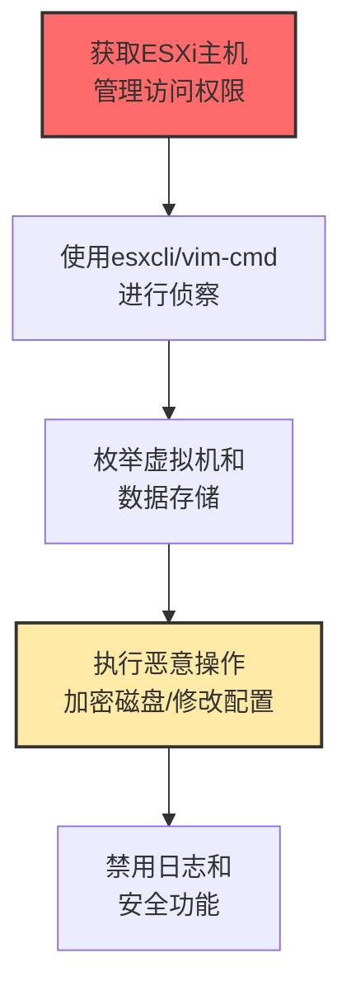

# ESXi管理命令 (T1675)

## 一句话通俗理解

**攻击者利用VMware ESXi的管理命令控制整个虚拟化环境——一台ESXi服务器上可能跑着几十台虚拟机，拿下它就等于拿下了整个数据中心。**

## 难度等级

⭐️⭐️ 中级（需要一定基础）

需要了解VMware ESXi虚拟化平台的管理操作。

## 技术描述

ESXi管理命令是指攻击者利用VMware ESXi hypervisor的命令行接口来执行恶意操作。VMware ESXi是企业环境中最广泛使用的裸机虚拟化平台，攻击者在获得ESXi管理访问权限后，可以使用ESXi Shell、CLI或vSphere PowerCLI来执行命令，包括创建/修改虚拟机、更改网络配置、访问数据存储、加密虚拟磁盘等。

**通俗解释：**
一栋大楼里有几十个房间（虚拟机），每个房间都住着不同的公司。大楼的管理员办公室（ESXi hypervisor）拥有所有房间的"总钥匙"。攻击者控制了管理员办公室，就可以随意进入任何房间、搬走任何东西、甚至给房间换锁（加密虚拟磁盘）。

**技术原理：**
1. ESXi是VMware的裸机虚拟化平台，直接在硬件上运行
2. ESXi管理可以通过vSphere客户端、SSH或ESXi Shell（直接控制台）
3. 管理命令包括：列出虚拟机（vim-cmd vmsvc/getallvms）、配置网络（esxcli network）、管理存储等

## 攻击流程



## 真实案例

### 案例1：ESXiArgs勒索软件大规模攻击ESXi服务器（2023-2024）

- **时间**: 2023-2024年
- **目标**: 全球使用VMware ESXi的企业
- **攻击组织**: ESXiArgs
- **手法**: ESXiArgs勒索软件专门针对VMware ESXi hypervisor。利用ESXi服务器上的已知漏洞获得访问权限后，使用ESXi Shell命令识别和加密虚拟机磁盘文件（.vmdk），执行vim-cmd vmsvc/getallvms列出所有虚拟机，然后加密.vmdk文件。一台ESXi服务器运行多台虚拟机，攻击可一次性瘫痪整个虚拟化环境。
- **影响**: 全球大量ESXi服务器被加密
- **参考链接**: [CISA AA23-075A](https://www.cisa.gov/news-events/cybersecurity-advisories/aa23-075a)

### 案例2：利用ESXi SSH访问进行横向移动（2024）

- **时间**: 2024年
- **目标**: 使用VMware虚拟化的企业
- **手法**: 攻击者获得域管理员凭证后通过SSH登录ESXi主机。使用ESXi Shell命令枚举虚拟机、检查网络配置和访问数据存储。ESXi主机通常托管关键虚拟机，控制ESXi等于控制整个虚拟化基础设施。
- **影响**: 企业核心虚拟化基础设施被控制
- **参考链接**: [VMware安全公告](https://www.vmware.com/security/advisories.html)

### 案例3：勒索软件团伙专门针对ESXi进行"双重勒索"（2024-2025）

- **时间**: 2024-2025年
- **目标**: 全球企业
- **攻击组织**: LockBit、Black Basta、Akira等
- **手法**: 多个勒索软件团伙开发了专门针对ESXi的加密器。不仅加密虚拟磁盘文件，还窃取虚拟机中的敏感数据实施双重勒索。使用ESXi命令停止虚拟机、加密磁盘，然后留下勒索信。
- **影响**: 企业面临数据泄露和业务中断双重打击
- **参考链接**: [TrendMicro ESXi研究](https://www.trendmicro.com/en_us/research/)

## 红队视角

> ⚠️ **免责声明**：以下内容仅用于合法的安全测试、渗透测试和教育目的。未经授权对他人系统进行测试是违法行为。

### 常用工具

| 工具名称 | 用途 | 平台 | 链接 |
|----------|------|------|------|
| esxcli | ESXi命令行管理工具 | ESXi | 系统自带 |
| vim-cmd | vSphere命令行工具 | ESXi | 系统自带 |
| PowerCLI | VMware PowerShell管理工具 | 跨平台 | https://code.vmware.com/web/tool/vmware-powercli |

### 实战技巧

- 使用`esxcli vm process kill`停止虚拟机
- 使用`vim-cmd vmsvc/power.off`强制关闭重要虚拟机
- 利用esxcli管理VMFS存储卷加密虚拟磁盘

## 蓝队视角

### 检测方法

- 监控ESXi Shell和SSH登录日志，关注异常登录时间
- 配置vCenter告警，监控大规模虚拟机管理操作
- 使用SIEM收集和分析ESXi审计日志

## 缓解措施

### 优先级1：关键措施

**措施名称：** 禁用不必要的SSH和ESXi Shell

**具体实施步骤：**
1. 在生产环境中默认禁用ESXi SSH服务，仅按需启用
2. 禁用ESXi Shell（直接控制台Shell），限制物理访问
3. 使用vCenter集中管理，避免直接登录单个ESXi主机

### 优先级2：重要措施

**措施名称：** ESXi管理网络隔离

**具体实施步骤：**
1. 将ESXi管理网络（SSH、vSphere客户端）隔离在独立的管理VLAN中
2. 配置防火墙规则限制管理端口的来源IP
3. 实施ESXi主机级别的Lockdown Mode（锁定模式）

**配置示例：**
```bash
# 检查ESXi SSH服务状态
esxcli network ip interface list | grep ssh
netstat -anp | grep :22

# 查看ESXi Lockdown Mode状态
vim-cmd hostsvc/advopt/view Security.LockdownMode

# 列出所有虚拟机的Power状态
vim-cmd vmsvc/getallvms | grep -v "^Vmid" | awk '{print $1, $2}'
```

### MITRE ATT&CK 缓解措施映射

| 缓解措施ID | 缓解措施名称 | 适用性 | 说明 |
|------------|-------------|--------|------|
| M1030 | 网络分段 | 适用 | 隔离ESXi管理网络 |
| M1042 | 禁用功能或服务 | 适用 | 不需要时禁用SSH和ESXi Shell |
| M1026 | 特权账户管理 | 适用 | 使用MFA和最小权限 |
| M1045 | 软件更新 | 适用 | 及时修补ESXi和vCenter漏洞 |

## 检测建议

### 网络层检测

**检测方法：** 监控ESXi管理接口（SSH端口22、vSphere客户端端口443）的网络流量，检测来自非管理网络段的登录尝试。

**具体规则/命令示例：**
```bash
# 监控ESXi SSH登录流量
tcpdump -i eth0 port 22 and not host trusted-admin-cidr -w esxi_ssh.pcap

# 检测异常的vSphere API调用
tcpdump -i eth0 port 443 and host esxi-host-ip -A | grep "POST /sdk/webService"
```

### 主机层检测

**检测方法：** 启用ESXi Shell和SSH登录审计，监控esxcli和vim-cmd命令的执行日志。

**Windows事件ID：**
- （不适用，ESXi基于VMkernel Linux运行）

**Linux日志：**
- `/var/log/auth.log` - SSH登录日志
- `/var/log/shell.log` - ESXi Shell命令日志
- `/var/log/vmkernel` - VMkernel日志
- `/var/log/hostd.log` - ESXi host daemon操作日志

**具体命令示例：**
```bash
# 查看ESXi SSH登录日志
grep "sshd" /var/log/auth.log | grep "Accepted"

# 查看ESXi Shell执行日志
cat /var/log/shell.log | tail -50

# 检测vim-cmd大规模虚拟机操作
grep "vim-cmd vmsvc/power.off\|vim-cmd vmsvc/destroy" /var/log/shell.log

# 查看vCenter告警：异常管理操作
# （通过vSphere Web Client查看告警）
```

### 应用层检测

**Sigma规则示例：**

```yaml
title: Suspicious ESXi Admin Command
status: experimental
description: Detects potentially malicious ESXi management commands
logsource:
    category: process_creation
    product: linux
detection:
    selection:
        CommandLine|contains:
            - 'vim-cmd vmsvc/power.off'
            - 'vim-cmd vmsvc/destroy'
            - 'esxcli vm process kill'
            - 'esxcli storage'
    condition: selection
level: high
tags:
    - attack.t1675
```

## 动手实验

> ⚠️ **重要提示**：所有实验必须在隔离的实验室环境中进行，禁止对未授权的真实系统进行测试。

### 实验1：ESXi安全检查

```bash
# 检查SSH状态
esxcli network ip interface list | grep ssh
# 列出所有虚拟机
vim-cmd vmsvc/getallvms
# 检查ESXi版本
vmware -v
```

## 术语解释

| 术语 | 英文原名 | 通俗解释 |
|------|----------|----------|
| ESXi | ESXi | VMware的"裸机虚拟化引擎" |
| hypervisor | Hypervisor | 虚拟机的"操作系统" |
| vSphere | vSphere | VMware的"虚拟化管理平台" |
| vmdk | Virtual Machine Disk | VMware虚拟机的"硬盘文件" |
| vCenter | vCenter | VMware的"集中管理控制器" |

## 参考资料

- [MITRE ATT&CK T1675官方页面](https://attack.mitre.org/techniques/T1675/)
- [CISA ESXiArgs勒索软件公告](https://www.cisa.gov/news-events/cybersecurity-advisories/aa23-075a)
- [VMware安全公告](https://www.vmware.com/security/advisories.html)
- [CIS VMware vSphere基准](https://www.cisecurity.org/controls/vmware-vsphere)
