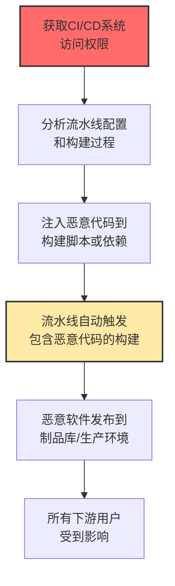

# 毒化流水线执行 (T1677)

## 一句话通俗理解

**攻击者破坏软件的自动化构建流水线（CI/CD），在编译过程中偷偷注入恶意代码——你发布的"官方软件"里藏着后门。**

## 难度等级

⭐️⭐️⭐️ 高级（需要深入技术知识）

需要了解CI/CD流水线的工作原理和安全配置。

## 技术描述

毒化流水线执行是指攻击者通过破坏持续集成和持续部署（CI/CD）流水线来执行恶意代码。现代软件开发高度依赖自动化流水线来构建、测试和部署应用程序。攻击者可以利用流水线中的漏洞或配置错误来注入恶意代码，使得发布的软件包含后门，影响所有使用该软件的用户。

**通俗解释：**
一家面包厂（软件公司）有一条全自动生产线（CI/CD流水线）——面粉进、面包出。攻击者入侵了生产线的控制系统，在配方中多加了一点"特殊配料"（恶意代码）。结果，所有出厂的"官方面包"都包含了问题配料。从超市买面包的顾客（软件用户）都吃到了问题产品。

**技术原理：**
1. CI/CD流水线自动从代码仓库拉取代码，进行构建、测试、打包和部署
2. 流水线通常具有高权限，可以访问源代码、制品库和生产环境
3. 攻击者通过凭证窃取或配置错误获得流水线访问权限
4. 修改构建脚本或依赖配置，在构建过程中注入恶意代码
5. 恶意代码被编译到最终发布的软件制品中

## 攻击流程



## 真实案例

### 案例1：TJ Actions GitHub Actions供应链攻击（2025）

- **时间**: 2025年
- **目标**: 使用GitHub Actions的开源项目
- **手法**: 攻击者入侵了流行的GitHub Actions action（tj-actions/changed-files）的维护者账户，修改action代码窃取CI/CD流水线中的密钥和凭证。该action被超过20,000个仓库使用，攻击者能够从受影响的流水线中窃取AWS密钥、GitHub token等敏感凭证。
- **影响**: 20,000+项目受影响，是近年来最严重的CI/CD供应链攻击
- **参考链接**: [StepSecurity TJ Actions分析](https://www.stepsecurity.io/blog/harden-runner-detection-tj-actions-changed-files-action-compromise)

### 案例2：SolarWinds供应链攻击（持续影响）

- **时间**: 2020年（影响持续到2024年）
- **目标**: 使用SolarWinds Orion软件的18,000个组织
- **攻击组织**: APT29（Cozy Bear）
- **手法**: APT29入侵了SolarWinds的构建系统，在Orion软件的构建过程中植入SUNBURST后门。攻击者修改构建流水线，编译时自动包含恶意代码。全球约18,000个客户下载并安装了被毒化的版本，包括多个美国政府机构。这是历史上最严重的供应链攻击。
- **影响**: 18,000组织受影响，美国政府机构数据泄露
- **参考链接**: [FireEye SUNBURST分析](https://www.fireeye.com/blog/threat-research/2020/12/evasive-attacker-leverages-solarwinds-supply-chain-compromises-with-sunburst-backdoor.html)

### 案例3：利用不安全的CI/CD凭证进行加密货币挖矿（2024）

- **时间**: 2024年
- **目标**: 使用Jenkins、GitLab CI、GitHub Actions的企业
- **手法**: 攻击者扫描互联网上暴露的CI/CD服务或利用凭证泄漏获得构建流水线访问权限。修改流水线配置在构建过程中执行加密货币挖矿脚本，CI/CD运行器通常具有访问内部网络和云资源的权限。
- **影响**: 企业计算资源被滥用
- **参考链接**: [Unit42 CI/CD挖矿分析](https://unit42.paloaltonetworks.com/attackers-abuse-ci-cd-to-mine-cryptocurrency/)

### 案例4：恶意npm包通过CI/CD流水线传播（2024）

- **时间**: 2024年
- **目标**: 使用JavaScript/Node.js的开发者
- **手法**: 攻击者将恶意版本的npm包发布到注册表。当CI/CD流水线自动构建和测试依赖此包的项目时，流水线下载并执行恶意代码，在CI/CD环境中窃取凭证、修改构建输出或向代码库中注入后门。
- **影响**: CI/CD环境凭证被窃取
- **参考链接**: [npm安全公告](https://blog.npmjs.org/post/180565383895/details-about-the-event-stream-incident)

## 红队视角

> ⚠️ **免责声明**：以下内容仅用于合法的安全测试、渗透测试和教育目的。未经授权对他人系统进行测试是违法行为。

### 常用工具

| 工具名称 | 用途 | 平台 | 链接 |
|----------|------|------|------|
| Jenkins | CI/CD服务器（双刃剑） | 跨平台 | https://www.jenkins.io/ |
| GitLab CI | GitLab内置CI/CD | 跨平台 | https://docs.gitlab.com/ee/ci/ |
| GitHub Actions | GitHub CI/CD平台 | 跨平台 | https://github.com/features/actions |

## 蓝队视角

### 检测方法

- 监控CI/CD流水线配置的Git变更历史，关注非工作时间修改
- 检测构建中的异常网络连接和数据外传
- 实施构建产物签名验证，确保构建产物未被篡改

## 缓解措施

### 优先级1：关键措施

严格访问控制，对CI/CD系统实施MFA和最小权限。

### MITRE ATT&CK 缓解措施映射

| 缓解措施ID | 缓解措施名称 | 适用性 | 说明 |
|------------|-------------|--------|------|
| M1016 | 供应链安全 | 适用 | 实施SLSA供应链安全框架 |
| M1026 | 特权账户管理 | 适用 | 保护CI/CD系统凭证 |
| M1045 | 软件更新 | 适用 | 保持CI/CD工具最新 |
| M1047 | 审计 | 适用 | 审计流水线配置变更 |

## 检测建议

### 网络层检测

**检测方法：** 监控CI/CD流水线构建过程中的异常网络连接，包括构建服务器向外部非可信源下载依赖、构建产物上传到非标准仓库的流量。

**具体规则/命令示例：**
```
# 检测构建服务器异常的外部连接
suricata -r traffic.pcap --rule "alert tcp $HOME_NET any -> $EXTERNAL_NET $HTTP_PORTS (msg:\"CI/CD Pipeline Anomalous Download\"; content:\"ci-bot\"; http_user_agent; nocase; sid:1000025;)"

# 检测构建产物推送异常
zeek -r traffic.pcap | grep "docker push\|npm publish\|git push" | grep -v "trusted-registry"
```

### 检测点

- 监控CI/CD流水线配置文件的Git变更历史
- 检测构建过程中的异常网络连接
- 监控构建产物签名和完整性校验

### Sigma规则示例

```yaml
title: Suspicious CI/CD Pipeline Modification
status: experimental
description: Detects CI/CD pipeline configuration changes via audit logs
logsource:
    category: web
    product: github_actions
detection:
    selection:
        action:
            - 'workflow.create'
            - 'workflow.update'
            - 'workflow.add_file'
        author|contains:
            - 'deploy-bot'
            - 'ci-bot'
    condition: selection
level: high
tags:
    - attack.t1677
```

## 动手实验

> ⚠️ **重要提示**：所有实验必须在隔离的实验室环境中进行，禁止对未授权的真实系统进行测试。

### 实验1：GitHub Actions安全检查

```bash
ls -la .github/workflows/
grep -r "uses:" .github/workflows/
grep -r "password\|secret\|token\|key" .github/workflows/
```

### 实验2：依赖安全检查

```bash
npm audit
pip-audit
slsa-verifier verify-artifact --provenance-path provenance.intoto.jsonl artifact
```

## 术语解释

| 术语 | 英文原名 | 通俗解释 |
|------|----------|----------|
| CI/CD | Continuous Integration/Continuous Deployment | 软件的"自动化生产流水线" |
| 流水线 | Pipeline | 从代码到发布的全自动流程 |
| SLSA | Supply-chain Levels for Software Artifacts | 软件供应链的"安全等级认证" |
| 制品 | Artifact | 构建过程输出的"产品" |
| 依赖混淆 | Dependency Confusion | 利用包管理器优先级机制投毒 |

## 参考资料

- [MITRE ATT&CK T1677官方页面](https://attack.mitre.org/techniques/T1677/)
- [TJ Actions供应链攻击分析](https://www.stepsecurity.io/blog/harden-runner-detection-tj-actions-changed-files-action-compromise)
- [SolarWinds SUNBURST分析](https://www.fireeye.com/blog/threat-research/2020/12/evasive-attacker-leverages-solarwinds-supply-chain-compromises-with-sunburst-backdoor.html)
- [SLSA供应链安全框架](https://slsa.dev/)
- [CI/CD安全最佳实践](https://www.snyk.io/blog/securing-ci-cd-pipelines-best-practices/)
