# 持久化 (TA0003)

## 一句话理解

> 攻击者在你的系统里"安家"，确保即使你发现了部分入侵痕迹，他们依然能卷土重来。

## 战术概述

**持久化就像小偷在你家装了暗门。** 即使你换了门锁（改了密码）、装了监控（装了杀毒软件）、甚至重新装修了房子（重装了系统），小偷依然能通过他留下的暗门随时进来。

在网络安全领域，持久化是指攻击者在获得初始访问权限后，采取各种手段确保自己能够**长期、稳定地保持对目标系统的访问**。这是攻击链中最关键的环节之一——没有持久化，攻击者可能在一次系统重启或密码修改后就失去所有访问权限。

**通俗解释：**
持久化就像小偷在偷到钥匙后，趁你不注意配了一把备用钥匙藏在门外花盆底下——这样即使你发现钥匙丢了、换了新锁，他还可以从花盆下取出备用钥匙再次进入。

**在攻击中的作用：**
持久化是攻击者巩固战果的关键一步。在成功完成初始入侵后，攻击者第一件事就是部署持久化机制。没有持久化，一次系统更新、密码更改或意外重启就可能让攻击者失去所有访问权限，前期所有努力白费。

**包含的技术类型：**
- **账户类持久化**：创建新账户、操纵现有账户、使用有效账户
- **系统机制类持久化**：修改注册表、创建计划任务、安装服务
- **启动类持久化**：自动启动、登录脚本、预启动（固件级）
- **触发类持久化**：事件触发执行、流量信号、Office/浏览器扩展
- **高级持久化**：修改认证流程、劫持执行流、篡改软件二进制

## 战术在攻击链中的位置

### 攻击链全景图

```mermaid
graph LR
    A["侦察<br/>TA0043"] --> B["资源开发<br/>TA0042"]
    B --> C["初始访问<br/>TA0001"]
    C --> D["执行<br/>TA0002"]
    D --> E["持久化<br/>TA0003"]
    E --> F["权限提升<br/>TA0004"]
    F --> G["隐蔽<br/>TA0005"]
    G --> H["防御削弱<br/>TA0112"]
    H --> I["凭证访问<br/>TA0006"]
    I --> J["发现<br/>TA0007"]
    J --> K["横向移动<br/>TA0008"]
    K --> L["收集<br/>TA0009"]
    L --> M["命令与控制<br/>TA0011"]
    M --> N["数据窃取<br/>TA0010"]
    N --> O["影响<br/>TA0040"]

    style E fill:#ff6b6b,stroke:#333,stroke-width:3px,color:#fff
```

### 当前战术的角色

持久化是攻击链中承上启下的关键环节。在成功获取初始访问权限并执行恶意代码后，攻击者必须立即部署持久化机制来巩固战果。持久化做得好，攻击者可以长期潜伏在目标网络中，即使部分后门被清除仍有备用入口。没有持久化的攻击就像一次性工具——用完即废。

### 前置战术

- **初始访问 (TA0001)**：攻击者必须先进入目标系统，才能部署持久化机制
- **执行 (TA0002)**：攻击者需要先获得代码执行能力，才能安装后门或修改系统配置

### 后续战术

- **权限提升 (TA0004)**：许多持久化机制需要更高权限才能部署，两者经常配合使用
- **隐蔽 (TA0005)**：持久化后门需要隐藏自己，避免被发现和清除
- **凭证访问 (TA0006)**：账户类持久化技术常与凭证窃取配合使用

## 技术索引表

| 技术ID | 中文名称 | 难度 | 子技术数 | 一句话理解 | 文档状态 |
|--------|----------|------|----------|------------|----------|
| [T1098](./T1098-Account-Manipulation.md) | 账户操纵 | ⭐⭐ | 7 | 偷偷给自己的钥匙加上管理员权限 | ✅ 已完成 |
| [T1108](./T1108-Redundant-Access.md) | 冗余访问 | ⭐⭐ | 0 | 建立多个备用入口，确保主入口被封后仍能进入系统 | ✅ 已完成 |
| [T1197](./T1197-BITS-Jobs.md) | BITS作业 | ⭐⭐ | 0 | 利用Windows的"后台下载"功能偷偷运行恶意代码 | ✅ 已完成 |
| [T1547](./T1547-Boot-or-Logon-Autostart-Execution.md) | 启动或登录自动执行 | ⭐⭐ | 15 | 在系统启动的"自动播放列表"里塞进恶意程序 | ✅ 已完成 |
| [T1037](./T1037-Boot-or-Logon-Initialization-Scripts.md) | 启动或登录初始化脚本 | ⭐⭐ | 5 | 修改开机/登录时自动运行的脚本 | ✅ 已完成 |
| [T1671](./T1671-Cloud-Application-Integration.md) | 云应用集成 | ⭐⭐⭐ | 0 | 在云平台上安装"合法"的间谍应用 | ✅ 已完成 |
| [T1554](./T1554-Compromise-Client-Software-Binary.md) | 篡改客户端软件二进制 | ⭐⭐⭐ | 0 | 把正版软件偷偷换成夹带私货的版本 | ✅ 已完成 |
| [T1136](./T1136-Create-Account.md) | 创建账户 | ⭐ | 3 | 偷偷给自己开一个管理员账号 | ✅ 已完成 |
| [T1543](./T1543-Create-or-Modify-System-Process.md) | 创建或修改系统进程 | ⭐⭐ | 5 | 创建一个伪装成系统服务的后门 | ✅ 已完成 |
| [T1050](./T1050-New-Service.md) | 创建新服务 | ⭐⭐ | 0 | 创建一个新的系统服务来持久化运行恶意代码 | ✅ 已完成 |
| [T1546](./T1546-Event-Triggered-Execution.md) | 事件触发执行 | ⭐⭐⭐ | 18 | 设置"陷阱"——当特定事件发生时自动执行恶意代码 | ✅ 已完成 |
| [T1668](./T1668-Exclusive-Control.md) | 独占控制 | ⭐⭐⭐ | 0 | 锁住云资源，让管理员自己都删不掉 | ✅ 已完成 |
| [T1133](./T1133-External-Remote-Services.md) | 外部远程服务 | ⭐⭐ | 0 | 用你的VPN/远程桌面当自己的后门 | ✅ 已完成 |
| [T1525](./T1525-Implant-Internal-Image.md) | 植入内部镜像 | ⭐⭐⭐ | 0 | 在系统镜像/容器镜像里预埋后门 | ✅ 已完成 |
| [T1556](./T1556-Modify-Authentication-Process.md) | 修改认证流程 | ⭐⭐⭐⭐ | 9 | 篡改门禁系统，让假钥匙也能开门 | ✅ 已完成 |
| [T1574](./T1574-Hijack-Execution-Flow.md) | 劫持执行流 | ⭐⭐⭐ | 12 | 偷梁换柱——让程序加载恶意的DLL而不是正版的 | ✅ 已完成 |
| [T1112](./T1112-Modify-Registry.md) | 修改注册表 | ⭐⭐ | 0 | 在Windows的"配置数据库"里动手脚 | ✅ 已完成 |
| [T1137](./T1137-Office-Application-Startup.md) | Office应用启动 | ⭐⭐ | 6 | 利用Word/Excel/Outlook的自动化功能执行恶意代码 | ✅ 已完成 |
| [T1653](./T1653-Power-Settings.md) | 电源设置 | ⭐ | 0 | 修改电源设置，确保电脑不会"睡觉"而中断恶意活动 | ✅ 已完成 |
| [T1542](./T1542-Pre-OS-Boot.md) | 预启动 | ⭐⭐⭐⭐ | 5 | 在操作系统加载之前就植入后门（固件级） | ✅ 已完成 |
| [T1053](./T1053-Scheduled-Task-Job.md) | 计划任务/作业 | ⭐ | 7 | 设置定时器，让恶意代码按时自动运行 | ✅ 已完成 |
| [T1505](./T1505-Server-Software-Component.md) | 服务器软件组件 | ⭐⭐⭐ | 6 | 在Web服务器/数据库里植入后门组件 | ✅ 已完成 |
| [T1176](./T1176-Software-Extensions.md) | 软件扩展 | ⭐⭐ | 2 | 通过恶意浏览器扩展或Office插件保持访问 | ✅ 已完成 |
| [T1205](./T1205-Traffic-Signaling.md) | 流量信号 | ⭐⭐⭐⭐ | 2 | 发送特定"暗号"网络包来唤醒休眠的后门 | ✅ 已完成 |
| [T1078](./T1078-Valid-Accounts.md) | 有效账户 | ⭐⭐ | 4 | 直接用偷来的合法账号登录，无需安装任何恶意软件 | ✅ 已完成 |

## 子技术索引

| 子技术ID | 名称 | 难度 | 一句话理解 | 文档状态 |
|----------|------|:----:|-----------|:--------:|
| [T1037.001](./T1037/T1037.001-Logon Script (Windows)-登录脚本（Windows）.md) | 登录脚本（Windows） | ⭐⭐ | Windows域登录脚本和本地登录脚本 | ✅ 已完成 |
| [T1037.002](./T1037/T1037.002-Logon Script (Mac)-登录脚本（Mac）.md) | 登录脚本（Mac） | ⭐⭐ | macOS的loginhook和启动脚本 | ✅ 已完成 |
| [T1037.003](./T1037/T1037.003-Logon Script (Linux)-登录脚本（Linux）.md) | 登录脚本（Linux） | ⭐⭐ | Linux的.bashrc、.profile等shell配置 | ✅ 已完成 |
| [T1037.004](./T1037/T1037.004-Logon Script (Network)-登录脚本（网络）.md) | 登录脚本（网络） | ⭐⭐ | 域控制器上的组策略登录脚本 | ✅ 已完成 |
| [T1037.005](./T1037/T1037.005-Logon Script (Cross-platform)-登录脚本（跨平台）.md) | 登录脚本（跨平台） | ⭐⭐ | Python/PowerShell等跨平台脚本 | ✅ 已完成 |
| [T1053.001](./T1053/T1053.001-At (Windows)-At（Windows）.md) | At（Windows） | ⭐ | Windows at.exe调度 | ✅ 已完成 |
| [T1053.002](./T1053/T1053.002-At (Linux)-At（Linux）.md) | At（Linux） | ⭐ | Linux at命令 | ✅ 已完成 |
| [T1053.003](./T1053/T1053.003-Cron-Cron.md) | Cron | ⭐ | Unix/Linux cron作业 | ✅ 已完成 |
| [T1053.005](./T1053/T1053.005-Scheduled Task (Windows)-计划任务（Windows）.md) | 计划任务（Windows） | ⭐ | Windows任务调度器 | ✅ 已完成 |
| [T1053.006](./T1053/T1053.006-Systemd-Timers.md) | Systemd定时器 | ⭐ | Linux systemd定时器 | ✅ 已完成 |
| [T1053.007](./T1053/T1053.007-Container-Orchestration-Job.md) | 容器编排作业 | ⭐ | Kubernetes CronJob | ✅ 已完成 |
| [T1078.001](./T1078/T1078.001-Default-Accounts.md) | 默认账户 | ⭐⭐ | 使用系统预配置的默认账户 | ✅ 已完成 |
| [T1078.002](./T1078/T1078.002-Domain-Account.md) | 域账户 | ⭐⭐ | 使用Active Directory域账户 | ✅ 已完成 |
| [T1078.003](./T1078/T1078.003-Local-Account.md) | 本地账户 | ⭐⭐ | 使用本地系统账户 | ✅ 已完成 |
| [T1078.004](./T1078/T1078.004-Cloud-Account.md) | 云账户 | ⭐⭐ | 使用云平台账户（AWS/Azure/GCP） | ✅ 已完成 |
| [T1098.001](./T1098/T1098.001-Additional-Cloud-Credentials.md) | 额外云凭据 | ⭐⭐ | 在云环境中创建额外的访问密钥或服务主体 | ✅ 已完成 |
| [T1098.002](./T1098/T1098.002-Additional-Email-Delegate-Permissions.md) | 额外邮箱委托权限 | ⭐⭐ | 授予攻击者对目标邮箱的读取/发送权限 | ✅ 已完成 |
| [T1098.003](./T1098/T1098.003-Additional-Cloud-Roles.md) | 额外云角色 | ⭐⭐ | 将恶意账户添加到高权限云角色 | ✅ 已完成 |
| [T1098.004](./T1098/T1098.004-SSH-Authorized-Keys.md) | SSH授权密钥 | ⭐⭐ | 在Linux系统中添加攻击者的SSH公钥 | ✅ 已完成 |
| [T1098.005](./T1098/T1098.005-Device-Registration.md) | 设备注册 | ⭐⭐ | 注册攻击者控制的设备到身份提供者 | ✅ 已完成 |
| [T1098.006](./T1098/T1098.006-Additional-Container-Cluster-Roles.md) | 额外容器集群角色 | ⭐⭐ | 在Kubernetes等容器平台中添加恶意角色 | ✅ 已完成 |
| [T1098.007](./T1098/T1098.007-Additional-Local-or-Domain-Groups.md) | 额外本地或域组 | ⭐⭐ | 将恶意账户添加到特权组 | ✅ 已完成 |
| [T1136.001](./T1136/T1136.001-Local-Account.md) | 本地账户 | ⭐ | 在特定工作站或服务器上创建账户 | ✅ 已完成 |
| [T1136.002](./T1136/T1136.002-Domain-Account.md) | 域账户 | ⭐ | 在Active Directory中创建账户 | ✅ 已完成 |
| [T1136.003](./T1136/T1136.003-Cloud-Account.md) | 云账户 | ⭐ | 在云环境中创建账户 | ✅ 已完成 |
| [T1137.001](./T1137/T1137.001-Office-Template-Macros.md) | Office模板宏 | ⭐⭐ | 修改Normal.dotm等全局模板 | ✅ 已完成 |
| [T1137.002](./T1137/T1137.002-Office-Add-ins.md) | Office加载项 | ⭐⭐ | 安装恶意COM/VBA加载项 | ✅ 已完成 |
| [T1137.003](./T1137/T1137.003-Outlook-Forms.md) | Outlook表单 | ⭐⭐ | 创建恶意自定义表单 | ✅ 已完成 |
| [T1137.004](./T1137/T1137.004-Outlook-Home-Page.md) | Outlook主页 | ⭐⭐ | 设置文件夹自定义主页 | ✅ 已完成 |
| [T1137.005](./T1137/T1137.005-Outlook-Rules.md) | Outlook规则 | ⭐⭐ | 创建恶意邮件规则 | ✅ 已完成 |
| [T1137.006](./T1137/T1137.006-Outlook-API-Outlook-API.md) | Outlook API | ⭐⭐ | 使用OOM/MAPI注册事件处理程序 | ✅ 已完成 |
| [T1176.001](./T1176/T1176.001-Microsoft-Office-Add-in.md) | Microsoft Office加载项 | ⭐⭐ | 恶意Office COM/VSTO加载项 | ✅ 已完成 |
| [T1176.002](./T1176/T1176.002-Browser-Extensions.md) | 浏览器扩展 | ⭐⭐ | 恶意浏览器扩展程序 | ✅ 已完成 |
| [T1205.001](./T1205/T1205.001-Port-Knocking.md) | 端口敲门 | ⭐⭐⭐ | 发送特定端口序列激活后门 | ✅ 已完成 |
| [T1205.002](./T1205/T1205.002-Socket-Filters.md) | 套接字过滤器 | ⭐⭐⭐ | 使用BPF/WFP过滤器触发操作 | ✅ 已完成 |
| [T1505.001](./T1505/T1505.001-SQL-Stored-Procedures.md) | SQL存储过程 | ⭐⭐⭐ | 创建恶意数据库存储过程 | ✅ 已完成 |
| [T1505.002](./T1505/T1505.002-Transport-Agent.md) | 传输代理 | ⭐⭐⭐ | 安装恶意邮件传输代理 | ✅ 已完成 |
| [T1505.003](./T1505/T1505.003-Web-Shell-Web-Shell.md) | Web Shell | ⭐⭐⭐ | 部署Web后门脚本 | ✅ 已完成 |
| [T1505.004](./T1505/T1505.004-IIS-Components.md) | IIS组件 | ⭐⭐⭐ | 安装恶意IIS模块 | ✅ 已完成 |
| [T1505.005](./T1505/T1505.005-Terminal-Services.md) | 终端服务 | ⭐⭐⭐ | 修改RDP组件 | ✅ 已完成 |
| [T1542.001](./T1542/T1542.001-System-Firmware.md) | 系统固件 | ⭐⭐⭐ | 修改BIOS/UEFI固件 | ✅ 已完成 |
| [T1542.002](./T1542/T1542.002-Component-Firmware.md) | 组件固件 | ⭐⭐⭐ | 修改硬盘/网卡等硬件固件 | ✅ 已完成 |
| [T1542.003](./T1542/T1542.003-Bootkit-Bootkit.md) | Bootkit | ⭐⭐⭐ | 修改启动加载程序 | ✅ 已完成 |
| [T1542.004](./T1542/T1542.004-ROMMONkit-ROMMONkit.md) | ROMMONkit | ⭐⭐⭐ | 修改网络设备固件 | ✅ 已完成 |
| [T1542.005](./T1542/T1542.005-TFTP-Boot.md) | TFTP启动 | ⭐⭐⭐ | 配置网络设备从TFTP启动 | ✅ 已完成 |
| [T1543.001](./T1543/T1543.001-Launch-Agent-Launch-Agent.md) | Launch Agent | ⭐⭐ | macOS用户级自动启动代理 | ✅ 已完成 |
| [T1543.002](./T1543/T1543.002-SystemD-Service.md) | SystemD服务 | ⭐⭐ | Linux系统服务 | ✅ 已完成 |
| [T1543.003](./T1543/T1543.003-Windows-Service.md) | Windows服务 | ⭐⭐ | Windows系统服务 | ✅ 已完成 |
| [T1543.004](./T1543/T1543.004-Launch-Daemon-Launch-Daemon.md) | Launch Daemon | ⭐⭐ | macOS系统级守护进程 | ✅ 已完成 |
| [T1543.005](./T1543/T1543.005-Containers.md) | 容器 | ⭐⭐ | Docker/Kubernetes容器持久化 | ✅ 已完成 |
| [T1546.001](./T1546/T1546.001-Change-Default-File-Association.md) | 更改默认文件关联 | ⭐⭐⭐ | 修改文件类型打开方式 | ✅ 已完成 |
| [T1546.002](./T1546/T1546.002-Screensaver.md) | 屏幕保护程序 | ⭐⭐⭐ | 替换屏幕保护程序为恶意程序 | ✅ 已完成 |
| [T1546.003](./T1546/T1546.003-WMI-Event-Subscription.md) | WMI事件订阅 | ⭐⭐⭐ | 使用WMI创建事件触发器 | ✅ 已完成 |
| [T1546.004](./T1546/T1546.004-Unix-Shell-Configuration-Modification.md) | Unix Shell配置修改 | ⭐⭐⭐ | 修改.bashrc等shell配置文件 | ✅ 已完成 |
| [T1546.005](./T1546/T1546.005-Trap-Trap.md) | Trap | ⭐⭐⭐ | 使用Unix trap命令捕获信号 | ✅ 已完成 |
| [T1546.006](./T1546/T1546.006-LC_LOAD_DYLIB-Addition.md) | LC_LOAD_DYLIB添加 | ⭐⭐⭐ | macOS动态库注入 | ✅ 已完成 |
| [T1546.007](./T1546/T1546.007-Netsh-Helper-DLL.md) | Netsh辅助DLL | ⭐⭐⭐ | 注册netsh辅助DLL | ✅ 已完成 |
| [T1546.008](./T1546/T1546.008-Accessibility-Features.md) | 辅助功能 | ⭐⭐⭐ | 替换辅助功能二进制文件 | ✅ 已完成 |
| [T1546.009](./T1546/T1546.009-AppInit-DLLs-AppInit-DLLs.md) | AppInit DLLs | ⭐⭐⭐ | 注册AppInit DLL | ✅ 已完成 |
| [T1546.010](./T1546/T1546.010-AppCert-DLLs-AppCert-DLLs.md) | AppCert DLLs | ⭐⭐⭐ | 注册AppCert DLL | ✅ 已完成 |
| [T1546.011](./T1546/T1546.011-Application-Shim.md) | 应用程序兼容性垫片 | ⭐⭐⭐ | 使用sdbinst安装垫片 | ✅ 已完成 |
| [T1546.012](./T1546/T1546.012-Image-File-Execution-Options.md) | 映像文件执行选项 | ⭐⭐⭐ | 使用IFEO调试器劫持 | ✅ 已完成 |
| [T1546.013](./T1546/T1546.013-PowerShell-Profile.md) | PowerShell配置文件 | ⭐⭐⭐ | 修改PowerShell启动脚本 | ✅ 已完成 |
| [T1546.014](./T1546/T1546.014-Email.md) | 电子邮件 | ⭐⭐⭐ | 利用邮件规则触发代码 | ✅ 已完成 |
| [T1546.015](./T1546/T1546.015-Update-Orchestrator.md) | 更新编排器 | ⭐⭐⭐ | 滥用Windows更新服务 | ✅ 已完成 |
| [T1547.001](./T1547/T1547.001-Registry-Run-Keys---Startup-Folder-注册表Run键.md) | 注册表Run键/启动文件夹 | ⭐⭐ | 最常见的自动启动位置 | ✅ 已完成 |
| [T1547.002](./T1547/T1547.002-Authentication-Package.md) | 认证包 | ⭐⭐ | 加载到LSASS进程中的DLL | ✅ 已完成 |
| [T1547.003](./T1547/T1547.003-Time-Providers.md) | 时间提供者 | ⭐⭐ | 系统时间同步相关的DLL | ✅ 已完成 |
| [T1547.004](./T1547/T1547.004-Winlogon-Helper-DLL.md) | Winlogon辅助DLL | ⭐⭐ | 用户登录时加载的DLL | ✅ 已完成 |
| [T1547.005](./T1547/T1547.005-Security-Support-Provider.md) | 安全支持提供者 | ⭐⭐ | 认证相关的安全DLL | ✅ 已完成 |
| [T1547.006](./T1547/T1547.006-Kernel-Modules-and-Extensions.md) | 内核模块和扩展 | ⭐⭐ | Linux内核模块（.ko文件） | ✅ 已完成 |
| [T1547.007](./T1547/T1547.007-Re-opened-Applications.md) | 重新打开的应用程序 | ⭐⭐ | macOS应用恢复功能 | ✅ 已完成 |
| [T1547.008](./T1547/T1547.008-LSASS-Driver.md) | LSASS驱动程序 | ⭐⭐ | LSASS进程加载的驱动 | ✅ 已完成 |
| [T1547.009](./T1547/T1547.009-Shortcut-Modification.md) | 快捷方式修改 | ⭐⭐ | 修改桌面快捷方式指向恶意程序 | ✅ 已完成 |
| [T1547.010](./T1547/T1547.010-Port-Monitors.md) | 端口监视器 | ⭐⭐ | 打印相关的系统DLL | ✅ 已完成 |
| [T1547.012](./T1547/T1547.012-Print-Processors.md) | 打印处理器 | ⭐⭐ | 打印处理相关的DLL | ✅ 已完成 |
| [T1547.013](./T1547/T1547.013-XDG-Autostart-Entries.md) | XDG自动启动条目 | ⭐⭐ | Linux桌面环境自动启动 | ✅ 已完成 |
| [T1547.014](./T1547/T1547.014-Active-Setup-Active-Setup.md) | Active Setup | ⭐⭐ | Windows组件自动安装机制 | ✅ 已完成 |
| [T1547.015](./T1547/T1547.015-Login-Items.md) | 登录项 | ⭐⭐ | macOS登录时自动启动的应用 | ✅ 已完成 |
| [T1556.001](./T1556/T1556.001-Domain-Controller-Authentication.md) | 域控制器认证 | ⭐⭐⭐ | 修改DC认证机制（Skeleton Key） | ✅ 已完成 |
| [T1556.002](./T1556/T1556.002-Password-Filter.md) | 密码过滤器 | ⭐⭐⭐ | 安装恶意密码过滤器DLL | ✅ 已完成 |
| [T1556.003](./T1556/T1556.003-Pluggable-Authentication-Modules-PAM.md) | PAM | ⭐⭐⭐ | 修改Linux/macOS认证模块 | ✅ 已完成 |
| [T1556.004](./T1556/T1556.004-Network-Device-Authentication.md) | 网络设备认证 | ⭐⭐⭐ | 修改路由器/交换机认证 | ✅ 已完成 |
| [T1556.005](./T1556/T1556.005-Multi-Factor-Authentication.md) | 多因素认证 | ⭐⭐⭐ | 绕过或操纵MFA | ✅ 已完成 |
| [T1556.006](./T1556/T1556.006-Hybrid-Identity.md) | 混合身份 | ⭐⭐⭐ | 修改AD FS联合认证 | ✅ 已完成 |
| [T1556.007](./T1556/T1556.007-Hybrid-Identity-Sync.md) | 混合身份同步 | ⭐⭐⭐ | 修改Azure AD Connect | ✅ 已完成 |
| [T1556.008](./T1556/T1556.008-Network-Provider-DLL.md) | 网络提供程序DLL | ⭐⭐⭐ | 注册恶意网络认证DLL | ✅ 已完成 |
| [T1556.009](./T1556/T1556.009-Conditional-Access-Policy.md) | 条件访问策略 | ⭐⭐⭐ | 修改云环境条件访问策略 | ✅ 已完成 |
| [T1574.001](./T1574/T1574.001-DLL-Search-Order-Hijacking.md) | DLL搜索顺序劫持 | ⭐⭐⭐ | 利用Windows DLL搜索顺序 | ✅ 已完成 |
| [T1574.002](./T1574/T1574.002-DLL-Side-Loading.md) | DLL侧加载 | ⭐⭐⭐ | 利用合法程序加载恶意DLL | ✅ 已完成 |
| [T1574.004](./T1574/T1574.004-Dylib-Hijacking.md) | Dylib劫持 | ⭐⭐⭐ | macOS动态库劫持 | ✅ 已完成 |
| [T1574.005](./T1574/T1574.005-Executable-Installer-File-Permissions-Weakness.md) | 可执行安装程序文件权限弱点 | ⭐⭐⭐ | 利用安装程序弱权限 | ✅ 已完成 |
| [T1574.006](./T1574/T1574.006-Dynamic-Linker-Hijacking.md) | 动态链接器劫持 | ⭐⭐⭐ | 利用LD_PRELOAD等机制 | ✅ 已完成 |
| [T1574.007](./T1574/T1574.007-Path-Interception-by-PATH-Environment-Variable.md) | PATH环境变量路径拦截 | ⭐⭐⭐ | 修改PATH变量 | ✅ 已完成 |
| [T1574.008](./T1574/T1574.008-Search-Order-Interception.md) | 搜索顺序路径拦截 | ⭐⭐⭐ | 利用应用搜索顺序 | ✅ 已完成 |
| [T1574.009](./T1574/T1574.009-Unquoted-Path-Interception.md) | 未引用路径路径拦截 | ⭐⭐⭐ | 利用路径中的空格 | ✅ 已完成 |
| [T1574.010](./T1574/T1574.010-Service-File-Permissions-Weakness.md) | 服务文件权限弱点 | ⭐⭐⭐ | 利用服务二进制弱权限 | ✅ 已完成 |
| [T1574.011](./T1574/T1574.011-PLAT (Android)-PLAT（Android）.md) | PLAT（Android） | ⭐⭐⭐ | Android系统级加载劫持 | ✅ 已完成 |
| [T1574.012](./T1574/T1574.012-COR_PROFILER-COR_PROFILER.md) | COR_PROFILER | ⭐⭐⭐ | .NET CLR配置劫持 | ✅ 已完成 |

### 统计信息

- **技术总数**：25 个
- **子技术总数**：99 个
- **已完成文档**：99 个
- **进行中文档**：0 个
- **待编写文档**：0 个

## 推荐阅读顺序

### 入门阶段（第1-2周）

> 适合零基础的安全爱好者，从最简单、最直观的技术开始。

**前置知识：** 基本的操作系统概念（什么是用户、什么是进程），会使用命令行

**推荐阅读：**

1. **[T1136 创建账户](./T1136-Create-Account.md)** - 最直观的持久化方式，理解"留后门"的基本思路，适合入门
2. **[T1078 有效账户](./T1078-Valid-Accounts.md)** - 理解如何利用现有账户实现无文件持久化，是攻击者最常用的方法
3. **[T1053 计划任务/作业](./T1053-Scheduled-Task-Job.md)** - 掌握定时执行的基本机制，跨平台通用

**学习建议：**
- 在每个技术上花1-2天时间，先在实验环境中动手操作
- 理解核心概念后再进入下一个技术

### 进阶阶段（第3-4周）

> 适合有一定基础的学习者，开始接触更复杂的技术。

**前置知识：** 了解Windows注册表基本结构，了解Linux文件系统，会使用PowerShell/Bash

**推荐阅读：**

1. **[T1112 修改注册表](./T1112-Modify-Registry.md)** - Windows持久化的基础，理解注册表是核心
2. **[T1547 启动或登录自动执行](./T1547-Boot-or-Logon-Autostart-Execution.md)** - 注册表持久化的扩展应用，15个子技术覆盖广泛
3. **[T1543 创建或修改系统进程](./T1543-Create-or-Modify-System-Process.md)** - 服务级持久化，理解Windows/Linux/macOS服务机制
4. **[T1137 Office应用启动](./T1137-Office-Application-Startup.md)** - 利用办公软件的持久化，社会工程学常用

**学习建议：**
- 每个技术配合《动手实验》部分实际操作
- 尝试使用Atomic Red Team执行自动化测试

### 高级阶段（第5-6周）

> 适合有较好技术基础的学习者，深入理解复杂技术原理。

**前置知识：** 了解DLL加载机制、API调用、云平台基础

**推荐阅读：**

1. **[T1546 事件触发执行](./T1546-Event-Triggered-Execution.md)** - 理解WMI等高级触发机制，无文件持久化的核心
2. **[T1574 劫持执行流](./T1574-Hijack-Execution-Flow.md)** - DLL劫持和搜索顺序利用，红队必备技能
3. **[T1554 篡改客户端软件二进制](./T1554-Compromise-Client-Software-Binary.md)** - 供应链攻击的核心技术（SolarWinds、CCleaner案例）
4. **[T1671 云应用集成](./T1671-Cloud-Application-Integration.md)** - 云环境持久化，现代企业必备
5. **[T1542 预启动](./T1542-Pre-OS-Boot.md)** - 固件级持久化，最难以检测和清除的持久化方式
6. **[T1205 流量信号](./T1205-Traffic-Signaling.md)** - 隐蔽的网络触发机制，高级红队技术

**学习建议：**
- 深入阅读每个技术的真实案例，理解攻击者的实际操作
- 搭建完整的实验环境（Windows AD + Linux + 云环境）
- 关注2024-2026年最新攻击组织手法（BRICKSTORM、APT28 Neusploit等）

## 参考资料

### 官方文档

- [MITRE ATT&CK - 持久化](https://attack.mitre.org/tactics/TA0003/)
- [MITRE ATT&CK Enterprise Matrix](https://attack.mitre.org/matrices/enterprise/)
- [MITRE ATT&CK Navigator - 持久化层](https://mitre-attack.github.io/attack-navigator/)

### 学习资源

- [CISA 持久化技术防御指南](https://www.cisa.gov/eviction-strategies-tool) - CISA官方发布的持久化检测和清除指南
- [Red Team Field Manual (RTFM) - 持久化章节](https://www.amazon.com/Red-Team-Field-Manual-Ben/dp/1494295504) - 红队经典参考手册
- [Blue Team Handbook - 持久化检测](https://www.amazon.com/Blue-Team-Handbook-Condensed-Response/dp/1500734756) - 蓝队防御实战指南

### 相关工具

- [Atomic Red Team - 持久化测试用例](https://github.com/redcanaryco/atomic-red-team/tree/master/atomics) - 可执行的安全测试用例库
- [Sysinternals Autoruns](https://docs.microsoft.com/en-us/sysinternals/downloads/autoruns) - 查看所有自动启动位置的权威工具
- [MITRE CALDERA](https://caldera.mitre.org/) - 自动化 adversary emulation 平台
