# 持久化 (TA0003)

## 一句话理解

> 攻击者在你的系统里"安家"，确保即使你发现了部分入侵痕迹，他们依然能卷土重来。

## 战术概述

**持久化就像小偷在你家装了暗门。** 即使你换了门锁（改了密码）、装了监控（装了杀毒软件）、甚至重新装修了房子（重装了系统），小偷依然能通过他留下的暗门随时进来。

在网络安全领域，持久化是指攻击者在获得初始访问权限后，采取各种手段确保自己能够**长期、稳定地保持对目标系统的访问**。这是攻击链中最关键的环节之一——没有持久化，攻击者可能在一次系统重启或密码修改后就失去所有访问权限。

**通俗解释：**
持久化就像小偷在偷到钥匙后，趁你不注意配了一把备用钥匙藏在门外花盆底下——这样即使你发现钥匙丢了、换了新锁，他还可以从花盆下取出备用钥匙再次进入。

**在攻击中的作用：**
持久化是攻击者巩固战果的关键一步。在成功完成初始入侵后，攻击者第一件事就是部署持久化机制。没有持久化，一次系统更新、密码更改或意外重启就可能让攻击者失去所有访问权限，前期所有努力白费。

**包含的技术类型：**
- **账户类持久化**：创建新账户、操纵现有账户、使用有效账户
- **系统机制类持久化**：修改注册表、创建计划任务、安装服务
- **启动类持久化**：自动启动、登录脚本、预启动（固件级）
- **触发类持久化**：事件触发执行、流量信号、Office/浏览器扩展
- **高级持久化**：修改认证流程、劫持执行流、篡改软件二进制

## 战术在攻击链中的位置

### 攻击链全景图

```mermaid
graph LR
    A["侦察<br/>TA0043"] --> B["资源开发<br/>TA0042"]
    B --> C["初始访问<br/>TA0001"]
    C --> D["执行<br/>TA0002"]
    D --> E["持久化<br/>TA0003"]
    E --> F["权限提升<br/>TA0004"]
    F --> G["隐蔽<br/>TA0005"]
    G --> H["防御削弱<br/>TA0112"]
    H --> I["凭证访问<br/>TA0006"]
    I --> J["发现<br/>TA0007"]
    J --> K["横向移动<br/>TA0008"]
    K --> L["收集<br/>TA0009"]
    L --> M["命令与控制<br/>TA0011"]
    M --> N["数据窃取<br/>TA0010"]
    N --> O["影响<br/>TA0040"]

    style E fill:#ff6b6b,stroke:#333,stroke-width:3px,color:#fff
```

### 当前战术的角色

持久化是攻击链中承上启下的关键环节。在成功获取初始访问权限并执行恶意代码后，攻击者必须立即部署持久化机制来巩固战果。持久化做得好，攻击者可以长期潜伏在目标网络中，即使部分后门被清除仍有备用入口。没有持久化的攻击就像一次性工具——用完即废。

### 前置战术

- **初始访问 (TA0001)**：攻击者必须先进入目标系统，才能部署持久化机制
- **执行 (TA0002)**：攻击者需要先获得代码执行能力，才能安装后门或修改系统配置

### 后续战术

- **权限提升 (TA0004)**：许多持久化机制需要更高权限才能部署，两者经常配合使用
- **隐蔽 (TA0005)**：持久化后门需要隐藏自己，避免被发现和清除
- **凭证访问 (TA0006)**：账户类持久化技术常与凭证窃取配合使用

## 技术索引表

| 技术ID | 中文名称 | 难度 | 子技术数 | 一句话理解 | 文档状态 |
|--------|----------|------|----------|------------|----------|
| [T1098](./T1098-Account-Manipulation.md) | 账户操纵 | ⭐⭐ | 7 | 偷偷给自己的钥匙加上管理员权限 | ✅ 已完成 |
| [T1108](./T1108-Redundant-Access.md) | 冗余访问 | ⭐⭐ | 0 | 建立多个备用入口，确保主入口被封后仍能进入系统 | ✅ 已完成 |
| [T1197](./T1197-BITS-Jobs.md) | BITS作业 | ⭐⭐ | 0 | 利用Windows的"后台下载"功能偷偷运行恶意代码 | ✅ 已完成 |
| [T1547](./T1547-Boot-or-Logon-Autostart-Execution.md) | 启动或登录自动执行 | ⭐⭐ | 15 | 在系统启动的"自动播放列表"里塞进恶意程序 | ✅ 已完成 |
| [T1037](./T1037-Boot-or-Logon-Initialization-Scripts.md) | 启动或登录初始化脚本 | ⭐⭐ | 5 | 修改开机/登录时自动运行的脚本 | ✅ 已完成 |
| [T1671](./T1671-Cloud-Application-Integration.md) | 云应用集成 | ⭐⭐⭐ | 0 | 在云平台上安装"合法"的间谍应用 | ✅ 已完成 |
| [T1554](./T1554-Compromise-Client-Software-Binary.md) | 篡改客户端软件二进制 | ⭐⭐⭐ | 0 | 把正版软件偷偷换成夹带私货的版本 | ✅ 已完成 |
| [T1136](./T1136-Create-Account.md) | 创建账户 | ⭐ | 3 | 偷偷给自己开一个管理员账号 | ✅ 已完成 |
| [T1543](./T1543-Create-or-Modify-System-Process.md) | 创建或修改系统进程 | ⭐⭐ | 5 | 创建一个伪装成系统服务的后门 | ✅ 已完成 |
| [T1050](./T1050-New-Service.md) | 创建新服务 | ⭐⭐ | 0 | 创建一个新的系统服务来持久化运行恶意代码 | ✅ 已完成 |
| [T1546](./T1546-Event-Triggered-Execution.md) | 事件触发执行 | ⭐⭐⭐ | 18 | 设置"陷阱"——当特定事件发生时自动执行恶意代码 | ✅ 已完成 |
| [T1668](./T1668-Exclusive-Control.md) | 独占控制 | ⭐⭐⭐ | 0 | 锁住云资源，让管理员自己都删不掉 | ✅ 已完成 |
| [T1133](./T1133-External-Remote-Services.md) | 外部远程服务 | ⭐⭐ | 0 | 用你的VPN/远程桌面当自己的后门 | ✅ 已完成 |
| [T1525](./T1525-Implant-Internal-Image.md) | 植入内部镜像 | ⭐⭐⭐ | 0 | 在系统镜像/容器镜像里预埋后门 | ✅ 已完成 |
| [T1556](./T1556-Modify-Authentication-Process.md) | 修改认证流程 | ⭐⭐⭐⭐ | 9 | 篡改门禁系统，让假钥匙也能开门 | ✅ 已完成 |
| [T1574](./T1574-Hijack-Execution-Flow.md) | 劫持执行流 | ⭐⭐⭐ | 12 | 偷梁换柱——让程序加载恶意的DLL而不是正版的 | ✅ 已完成 |
| [T1112](./T1112-Modify-Registry.md) | 修改注册表 | ⭐⭐ | 0 | 在Windows的"配置数据库"里动手脚 | ✅ 已完成 |
| [T1137](./T1137-Office-Application-Startup.md) | Office应用启动 | ⭐⭐ | 6 | 利用Word/Excel/Outlook的自动化功能执行恶意代码 | ✅ 已完成 |
| [T1653](./T1653-Power-Settings.md) | 电源设置 | ⭐ | 0 | 修改电源设置，确保电脑不会"睡觉"而中断恶意活动 | ✅ 已完成 |
| [T1542](./T1542-Pre-OS-Boot.md) | 预启动 | ⭐⭐⭐⭐ | 5 | 在操作系统加载之前就植入后门（固件级） | ✅ 已完成 |
| [T1053](./T1053-Scheduled-Task-Job.md) | 计划任务/作业 | ⭐ | 7 | 设置定时器，让恶意代码按时自动运行 | ✅ 已完成 |
| [T1505](./T1505-Server-Software-Component.md) | 服务器软件组件 | ⭐⭐⭐ | 6 | 在Web服务器/数据库里植入后门组件 | ✅ 已完成 |
| [T1176](./T1176-Software-Extensions.md) | 软件扩展 | ⭐⭐ | 2 | 通过恶意浏览器扩展或Office插件保持访问 | ✅ 已完成 |
| [T1205](./T1205-Traffic-Signaling.md) | 流量信号 | ⭐⭐⭐⭐ | 2 | 发送特定"暗号"网络包来唤醒休眠的后门 | ✅ 已完成 |
| [T1078](./T1078-Valid-Accounts.md) | 有效账户 | ⭐⭐ | 4 | 直接用偷来的合法账号登录，无需安装任何恶意软件 | ✅ 已完成 |

### 统计信息

- **技术总数**：25 个
- **子技术总数**：106 个
- **已完成文档**：26 个
- **进行中文档**：0 个
- **待编写文档**：0 个

## 推荐阅读顺序

### 入门阶段（第1-2周）

> 适合零基础的安全爱好者，从最简单、最直观的技术开始。

**前置知识：** 基本的操作系统概念（什么是用户、什么是进程），会使用命令行

**推荐阅读：**

1. **[T1136 创建账户](./T1136-Create-Account.md)** - 最直观的持久化方式，理解"留后门"的基本思路，适合入门
2. **[T1078 有效账户](./T1078-Valid-Accounts.md)** - 理解如何利用现有账户实现无文件持久化，是攻击者最常用的方法
3. **[T1053 计划任务/作业](./T1053-Scheduled-Task-Job.md)** - 掌握定时执行的基本机制，跨平台通用

**学习建议：**
- 在每个技术上花1-2天时间，先在实验环境中动手操作
- 理解核心概念后再进入下一个技术

### 进阶阶段（第3-4周）

> 适合有一定基础的学习者，开始接触更复杂的技术。

**前置知识：** 了解Windows注册表基本结构，了解Linux文件系统，会使用PowerShell/Bash

**推荐阅读：**

1. **[T1112 修改注册表](./T1112-Modify-Registry.md)** - Windows持久化的基础，理解注册表是核心
2. **[T1547 启动或登录自动执行](./T1547-Boot-or-Logon-Autostart-Execution.md)** - 注册表持久化的扩展应用，15个子技术覆盖广泛
3. **[T1543 创建或修改系统进程](./T1543-Create-or-Modify-System-Process.md)** - 服务级持久化，理解Windows/Linux/macOS服务机制
4. **[T1137 Office应用启动](./T1137-Office-Application-Startup.md)** - 利用办公软件的持久化，社会工程学常用

**学习建议：**
- 每个技术配合《动手实验》部分实际操作
- 尝试使用Atomic Red Team执行自动化测试

### 高级阶段（第5-6周）

> 适合有较好技术基础的学习者，深入理解复杂技术原理。

**前置知识：** 了解DLL加载机制、API调用、云平台基础

**推荐阅读：**

1. **[T1546 事件触发执行](./T1546-Event-Triggered-Execution.md)** - 理解WMI等高级触发机制，无文件持久化的核心
2. **[T1574 劫持执行流](./T1574-Hijack-Execution-Flow.md)** - DLL劫持和搜索顺序利用，红队必备技能
3. **[T1554 篡改客户端软件二进制](./T1554-Compromise-Client-Software-Binary.md)** - 供应链攻击的核心技术（SolarWinds、CCleaner案例）
4. **[T1671 云应用集成](./T1671-Cloud-Application-Integration.md)** - 云环境持久化，现代企业必备
5. **[T1542 预启动](./T1542-Pre-OS-Boot.md)** - 固件级持久化，最难以检测和清除的持久化方式
6. **[T1205 流量信号](./T1205-Traffic-Signaling.md)** - 隐蔽的网络触发机制，高级红队技术

**学习建议：**
- 深入阅读每个技术的真实案例，理解攻击者的实际操作
- 搭建完整的实验环境（Windows AD + Linux + 云环境）
- 关注2024-2026年最新攻击组织手法（BRICKSTORM、APT28 Neusploit等）

## 参考资料

### 官方文档

- [MITRE ATT&CK - 持久化](https://attack.mitre.org/tactics/TA0003/)
- [MITRE ATT&CK Enterprise Matrix](https://attack.mitre.org/matrices/enterprise/)
- [MITRE ATT&CK Navigator - 持久化层](https://mitre-attack.github.io/attack-navigator/)

### 学习资源

- [CISA 持久化技术防御指南](https://www.cisa.gov/eviction-strategies-tool) - CISA官方发布的持久化检测和清除指南
- [Red Team Field Manual (RTFM) - 持久化章节](https://www.amazon.com/Red-Team-Field-Manual-Ben/dp/1494295504) - 红队经典参考手册
- [Blue Team Handbook - 持久化检测](https://www.amazon.com/Blue-Team-Handbook-Condensed-Response/dp/1500734756) - 蓝队防御实战指南

### 相关工具

- [Atomic Red Team - 持久化测试用例](https://github.com/redcanaryco/atomic-red-team/tree/master/atomics) - 可执行的安全测试用例库
- [Sysinternals Autoruns](https://docs.microsoft.com/en-us/sysinternals/downloads/autoruns) - 查看所有自动启动位置的权威工具
- [MITRE CALDERA](https://caldera.mitre.org/) - 自动化 adversary emulation 平台
