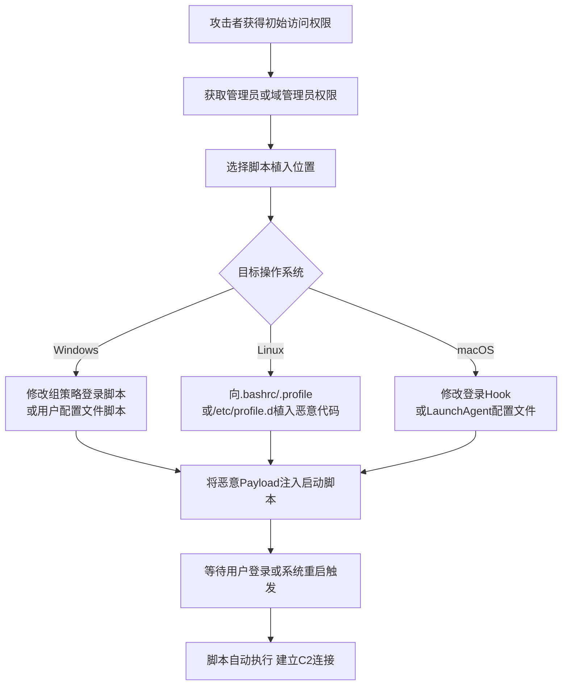

# 启动或登录初始化脚本 (T1037)

## 一句话通俗理解

> 就像在你的"开机启动项"里加了一个自动运行的脚本——每次你登录电脑，这个脚本就会默默执行，帮你"开门"给攻击者。

## 难度等级

⭐⭐ 中等（需要管理员/root权限或域管理员权限）

## 技术描述

攻击者可能使用在启动或登录初始化时自动执行的脚本来建立持久性。初始化脚本可用于执行管理功能，这些功能通常会执行其他程序或将信息发送到内部日志服务器。这些脚本可用于在单个系统上维持持久性。

登录脚本是系统管理员常用的合法工具，用于在用户登录时自动配置环境、映射网络驱动器或执行维护任务。攻击者利用这一机制将自己的恶意代码添加到这些脚本中，使得每次用户登录时恶意代码都会自动执行。

## 子技术列表

| 子技术ID | 名称 | 说明 | 平台 |
|----------|------|------|------|
| T1037.001 | 登录脚本（Windows） | Windows域登录脚本和本地登录脚本 | Windows |
| T1037.002 | 登录脚本（Mac） | macOS的loginhook和启动脚本 | macOS |
| T1037.003 | 登录脚本（Linux） | Linux的.bashrc、.profile等shell配置 | Linux |
| T1037.004 | 登录脚本（网络） | 域控制器上的组策略登录脚本 | Windows域 |
| T1037.005 | 登录脚本（跨平台） | Python/PowerShell等跨平台脚本 | 全平台 |

## 攻击流程



```
1. 获取管理员/root权限或域管理员权限
    ↓
2. 选择脚本位置：
   - Windows：组策略登录脚本、用户配置文件脚本
   - Linux：.bashrc、.profile、/etc/profile.d/
   - macOS：loginhook、LaunchAgent
    ↓
3. 将恶意代码注入或追加到脚本中
    ↓
4. 等待用户登录或系统启动
    ↓
5. 脚本自动执行，建立C2连接或部署后续payload
```

## 真实案例

### 案例1：APT29 Eye Spy邮件活动
- **时间**: 2022年11月
- **目标**: 全球政府和企业网络
- **手法**: APT29在其Eye Spy邮件活动中使用登录脚本（T1037.001）维持持久性。攻击者通过修改Windows登录脚本（如用户的登录脚本或组策略登录脚本）确保恶意代码在每次用户登录时执行。
- **链接**: https://www.mandiant.com/resources/eye-spy-apt29-email-campaign

### 案例2：APT28利用Linux登录脚本
- **时间**: 2019年3月
- **目标**: 欧洲政府和军事组织
- **手法**: APT28修改了Linux系统的RC文件（如.bashrc、.zshrc或登录挂钩）以及Windows登录脚本，确保恶意代码在系统启动或用户登录时自动执行。
- **链接**: https://www.anomali.com/resources/threat-intelligence-report-rocke

### 案例3：Volt Typhoon利用初始化脚本
- **时间**: 2023-2024年
- **目标**: 美国关键基础设施
- **手法**: Volt Typhoon在受感染的Linux服务器上修改shell初始化脚本（.bashrc、.profile），添加恶意命令以维持持久访问。这些修改与正常的系统配置文件混在一起，难以被发现。
- **链接**: https://www.cisa.gov/news-events/cybersecurity-advisories/aa24-038a

### 案例4：Lazarus Group跨平台脚本持久化
- **时间**: 2021年
- **目标**: 全球银行和金融机构
- **手法**: Lazarus Group使用跨平台登录脚本（T1037.005）在Windows、Linux和macOS上保持持久性。他们利用Python或PowerShell脚本放置在系统范围的登录初始化位置。
- **链接**: https://attack.mitre.org/groups/G0032/

## 红队视角

> ⚠️ **免责声明**：以下内容仅用于合法的安全测试、渗透测试和教育目的。未经授权对他人系统进行测试是违法行为。

**攻击优势**：
- 登录脚本是合法的管理工具，难以与正常配置区分
- 可以在多个系统间批量部署
- 跨平台脚本可以在异构环境中统一使用

**常用技术**：
```bash
# Linux - 修改.bashrc
echo "/tmp/backdoor &" >> ~/.bashrc

# Windows - 组策略登录脚本
# 将脚本添加到\\domain.com\SYSVOL\scripts\

# macOS - 设置loginhook
sudo defaults write com.apple.loginwindow LoginHook /path/to/script.sh
```

**实战技巧**：
- 将恶意代码追加到现有脚本末尾，而非替换整个文件
- 使用注释伪装恶意代码行
- 优先修改系统级脚本（/etc/profile.d/）而非用户级

## 蓝队视角

**防御重点**：
- 监控shell配置文件和登录脚本的修改
- 审计组策略登录脚本的变更
- 使用文件完整性监控关键脚本

**常见盲点**：
- 只监控Windows，忽略Linux/macOS的shell配置
- 未审计组策略中SYSVOL目录的脚本变更
- 忽略用户级脚本（.bashrc）的修改

## 检测建议

### 网络层检测

监控与登录脚本相关的网络流量，包括SYSVOL的SMB流量和组策略分发流量。

| 检测层面 | 检测方法 | 数据来源 | 检测规则示例 |
|---------|---------|---------|-------------|
| 网络边界 | SYSVOL文件访问监控 | SMB流量 | 检测从非域控制器IP发起的SYSVOL共享连接 |
| 网络流量 | 组策略更新流量检测 | Kerberos/AD流量 | 监控异常的组策略更新请求（GPUpdate） |
| 远程访问 | PowerShell远程脚本执行 | WinRM/PowerShell Remoting日志 | 检测通过WinRM执行的登录脚本修改 |

**Snort/Suricata规则示例：**
```bash
# 检测非域控制器对SYSVOL的SMB访问
alert tcp $HOME_NET any -> $DC_SERVER 445 (msg:"Non-DC SYSVOL access"; content:"|00|SYSVOL|00|"; sid:1000005; rev:1;)

# 检测异常的组策略更新请求
alert udp any any -> $DC_SERVER 389 (msg:"Abnormal GPUpdate Request"; content:"|01|GPUpdate|00|"; threshold:type both, track by_src, count 5, seconds 60; sid:1000006; rev:1;)
```

### 主机层检测

监控主机上登录初始化脚本的文件修改和执行活动。

| 检测层面 | 检测方法 | 数据来源 | 检测规则示例 |
|---------|---------|---------|-------------|
| 文件系统 | Shell配置文件修改监控 | Windows Event ID 4663 / Linux auditd | 监控.bashrc/.profile/.zshrc的写入事件（非交互式用户） |
| 文件系统 | SYSVOL脚本变更监控 | Windows Event ID 4656（SYSVOL句柄关闭） | 监控SYSVOL目录下所有.bat/.ps1/.vbs文件的创建/修改 |
| 进程执行 | 登录脚本执行监控 | Windows Event ID 4688 / Sysmon Event ID 1 | 监控以用户登录上下文执行的脚本进程（父进程为userinit.exe） |
| 注册表 | 登录脚本路径修改 | Windows Event ID 4657 | 监控UserInitMprLogonScript注册表值的修改 |

**Windows事件检测规则：**
```powershell
# 检测shell配置文件的异常修改
Get-WinEvent -FilterHashtable @{LogName='Security';ID=4663} | Where-Object {$_.Message -match ".bashrc|.profile|.zshrc"}

# 检测SYSVOL目录下的脚本修改
Get-WinEvent -FilterHashtable @{LogName='Security';ID=4663} | Where-Object {$_.Message -match "SYSVOL" -and $_.Message -match "\.ps1|\.bat|\.vbs"}
```

### 应用层检测

通过Sigma规则和YARA规则检测登录初始化脚本的恶意修改。

```yaml
title: Shell配置文件修改检测
status: experimental
description: 检测Linux系统shell配置文件的异常修改
logsource:
    category: file_event
    product: linux
detection:
    selection:
        TargetFile|endswith:
            - '.bashrc'
            - '.profile'
            - '.zshrc'
            - '/etc/profile.d/'
            - '/etc/bash.bashrc'
    condition: selection
level: high
tags:
    - attack.t1037.003
```

```yaml
title: Windows SYSVOL脚本修改检测
status: experimental
description: 检测SYSVOL目录下的登录脚本创建或修改
logsource:
    category: file_event
    product: windows
detection:
    selection:
        TargetFile|contains: 'SYSVOL'
        TargetFile|endswith:
            - '.bat'
            - '.cmd'
            - '.ps1'
            - '.vbs'
    condition: selection
level: high
```

## 缓解措施

### 优先级1：关键措施

**措施名称：** 最小特权原则与文件权限控制

**具体实施步骤：**
1. 限制用户对登录初始化脚本的写入权限（仅允许管理员修改）
2. 对SYSVOL目录实施严格的ACL控制，仅允许域管理员写入
3. 禁用非必要的shell配置文件自动加载（如.bashrc对非交互式SSH连接）

**配置示例：**
```bash
# 锁定shell配置文件权限
chmod 644 ~/.bashrc  # 只允许所有者写入
chattr +i ~/.bashrc  # 锁定文件，防止任何修改（包括root）

# 限制SYSVOL目录权限（PowerShell）
icacls \\domain.com\SYSVOL\domain.com\scripts /inheritance:d
icacls \\domain.com\SYSVOL\domain.com\scripts /grant "Domain Admins:(CI)(OI)(F)"
icacls \\domain.com\SYSVOL\domain.com\scripts /grant "SYSTEM:(CI)(OI)(F)"
```

### 优先级2：重要措施

**措施名称：** 登录脚本完整性监控

**具体实施步骤：**
1. 部署文件完整性监控（FIM），覆盖所有登录初始化脚本路径
2. 建立脚本修改的变更审批流程，记录所有修改
3. 使用代码签名验证关键脚本的完整性

**配置示例：**
```bash
# 使用AIDE监控shell配置文件的完整性
/etc/aide/aide.conf 添加：
/etc/profile.d/ CONTENT_EX
/etc/bash.bashrc CONTENT_EX

# Windows SYSVOL文件审计策略
auditpol /set /subcategory:"File System" /success:enable /failure:enable
```

**措施名称：** 应用程序控制与执行策略

**具体实施步骤：**
1. 使用AppLocker或WDAC限制脚本执行来源
2. 配置PowerShell执行策略（仅允许签名脚本）
3. 阻止登录脚本从非标准位置执行

**配置示例：**
```powershell
# 设置PowerShell执行策略
Set-ExecutionPolicy -ExecutionPolicy AllSigned -Scope LocalMachine

# AppLocker规则：仅允许管理员运行脚本
New-AppLockerPolicy -RuleType Exe -User Everyone -Action Allow -Path "%SYSTEM32%\*"
```

### 优先级3：建议措施

**措施名称：** 行为监控与异常检测

**具体实施步骤：**
1. 部署EDR监控登录脚本的异常行为（如脚本启动网络连接）
2. 建立登录脚本行为基线（正常修改频率、修改者、时间模式）
3. 配置跨平台脚本（Python/PowerShell）在登录位置放置时的告警

**措施名称：** 定期审计与红蓝验证

**具体实施步骤：**
1. 每月审查所有登录初始化脚本的内容
2. 使用Atomic Red Team测试T1037检测覆盖
3. 模拟攻击者在Linux/macOS/Windows上部署持久化脚本

**Sigma规则示例：**
```yaml
title: Shell配置文件修改检测
status: experimental
description: 检测Linux系统shell配置文件的异常修改
logsource:
    category: file_event
    product: linux
detection:
    selection:
        TargetFile|endswith:
            - '.bashrc'
            - '.profile'
            - '.zshrc'
            - '/etc/profile.d/'
            - '/etc/bash.bashrc'
    condition: selection
level: high
tags:
    - attack.t1037.003
```

### MITRE ATT&CK 缓解措施映射

| 缓解措施ID | 缓解措施名称 | 适用性 | 说明 |
|------------|-------------|--------|------|
| M1022 | 限制文件权限 | 适用 | 限制对系统初始化脚本的写入权限 |
| M1018 | 用户账户控制 | 适用 | 限制修改组策略登录脚本的权限 |
| M1028 | 操作系统配置 | 适用 | 审计shell配置文件的修改 |
| M1030 | 网络分段 | 部分适用 | 限制SYSVOL目录的网络访问 |

## 动手实验

> ⚠️ **重要提示**：所有实验必须在隔离的实验室环境中进行，禁止对未授权的真实系统进行测试。

### 实验1：Linux .bashrc持久化
```bash
# 在.bashrc末尾添加测试命令
echo "echo 'Persistence test at $(date)' >> /tmp/login_test.log" >> ~/.bashrc

# 登录新shell会话验证
bash
cat /tmp/login_test.log

# 清理
sed -i '/Persistence test/d' ~/.bashrc
```

### 实验2：Windows登录脚本
```cmd
REM 创建测试登录脚本
echo echo Login script executed at %date% %time% > C:\scripts\logon.bat

REM 通过组策略关联（需要域管理员权限）
REM 或直接在用户属性中设置登录脚本路径
```

### 实验3：macOS loginhook
```bash
# 设置loginhook（需要root权限）
sudo defaults write com.apple.loginwindow LoginHook /usr/local/bin/test_hook.sh

# 创建hook脚本
echo '#!/bin/bash' | sudo tee /usr/local/bin/test_hook.sh
echo 'echo "Login hook executed" >> /tmp/hook_test.log' | sudo tee -a /usr/local/bin/test_hook.sh
sudo chmod +x /usr/local/bin/test_hook.sh

# 清理
sudo defaults delete com.apple.loginwindow LoginHook
```

## 术语解释

| 术语 | 英文原名 | 通俗解释 |
|------|----------|----------|
| 登录脚本 | Logon Script | 用户登录时自动执行的脚本 |
| 组策略 | Group Policy | Windows域环境中的集中配置管理机制 |
| SYSVOL | SYSVOL | 域控制器上存储组策略和登录脚本的共享目录 |
| .bashrc | .bashrc | Bash shell的配置文件，在每次打开终端时执行 |
| loginhook | Login Hook | macOS在用户登录时执行的脚本 |
| LaunchAgent | Launch Agent | macOS用户级的自动启动代理 |

## 参考资料

- [MITRE ATT&CK T1037 启动或登录初始化脚本](https://attack.mitre.org/techniques/T1037/)
- [CISA 启动或登录初始化脚本防御指南](https://www.cisa.gov/eviction-strategies-tool/info-attack/T1037)
- [Mandiant APT29 Eye Spy邮件活动](https://www.mandiant.com/resources/eye-spy-apt29-email-campaign)
- [Volt Typhoon Advisory - CISA](https://www.cisa.gov/news-events/cybersecurity-advisories/aa24-038a)
- [Atomic Red Team - T1037](https://github.com/redcanaryco/atomic-red-team/tree/master/atomics/T1037)
