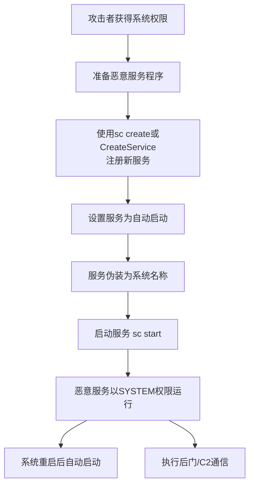

# 新服务创建 (T1050)

## 一句话通俗理解

攻击者在系统里注册一个新的"后台服务"，就像在酒店里开了一个长期包房——每次系统重启，这个包房（服务）都会自动开门营业。

## 难度等级

- ⭐⭐ 中级（需要一定基础）

## 技术描述

新服务创建（T1050）是MITRE ATT&CK框架中隐蔽战术的一种技术。

**通俗解释：**
Windows系统的"服务"是用来在后台长期运行程序的一种机制——比如杀毒软件服务、打印服务、更新服务等。这些服务有几个特点：开机自动启动、以高权限运行（通常是SYSTEM账户）、后台默默运行没有界面。攻击者利用这一点，把自己的恶意程序注册为一个系统服务，这样每次重启都会自动运行恶意代码，而且很难被普通用户发现。

**技术原理：**

1. 攻击者使用`sc create`命令或CreateService API创建新的服务条目
2. 服务配置为自动启动类型，确保系统启动时自动加载
3. 恶意服务以SYSTEM或管理员权限运行，执行后门、下载器或勒索软件
4. 服务名伪装为系统服务名称，如"Microsoft Update Service"、"Windows Security Center"

**用途与影响：**
新服务创建为攻击者提供了可靠的持久化机制和提升的权限。在勒索软件攻击中，攻击者经常创建新服务来运行加密程序；在APT攻击中，恶意服务用于长期驻留和C2通信。由于服务在系统后台运行，用户甚至不会注意到有新的进程在运行。

## 子技术列表

**该技术没有子技术。**（此技术已被MITRE ATT&CK v14弃用，合并至T1543.003）

## 攻击流程

### 典型攻击流程

```
获得权限 --> 准备恶意服务程序 --> 创建服务 --> 启动服务 --> 维持持久化
```



**步骤详解：**

1. **获得系统权限**
   - 通俗描述：攻击者先获得目标系统的控制权
   - 技术细节：通过漏洞利用或凭证窃取获得管理员权限
   - 常用工具：漏洞利用工具包、Mimikatz

2. **准备恶意服务程序**
   - 通俗描述：编写或准备一个可以作为服务运行的后门程序
   - 技术细节：服务程序需要实现ServiceMain入口点
   - 常用工具：Cobalt Strike、Metasploit、自定义开发

3. **创建服务**
   - 通俗描述：在系统中注册新服务
   - 技术细节：`sc create [服务名] binPath="恶意程序路径" start=auto`
   - 常用工具：sc.exe、PowerShell New-Service

4. **启动并维持服务**
   - 通俗描述：立即启动服务，并确保以后也能自动启动
   - 技术细节：`sc start [服务名]` 启动服务
   - 常用工具：sc.exe、net start

## 真实案例

### 案例1：Conti勒索软件创建新服务执行加密（2021-2022）

- **时间**: 2021年-2022年
- **目标**: 全球企业
- **攻击组织**: Conti
- **手法**: Conti勒索软件在横向移动过程中，使用PsExec在目标系统上创建新服务。服务名伪装为"Windows Defender Update"或"Microsoft Security Center"，二进制路径指向托管在共享文件夹中的Conti加密器。服务以SYSTEM权限启动，确保加密过程不受权限限制。
- **影响**: 全球数百家企业数据被加密
- **参考链接**: [MITRE - Conti](https://attack.mitre.org/software/S0575/)

### 案例2：BlackCat使用服务创建持久化（2023-2024）

- **时间**: 2023年-2024年
- **目标**: 全球医疗、教育行业
- **攻击组织**: BlackCat（ALPHV）
- **手法**: BlackCat勒索软件使用Windows服务实现持久化。他们创建名为"ALPHVService"或伪装为"MicrosoftEdgeUpdate"的服务，指向勒索软件二进制文件。服务配置为自动启动并设置为"恢复"模式，即使服务被终止也会自动重启。创建服务的命令被混淆编码在PowerShell脚本中。
- **影响**: 多家大型医疗机构数据被加密
- **参考链接**: [CISA - BlackCat Advisory](https://www.cisa.gov/news-events/cybersecurity-advisories/aa23-165a)

### 案例3：APT29使用服务托管C2后门（2020-2021）

- **时间**: 2020年-2021年
- **目标**: 美国政府机构、智库
- **攻击组织**: APT29（Cozy Bear）
- **手法**: APT29在SolarWinds攻击的后渗透阶段，使用创建的服务来托管C2后门。他们将Cobalt Strike Beacon作为Windows服务安装，服务名设置为"Windows Update Service"。该服务在系统后台运行，定期向C2服务器发送HTTP心跳请求。
- **影响**: 多个美国政府机构数据泄露
- **参考链接**: [CrowdStrike - SUNBURST](https://www.crowdstrike.com/blog/sunspot-malware-technical-analysis/)

### 案例4：LockBit通过服务创建横向传播（2024-2025）

- **时间**: 2024年-2025年
- **目标**: 全球制造业、能源行业
- **攻击组织**: LockBit
- **手法**: LockBit 4.0在2024-2025年的攻击活动中，利用新服务创建进行横向传播。攻击者通过已攻陷的域控制器，使用组策略启动脚本在所有域成员上创建恶意服务。服务名为"VMwareTools"或"IntelRSTService"，与合法的系统服务名高度相似。每个服务通过SMB共享执行加密的勒索软件负载。
- **影响**: 全球大规模勒索感染
- **参考链接**: [Trend Micro - LockBit 4.0](https://www.trendmicro.com/)

## 红队视角

> ⚠️ **免责声明**：以下内容仅用于合法的安全测试、渗透测试和教育目的。未经授权对他人系统进行测试是违法行为。

### 实战技巧

1. **服务名称伪装技巧**
   使用与常见软件相关的服务名，如"GoogleUpdateService"、"AdobeARMservice"、"VMwareTools"。避免使用svchost等高度受监控的系统服务名。

2. **使用PowerShell创建服务**
   `New-Service -Name "WindowsSecurityCenter" -BinaryPathName "C:\Windows\Temp\svchost.exe" -StartupType Automatic`

3. **隐藏服务描述**
   创建服务时可以留空描述或使用与伪装名称匹配的合法描述文本，增加管理员人工审查的难度。

### 常用工具

| 工具名称 | 用途 | 平台 | 链接 |
|----------|------|------|------|
| sc.exe | Windows服务管理命令 | Windows | 系统内置 |
| PowerShell | New-Service/Set-Service cmdlet | Windows | 系统内置 |
| PsExec | 远程创建服务执行命令 | Windows | https://docs.microsoft.com/en-us/sysinternals/downloads/psexec |
| Cobalt Strike | 内置服务创建和执行模块 | Windows | https://www.cobaltstrike.com/ |
| Metasploit | exploit/windows/local/payload_inject | Windows | https://www.metasploit.com/ |

### 注意事项

- 创建服务需要管理员权限，普通用户无法执行
- 服务程序必须实现正确的ServiceMain入口，否则服务无法正常运行
- 安全产品对sc.exe和PsExec的创建服务行为有专门监控规则
- 避免在文件名中使用明显的恶意标识

## 蓝队视角

### 检测要点

1. **监控新服务创建事件**
   - 日志来源：Windows事件日志（Event ID 7045 - 服务安装）
   - 关注字段：服务名称、服务二进制路径、服务启动类型、创建者账户
   - 异常特征：非IT管理员创建服务、服务名与系统服务相似但路径在临时目录

2. **检测服务创建工具的执行**
   - 日志来源：Sysmon Event ID 1（进程创建）
   - 关注字段：sc.exe、PowerShell、PsExec的执行
   - 异常特征：非管理员用户在非工作时间使用sc.exe创建服务

3. **分析异常服务行为**
   - 日志来源：Sysmon Event ID 3（网络连接）
   - 关注字段：新创建服务的网络连接目标
   - 异常特征：新服务立即建立外部网络连接

### 监控建议

- 启用事件ID 7045（新服务安装）的日志记录
- 建立企业服务的基线清单，定期比对服务列表
- 配置Sysmon监控sc.exe和PsExec的执行
- 创建服务变更告警规则，特别是系统目录之外的服务二进制

## 检测建议

### 网络层检测

**检测方法：** 监控新注册服务建立的异常网络连接。

**具体规则/命令示例：**
```
# 检测新服务到可疑目标的网络连接
# 关注服务进程的非标准端口连接
```

### 主机层检测

**Windows事件ID：**
- 事件ID 7045：新服务被安装
- 事件ID 4688：进程创建（sc.exe执行）
- Sysmon Event ID 1：进程创建
- Sysmon Event ID 3：网络连接

**具体命令示例：**
```bash
# 查看最近安装的服务
Get-WmiObject -Class Win32_Service | Where-Object {$_.PathName -match "temp|users|appdata"}

# 查询事件ID 7045
Get-WinEvent -FilterHashtable @{LogName='System';Id=7045} | Format-List
```

### 应用层检测

**Sigma规则示例：**
```yaml
title: 新服务创建 - 可疑路径
status: experimental
description: 检测在非标准系统目录创建的服务
logsource:
    category: process_creation
    product: windows
detection:
    selection:
        EventID: 7045
        ImagePath|contains:
            - '\Temp\'
            - '\Users\'
            - '\AppData\'
            - '\Downloads\'
    condition: selection
level: high
tags:
    - attack.t1050
```

## 缓解措施

### 优先级1：关键措施

**措施名称：** 限制服务创建权限

**具体实施步骤：**
1. 通过组策略限制非管理员账户创建服务
2. 使用WDAC（Windows Defender Application Control）验证服务二进制文件的签名
3. 对PsExec等远程执行工具实施白名单管控

### 优先级2：重要措施

**措施名称：** 服务变更监控

**具体实施步骤：**
1. 启用服务安装事件（7045）的实时告警
2. 建立服务基线并进行定期比对
3. 对新安装的服务实施人工审核流程

### 优先级3：建议措施

**措施名称：** 加固系统服务配置

**具体实施步骤：**
1. 禁用不必要的服务和功能
2. 配置服务恢复选项，防止恶意服务自动重启
3. 定期审计服务配置

### MITRE ATT&CK 缓解措施映射

| 缓解措施ID | 缓解措施名称 | 适用性 | 说明 |
|------------|-------------|--------|------|
| M1045 | 软件限制策略 | 适用 | WDAC限制未签名服务程序执行 |
| M1026 | 权限审计 | 适用 | 审计服务创建和修改事件 |
| M1018 | 用户账户控制 | 适用 | 限制非管理员创建服务权限 |
| M1038 | 执行预防 | 部分适用 | ASR规则阻止PsExec创建服务 |

## 动手实验

> ⚠️ **重要提示**：所有实验必须在隔离的实验室环境中进行，禁止对未授权的真实系统进行测试。

### 实验环境准备

**所需工具：**
- Windows虚拟机
- sc.exe / PowerShell

### 实验1：创建Windows服务（初级）

**实验目标：** 学习使用sc.exe创建和管理Windows服务。

**实验步骤：**
1. 以管理员身份打开命令提示符
2. 使用`sc create TestService binPath="C:\Windows\System32\calc.exe" start=auto`
3. 使用`sc query TestService`查看服务状态
4. 使用`sc start TestService`启动服务
5. 使用`sc delete TestService`删除服务

**预期结果：** 能够成功创建、启动和删除服务。

### 实验2：检测可疑服务创建（初级）

**实验目标：** 使用事件查看器检测新服务创建事件。

**实验步骤：**
1. 打开事件查看器，导航到Windows日志 > 系统
2. 过滤事件ID 7045
3. 创建一个测试服务
4. 观察事件日志中的服务创建记录

**预期结果：** 事件查看器中显示了新服务创建的详细记录。

## 术语解释

| 术语 | 英文原名 | 通俗解释 |
|------|----------|----------|
| 服务 | Windows Service | 在Windows后台长期运行的程序，不需要用户登录，开机自动启动 |
| SYSTEM | SYSTEM Account | Windows最高权限的系统账户，比管理员权限还高 |
| SCM | Service Control Manager | Windows中管理所有服务的"服务管家" |
| 二进制路径 | Binary Path | 服务程序的完整文件路径 |
| PsExec | PsExec | Sysinternals工具，可以在远程电脑上执行命令 |

## 参考资料

### 官方文档

- [MITRE ATT&CK - T1050 (Deprecated)](https://attack.mitre.org/techniques/T1050/)
- [MITRE ATT&CK - T1543.003](https://attack.mitre.org/techniques/T1543/003/)

### 安全报告

- [CISA - BlackCat Advisory](https://www.cisa.gov/news-events/cybersecurity-advisories/aa23-165a)
- [CrowdStrike - SUNBURST Analysis](https://www.crowdstrike.com/blog/sunspot-malware-technical-analysis/)

### 工具与资源

- [Sysinternals PsExec](https://docs.microsoft.com/en-us/sysinternals/downloads/psexec)
- [Windows Service Documentation](https://docs.microsoft.com/en-us/windows/win32/services/service-programs)
