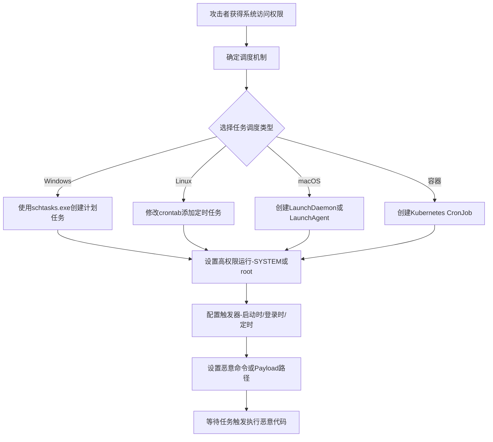

# 计划任务/作业 (T1053)

## 一句话通俗理解

> 就像给你的电脑设了个"闹钟"——但这个闹钟不是叫你起床，而是在特定时间自动执行恶意代码。每天凌晨3点、每次你登录、或者每次系统启动，恶意程序都会准时"打卡上班"。

## 30秒速查卡

| 维度 | 你需要知道的 |
|------|-------------|
| 这是什么？ | 攻击者利用系统内置的任务调度功能（Windows计划任务、Linux cron、Kubernetes CronJob）来定时自动执行恶意代码，实现持久化访问 |
| 为什么危险？ | 因为是系统自带功能，杀毒软件不会拦截；可设置启动时、登录时、定时触发，系统重启也不会丢失访问 |
| 谁需要关心？ | 系统管理员、安全运维人员、Kubernetes集群管理员 |
| 你的第一步防御 | 监控计划任务创建事件（Windows事件ID 4698），定期审计crontab和systemd定时器的变更 |
| 如果只做一件事 | 建立计划任务基线，用自动化工具定期对比当前任务列表与基线，发现新增或修改立即告警 |

## 难度等级

⭐ 简单（需要用户级或管理员权限）

## 前置知识检查

**读这个文件需要什么？**

- [ ] 操作系统权限模型：知道什么是用户权限、管理员/SYSTEM/root权限的区别（就像普通员工 vs 老板的权限差别）
- [ ] 命令行基础：会用schtasks.exe（Windows）和crontab（Linux）查看系统计划任务（就像会查看手机的"定时任务"列表）
- [ ] 进程与服务概念：知道程序可以"在后台偷偷运行"（就像手机App在后台运行但不显示在前台）

## 技术描述

**过渡段：** 上面的"闹钟"比喻帮你建立了直观印象，但现实中的计划任务机制远比闹钟复杂——它不只是定时响铃。攻击者可以精确控制何时触发（系统启动、用户登录、特定事件）、以什么权限运行（普通用户甚至SYSTEM/root）、执行什么操作（运行脚本、启动程序、下载payload）。更关键的是，每种操作系统都有自己的调度系统（Windows Task Scheduler、Linux cron/systemd timer、Kubernetes CronJob），它们的配置方式、检测方法和防御策略各不相同。下面我们来深入技术细节。

攻击者可能滥用任务调度机制以在预定时间或间隔执行恶意代码，通过确保代码定期运行来实现持久性。任务调度设施内置于大多数操作系统和容器编排平台中，允许程序或脚本自动运行并具有可配置的触发器（如登录时、每天、空闲时、系统启动时）。这些机制通常被系统管理员用于合法维护任务，使其成为寻求隐蔽持久性的攻击者常用的"离地攻击"技术。

## 子技术列表

| 子技术ID | 名称 | 说明 | 平台 |
|----------|------|------|------|
| T1053.001 | At（Windows） | Windows at.exe调度 | Windows |
| T1053.002 | At（Linux） | Linux at命令 | Linux |
| T1053.003 | Cron | Unix/Linux cron作业 | Linux/macOS |
| T1053.005 | 计划任务（Windows） | Windows任务调度器 | Windows |
| T1053.006 | Systemd定时器 | Linux systemd定时器 | Linux |
| T1053.007 | 容器编排作业 | Kubernetes CronJob | 容器 |

## 攻击流程



```
1. 获取系统访问权限
    ↓
2. 选择调度机制：
   - Windows计划任务（schtasks.exe）
   - Linux cron（crontab）
   - Systemd定时器
   - Kubernetes CronJob
    ↓
3. 创建调度任务：
   - 设置触发器（启动时、登录时、定时）
   - 设置要执行的命令/脚本
   - 设置运行权限（SYSTEM/root）
    ↓
4. 等待任务触发
    ↓
5. 恶意代码自动执行
```

## 真实案例

### 案例1：APT29利用Scheduled Tasks维持持久性
- **时间**: 2021年
- **目标**: 美国联邦政府机构、外交实体和智库
- **手法**: APT29广泛使用Scheduled Tasks来维持持久性访问。攻击者创建了多个计划任务，配置为在系统启动时、用户登录时或定时执行恶意payload，伪装成合法的系统更新或安全扫描任务。
- **链接**: https://attack.mitre.org/groups/G0016/

### 案例2：Wizard Spider利用Scheduled Tasks
- **时间**: 2020年
- **目标**: 全球金融机构和医疗机构
- **手法**: Wizard Spider在其TrickBot和Conti勒索软件运营中广泛滥用Windows Task Scheduler。TrickBot创建计划任务以实现持久性，Conti使用计划任务来调度加密程序的执行。
- **链接**: https://attack.mitre.org/software/S0266/

### 案例3：TeamTNT利用Container Orchestration Job
- **时间**: 2021年
- **目标**: 未受保护的Kubernetes集群和Docker环境
- **手法**: TeamTNT部署恶意CronJob来运行加密货币挖矿容器，配置为定期运行，确保挖矿进程在被终止后重新启动。
- **链接**: https://attack.mitre.org/groups/G0139/

### 案例4：Volt Typhoon利用Cron持久化
- **时间**: 2023-2024年
- **目标**: 美国关键基础设施
- **手法**: Volt Typhoon在受感染的Linux服务器上使用cron作业维持持久性，添加crontab条目配置为定期执行恶意脚本以与C2服务器通信。
- **链接**: https://www.cisa.gov/news-events/cybersecurity-advisories/aa24-038a

## 红队视角

> ⚠️ **免责声明**：以下内容仅用于合法的安全测试、渗透测试和教育目的。未经授权对他人系统进行测试是违法行为。

**攻击优势**：
- 计划任务是合法的系统管理工具
- 可以设置多种触发条件
- 可以以SYSTEM/root权限执行

**常用命令**：
```cmd
REM Windows计划任务
schtasks /create /tn "WindowsUpdate" /tr "C:\temp\malware.exe" /sc onstart /ru SYSTEM
schtasks /create /tn "DailyCheck" /tr "C:\temp\beacon.exe" /sc daily /st 03:00

REM Linux cron
echo "0 3 * * * /tmp/backdoor.sh" | crontab -
echo "@reboot /tmp/backdoor.sh" | crontab -

REM Kubernetes CronJob
kubectl create cronjob malicious --image=malicious:latest --schedule="0 3 * * *"
```

**实战技巧**：
- 使用看似合法的任务名称（如"WindowsUpdate"、"SystemMaintenance"）
- 设置随机延迟避免在整点执行
- 配合T1547（自动启动）使用增加冗余

## 蓝队视角

**防御重点**：
- 监控计划任务的创建和修改
- 审计cron目录的变更
- 检查Kubernetes CronJobs

**常见盲点**：
- 只监控Windows，忽略Linux/macOS
- 未审计容器环境中的调度作业
- 缺乏对任务执行内容的检查

## 检测建议

### 网络层检测

**检测方法：** 监控计划任务尝试连接外部C2服务器的网络流量，检测schtasks.exe发起的异常出站连接。

**具体规则/命令示例：**
```bash
# Suricata规则检测计划任务下载payload
alert http $HOME_NET any -> $EXTERNAL_NET any (msg:"Scheduled Task Downloading Payload"; content:"schtasks"; http_uri; flow:to_server,established; sid:1000201; rev:1;)
```

### 主机层检测

**检测方法：** 监控计划任务的创建和修改事件，审计cron和systemd定时器的变更。

**Windows事件ID：**
- 事件ID 4698：计划任务创建
- 事件ID 4699：计划任务删除
- 事件ID 4700：计划任务启用
- 事件ID 4701：计划任务禁用
- 事件ID 4702：计划任务更新

**Linux日志：**
- 日志文件：`/var/log/cron`（cron作业执行日志）
- 日志文件：`/var/log/syslog`（systemd定时器事件）
- 关键字段：CROND条目中的异常命令执行

**具体命令示例：**
```bash
# 列出所有计划任务
schtasks /query /fo LIST /v

# 检查crontab变更
crontab -l
ls -la /var/spool/cron/crontabs/

# 列出systemd定时器
systemctl list-timers --all
```

### 应用层检测

**Sigma规则示例：**
```yaml
title: 计划任务创建检测
status: experimental
description: 检测使用schtasks.exe创建计划任务的事件
logsource:
    category: process_creation
    product: windows
detection:
    selection:
        Image|endswith: '\schtasks.exe'
        CommandLine|contains: '/create'
    condition: selection
level: medium
tags:
    - attack.t1053.005
```

## 缓解措施

### 优先级1：关键措施

**措施名称：** 限制计划任务创建权限

**具体实施步骤：**
1. 通过组策略限制非管理员用户创建计划任务的权限
2. 在Linux系统上使用sudoers配置限制crontab和at命令的访问
3. 在Kubernetes环境中使用RBAC严格限制CronJob的创建权限
4. 使用AppLocker或WDAC限制计划任务可执行的二进制文件范围

### 优先级2：重要措施

**措施名称：** 计划任务审计与监控

**具体实施步骤：**
1. 配置Windows安全审计策略以记录所有计划任务创建和修改事件（事件ID 4698-4702）
2. 使用Sysmon监控schtasks.exe、at.exe和crontab的进程创建事件
3. 定期审查Windows `%SystemRoot%\System32\Tasks\` 目录和Linux `/etc/cron*` 目录
4. 建立计划任务基线并监控偏离基线的异常任务

**配置示例：**
```bash
# 配置Windows审计策略记录计划任务事件
auditpol /set /subcategory:"Other Object Access Events" /success:enable /failure:enable

# Linux cron访问限制
echo "user1 - - /usr/sbin/crontab" >> /etc/security/access.conf
```

## 动手实验

> ⚠️ **重要提示**：所有实验必须在隔离的实验室环境中进行，禁止对未授权的真实系统进行测试。

### 实验1：Windows计划任务
```cmd
REM 创建测试计划任务（需要管理员权限）
schtasks /create /tn "TestTask" /tr "cmd.exe /c echo test > C:\temp\task_test.txt" /sc onstart

REM 查看任务
schtasks /query /tn "TestTask"

REM 手动触发
schtasks /run /tn "TestTask"

REM 清理
schtasks /delete /tn "TestTask" /f
```

### 实验2：Linux Cron作业
```bash
# 添加cron作业
echo "* * * * * echo 'Cron test' >> /tmp/cron_test.log" | crontab -

# 查看crontab
crontab -l

# 清理
crontab -r
```

### 实验3：使用Atomic Red Team测试
```powershell
# 执行T1053测试
Invoke-AtomicTest T1053
```

## 术语解释

| 术语 | 英文原名 | 通俗解释 |
|------|----------|----------|
| 计划任务 | Scheduled Task | Windows任务调度器中的任务，就像设置了一个定时闹钟 |
| Cron | Cron | Unix/Linux系统的时间调度守护进程，按照配置文件定期执行命令 |
| Systemd定时器 | Systemd Timer | Linux systemd中的定时任务机制，比传统cron更灵活 |
| CronJob | CronJob | Kubernetes中定时执行的作业，用于在容器集群中定期运行任务 |
| crontab | Crontab | cron的配置文件，定义了要执行的命令和执行时间 |
| schtasks.exe | schtasks.exe | Windows命令行任务调度工具，用于创建和管理计划任务 |

## 参考资料

### 分类标注
| 类别 | 链接 |
|------|------|
| 📚 深入了解 | [MITRE ATT&CK T1053 计划任务/作业](https://attack.mitre.org/techniques/T1053/) - 如果你想深入了解技术细节 |
| 🔧 动手试试 | [Atomic Red Team - T1053](https://github.com/redcanaryco/atomic-red-tree/tree/master/atomics/T1053) - 如果你想动手测试计划任务攻击 |
| 📰 真实攻击 | [APT29 SolarWinds活动分析 - Mandiant](https://www.mandiant.com/resources/evasive-attacker-leverages-solarwinds-supply-chain-compromises) - 真实APT组织如何滥用计划任务 |
| 📰 真实攻击 | [TrickBot分析 - FireEye](https://www.fireeye.com/blog/threat-research/2020/02/trickbot-malware-analysis.html) - TrickBot勒索软件中的计划任务使用 |
| 📰 真实攻击 | [Volt Typhoon Advisory - CISA](https://www.cisa.gov/news-events/cybersecurity-advisories/aa24-038a) - Volt Typhoon在Linux服务器上用cron持久化 |
