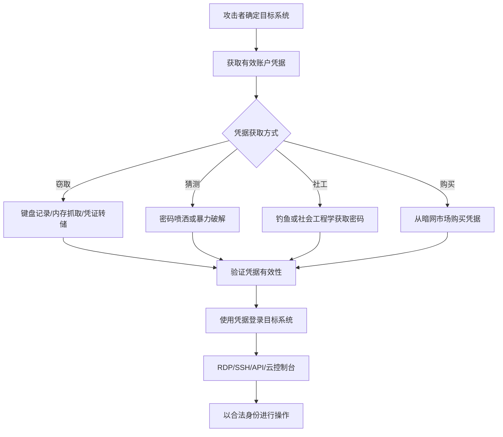

# 有效账户 (T1078)

## 一句话通俗理解

> 就像小偷偷了你的身份证和钥匙，然后每天正常刷卡进出门——攻击者直接用偷来的合法账号登录，不需要安装任何后门，看起来和正常员工一模一样，安全软件根本分不出来。

## 难度等级

⭐⭐ 中等（需要有效的账户凭据）

## 技术描述

攻击者可能获取和滥用现有账户的凭据作为持久性手段。通过利用合法用户账户（本地、域或云），攻击者可以在不安装传统后门或持久性机制的情况下维持对系统和网络的访问。使用有效账户提供了几个优势：与正常用户活动混在一起，绕过许多检测恶意软件安装的安全控制，并且可以通过受信任的关系提供对多个系统的访问。

被入侵的账户可以直接使用（通过交互式登录、RDP、SSH或API访问）或间接使用（使用账户的令牌或票据访问资源）。通过有效账户实现的持久性本质上与凭据的生命周期相关联；攻击者通常通过修改凭据（更改密码、添加替代认证方法）或创建/操纵账户本身来维持访问。有效账户也可以在其他持久性形式（如计划任务或服务）被发现和移除时作为备用持久性机制。

## 子技术列表

| 子技术ID | 名称 | 说明 | 风险等级 |
|----------|------|------|----------|
| T1078.001 | 默认账户 | 使用系统预配置的默认账户 | ⭐⭐⭐ 高 |
| T1078.002 | 域账户 | 使用Active Directory域账户 | ⭐⭐⭐ 高 |
| T1078.003 | 本地账户 | 使用本地系统账户 | ⭐⭐ 中等 |
| T1078.004 | 云账户 | 使用云平台账户（AWS/Azure/GCP） | ⭐⭐⭐ 高 |

## 攻击流程



```
1. 获取有效账户凭据：
   - 凭据窃取（键盘记录、内存抓取）
   - 密码猜测/暴力破解
   - 社会工程学
   - 暗网购买
    ↓
2. 验证凭据有效性
    ↓
3. 使用凭据访问目标系统：
   - 交互式登录
   - RDP/SSH
   - API调用
   - 云控制台
    ↓
4. 维持访问：
   - 修改密码
   - 添加MFA设备
   - 创建备用账户
    ↓
5. 横向移动到其他系统
```

## 真实案例

### 案例1：APT29 SolarWinds攻击中的Valid Accounts滥用
- **时间**: 2020年
- **目标**: 美国联邦政府机构、科技公司和智库
- **手法**: APT29广泛使用Valid Accounts来维持持久性访问。攻击者使用被盗的凭证（包括Kerberos票证和应用程序注册密钥）冒充合法用户和应用程序身份，使用OAuth应用程序创建恶意的服务主体。
- **链接**: https://attack.mitre.org/groups/G0016/

### 案例2：LAPSUS$利用云账户
- **时间**: 2022年
- **目标**: Microsoft、NVIDIA、三星等科技公司
- **手法**: LAPSUS$通过社会工程学获取初始凭据后，使用合法的云管理账户进行横向移动和持久化，创建新的云访问密钥和IAM角色。
- **链接**: https://www.microsoft.com/en-us/security/blog/2022/03/22/dev-0537-criminal-actor-targeting-organizations-for-data-exfiltration-and-destruction/

### 案例3：Scattered Spider利用云账户
- **时间**: 2023年
- **目标**: MGM Resorts、Caesars Entertainment等大型企业
- **手法**: Scattered Spider大量使用云账户进行持久化。攻击者通过针对IT帮助台的社会工程学攻击获取初始凭证，然后使用被盗的凭据登录到虚拟化基础设施和云服务。
- **链接**: https://www.crowdstrike.com/blog/scattered-spider-delivers-ransomware-at-warp-speed/

### 案例4：Volt Typhoon利用合法凭据
- **时间**: 2023-2024年
- **目标**: 美国关键基础设施
- **手法**: Volt Typhoon利用合法凭据和"离地攻击"技术，使用被盗的域账户和本地账户进行横向移动和持久化，以合法用户身份操作。
- **链接**: https://www.cisa.gov/news-events/cybersecurity-advisories/aa24-038a

## 红队视角

> ⚠️ **免责声明**：以下内容仅用于合法的安全测试、渗透测试和教育目的。未经授权对他人系统进行测试是违法行为。

**攻击优势**：
- 使用合法凭据，难以与正常用户区分
- 不需要安装恶意软件
- 可以绕过许多安全控制

**常用工具**：
```cmd
REM 使用窃取的凭据登录
runas /user:domain\admin cmd.exe

REM RDP连接
mstsc /v:target:3389

REM SSH连接
ssh user@target

REM 云CLI登录
aws configure --profile stolen
az login --username stolen@tenant.com
```

**实战技巧**：
- 优先使用服务账户（更少被监控）
- 在非工作时间使用凭据减少被注意的可能
- 配合T1098（账户操纵）使用，修改凭据维持访问

## 蓝队视角

**防御重点**：
- 监控异常登录行为
- 实施MFA保护所有账户
- 定期轮换凭据

**常见盲点**：
- 只关注恶意软件，忽略凭据滥用
- 未监控服务账户的异常使用
- 缺乏对云账户的异常检测

## 检测建议

### 网络层检测

**检测方法：** 监控异常的网络登录流量，检测来自不常见地理位置或已知恶意IP地址的认证请求。

**具体规则/命令示例：**
```bash
# Suricata规则检测异常RDP登录尝试
alert tcp $EXTERNAL_NET any -> $HOME_NET 3389 (msg:"Suspicious RDP Login from External"; flow:to_server,established; detection_filter:track by_src, count 10, seconds 60; sid:1000202; rev:1;)
```

### 主机层检测

**检测方法：** 监控Windows安全事件日志中的异常登录事件，检测凭据滥用和横向移动。

**Windows事件ID：**
- 事件ID 4624：账户成功登录
- 事件ID 4625：账户登录失败
- 事件ID 4648：使用显式凭据登录
- 事件ID 4672：超级用户登录（赋予特殊权限）

**Linux日志：**
- 日志文件：`/var/log/auth.log` 或 `/var/log/secure`
- 关键字段：sshd条目中的Accepted password/publickey
- 关键字段：sudo命令执行记录

**具体命令示例：**
```bash
# 检查最近的登录事件
last -10

# 检查失败的SSH登录尝试
grep "Failed password" /var/log/auth.log

# 检查所有当前登录会话
who -u
```

### 应用层检测

**Sigma规则示例：**
```yaml
title: 异常地理位置登录检测
status: experimental
description: 检测从不常见地理位置的成功登录事件
logsource:
    category: authentication
    product: windows
detection:
    selection:
        EventID: 4624
        LogonType: 10  # 远程交互登录
    geo_condition:
        IpAddress|not_in: trusted_geo_whitelist
    condition: selection and geo_condition
level: high
tags:
    - attack.t1078
```

## 缓解措施

### 优先级1：关键措施

**措施名称：** 多因素认证（MFA）

**具体实施步骤：**
1. 对所有面向外部的账户强制实施MFA，特别是管理门户和远程访问入口
2. 将云平台（Azure AD、AWS IAM）的条件访问策略配置为要求MFA
3. 对高权限账户使用FIDO2安全密钥或证书认证替代密码认证
4. 实施MFA防疲劳策略，要求提供额外的地理位置或设备信息

### 优先级2：重要措施

**措施名称：** 最小权限与凭据管理

**具体实施步骤：**
1. 对所有账户实施最小权限原则，使用基于角色的访问控制（RBAC）
2. 对高权限账户实施即时（JIT）访问和特权身份管理（PIM）
3. 定期审查和轮换凭据，特别是服务账户和非交互式账户
4. 禁用不再需要的账户，更改所有默认账户的初始密码

**配置示例：**
```bash
# Azure AD条件访问策略 - 要求MFA
Connect-MgGraph
New-MgIdentityConditionalAccessPolicy -DisplayName "Require MFA for Admins" -Conditions @{...} -GrantControls @{BuiltInControls="mfa"}

# 密码策略设置
net accounts /minpwlen:14 /maxpwage:90 /minpwage:1
```

## 动手实验

> ⚠️ **重要提示**：所有实验必须在隔离的实验室环境中进行，禁止对未授权的真实系统进行测试。

### 实验1：凭据验证
```cmd
REM 验证域凭据
net use \\target\C$ /user:domain\username password

REM 使用PowerShell验证
$cred = Get-Credential
Test-ComputerSecureChannel -Credential $cred
```

### 实验2：云账户访问
```bash
# AWS CLI使用窃取的凭据
aws sts get-caller-identity --profile stolen

# Azure CLI登录
az login --username stolen@tenant.com --password password
```

### 实验3：使用Atomic Red Team测试
```powershell
# 执行T1078测试
Invoke-AtomicTest T1078
```

## 术语解释

| 术语 | 英文原名 | 通俗解释 |
|------|----------|----------|
| 域账户 | Domain Account | Active Directory中的用户账户，可以在整个企业网络中使用 |
| 本地账户 | Local Account | 存储在单个系统上的用户账户，只能在该系统上使用 |
| 云账户 | Cloud Account | AWS IAM、Azure AD等云平台中的账户 |
| 默认账户 | Default Account | 系统预配置的账户（如root、Administrator），通常有默认密码 |
| 服务账户 | Service Account | 用于应用程序和服务的专用账户，通常有高权限 |
| MFA | Multi-Factor Authentication | 多因素认证，需要两种以上验证方式的认证方法 |
| JIT | Just-In-Time | 即时访问，按需临时授予权限的机制 |

## 参考资料

- [MITRE ATT&CK T1078 有效账户](https://attack.mitre.org/techniques/T1078/)
- [APT29 SolarWinds分析 - Mandiant](https://www.mandiant.com/resources/evasive-attacker-leverages-solarwinds-supply-chain-compromises)
- [LAPSUS$活动分析 - Microsoft](https://www.microsoft.com/en-us/security/blog/2022/03/22/dev-0537-criminal-actor-targeting-organizations-for-data-exfiltration-and-destruction/)
- [Scattered Spider分析 - CrowdStrike](https://www.crowdstrike.com/blog/scattered-spider-delivers-ransomware-at-warp-speed/)
- [Volt Typhoon Advisory - CISA](https://www.cisa.gov/news-events/cybersecurity-advisories/aa24-038a)
- [Atomic Red Team - T1078](https://github.com/redcanaryco/atomic-red-team/tree/master/atomics/T1078)
