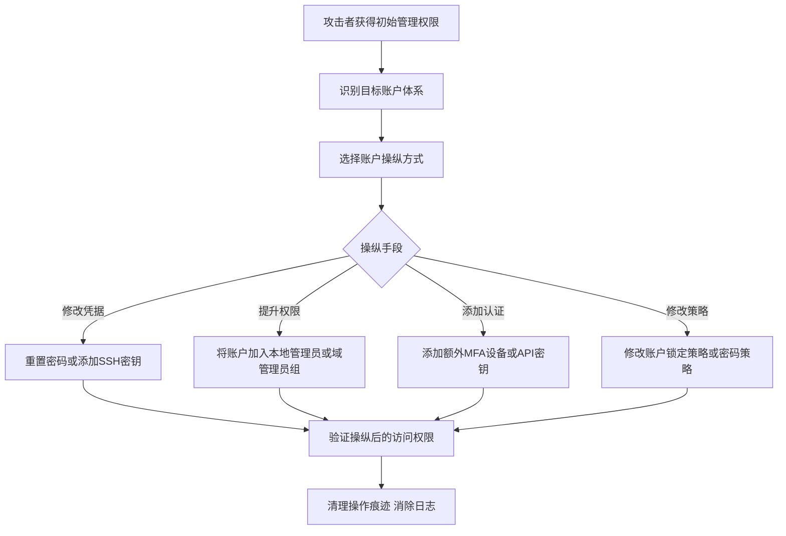

# 账户操纵 (T1098)

## 一句话通俗理解

> 就像小偷偷到了你家钥匙后，不仅不还，还偷偷给自己配了一把万能钥匙，并且把自己的权限升级成了"房东"。

## 难度等级

⭐⭐ 中等（需要已有管理员权限）

## 技术描述

攻击者通过操纵账户来维持和/或提升对受害者系统的访问权限。账户操纵包括任何保持或修改攻击者对已入侵账户访问权限的操作，例如修改凭据或权限组。这些操作还包括旨在破坏安全策略的账户活动，例如执行迭代密码更新以绕过密码持续时间策略并保持被入侵凭据的使用寿命。

要创建或操纵账户，攻击者必须已经在系统或域上拥有足够的权限。然而，账户操纵也可能导致权限提升，因为修改可以授予对额外角色、权限或更高权限有效账户的访问权限。

## 子技术列表

| 子技术ID | 名称 | 说明 |
|----------|------|------|
| T1098.001 | 额外云凭据 | 在云环境中创建额外的访问密钥或服务主体 |
| T1098.002 | 额外邮箱委托权限 | 授予攻击者对目标邮箱的读取/发送权限 |
| T1098.003 | 额外云角色 | 将恶意账户添加到高权限云角色 |
| T1098.004 | SSH授权密钥 | 在Linux系统中添加攻击者的SSH公钥 |
| T1098.005 | 设备注册 | 注册攻击者控制的设备到身份提供者 |
| T1098.006 | 额外容器集群角色 | 在Kubernetes等容器平台中添加恶意角色 |
| T1098.007 | 额外本地或域组 | 将恶意账户添加到特权组 |

## 攻击流程



```
1. 获取初始管理权限（通过凭据窃取、漏洞利用等）
    ↓
2. 识别目标账户和权限结构
    ↓
3. 选择操纵方式：
   - 修改现有账户凭据
   - 添加额外认证方式（SSH密钥、API密钥）
   - 将账户添加到特权组
   - 修改账户权限策略
    ↓
4. 验证操纵结果，确保持久访问
    ↓
5. 清理操作痕迹
```

## 真实案例

### 案例1：APT29 (Cozy Bear) SolarWinds 供应链攻击
- **时间**: 2020年
- **目标**: 全球政府机构、科技公司和关键基础设施
- **手法**: APT29在SolarWinds Orion软件构建过程中植入恶意代码（SUNBURST后门），利用获得的特权访问来修改现有账户的凭据和权限组成员身份，操作Azure AD账户以添加恶意凭据和修改组成员身份。
- **链接**: https://www.cisa.gov/news-events/cybersecurity-advisories/aa24-057a

### 案例2：LAPSUS$ 针对科技公司的云账户操纵
- **时间**: 2022年
- **目标**: Microsoft、NVIDIA、三星等科技公司
- **手法**: LAPSUS$通过社会工程学获取初始访问后，在受害者的Azure AD租户中创建额外的全局管理员账户，并注册恶意OAuth应用以维持持久访问。
- **链接**: https://www.microsoft.com/en-us/security/blog/2022/03/22/dev-0537-criminal-actor-targeting-organizations-for-data-exfiltration-and-destruction/

### 案例3：Volt Typhoon 针对关键基础设施的账户操纵
- **时间**: 2023-2024年
- **目标**: 美国关键基础设施（通信、能源、水务）
- **手法**: 中国关联的Volt Typhoon组织利用合法凭据和"离地攻击"技术，在受害者环境中操纵本地和域账户，添加后门账户到管理员组，并修改密码策略以维持长期访问。
- **链接**: https://www.cisa.gov/news-events/cybersecurity-advisories/aa24-038a

### 案例4：Scattered Spider 利用云账户操纵
- **时间**: 2023-2024年
- **目标**: MGM Resorts、Caesars Entertainment等大型企业
- **手法**: Scattered Spider通过社会工程学攻击IT帮助台获取初始访问后，在Azure AD和Okta中创建额外的管理员账户，注册恶意OAuth应用，并修改MFA设置以维持持久访问。
- **链接**: https://www.crowdstrike.com/blog/scattered-spider-delivers-ransomware-at-warp-speed/

## 红队视角

> ⚠️ **免责声明**：以下内容仅用于合法的安全测试、渗透测试和教育目的。未经授权对他人系统进行测试是违法行为。

**攻击优势**：
- 利用合法账户，难以与正常用户行为区分
- 可以在多个系统间横向移动
- 即使部分后门被清除，账户操纵仍可维持访问

**常用工具**：
- `net user` / `net localgroup`（Windows本地账户）
- `net user /domain`（域账户）
- `Add-MsolRoleMember`（Azure AD）
- `aws iam create-user`（AWS IAM）
- `kubectl create clusterrolebinding`（Kubernetes）

**实战技巧**：
- 创建账户时使用与现有服务账户相似的名称
- 避免将账户直接添加到Domain Admins，而是使用委派权限
- 配合T1078（有效账户）使用，减少暴露风险

## 蓝队视角

**防御重点**：
- 账户创建和权限变更的实时监控
- 特权组成员的定期审计
- 云环境中API调用的异常检测

**常见盲点**：
- 只关注域账户，忽略本地账户和云账户
- 缺乏对服务账户的监控
- 未审计邮箱委托权限的变更

## 检测建议

### 网络层检测

**检测方法：** 监控账户操纵相关的网络API调用，检测异常的云管理API流量。

**具体规则/命令示例：**
```bash
# Suricata规则检测Azure AD管理API调用
alert tcp $HOME_NET any -> $EXTERNAL_NET 443 (msg:"Azure AD Privileged Role Assignment"; content:"graph.microsoft.com"; http_host; content:"memberOf"; http_uri; nocase; sid:1000203; rev:1;)
```

### 主机层检测

**检测方法：** 监控本地账户创建、组成员变更和关键身份文件的异常修改。

**Windows事件ID：**
- 事件ID 4720：用户账户创建
- 事件ID 4728/4732/4756：安全组添加成员
- 事件ID 4738：用户账户修改
- 事件ID 4754：安全全局组创建

**Linux日志：**
- 日志文件：`/var/log/auth.log`
- 关键字段：useradd、usermod、groupadd命令执行
- 关键字段：SSH authorized_keys文件修改事件

**具体命令示例：**
```bash
# 检查最近创建的账户
lastlog | tail -20

# 检查/etc/passwd中的异常账户
awk -F: '$3 == 0 { print $1 " is UID 0"}' /etc/passwd

# 检查sudo组变更
grep -E "sudo|admin" /etc/group
```

### 应用层检测

**Sigma规则示例：**
```yaml
title: 特权组成员变更检测
status: experimental
description: 检测用户被添加到高特权组的事件
logsource:
    category: security
    product: windows
    service: security
detection:
    selection:
        EventID:
            - 4728  # 安全全局组添加成员
            - 4732  # 安全本地组添加成员
            - 4756  # 通用组添加成员
        TargetUserName|contains:
            - 'Domain Admins'
            - 'Enterprise Admins'
            - 'Administrators'
    condition: selection
level: high
tags:
    - attack.t1098.007
```

## 缓解措施

### 优先级1：关键措施

**措施名称：** 特权访问管理

**具体实施步骤：**
1. 实施即时访问（JIT）和特权身份管理（PIM）方案，按需临时提升权限
2. 严格限制具有"创建账户"和"修改组成员"权限的管理员数量
3. 对域控制器配置高级审计策略，捕获所有账户和组成员变更
4. 在云环境中使用服务控制策略（SCP）限制账户创建和管理能力

### 优先级2：重要措施

**措施名称：** 账户变更监控与定期审计

**具体实施步骤：**
1. 启用账户创建和权限变更的实时告警，将事件ID 4720、4728等转发至SIEM
2. 建立特权账户和组的基线清单，每周审计比较差异
3. 在Linux系统上使用AIDE或Tripwire监控`/etc/passwd`、`/etc/shadow`和`/etc/group`的完整性
4. 在云环境中使用CloudTrail审计日志监控`CreateUser`、`AttachUserPolicy`等API调用

**配置示例：**
```bash
# 监控SSH密钥变更（使用auditd）
auditctl -w /home/.ssh/authorized_keys -p wa -k ssh_key_change

# 配置PIM审批工作流
# 通过Azure AD Privileged Identity Management控制台设置角色激活审批
```

## 动手实验

> ⚠️ **重要提示**：所有实验必须在隔离的实验室环境中进行，禁止对未授权的真实系统进行测试。

### 实验1：Windows本地账户操纵
```cmd
REM 创建隐藏账户（以$结尾）
net user backdoor$ P@ssw0rd123! /add
net localgroup Administrators backdoor$ /add

REM 验证账户创建
net user backdoor$
```

### 实验2：Linux SSH密钥持久化
```bash
# 生成攻击者SSH密钥对
ssh-keygen -t rsa -f attacker_key

# 将公钥添加到目标用户的authorized_keys
echo "ssh-rsa AAAA..." >> ~/.ssh/authorized_keys

# 从攻击机连接
ssh -i attacker_key user@target
```

### 实验3：Azure AD账户操纵（使用Atomic Red Team）
```powershell
# 使用Azure AD PowerShell模块
Import-Module AzureAD
Connect-AzureAD

# 创建新用户
New-AzureADUser -DisplayName "Service Account" -UserPrincipalName "svcaccount@tenant.onmicrosoft.com" -PasswordProfile $passwordProfile -AccountEnabled $true

# 添加到全局管理员角色
Add-AzureADDirectoryRoleMember -ObjectId <RoleObjectId> -RefObjectId <UserObjectId>
```

## 术语解释

| 术语 | 英文原名 | 通俗解释 |
|------|----------|----------|
| 凭据 | Credential | 用于验证用户身份的信息，如密码、密钥、证书 |
| 权限组 | Privilege Group | 将多个权限捆绑在一起的集合，如Windows的Administrators组 |
| 服务主体 | Service Principal | Azure AD中代表应用程序的身份，就像应用程序的"用户账户" |
| OAuth应用 | OAuth Application | 使用OAuth协议进行授权的第三方应用程序 |
| JIT访问 | Just-In-Time Access | 按需临时提升权限，用完即收回 |
| PAM | Privileged Access Management | 特权访问管理，控制和监控特权账户使用的系统 |

## 参考资料

- [MITRE ATT&CK T1098 账户操纵](https://attack.mitre.org/techniques/T1098/)
- [CISA 账户操纵防御指南](https://www.cisa.gov/eviction-strategies-tool/info-attack/T1098)
- [APT29 Cloud Attack Tactics - Five Eyes Agencies](https://cybersecuritynews.com/russian-apt29-cloud-attack-tactics/)
- [LAPSUS$ 活动分析 - Microsoft](https://www.microsoft.com/en-us/security/blog/2022/03/22/dev-0537-criminal-actor-targeting-organizations-for-data-exfiltration-and-destruction/)
- [Volt Typhoon Advisory - CISA](https://www.cisa.gov/news-events/cybersecurity-advisories/aa24-038a)
- [Atomic Red Team - T1098](https://github.com/redcanaryco/atomic-red-team/tree/master/atomics/T1098)
