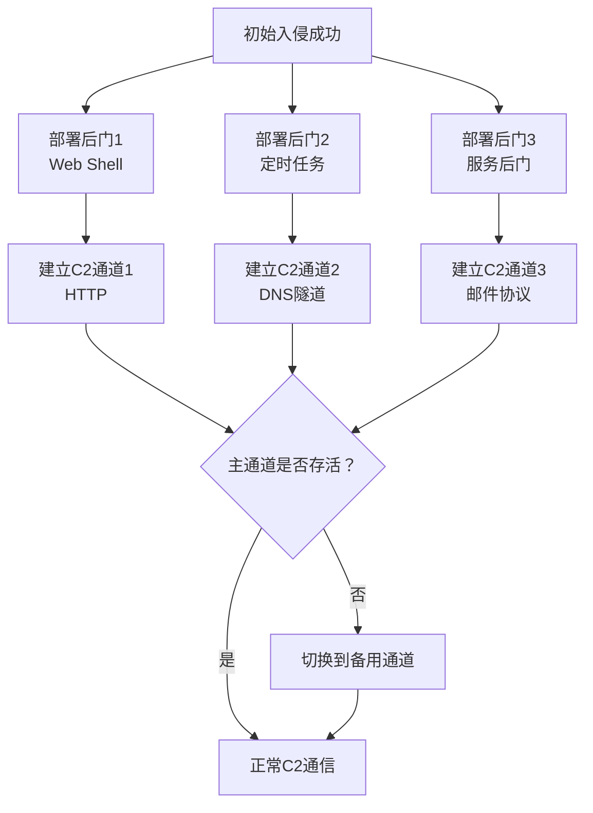

# 冗余访问 (T1108)

## 一句话通俗理解

攻击者通过多个不同的入口进入目标网络，即使一个入口被堵死，他们还有其他路可以走——就像小偷在你家前后门和窗户都留了通道。

## 难度等级

⭐⭐ 中级（需要一定基础）

## 技术描述

冗余访问（T1108）是MITRE ATT&CK框架中隐蔽战术的一种技术。

**通俗解释：**
攻击者在入侵目标时不会只留一个"后门"——他们会在不同的系统上安装多个后门、建立多条C2通道、使用多组备用凭证。这样即使安全团队发现并封堵了一个入口，攻击者还有其他通道可以继续访问网络。就像偷渡者不在船上只藏一个地方，而是在多个角落都准备了藏身处。

**技术原理：**
1. **多后门部署**：在多个关键系统上安装不同类型的后门，确保至少一个存活
2. **多C2通道**：建立HTTP、DNS、邮件等多种C2通信方式，主通道被封切备用
3. **多组凭据**：窃取多组管理员账号密码，一组失效使用另一组
4. **多入口点**：通过VPN、RDP、Web Shell等多种远程访问方式保持连接
5. **备用基础设施**：准备多个域名和C2服务器，主域名被屏蔽后切换到备用

**用途与影响：**
冗余访问是高级APT组织的标准做法。它确保攻击者能在目标网络中长期存活（典型的APT驻留时间超过200天），即使被发现后仍然保留访问能力。对于防御方来说，清除冗余访问比发现初期入侵难得多——需要同时封堵所有入口。

## 子技术列表

该技术没有子技术。

## 攻击流程

### 典型攻击流程

```
初始入侵 --> 部署多个后门 --> 建立多条C2通道 --> 窃取多组凭证 --> 维持长期访问
```



**步骤详解：**

1. **部署多个后门**
   - 通俗描述：在目标系统上安装多个不同的后门程序
   - 技术细节：使用Web Shell（ASP/PHP/JSP）、系统服务、计划任务、WMI事件订阅等多种机制
   - 常用工具：Cobalt Strike、Metasploit、自定义后门

2. **建立多条C2通道**
   - 通俗描述：设置多个不同的通信方式与C2服务器保持联系
   - 技术细节：主通道用HTTPS，备用通道用DNS隧道、邮件协议、社交平台等
   - 常用工具：Cobalt Strike malleable C2、dnscat2、HTTP隧道

3. **窃取多组凭证**
   - 通俗描述：收集多个管理员账号的密码
   - 技术细节：使用Mimikatz转储凭据，从不同系统中收集不同的账号
   - 常用工具：Mimikatz、LaZagne、SharpKatz

4. **维持长期访问**
   - 通俗描述：定期检查各通道的可用性，失效时自动切换
   - 技术细节：后门定时心跳，主C2不通则激活备用通道
   - 常用工具：心跳脚本、多阶段Beacon

## 真实案例

### 案例1：APT29 (Nobelium) 多通道C2冗余（2020-2023）

- **时间**: 2020-2023年
- **目标**: 全球政府机构、IT企业
- **攻击组织**: APT29 (Cozy Bear/Nobelium)
- **手法**: APT29在SolarWinds攻击中使用多层次的冗余访问策略。初始访问通过篡改SolarWinds Orion更新包；建立访问后部署了多种后门机制（包括Teardrop、Raindrop等）；C2通道通过HTTPS进行主通信，同时使用OneDrive、Google Drive等云服务作为备用通道；当主C2被阻断时，自动切换到备用云服务通道。
- **影响**: 美国政府多个部门被长期渗透
- **参考链接**: [MITRE - APT29](https://attack.mitre.org/groups/G0007/)

### 案例2：DarkGate 多入口冗余访问（2023-2025）

- **时间**: 2023-2025年
- **目标**: 全球企业和个人
- **攻击组织**: DarkGate运营者
- **手法**: DarkGate恶意软件通过多种方式植入目标系统（钓鱼邮件附件、恶意广告、SEO投毒）。感染后在系统中安装多个持久化机制（注册表启动项、计划任务、服务）。C2通信使用HTTPS为主，同时使用备用协议。当主C2服务器被封锁时，恶意软件通过DGA（域名生成算法）生成新的备用域名自动连接。
- **影响**: 全球数千台计算机被控制
- **参考链接**: [DarkGate - Trend Micro](https://www.trendmicro.com/)

## 红队视角

> ⚠️ **免责声明**：以下内容仅用于合法的安全测试、渗透测试和教育目的。未经授权对他人系统进行测试是违法行为。

### 实战技巧

1. **多阶段C2部署**
   先部署轻量级信标（Beacon）建立初始连接，确认安全后再部署功能完整的后门。初始信标只做心跳检测，不执行敏感操作。

2. **域名轮换策略**
   准备5-10个备用域名，设置不同的TTL值和注册商。主域名被屏蔽后，使用DGA或预配置的备用域名列表自动切换。

3. **混合C2协议**
   同时使用HTTP、HTTPS、DNS和邮件协议作为C2通道。在严格网络过滤的环境中，DNS隧道可以作为"救命稻草"。

### 常用工具

| 工具名称 | 用途 | 平台 | 链接 |
|----------|------|------|------|
| Cobalt Strike | C2框架，支持多通道 | 跨平台 | https://www.cobaltstrike.com/ |
| Silver | 开源C2框架 | 跨平台 | https://github.com/BishopFox/sliver |
| Mythic | 多用户C2平台 | 跨平台 | https://github.com/its-a-feature/Mythic |
| dnscat2 | DNS隧道工具 | 跨平台 | https://github.com/iagox86/dnscat2 |

### 注意事项

- 多后门会增加被检测面（每个后门都有独特的文件/进程特征）
- 域名购买和托管记录可能暴露攻击者身份
- 备用通道需要定期维护和测试

## 蓝队视角

### 检测要点

1. **多后门检测**
   - 日志来源：Sysmon Event ID 1、EDR进程监控
   - 关注字段：多个不同的持久化机制在同一主机上部署
   - 异常特征：同一个系统上存在Web Shell、服务后门和计划任务后门

2. **备用C2通道检测**
   - 日志来源：DNS日志、Web代理日志、邮件日志
   - 关注字段：异常的DNS查询、非标准协议的HTTP请求
   - 异常特征：主机同时使用HTTP和DNS进行外连，且流量模式一致

3. **多凭证使用检测**
   - 日志来源：Windows Event ID 4624（登录成功）
   - 关注字段：同一用户从多个IP地址登录、同一IP使用多个用户登录
   - 异常特征：短时间内多组管理员凭证被使用

### 监控建议

- 对同一主机上多个持久化机制建立关联告警
- 监控异常的外连域名请求模式
- 建立用户行为基线，检测异常的凭证使用

## 检测建议

### 网络层检测

**检测方法：** 监控同一主机上多个后门建立的冗余C2通道，特别是不同的进程使用不同协议（HTTP、DNS、ICMP）连接同一外部IP的行为。

**具体规则/命令示例：**
```
# 检测同一目标IP的多协议通信
zeek -r traffic.pcap conn.log | awk '{print $3}' | sort | uniq -c | sort -nr | head

# 检测备用通道的协议切换行为
suricata -r traffic.pcap --rule "alert tcp $HOME_NET any -> $EXTERNAL_NET any (msg:\"Redundant C2 Channel\"; flow:to_server; sid:1000030;)"
```

### 主机层检测

**Windows事件ID：**
- Sysmon Event ID 1：进程创建（检测多个后门部署）
- Sysmon Event ID 12/13/14：注册表修改（检测持久化机制）
- Event ID 4698：计划任务创建
- Event ID 7045：服务创建

**具体命令示例：**
```bash
# 检测异常的持久化机制部署
Get-WmiObject -Class Win32_Service | Where-Object {$_.PathName -match 'temp|appdata'}
```

### 应用层检测

**Sigma规则示例：**
```yaml
title: 检测多后门部署迹象
status: experimental
description: 检测同一主机上多个不同类型的后门部署行为
logsource:
    category: process_creation
    product: windows
detection:
    selection:
        CommandLine|contains:
            - 'schtasks /create'
            - 'sc create'
            - 'New-Service'
    condition: selection
level: medium
tags:
    - attack.t1108
    - attack.persistence
```

## 缓解措施

### 优先级1：关键措施

**措施名称：** 端点检测和响应（EDR）部署

**具体实施步骤：**
1. 在所有端点上部署EDR解决方案
2. 配置EDR监控持久化机制的变化
3. 建立后门检测的关联规则

### 优先级2：重要措施

**措施名称：** 网络分段控制

**具体实施步骤：**
1. 实施网络微分段，限制东西向流量
2. 对出站流量实施白名单策略
3. 监控异常的出站连接模式

### 优先级3：建议措施

**措施名称：** 凭证保护

**具体实施步骤：**
1. 实施LAPS管理本地管理员密码
2. 定期轮换域管理员密码
3. 对敏感账户启用MFA

### MITRE ATT&CK 缓解措施映射

| 缓解措施ID | 缓解措施名称 | 适用性 | 说明 |
|------------|-------------|--------|------|
| M1031 | 网络入侵检测 | 适用 | 检测备用C2通道的建立 |
| M1047 | 审计 | 适用 | 审计持久化机制的变化 |
| M1026 | 特权账户管理 | 适用 | 限制凭证泄露的影响范围 |
| M1018 | 用户账户管理 | 适用 | 定期轮换管理员密码 |

## 动手实验

> ⚠️ **重要提示**：所有实验必须在隔离的实验室环境中进行，禁止对未授权的真实系统进行测试。

### 实验环境准备

**所需工具：**
- 2台虚拟机（Windows + Kali Linux）
- Cobalt Strike试用版或Sliver

### 实验1：多通道C2建立（中级）

**实验目标：** 理解如何建立多通道C2通信

**实验步骤：**
1. 在Kali上搭建C2服务器
2. 生成HTTP和DNS两种Beacon
3. 在Windows VM上部署两种Beacon
4. 观察主备通道切换机制

**预期结果：** 主HTTP通道被阻断时，DNS备用通道自动激活

**学习要点：** 理解冗余访问的核心原理——多通道保障

## 术语解释

| 术语 | 英文原名 | 通俗解释 |
|------|----------|----------|
| C2 | Command and Control | 命令与控制，攻击者与被黑设备之间的通信通道 |
| Beacon | Beacon | 驻留在目标系统上的后门程序，定期向C2服务器发送心跳 |
| DGA | Domain Generation Algorithm | 域名生成算法，自动生成一批域名用于C2通信 |
| 心跳 | Heartbeat | 后门定期向C2服务器发送的状态信号 |

## 参考资料

### 官方文档

- [MITRE ATT&CK - T1108 Redundant Access](https://attack.mitre.org/techniques/T1108/)

### 安全报告

- [APT29 SolarWinds - Mandiant](https://www.mandiant.com/resources/evasive-attacker-leverages-solarwinds-supply-chain-compromises)
- [DarkGate Analysis - Trend Micro](https://www.trendmicro.com/)

### 工具与资源

- [Cobalt Strike Documentation](https://www.cobaltstrike.com/documentation)
- [Sliver C2 Framework](https://github.com/BishopFox/sliver)
