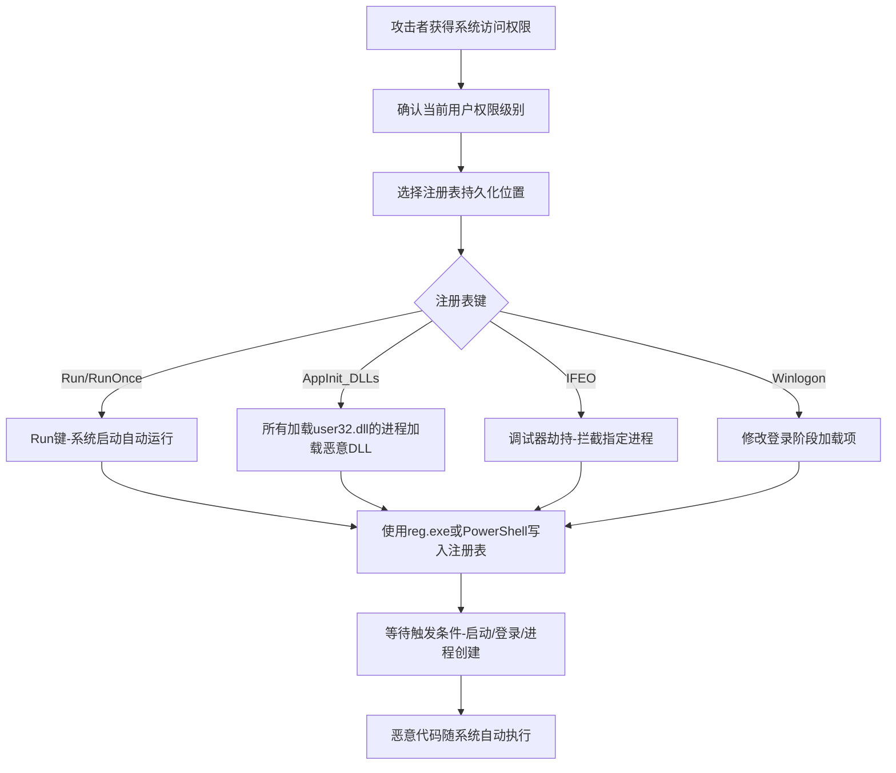

# 修改注册表 (T1112)

## 一句话通俗理解

> 就像在你家的"万能遥控器"里偷偷改了设置——Windows注册表是系统的"配置中心"，攻击者在里面动手脚，就能让恶意程序开机自动运行、关闭安全软件、或者改变系统行为。

## 难度等级

⭐⭐ 中等（需要管理员权限或用户级访问）

## 技术描述

攻击者可能修改Windows注册表以实现持久性、配置更改或规避防御。Windows注册表以分层数据库的形式存储操作系统、应用程序和驱动程序的配置数据。通过写入操作系统和应用程序通常用于自动启动程序或加载库的特定注册表键，攻击者可以确保恶意代码在系统启动、用户登录或特定应用程序启动时执行。

注册表修改是Windows环境中最常见的持久性机制之一。注册表包含多个会自动执行程序的位置：`HKCU\Software\Microsoft\Windows\CurrentVersion\Run`和`HKLM\Software\Microsoft\Windows\CurrentVersion\Run`下的Run和RunOnce键是经典目标。除了这些知名位置，攻击者还针对较少被监控的区域，如`ShellServiceObjectDelayLoad`、`AppInit_DLLs`、`BootExecute`、`Winlogon`、`Notify`、`Image File Execution Options`（IFEO）和`SilentProcessExit`。

该技术用途广泛，因为注册表是Windows运行不可或缺的部分。修改还可用于禁用安全功能（如通过`DisableAntiSpyware`禁用Windows Defender）、重定向执行路径或通过处理`CLSID`条目配置COM劫持。

## 子技术列表

该技术无子技术。

## 攻击流程



```
1. 获取系统访问权限（用户级或管理员级）
    ↓
2. 选择注册表位置：
   - Run/RunOnce键（最常见）
   - AppInit_DLLs（进程注入）
   - IFEO（调试器劫持）
   - Winlogon（登录过程）
    ↓
3. 使用reg.exe、PowerShell或API修改注册表
    ↓
4. 等待触发条件（系统启动、用户登录、进程创建）
    ↓
5. 恶意代码自动执行
```

## 真实案例

### 案例1：APT29利用Registry Run Keys维持持久性
- **时间**: 2020-2021年
- **目标**: 美国联邦政府机构和科技公司
- **手法**: APT29在SolarWinds供应链攻击中，通过修改注册表Run键值来维持持久性。在`HKLM\Software\Microsoft\Windows\CurrentVersion\Run`中添加了指向恶意DLL的条目，伪装成合法的安全软件或系统更新条目。
- **链接**: https://attack.mitre.org/groups/G0016/

### 案例2：TrickBot滥用Registry实现持久化
- **时间**: 2019-2022年
- **目标**: 全球金融机构和医疗机构
- **手法**: TrickBot通过写入`HKCU\Software\Microsoft\Windows\CurrentVersion\Run`注册表键创建持久性，同时修改`AppInit_DLLs`注册表值，实现广泛的进程注入和持久化。
- **链接**: https://attack.mitre.org/software/S0266/

### 案例3：Emotet利用Registry实现持久化
- **时间**: 2018-2021年
- **目标**: 全球政府和企业网络
- **手法**: Emotet通过写入注册表Run键实现持久性，同时修改注册表以禁用Windows Defender实时监控。
- **链接**: https://attack.mitre.org/software/S0367/

### 案例4：Volt Typhoon利用注册表持久化
- **时间**: 2023-2024年
- **目标**: 美国关键基础设施
- **手法**: Volt Typhoon使用注册表修改技术维持持久性，包括添加Run键和修改IFEO设置。
- **链接**: https://www.cisa.gov/news-events/cybersecurity-advisories/aa24-038a

## 红队视角

> ⚠️ **免责声明**：以下内容仅用于合法的安全测试、渗透测试和教育目的。未经授权对他人系统进行测试是违法行为。

**攻击优势**：
- 注册表是Windows核心组件，修改难以被完全阻止
- 可以在用户级或系统级实现持久化
- 位置众多，难以全面监控

**常用命令**：
```cmd
REM Run键持久化
reg add "HKLM\Software\Microsoft\Windows\CurrentVersion\Run" /v "WindowsUpdate" /d "C:\temp\malware.exe" /f

REM RunOnce键（仅执行一次）
reg add "HKCU\Software\Microsoft\Windows\CurrentVersion\RunOnce" /v "Setup" /d "C:\temp\payload.exe" /f

REM IFEO调试器劫持
reg add "HKLM\Software\Microsoft\Windows NT\CurrentVersion\Image File Execution Options\notepad.exe" /v "Debugger" /d "C:\temp\malware.exe" /f

REM 禁用Windows Defender
reg add "HKLM\Software\Policies\Microsoft\Windows Defender" /v "DisableAntiSpyware" /t REG_DWORD /d 1 /f
```

**实战技巧**：
- 使用看似合法的键值名称（如"WindowsUpdate"、"SecurityHealth"）
- 优先使用HKCU（用户级）避免需要管理员权限
- 配合T1546（事件触发执行）使用IFEO等高级技术

## 蓝队视角

**防御重点**：
- 监控Run/RunOnce键的修改
- 审计AppInit_DLLs和IFEO的变化
- 使用Sysmon记录注册表事件

**常见盲点**：
- 只监控HKLM，忽略HKCU
- 未监控IFEO和AppInit_DLLs
- 缺乏对注册表修改的基线比较

## 检测建议

### 网络层检测

**检测方法：** 监控通过远程注册表操作（如PowerShell Remoting或WMI）进行的异常注册表修改流量。

**具体规则/命令示例：**
```bash
# Snort规则检测远程注册表访问
alert tcp $EXTERNAL_NET 1024-65535 -> $HOME_NET 445 (msg:"Remote Registry Access via SMB"; flow:to_server,established; content:"|05 00|"; depth:2; sid:1000204; rev:1;)
```

### 主机层检测

**检测方法：** 使用Sysmon监控注册表关键位置的修改事件，特别是自动启动相关位置。

**Windows事件ID：**
- Sysmon事件ID 12：注册表键值创建
- Sysmon事件ID 13：注册表值修改
- Sysmon事件ID 14：注册表键值删除
- 事件ID 4657：注册表值修改（如果启用审计）

**Linux日志：**
- Linux注册表不适用；可类比监控配置数据库文件（如`/etc/`）的变更

**具体命令示例：**
```bash
# 监控Run键注册表
reg query "HKLM\Software\Microsoft\Windows\CurrentVersion\Run"
reg query "HKCU\Software\Microsoft\Windows\CurrentVersion\Run"

# 检查IFEO调试器劫持
reg query "HKLM\Software\Microsoft\Windows NT\CurrentVersion\Image File Execution Options"

# 检查AppInit_DLLs
reg query "HKLM\Software\Microsoft\Windows NT\CurrentVersion\Windows" /v AppInit_DLLs
```

### 应用层检测

**Sigma规则示例：**
```yaml
title: 注册表Run键修改检测
status: experimental
description: 检测对Run注册表键的写入操作
logsource:
    category: registry_event
    product: windows
detection:
    selection:
        EventID: 12  # 注册表键值创建
        TargetObject|contains:
            - '\Microsoft\Windows\CurrentVersion\Run'
            - '\Microsoft\Windows\CurrentVersion\RunOnce'
    condition: selection
level: high
tags:
    - attack.t1112
```

## 缓解措施

### 优先级1：关键措施

**措施名称：** 关键注册表键访问控制

**具体实施步骤：**
1. 使用组策略对关键注册表位置（Run键、IFEO、AppInit_DLLs）设置严格的ACL权限
2. 启用Windows Defender ASR规则，阻止通过注册表实现的持久化尝试
3. 限制管理员权限，确保只有受信任的管理员账号可以修改系统级注册表键
4. 实施应用程序控制（WDAC/AppLocker），阻止非授权进程（如reg.exe、PowerShell）对关键注册表位置的写入

### 优先级2：重要措施

**措施名称：** 注册表变更监控与基线审计

**具体实施步骤：**
1. 配置Windows注册表审计策略，启用Sysmon注册表事件记录（事件ID 12-14）
2. 建立关键注册表位置的基线配置，使用PowerShell定期与当前状态进行比较
3. 将注册表修改事件实时转发至SIEM，设置异常告警规则
4. 使用组策略禁用不必要的注册表修改途径（如限制远程注册表服务）

**配置示例：**
```bash
# 使用组策略增强Run键ACL安全性
# 通过GPMC -> 计算机配置 -> 安全设置 -> 注册表，添加关键路径的ACL限制

# 使用PowerShell设置ASR规则
Add-MpPreference -AttackSurfaceReductionRules_Ids 99206964-4C12-4C8C-B7B0-54B0A7B707A2 -AttackSurfaceReductionRules_Actions Enabled
```

## 动手实验

> ⚠️ **重要提示**：所有实验必须在隔离的实验室环境中进行，禁止对未授权的真实系统进行测试。

### 实验1：Run键持久化
```cmd
REM 添加Run键
reg add "HKCU\Software\Microsoft\Windows\CurrentVersion\Run" /v "TestPersistence" /d "cmd.exe /c echo test > C:\temp\reg_test.txt" /f

REM 查询Run键
reg query "HKCU\Software\Microsoft\Windows\CurrentVersion\Run"

REM 清理
reg delete "HKCU\Software\Microsoft\Windows\CurrentVersion\Run" /v "TestPersistence" /f
```

### 实验2：IFEO调试器劫持
```cmd
REM 为notepad.exe设置调试器
reg add "HKLM\Software\Microsoft\Windows NT\CurrentVersion\Image File Execution Options\notepad.exe" /v "Debugger" /d "cmd.exe" /f

REM 测试：打开notepad应该会打开cmd

REM 清理
reg delete "HKLM\Software\Microsoft\Windows NT\CurrentVersion\Image File Execution Options\notepad.exe" /f
```

### 实验3：使用Atomic Red Team测试
```powershell
# 执行T1112测试
Invoke-AtomicTest T1112
```

## 术语解释

| 术语 | 英文原名 | 通俗解释 |
|------|----------|----------|
| 注册表 | Registry | Windows分层数据库，存储系统和应用配置，就像系统的"大词典" |
| Run键 | Run Key | 注册表中用于自动启动程序的键，就像系统的"自动播放列表" |
| IFEO | Image File Execution Options | 映像文件执行选项，Windows中调试程序的配置，可被劫持 |
| AppInit_DLLs | AppInit DLLs | 在所有加载user32.dll的进程中自动加载的DLL |
| COM劫持 | COM Hijacking | 通过修改CLSID注册表条目劫持COM对象的技术 |
| ACL | Access Control List | 访问控制列表，定义谁可以访问某个资源的权限列表 |

## 参考资料

- [MITRE ATT&CK T1112 修改注册表](https://attack.mitre.org/techniques/T1112/)
- [CISA 修改注册表防御指南](https://www.cisa.gov/eviction-strategies-tool/info-attack/T1112)
- [Windows注册表持久化位置 - Microsoft](https://docs.microsoft.com/en-us/windows/win32/setupapi/run-and-runonce-registry-keys)
- [Volt Typhoon Advisory - CISA](https://www.cisa.gov/news-events/cybersecurity-advisories/aa24-038a)
- [Atomic Red Team - T1112](https://github.com/redcanaryco/atomic-red-team/tree/master/atomics/T1112)
