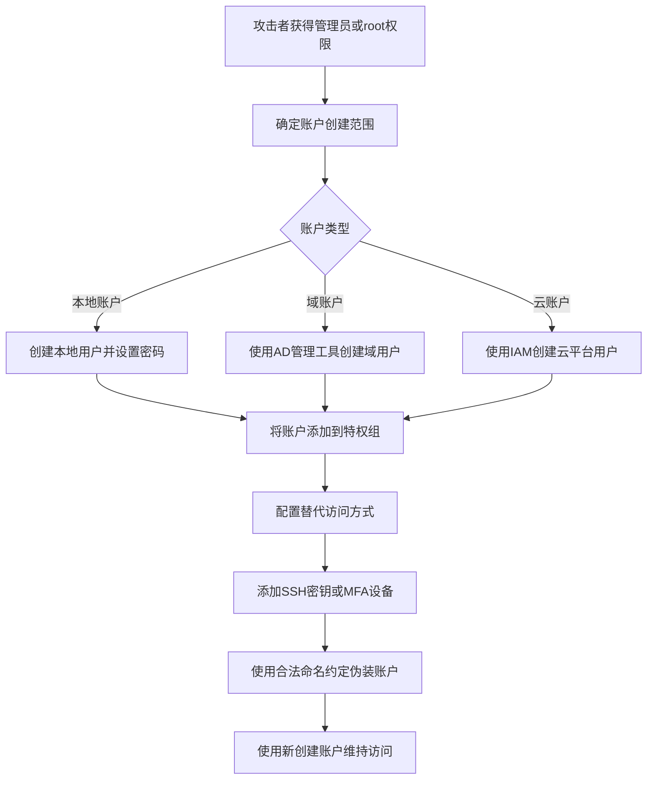

# 创建账户 (T1136)

## 一句话通俗理解

> 就像小偷偷偷给自己配了一把钥匙，并在物业系统里登记成了"业主"——攻击者创建一个看起来合法的管理员账户，即使你改了所有现有密码，这个新账户依然有效。

## 难度等级

⭐ 简单（需要管理员/root权限）

## 技术描述

攻击者可能创建账户以维持对受害者系统的访问。创建新账户是一种直接有效的持久化机制，允许攻击者绕过许多形式的凭据轮换和访问撤销。通过建立新账户的立足点，攻击者可以在不依赖可能受到调查的被入侵合法用户账户的情况下操作。

该技术涵盖三种主要环境：本地系统（Windows、Linux、macOS）、域环境（Active Directory）和云平台（Azure AD、AWS IAM、GCP）。具体命令和API在不同平台之间有所不同，但基本原理相同。攻击者必须拥有足够的权限（通常是Administrator或root）才能创建新账户。

攻击者通常将账户创建与其他技术配对。例如，创建新账户后，可能将其添加到特权组（T1098），用于横向移动（TA0008），或配置SSH密钥进行远程访问（T1098.004）。创建的账户可能被命名为与合法命名约定混在一起，模仿服务账户、临时用户账户或通用名称如"backup"、"admin"或"support"。

## 子技术列表

| 子技术ID | 名称 | 说明 | 命令示例 |
|----------|------|------|----------|
| T1136.001 | 本地账户 | 在特定工作站或服务器上创建账户 | `net user adversary P@ss /add` |
| T1136.002 | 域账户 | 在Active Directory中创建账户 | `net user adversary P@ss /add /domain` |
| T1136.003 | 云账户 | 在云环境中创建账户 | `aws iam create-user --user-name adversary` |

## 攻击流程



```
1. 获取管理员/root权限
    ↓
2. 选择账户类型：
   - 本地账户（仅限单机）
   - 域账户（整个域）
   - 云账户（云环境）
    ↓
3. 创建账户并设置密码
    ↓
4. 将账户添加到特权组
    ↓
5. 配置额外访问方式（SSH密钥、MFA设备等）
    ↓
6. 使用合法命名约定伪装账户
```

## 真实案例

### 案例1：APT29 Midnight Blizzard SolarWinds攻击
- **时间**: 2020-2021年
- **目标**: 全球政府机构、科技公司和关键基础设施
- **手法**: APT29在SolarWinds攻击中，在受害者的云和本地环境中创建了新的账户，包括在Azure AD中创建新的应用注册和服务主体。这些账户被授予了高特权角色，以维持持久的云访问。
- **链接**: https://attack.mitre.org/groups/G0016/

### 案例2：LAPSUS$针对科技公司的账户创建
- **时间**: 2022年
- **目标**: Microsoft、NVIDIA、三星等科技公司
- **手法**: LAPSUS$通过社会工程学获取初始访问后，在受害者环境中创建新的管理员账户。他们还在Azure AD中注册恶意应用并创建服务主体，以维持对云环境的持久访问。
- **链接**: https://www.microsoft.com/en-us/security/blog/2022/03/22/dev-0537-criminal-actor-targeting-organizations-for-data-exfiltration-and-destruction/

### 案例3：Volt Typhoon创建隐蔽账户
- **时间**: 2023-2024年
- **目标**: 美国关键基础设施
- **手法**: Volt Typhoon在受感染的系统上创建本地管理员账户，使用与现有服务账户相似的名称以避免被发现。这些账户用于维持持久访问和横向移动。
- **链接**: https://www.cisa.gov/news-events/cybersecurity-advisories/aa24-038a

### 案例4：Scattered Spider创建云账户
- **时间**: 2023-2024年
- **目标**: MGM Resorts、Caesars Entertainment等大型企业
- **手法**: Scattered Spider在获得初始访问后，在Azure AD和AWS IAM中创建新的管理员账户和访问密钥，确保即使初始凭据被撤销也能保持访问。
- **链接**: https://www.crowdstrike.com/blog/scattered-spider-delivers-ransomware-at-warp-speed/

## 红队视角

> ⚠️ **免责声明**：以下内容仅用于合法的安全测试、渗透测试和教育目的。未经授权对他人系统进行测试是违法行为。

**攻击优势**：
- 创建的账户是合法的身份，难以与正常用户区分
- 可以在凭据轮换后仍然有效
- 配合权限提升技术可以获得高权限

**常用命令**：
```cmd
REM Windows本地账户
net user backdoor$ P@ssw0rd123! /add
net localgroup Administrators backdoor$ /add

REM Windows域账户
net user svcbackup P@ssw0rd123! /add /domain
net group "Domain Admins" svcbackup /add /domain

REM Linux
useradd -m -G sudo -s /bin/bash backdoor
echo "backdoor:P@ssw0rd" | chpasswd

REM Azure AD
New-AzureADUser -DisplayName "Service Account" -UserPrincipalName "svc@tenant.onmicrosoft.com"

REM AWS IAM
aws iam create-user --user-name backup-admin
aws iam attach-user-policy --user-name backup-admin --policy-arn arn:aws:iam::aws:policy/AdministratorAccess
```

**实战技巧**：
- 使用`$`结尾的名称创建隐藏账户（Windows）
- 模仿现有服务账户的命名模式
- 避免立即添加到最高权限组，先使用委派权限

## 蓝队视角

**防御重点**：
- 监控账户创建事件
- 定期审计所有账户
- 限制账户创建权限

**常见盲点**：
- 只关注域账户，忽略本地账户和云账户
- 未审计服务账户的创建
- 缺乏对账户命名模式的分析

## 检测建议

### 网络层检测

**检测方法：** 监控云平台管理API调用，检测异常的账户创建活动。

**具体规则/命令示例：**
```bash
# Suricata规则检测AWS IAM管理API访问
alert tcp $HOME_NET any -> $EXTERNAL_NET 443 (msg:"AWS IAM CreateUser API Call"; content:"iam.amazonaws.com"; http_host; content:"Action=CreateUser"; http_uri; nocase; sid:1000206; rev:1;)
```

### 主机层检测

**检测方法：** 监控本地操作系统中的账户创建事件，检测新账户的异常创建。

**Windows事件ID：**
- 事件ID 4720：用户账户创建
- 事件ID 4722：用户账户启用
- 事件ID 4738：用户账户修改
- 事件ID 4740：用户账户被锁定

**Linux日志：**
- 日志文件：`/var/log/auth.log` 或 `/var/log/secure`
- 关键字段：useradd、adduser命令执行日志
- 关键字段：`/etc/passwd`和`/etc/shadow`文件的修改记录

**具体命令示例：**
```bash
# 列出所有用户账户
cat /etc/passwd

# 查找UID为0的非root账户
awk -F: '($3 == 0 && $1 != "root") {print $1}' /etc/passwd

# 查看最近创建的账户（检查lastlog）
lastlog | grep -v "Never logged in"
```

### 应用层检测

**Sigma规则示例：**
```yaml
title: 本地账户创建检测
status: experimental
description: 检测使用net user命令创建新账户的事件
logsource:
    category: process_creation
    product: windows
detection:
    selection:
        Image|endswith: '\net.exe'
        CommandLine|contains|all:
            - 'user'
            - '/add'
    condition: selection
level: high
tags:
    - attack.t1136.001
```

## 缓解措施

### 优先级1：关键措施

**措施名称：** 账户创建权限管控

**具体实施步骤：**
1. 实施最小特权原则，严格限制哪些用户和角色具有创建账户的权限
2. 在域环境中使用委派权限而非将用户加入Domain Admins组
3. 在云环境中使用服务控制策略（SCP）限制账户创建能力
4. 实施账户创建审批流程，要求所有新账户创建需经过管理员审批

### 优先级2：重要措施

**措施名称：** 账户审计与监测

**具体实施步骤：**
1. 启用账户创建事件的实时告警，配置SIEM监控事件ID 4720等关键事件
2. 建立企业账户基线清单，每周审计所有账户的创建时间和权限
3. 在Linux系统上使用auditd监控useradd、adduser、groupadd等命令
4. 在云环境中配置CloudTrail审计日志监控`CreateUser`、`CreateServiceLinkedRole`等API调用

**配置示例：**
```bash
# Linux audited规则监控账户创建
auditctl -w /etc/passwd -p wa -k passwd_change
auditctl -w /etc/shadow -p wa -k shadow_change

# 配置Windows账户审计策略
auditpol /set /subcategory:"User Account Management" /success:enable
```

## 动手实验

> ⚠️ **重要提示**：所有实验必须在隔离的实验室环境中进行，禁止对未授权的真实系统进行测试。

### 实验1：Windows本地账户创建
```cmd
REM 创建隐藏账户（需要管理员权限）
net user testuser$ TestPass123! /add
net localgroup Administrators testuser$ /add

REM 验证账户
net user testuser$

REM 清理
net user testuser$ /delete
```

### 实验2：Linux账户创建
```bash
# 创建用户并添加到sudo组
sudo useradd -m -G sudo -s /bin/bash testuser
echo "testuser:TestPass123!" | sudo chpasswd

# 验证
id testuser

# 清理
sudo userdel -r testuser
```

### 实验3：使用Atomic Red Team测试
```powershell
# 执行T1136测试
Invoke-AtomicTest T1136
```

## 术语解释

| 术语 | 英文原名 | 通俗解释 |
|------|----------|----------|
| 域账户 | Domain Account | Active Directory中的用户账户，可在整个域中使用 |
| 本地账户 | Local Account | 存储在单个系统上的用户账户 |
| 云账户 | Cloud Account | AWS IAM、Azure AD等云平台中的用户账户 |
| 服务账户 | Service Account | 用于应用程序和服务的专用账户，通常自动化运行 |
| PAM | Privileged Access Management | 特权访问管理，控制高权限账户使用的系统 |
| JIT | Just-In-Time | 即时访问，按需临时授予权限的机制 |

## 参考资料

- [MITRE ATT&CK T1136 创建账户](https://attack.mitre.org/techniques/T1136/)
- [CISA 创建账户防御指南](https://www.cisa.gov/eviction-strategies-tool/info-attack/T1136)
- [LAPSUS$活动分析 - Microsoft](https://www.microsoft.com/en-us/security/blog/2022/03/22/dev-0537-criminal-actor-targeting-organizations-for-data-exfiltration-and-destruction/)
- [Volt Typhoon Advisory - CISA](https://www.cisa.gov/news-events/cybersecurity-advisories/aa24-038a)
- [Atomic Red Team - T1136](https://github.com/redcanaryco/atomic-red-team/tree/master/atomics/T1136)
