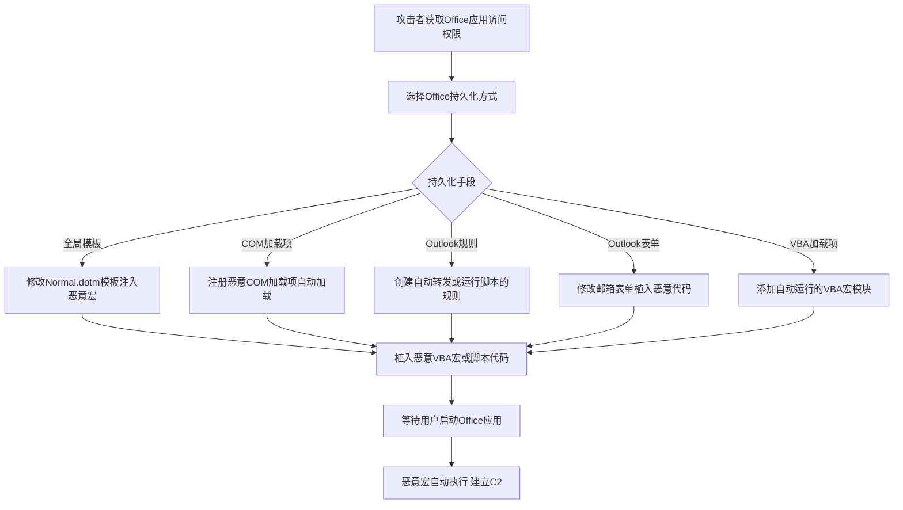

# Office应用启动 (T1137)

## 一句话通俗理解

> 就像在你的Word/Excel/Outlook里装了一个"定时炸弹"——每次你打开这些办公软件，恶意代码就会自动运行，而且因为是通过正规软件触发的，安全软件通常不会报警。

## 难度等级

⭐⭐ 中等（需要用户级访问或管理员权限）

## 技术描述

攻击者可能滥用Microsoft Office应用程序的启动机制来建立对系统的持久访问。Microsoft Office提供了多种扩展性机制，允许应用程序、模板和加载项在Office程序启动时自动加载。这些包括模板宏、COM加载项、VBA加载项、Outlook特定扩展（表单、主页、规则和API访问）以及其他插件系统。通过这些机制注册恶意代码，攻击者确保每次相关Office应用程序启动时都会执行其代码，在某些情况下（如Outlook扩展），即使用户没有主动使用Office也会执行。

Office应用程序通常被安全产品信任，并且有合法的理由执行代码（如加载模板或加载项），使得该技术对隐蔽持久性非常有效。此外，Office进程通常在用户的安全上下文中运行，允许攻击者以与目标用户相同的权限操作。

## 子技术列表

| 子技术ID | 名称 | 说明 | 触发条件 |
|----------|------|------|----------|
| T1137.001 | Office模板宏 | 修改Normal.dotm等全局模板 | Word/Excel启动时 |
| T1137.002 | Office加载项 | 安装恶意COM/VBA加载项 | Office应用启动时 |
| T1137.003 | Outlook表单 | 创建恶意自定义表单 | 打开邮件/日历项时 |
| T1137.004 | Outlook主页 | 设置文件夹自定义主页 | 导航到文件夹时 |
| T1137.005 | Outlook规则 | 创建恶意邮件规则 | 收到特定邮件时 |
| T1137.006 | Outlook API | 使用OOM/MAPI注册事件处理程序 | Outlook事件触发时 |

## 攻击流程



```
1. 获取对Office应用的访问权限
    ↓
2. 选择持久化方式：
   - 修改全局模板（Normal.dotm）
   - 注册COM加载项
   - 创建Outlook规则/表单
    ↓
3. 植入恶意代码（VBA宏、VBScript等）
    ↓
4. 等待用户启动Office应用
    ↓
5. 恶意代码自动执行
```

## 真实案例

### 案例1：APT29利用Office Application Startup
- **时间**: 2020年
- **目标**: 美国政府机构、外交实体和智库
- **手法**: APT29通过钓鱼邮件发送包含恶意宏的Office文档。当目标用户打开文档时，恶意宏修改了Word的全局模板（Normal.dotm），将恶意代码嵌入到模板宏中。此后每次Word启动时都会执行该恶意宏。
- **链接**: https://attack.mitre.org/groups/G0016/

### 案例2：Wizard Spider利用Office加载项
- **时间**: 2020年
- **目标**: 全球金融机构和医疗机构
- **手法**: Wizard Spider在其TrickBot恶意软件活动中安装恶意的VBA或COM加载项，每次打开Office应用时自动加载，为后门访问提供第二道保障。
- **链接**: https://attack.mitre.org/software/S0266/

### 案例3：OilRig利用Outlook Rules
- **时间**: 2017年
- **目标**: 中东地区的政府机构和能源组织
- **手法**: OilRig使用Outlook Rules技术在受害者Outlook客户端上创建恶意邮件规则，配置为将特定邮件转发或回复到攻击者控制的电子邮件地址。
- **链接**: https://attack.mitre.org/techniques/T1137/005/

### 案例4：Volt Typhoon利用Office持久化
- **时间**: 2023-2024年
- **目标**: 美国关键基础设施
- **手法**: Volt Typhoon利用Office应用的启动机制维持持久性，包括修改模板和注册加载项。
- **链接**: https://www.cisa.gov/news-events/cybersecurity-advisories/aa24-038a

## 红队视角

> ⚠️ **免责声明**：以下内容仅用于合法的安全测试、渗透测试和教育目的。未经授权对他人系统进行测试是违法行为。

**攻击优势**：
- Office应用被安全软件信任
- 用户每天都会使用Office
- 可以通过钓鱼邮件轻松部署

**常用技术**：
```powershell
# 修改Normal.dotm
$templatePath = "$env:APPDATA\Microsoft\Templates\Normal.dotm"
# 使用VBA编辑器添加恶意宏

# 注册COM加载项
reg add "HKCU\Software\Microsoft\Office\Word\Addins\MaliciousAddin" /v "Description" /d "Legit Addin" /f
reg add "HKCU\Software\Microsoft\Office\Word\Addins\MaliciousAddin" /v "LoadBehavior" /t REG_DWORD /d 3 /f

# 创建Outlook规则（通过Outlook对象模型）
```

**实战技巧**：
- 优先使用Outlook规则（触发条件更灵活）
- 使用COM加载项（更难被用户发现）
- 配合T1566（钓鱼）使用，通过邮件分发恶意文档

## 蓝队视角

**防御重点**：
- 监控Normal.dotm的修改
- 审计Office加载项注册
- 检查Outlook规则

**常见盲点**：
- 只监控宏执行，忽略模板修改
- 未审计COM加载项注册
- 缺乏对Outlook规则的监控

## 检测建议

### 网络层检测

**检测方法：** 监控Office应用程序（WINWORD.EXE、EXCEL.EXE、OUTLOOK.EXE）的异常出站网络连接。

**具体规则/命令示例：**
```bash
# Suricata规则检测Office应用异常出站连接
alert tcp $HOME_NET any -> $EXTERNAL_NET $HTTP_PORTS (msg:"Office Application Beaconing"; flow:to_server,established; content:"WINWORD|5c|"; http_user_agent; content:"User-Agent|3a| Microsoft Office"; http_user_agent; sid:1000207; rev:1;)
```

### 主机层检测

**检测方法：** 监控Office全局模板、COM加载项注册和Outlook规则的异常修改。

**Windows事件ID：**
- Sysmon事件ID 11：文件创建（监控Normal.dotm、.ppa等模板文件）
- Sysmon事件ID 12/13：注册表修改（监控Office加载项注册表路径）
- 事件ID 4657：注册表值修改（Office相关键值）
- 事件ID 4688：进程创建（监控Office进程启动子进程）

**Linux日志：**
- Office应用启动主要是Windows技术，Linux/macOS不适用

**具体命令示例：**
```bash
# 检查Normal.dotm的修改时间
dir "%APPDATA%\Microsoft\Templates\Normal.dotm"

# 列出所有Office加载项
reg query "HKCU\Software\Microsoft\Office\Word\Addins"
reg query "HKCU\Software\Microsoft\Office\Outlook\Addins"

# 检查Outlook客户端规则
# 需要通过Outlook VBA或MFCMAPI工具查看
```

### 应用层检测

**Sigma规则示例：**
```yaml
title: Office加载项注册检测
status: experimental
description: 检测Office COM加载项的注册表写入
logsource:
    category: registry_event
    product: windows
detection:
    selection:
        TargetObject|contains:
            - '\Office\Word\Addins'
            - '\Office\Outlook\Addins'
            - '\Office\Excel\Addins'
    condition: selection
level: medium
tags:
    - attack.t1137.002
```

## 缓解措施

### 优先级1：关键措施

**措施名称：** Office安全策略加固

**具体实施步骤：**
1. 通过组策略配置Office安全设置，禁用所有位置（网络、可移动媒体、本地）的宏执行
2. 禁用Office应用程序对VBA脚本和ActiveX控件的支持
3. 使用ASR规则阻止Office应用程序创建子进程（GUID：`26190899-1602-49e8-8b27-eb1d0a1ce869`）
4. 限制用户安装Office加载项的权限，仅允许经过签名的加载项

### 优先级2：重要措施

**措施名称：** Office加载项与模板审计

**具体实施步骤：**
1. 配置Sysmon监控Office模板目录（Normal.dotm）和加载项注册表路径的变更
2. 使用MFCMAPI或类似工具定期检查Outlook加载项和规则的异常条目
3. 建立Office模板文件的完整性基线（计算Normal.dotm的哈希值）
4. 定期审查Organizational Forms Library中是否存在未授权的自定义表单

**配置示例：**
```bash
# 通过组策略禁用宏（GPO路径）
# 计算机配置 -> 管理模板 -> Microsoft Office 20XX -> 应用程序设置 -> 安全设置
# 启用"禁用所有宏而不通知"

# PowerShell监控Normal.dotm变更
$hash = Get-FileHash "$env:APPDATA\Microsoft\Templates\Normal.dotm"
Add-Content -Path "C:\logs\dotm_baseline.txt" -Value "$(Get-Date) $hash.Hash"
```

## 动手实验

> ⚠️ **重要提示**：所有实验必须在隔离的实验室环境中进行，禁止对未授权的真实系统进行测试。

### 实验1：修改Normal.dotm
```powershell
# 备份原始模板
$templatePath = "$env:APPDATA\Microsoft\Templates\Normal.dotm"
Copy-Item $templatePath "$templatePath.backup"

# 使用Word打开并添加VBA宏
# （需要通过Word VBA编辑器手动添加）

# 清理 - 恢复原始模板
Copy-Item "$templatePath.backup" $templatePath -Force
```

### 实验2：注册COM加载项
```cmd
REM 注册测试COM加载项
reg add "HKCU\Software\Microsoft\Office\Word\Addins\TestAddin" /v "Description" /d "Test Addin" /f
reg add "HKCU\Software\Microsoft\Office\Word\Addins\TestAddin" /v "LoadBehavior" /t REG_DWORD /d 3 /f
reg add "HKCU\Software\Microsoft\Office\Word\Addins\TestAddin" /v "FriendlyName" /d "Test Addin" /f

REM 清理
reg delete "HKCU\Software\Microsoft\Office\Word\Addins\TestAddin" /f
```

### 实验3：使用Atomic Red Team测试
```powershell
# 执行T1137测试
Invoke-AtomicTest T1137
```

## 术语解释

| 术语 | 英文原名 | 通俗解释 |
|------|----------|----------|
| Normal.dotm | Normal.dotm | Word全局模板文件，每次Word启动时自动加载 |
| COM加载项 | COM Add-in | 组件对象模型加载项，可在Office中注册的扩展组件 |
| VBA | Visual Basic for Applications | Office宏语言，用于在Office中编写自动化脚本 |
| Outlook规则 | Outlook Rule | 客户端邮件处理规则，自动对邮件进行分类和处理 |
| OOM | Outlook Object Model | Outlook对象模型，用于编程控制Outlook的接口 |
| ASR | Attack Surface Reduction | 攻击面减少，Windows Defender中的安全功能 |

## 参考资料

- [MITRE ATT&CK T1137 Office应用启动](https://attack.mitre.org/techniques/T1137/)
- [APT29活动分析 - Mandiant](https://www.mandiant.com/resources/apt29-windows-utility)
- [TrickBot分析 - FireEye](https://www.fireeye.com/blog/threat-research/2020/02/trickbot-malware-analysis.html)
- [Volt Typhoon Advisory - CISA](https://www.cisa.gov/news-events/cybersecurity-advisories/aa24-038a)
- [Atomic Red Team - T1137](https://github.com/redcanaryco/atomic-red-team/tree/master/atomics/T1137)
