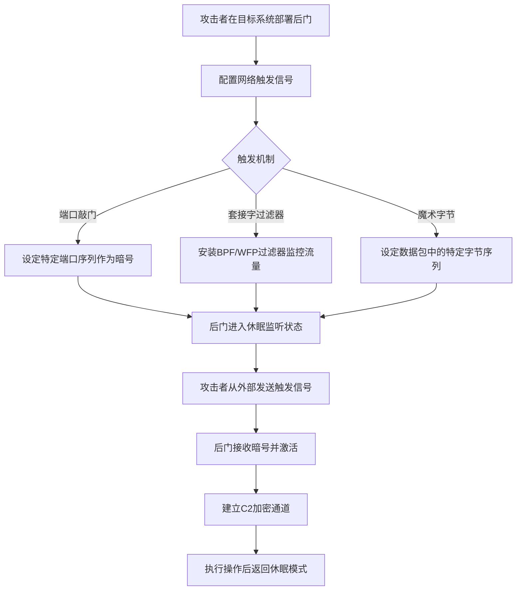

# 流量信号 (T1205)

## 一句话通俗理解

> 就像特工的"暗号"系统——后门平时在系统里"睡觉"，只有当攻击者发送特定的网络"暗号"（特定端口序列或特殊数据包）时，后门才会"醒来"开始工作。没有暗号，后门就像不存在一样。

## 难度等级

⭐⭐⭐⭐ 高（需要深入的网络和系统知识）

## 技术描述

攻击者可能使用流量信号作为持久化和命令控制激活的手段。流量信号涉及使用特定的网络模式、序列或条件，当受害者系统上安装的恶意软件观察到这些模式时，会触发特定操作，如向C2服务器发送信标、启用后门或执行预定义的payload。该技术允许攻击者在系统上保持存在而不产生持续的网络活动，减少被检测的机会。

流量信号实现了"按需"持久化模型，恶意软件保持休眠直到收到适当的信号。该信号可以采取多种形式，包括精心制作的数据包（端口敲门）、匹配特定条件的套接字过滤器或其他网络级触发器。

## 子技术列表

| 子技术ID | 名称 | 说明 | 难度 |
|----------|------|------|------|
| T1205.001 | 端口敲门 | 发送特定端口序列激活后门 | ⭐⭐⭐ 较高 |
| T1205.002 | 套接字过滤器 | 使用BPF/WFP过滤器触发操作 | ⭐⭐⭐⭐ 高 |

## 攻击流程



```
1. 在目标系统上部署后门
    ↓
2. 配置触发机制：
   - 端口敲门序列
   - 套接字过滤器（BPF/WFP）
   - 特定魔术字节
    ↓
3. 后门进入休眠状态
    ↓
4. 攻击者发送触发信号
    ↓
5. 后门激活并建立C2连接
    ↓
6. 执行操作后可返回休眠状态
```

## 真实案例

### 案例1：Cobalt Strike使用Port Knocking隐藏C2通信
- **时间**: 2019年
- **目标**: 全球企业和政府网络
- **手法**: Cobalt Strike的Beacon payload支持端口敲门机制来隐藏C2服务器的通信。攻击者可以配置Beacon在发送信标之前，先按特定顺序向特定端口发送TCP SYN连接。
- **链接**: https://attack.mitre.org/software/S0154/

### 案例2：Regin恶意软件使用Port Knocking
- **时间**: 2014年
- **目标**: 全球电信公司、政府和研究机构
- **手法**: Regin使用端口敲门技术来隐藏其C2通信。该恶意软件安装了一个内核模式驱动来监控所有网络流量，当检测到特定序列的TCP SYN数据包时激活通信模块。
- **链接**: https://attack.mitre.org/software/S0139/

### 案例3：TripleCross eBPF Rootkit
- **时间**: 2022年
- **目标**: Linux服务器和云环境
- **手法**: TripleCross是一个使用eBPF技术的Linux rootkit，利用Socket Filters建立隐蔽的持久化后门。eBPF程序在内核空间运行，对用户空间工具和大多数安全产品不可见。
- **链接**: https://attack.mitre.org/techniques/T1205/002/

### 案例4：Volt Typhoon使用流量信号
- **时间**: 2023-2024年
- **目标**: 美国关键基础设施
- **手法**: Volt Typhoon使用流量信号技术来激活休眠的后门，通过特定的网络模式触发C2通信。
- **链接**: https://www.cisa.gov/news-events/cybersecurity-advisories/aa24-038a

## 红队视角

> ⚠️ **免责声明**：以下内容仅用于合法的安全测试、渗透测试和教育目的。未经授权对他人系统进行测试是违法行为。

**攻击优势**：
- 后门在未触发时完全不产生网络活动
- 极难被网络监控检测
- 可以在受限制的网络环境中使用

**常用工具**：
```bash
# 端口敲门客户端
knock target.com 7000 8000 9000

# 使用nmap进行端口敲门
nmap -Pn --host-timeout 201 -p 7000 target.com
nmap -Pn --host-timeout 201 -p 8000 target.com
nmap -Pn --host-timeout 201 -p 9000 target.com

# eBPF套接字过滤器（概念）
# 使用libbpf或bcc工具创建eBPF程序
```

**实战技巧**：
- 使用加密的敲门序列（SPA - 单包授权）
- 配合T1573（加密通道）使用，激活后使用加密C2
- 在高安全环境中使用eBPF级别的触发器

## 蓝队视角

**防御重点**：
- 监控异常的端口连接序列
- 检测eBPF程序的加载
- 审计防火墙规则的临时修改

**常见盲点**：
- 只关注持续的网络连接，忽略间歇性信号
- 未监控eBPF程序的加载
- 缺乏对内核级网络过滤的检测

## 检测建议

### 网络层检测

**检测方法：** 分析网络流量中异常的端口连接序列和特定模式的包序列，检测端口敲门等活动。

**具体规则/命令示例：**
```bash
# Snort规则检测端口敲门序列
alert tcp $EXTERNAL_NET any -> $HOME_NET 7000 (msg:"Port Knocking - Sequence Start"; flags:S; threshold:type both, track by_src, count 3, seconds 60; sid:1000210; rev:1;)
alert tcp $EXTERNAL_NET any -> $HOME_NET 8000 (msg:"Port Knocking - Sequence Middle"; flags:S; sid:1000211; rev:1;)
alert tcp $EXTERNAL_NET any -> $HOME_NET 9000 (msg:"Port Knocking - Sequence End"; flags:S; sid:1000212; rev:1;)
```

### 主机层检测

**检测方法：** 监控eBPF程序加载、Raw Socket监听器安装和内核模块加载等主机级信号。

**Windows事件ID：**
- Sysmon事件ID 12/13：注册表修改（监控WFP过滤器注册表路径）
- 事件ID 5031：Windows Filtering Platform阻止连接
- Sysmon事件ID 10：进程访问（监控LSASS等进程）

**Linux日志：**
- 日志文件：`/var/log/kern.log`
- 关键字段：bpftool、kprobe、eBPF程序加载事件
- 关键字段：内核模块加载（insmod、modprobe）

**具体命令示例：**
```bash
# 列出已加载的eBPF程序
bpftool prog list

# 检查Raw Socket监听
ss -praw

# 列出已加载的内核模块
lsmod

# 检查WFP过滤器
netsh wfp show filters
```

### 应用层检测

**Sigma规则示例：**
```yaml
title: eBPF程序加载检测
status: experimental
description: 检测Linux系统上eBPF程序的加载
logsource:
    category: process_creation
    product: linux
detection:
    selection:
        Image|endswith: '/bpftool'
        CommandLine|contains: 'prog load'
    condition: selection
level: high
tags:
    - attack.t1205.002
```

## 缓解措施

### 优先级1：关键措施

**措施名称：** 网络触发机制检测与控制

**具体实施步骤：**
1. 部署IDS/IPS系统检测异常的端口连接序列和短时间内多个端口访问模式
2. 在Linux系统上启用eBPF程序签名验证，仅允许加载经过签名的eBPF程序
3. 限制内核模块加载权限，仅允许具有CAP_SYS_MODULE权限的用户加载模块
4. 实施严格的防火墙策略，仅允许已知和必要的端口通信

### 优先级2：重要措施

**措施名称：** 网络过滤层审计

**具体实施步骤：**
1. 在Windows系统上审计WFP过滤器的注册和修改，监控使用netsh添加过滤器的行为
2. 在Linux系统上使用auditd监控bpftool、insmod、modprobe等命令的执行
3. 定期审计网络规则集（iptables、nftables、Windows Filtering Platform）
4. 使用HIPS监控Raw Socket的访问，检测非系统进程的原始套接字监听

**配置示例：**
```bash
# 启用eBPF程序签名验证
# 在Linux内核启动参数中添加：`bpf_jit_enable=1 lsm=lockdown lockdown=confidentiality`

# 使用auditd监控内核模块加载
auditctl -w /sbin/insmod -p x -k kernel_module_load
auditctl -w /sbin/modprobe -p x -k kernel_module_load
```

## 动手实验

> ⚠️ **重要提示**：所有实验必须在隔离的实验室环境中进行，禁止对未授权的真实系统进行测试。

### 实验1：简单端口敲门（Linux）
```bash
# 服务端 - 使用knockd
sudo apt install knockd

# 配置/etc/knockd.conf
[options]
    logfile = /var/log/knockd.log

[openSSH]
    sequence    = 7000,8000,9000
    seq_timeout = 15
    command     = /sbin/iptables -A INPUT -s %IP% -p tcp --dport 22 -j ACCEPT
    tcpflags    = syn

[closeSSH]
    sequence    = 9000,8000,7000
    seq_timeout = 15
    command     = /sbin/iptables -D INPUT -s %IP% -p tcp --dport 22 -j ACCEPT
    tcpflags    = syn

# 客户端敲门
knock target.com 7000 8000 9000
```

### 实验2：eBPF套接字过滤器（概念）
```python
# 使用bcc工具创建简单的eBPF程序
from bcc import BPF

program = """
int hello(void *ctx) {
    bpf_trace_printk("Hello World!\\n");
    return 0;
}
"""

b = BPF(text=program)
b.attach_kprobe(event="sys_clone", fn_name="hello")
b.trace_print()
```

### 实验3：使用Atomic Red Team测试
```powershell
# 执行T1205测试
Invoke-AtomicTest T1205
```

## 术语解释

| 术语 | 英文原名 | 通俗解释 |
|------|----------|----------|
| 端口敲门 | Port Knocking | 发送特定端口序列以激活隐藏服务，就像敲出特定节奏的暗号 |
| 套接字过滤器 | Socket Filter | 在网络套接字上应用的过滤规则 |
| BPF | Berkeley Packet Filter | 伯克利包过滤器，用于过滤网络数据包的标准 |
| eBPF | Extended BPF | 扩展伯克利包过滤器，Linux内核中的沙箱程序运行环境 |
| WFP | Windows Filtering Platform | Windows过滤平台，用于处理网络数据的框架 |
| SPA | Single Packet Authorization | 单包授权，用单个加密包实现端口敲门的技术 |
| 魔术字节 | Magic Bytes | 用于识别和触发操作的特定字节序列 |

## 参考资料

- [MITRE ATT&CK T1205 流量信号](https://attack.mitre.org/techniques/T1205/)
- [Cobalt Strike端口敲门文档](https://www.cobaltstrike.com/help-malleable-c2)
- [Regin恶意软件分析 - Symantec](https://symantec-enterprise-blogs.security.com/blogs/threat-intelligence/regin-top-tier-espionage-tool-software)
- [TripleCross eBPF Rootkit](https://www.cross.io/triplecross-ebpf-rootkit)
- [Volt Typhoon Advisory - CISA](https://www.cisa.gov/news-events/cybersecurity-advisories/aa24-038a)
- [Atomic Red Team - T1205](https://github.com/redcanaryco/atomic-red-team/tree/master/atomics/T1205)
