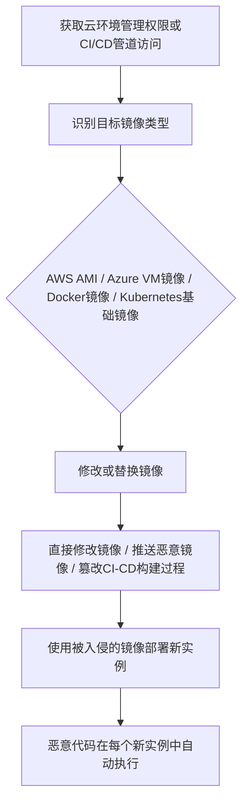

# 植入内部镜像 (T1525)

## 一句话通俗理解

> 就像在"模板"里下了毒——攻击者在系统镜像或容器镜像里预埋了后门，每次你用这个镜像创建新系统，后门就自动"出生"在新系统里。

## 难度等级

⭐⭐⭐ 较高（需要云环境管理权限或CI/CD管道访问）

## 技术描述

攻击者可能在云或容器镜像中植入恶意代码，以在云环境中建立持久性。与修改运行中的工作负载不同，攻击者篡改用于配置计算实例、容器或无服务器功能的基础镜像。当从被入侵的镜像启动新实例或容器时，恶意代码会自动包含在内，提供了能够经受实例终止和重新部署的持久立足点。

该技术主要针对基础设施即服务（IaaS）平台，如AWS、Azure和Google Cloud。拥有足够云环境访问权限的攻击者可以修改或替换Amazon Machine Images（AMIs）、Azure虚拟机镜像或Google Compute镜像。在容器环境中，攻击者可能将恶意镜像推送到容器注册表或修改Dockerfile和Kubernetes集群使用的镜像层。

基于镜像的持久性特别危险，因为恶意代码嵌入在基础设施层面。传统端点安全工具可能无法检测到入侵，因为恶意代码从实例启动的那一刻起就存在。

## 子技术列表

该技术无子技术。

## 攻击流程



```
1. 获取云环境管理权限或CI/CD管道访问
    ↓
2. 识别目标镜像：
   - AWS AMI
   - Azure VM镜像
   - Docker镜像
   - Kubernetes基础镜像
    ↓
3. 修改或替换镜像：
   - 直接修改镜像
   - 推送恶意镜像到注册表
   - 篡改CI/CD构建过程
    ↓
4. 使用被入侵的镜像部署新实例
    ↓
5. 恶意代码在每个新实例中自动存在
```

## 真实案例

### 案例1：TeamTNT针对Docker镜像植入挖矿代码
- **时间**: 2020-2021年
- **目标**: 未受保护的Docker和Kubernetes环境
- **手法**: TeamTNT创建包含挖矿软件和后门程序的恶意Docker镜像，并将其推送到Docker Hub，诱使其他用户下载使用。这些镜像通过在组织内广泛传播来建立持久化。
- **链接**: https://attack.mitre.org/groups/G0139/

### 案例2：Scarab恶意软件利用受感染AMI
- **时间**: 2018年
- **目标**: AWS云环境
- **手法**: 攻击者在AWS Marketplace和社区AMI中植入恶意代码，创建了包含加密挖矿软件和后门程序的受感染Amazon Machine Images。当用户使用这些AMI启动EC2实例时，恶意代码立即执行。
- **链接**: https://attack.mitre.org/techniques/T1525/

### 案例3：Kinsing恶意软件利用容器镜像
- **时间**: 2021-2022年
- **目标**: 配置错误的Kubernetes集群
- **手法**: Kinsing恶意软件将包含挖矿软件的恶意容器镜像部署到Kubernetes集群中，并将恶意镜像推送到公共容器注册表，伪装成合法的系统工具镜像。
- **链接**: https://attack.mitre.org/software/S0599/

### 案例4：针对CI/CD管道的镜像投毒攻击
- **时间**: 2022年
- **目标**: 软件供应链环境
- **手法**: 攻击者通过入侵CI/CD系统（如Jenkins、GitLab CI）来修改组织内部使用的基础Docker镜像，在镜像构建过程中添加后门、挖矿程序或信息窃取组件。
- **链接**: https://attack.mitre.org/techniques/T1525/

## 红队视角

> ⚠️ **免责声明**：以下内容仅用于合法的安全测试、渗透测试和教育目的。未经授权对他人系统进行测试是违法行为。

**攻击优势**：
- 恶意代码在每个新实例中自动存在
- 难以被运行时安全工具检测
- 可以经受实例终止和重新部署

**常用技术**：
```dockerfile
# 恶意Dockerfile示例
FROM ubuntu:20.04
RUN apt-get update && apt-get install -y openssh-server
RUN echo "ssh-rsa AAAA..." >> /root/.ssh/authorized_keys
# 正常应用配置...
```

**实战技巧**：
- 使用看似合法的基础镜像名称
- 将恶意代码隐藏在多层构建中
- 配合T1053（计划任务）使用，确保持久性

## 蓝队视角

**防御重点**：
- 实施镜像签名和验证策略
- 监控镜像注册表的异常推送
- 审计CI/CD管道安全

**常见盲点**：
- 信任所有来自公共注册表的镜像
- 未监控CI/CD管道的镜像构建过程
- 缺乏对镜像完整性的持续验证

## 检测建议

### 网络层检测

**检测方法：** 监控容器注册表和云镜像服务的API访问流量，检测异常的镜像推送和拉取操作。

**具体规则/命令示例：**
```bash
# Suricata规则检测异常Docker镜像操作
alert tcp $HOME_NET any -> $EXTERNAL_NET 443 (msg:"Docker Registry Push to Unusual Repository"; content:"docker.io"; http_host; content:"/v2/"; http_uri; content:"blob/uploads"; http_uri; sid:1000212; rev:1;)
```

### 主机层检测

**检测方法：** 监控云环境中的镜像创建事件，审计容器镜像注册表的推送和修改操作。

**Windows事件ID：**
- 云环境不适用传统的Windows事件ID，但可在Windows Server Docker主机上监控Docker守护进程日志

**Linux日志：**
- 日志文件：`/var/log/docker.log`或使用`docker events`命令
- 关键字段：docker commit、docker build、docker push命令执行
- 关键字段：Dockerfile中RUN指令执行的异常命令

**具体命令示例：**
```bash
# 列出所有Docker镜像
docker images

# 查看镜像的构建历史
docker history suspicious_image:latest

# 检查Dockerfile变更
git diff HEAD~1 -- Dockerfile

# AWS CLI检查AMI
aws ec2 describe-images --image-ids ami-12345678
```

### 应用层检测

**Sigma规则示例：**
```yaml
title: AWS AMI创建事件检测
status: experimental
description: 检测AWS账户中AMI镜像的创建事件
logsource:
    service: cloudtrail
    product: aws
detection:
    selection:
        eventSource: 'ec2.amazonaws.com'
        eventName: 'CreateImage'
    condition: selection
level: medium
tags:
    - attack.t1525
```

## 缓解措施

### 优先级1：关键措施

**措施名称：** 镜像签名与验证

**具体实施步骤：**
1. 实施镜像签名策略（如Docker Content Trust或Notary），确保只有经过签名的镜像才能部署
2. 使用受信任的官方基础镜像，建立组织的内部镜像仓库
3. 在CI/CD管道中集成镜像安全扫描（Trivy、Clair、Anchore）
4. 限制谁有权向容器注册表推送和修改镜像，严格管理镜像仓库的访问权限

### 优先级2：重要措施

**措施名称：** 镜像供应链安全

**具体实施步骤：**
1. 保护CI/CD管道的安全，确保构建环境不受篡改
2. 对基础镜像实施完整性校验，与已知摘要（digest）进行比较
3. 使用基础设施即代码（IaC）模板管理镜像版本，避免手动修改
4. 定期扫描镜像注册表中的所有镜像，检测已知漏洞和恶意软件

**配置示例：**
```bash
# 启用Docker Content Trust
export DOCKER_CONTENT_TRUST=1

# 验证镜像签名
docker trust inspect --pretty myregistry/myimage:latest

# Dockerfile基础镜像完整性检查
# 在Dockerfile中使用@sha256指定确切的镜像摘要
FROM ubuntu:20.04@sha256:abcdef1234567890...
```

## 动手实验

> ⚠️ **重要提示**：所有实验必须在隔离的实验室环境中进行，禁止对未授权的真实系统进行测试。

### 实验1：Docker镜像签名
```bash
# 启用Docker Content Trust
export DOCKER_CONTENT_TRUST=1

# 签名镜像
docker push myregistry/myimage:latest

# 验证签名
docker trust inspect --pretty myregistry/myimage:latest
```

### 实验2：镜像扫描
```bash
# 使用Trivy扫描镜像漏洞
trivy image myimage:latest

# 使用Docker Scout扫描
docker scout cves myimage:latest
```

### 实验3：使用Atomic Red Team测试
```powershell
# 执行T1525测试
Invoke-AtomicTest T1525
```

## 术语解释

| 术语 | 英文原名 | 通俗解释 |
|------|----------|----------|
| AMI | Amazon Machine Image | 亚马逊机器镜像，AWS中用于创建虚拟机的模板 |
| 容器镜像 | Container Image | 包含应用程序及其依赖的只读模板 |
| 容器注册表 | Container Registry | 存储和分发容器镜像的服务 |
| CI/CD | Continuous Integration/Continuous Deployment | 持续集成/持续部署，软件开发自动化流程 |
| IaC | Infrastructure as Code | 基础设施即代码，用代码管理IT基础设施 |
| Dockerfile | Dockerfile | 用于构建Docker镜像的脚本文件 |

## 参考资料

- [MITRE ATT&CK T1525 植入内部镜像](https://attack.mitre.org/techniques/T1525/)
- [AWS AMI安全最佳实践](https://docs.aws.amazon.com/AWSEC2/latest/UserGuide/AMI-security.html)
- [Docker镜像安全](https://docs.docker.com/engine/security/trust/)
- [TeamTNT分析 - MITRE](https://attack.mitre.org/groups/G0139/)
- [Kinsing恶意软件分析 - Aqua Security](https://blog.aquasec.com/kinsing-malware-analysis)
- [Atomic Red Team - T1525](https://github.com/redcanaryco/atomic-red-team/tree/master/atomics/T1525)
