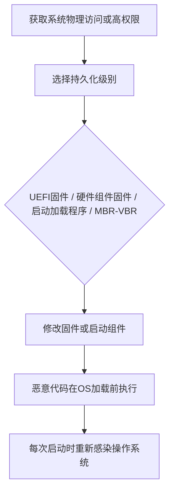

# 预启动 (T1542)

## 一句话通俗理解

> 就像在你家地基里埋了个"暗室"——在你盖房子之前（操作系统加载之前），小偷就已经在地基里建好了藏身之处。你换多少次门锁、重装多少次房子都没用，因为暗室在地基里，根本碰不到。

## 难度等级

⭐⭐⭐⭐ 高（需要深入的系统知识和物理/固件访问）

## 技术描述

攻击者可能滥用预启动机制以在固件、引导加载程序或主引导记录级别建立持久性。与应用级持久性（在操作系统内运行）不同，预启动机制在操作系统加载之前执行，使用标准OS安全工具极难检测和清除。在此级别的入侵可以经受操作系统重新安装、磁盘格式化，甚至在某些情况下更换存储设备。

该技术目标是系统启动链的多个层面。在最深层，固件（BIOS/UEFI）持久性涉及修改系统固件以在早期启动阶段执行恶意代码。UEFI固件存储在主板上的闪存中，在任何其他软件之前由CPU执行。恶意固件可以在每次启动时重新感染操作系统，在更换磁盘后存活，并规避所有操作系统级安全控制。

在引导加载程序级别（如Windows启动管理器、Linux的GRUB2），攻击者修改启动配置以加载恶意启动组件。主引导记录（MBR）和卷引导记录（VBR）持久性修改磁盘的第一个扇区以在OS内核加载之前加载恶意代码。

因为预启动持久性在操作系统之外运行，其移除通常需要专门工具、物理访问系统或硬件重新编程。检测通常依赖于基于硬件的证明、固件完整性测量和带外验证机制。

## 子技术列表

| 子技术ID | 名称 | 说明 | 难度 |
|----------|------|------|------|
| T1542.001 | 系统固件 | 修改BIOS/UEFI固件 | ⭐⭐⭐⭐ 高 |
| T1542.002 | 组件固件 | 修改硬盘/网卡等硬件固件 | ⭐⭐⭐⭐ 高 |
| T1542.003 | Bootkit | 修改启动加载程序 | ⭐⭐⭐ 较高 |
| T1542.004 | ROMMONkit | 修改网络设备固件 | ⭐⭐⭐⭐ 高 |
| T1542.005 | TFTP启动 | 配置网络设备从TFTP启动 | ⭐⭐⭐ 较高 |

## 攻击流程



```
1. 获取系统物理访问或高权限
    ↓
2. 选择持久化级别：
   - UEFI/BIOS固件
   - 硬件组件固件
   - 启动加载程序
   - MBR/VBR
    ↓
3. 修改固件或启动组件
    ↓
4. 确保恶意代码在OS加载前执行
    ↓
5. 每次启动时重新感染操作系统
```

## 真实案例

### 案例1：APT28利用LoJax UEFI Rootkit
- **时间**: 2018年
- **目标**: 欧洲政府机构和军事组织
- **手法**: APT28开发了LoJax UEFI rootkit，这是第一个在真实攻击中观察到的UEFI固件rootkit。该rootkit利用LoJack软件的UEFI模块，将其替换为恶意版本，驻留在主板SPI闪存中，能够经受操作系统重新安装和硬盘更换。
- **链接**: https://attack.mitre.org/software/S0397/

### 案例2：BlackLotus UEFI Bootkit绕过Secure Boot
- **时间**: 2022-2023年
- **目标**: 全球Windows系统
- **手法**: BlackLotus是第一个能够绕过Secure Boot的UEFI bootkit，即使在全补丁的Windows 11系统上也能工作。该bootkit利用CVE-2022-21894漏洞绕过Secure Boot的完整性检查，禁用安全功能并加载恶意内核驱动程序。
- **链接**: https://attack.mitre.org/techniques/T1542/003/

### 案例3：Equation Group利用硬盘固件
- **时间**: 2015年（披露时间）
- **目标**: 全球政府机构和企业网络
- **手法**: Equation Group开发了能够在硬盘固件中驻留的恶意软件，修改了西部数据、希捷等主要品牌硬盘的固件，在硬盘的隐藏区域中创建持久存储。即使操作系统被重新安装，硬盘固件中的恶意代码仍然保持活动状态。
- **链接**: https://attack.mitre.org/techniques/T1542/002/

### 案例4：VPNFilter利用路由器固件
- **时间**: 2018年
- **目标**: 全球SOHO路由器
- **手法**: VPNFilter恶意软件感染了全球超过50万台路由器，通过修改设备固件实现持久化。该恶意软件能够拦截网络流量、修改Web请求、收集凭证，并在设备重启后存活。
- **链接**: https://attack.mitre.org/software/S0631/

## 红队视角

> ⚠️ **免责声明**：以下内容仅用于合法的安全测试、渗透测试和教育目的。未经授权对他人系统进行测试是违法行为。

**攻击优势**：
- 在操作系统加载前执行，极难被检测
- 可以经受OS重装、磁盘格式化
- 可以禁用所有OS级安全控制

**常用工具**：
```bash
# UEFI固件修改
# 使用CHIPSEC工具分析和修改UEFI固件
chipsec_main.py -m common.uefi.access

# Bootkit部署
# 使用自定义bootkit加载程序

# 固件提取和修改
flashrom -p internal -r firmware.bin
# 修改firmware.bin
flashrom -p internal -w firmware.bin
```

**实战技巧**：
- 优先使用UEFI固件持久化（最难被清除）
- 配合T1547（自动启动）使用，在OS层也建立持久性
- 使用硬件级别的持久化作为"最后手段"

## 蓝队视角

**防御重点**：
- 启用Secure Boot和TPM
- 监控固件完整性
- 限制物理访问

**常见盲点**：
- 未启用Secure Boot
- 缺乏对固件完整性的监控
- 未限制对BIOS/UEFI配置的物理访问

## 检测建议

### 网络层检测

**检测方法：** 监控网络启动（PXE/TFTP）流量和固件更新服务器的异常访问，检测预启动阶段的网络攻击。

**具体规则/命令示例：**
```bash
# Snort规则检测TFTP启动文件下载
alert udp $EXTERNAL_NET any -> $HOME_NET 69 (msg:"TFTP Boot File Download"; content:"|00 01|"; depth:2; content:"bootmgr"; nocase; sid:1000213; rev:1;)
```

### 主机层检测

**检测方法：** 使用TPM进行平台固件完整性测量，监控UEFI固件变量、启动管理器条目和MBR/VBR扇区的修改。

**Windows事件ID：**
- 事件ID 1001：Windows Boot Manager事件
- 事件ID 12：TPM测量事件
- Sysmon事件ID 1：bcdedit.exe执行（监控启动配置修改）
- 事件ID 5038：代码完整性检测到无效的签名哈希

**Linux日志：**
- 日志文件：`/var/log/kern.log`
- 关键字段：fwupd固件更新日志
- 关键字段：TPM PCR寄存器扩展事件
- 关键字段：GRUB配置变更

**具体命令示例：**
```bash
# 检查Secure Boot状态
Confirm-SecureBootUEFI

# 检查TPM状态
Get-Tpm

# 查看启动配置
bcdedit /enum firmware

# Linux检查固件版本
dmidecode -t bios
cat /sys/firmware/efi/efivars/SecureBoot-*

# 备份MBR
dd if=/dev/sda of=mbr_backup.bin bs=512 count=1
sha256sum mbr_backup.bin
```

### 应用层检测

**Sigma规则示例：**
```yaml
title: UEFI固件修改检测
status: experimental
description: 检测UEFI固件变量和启动管理器条目的修改
logsource:
    category: process_creation
    product: windows
detection:
    selection:
        Image|endswith: '\bcdedit.exe'
        CommandLine|contains: '/set'
    condition: selection
level: high
tags:
    - attack.t1542.001
```

## 缓解措施

### 优先级1：关键措施

**措施名称：** 启动链完整性保护

**具体实施步骤：**
1. 在所有支持的系统上启用Secure Boot和TPM 2.0，验证启动组件的数字签名
2. 设置BIOS/UEFI管理密码，防止未授权的固件配置修改
3. 使用Windows Defender System Guard或Linux Integrity Measurement Architecture（IMA）验证启动完整性
4. 实施硬件root of trust，确保从固件到OS内核的整个启动链的可信度

### 优先级2：重要措施

**措施名称：** 固件和物理访问控制

**具体实施步骤：**
1. 限制对系统固件和BIOS/UEFI配置接口的物理访问
2. 禁用不必要的UEFI选项（如从可移动介质启动、网络启动等）
3. 定期审计网络设备的固件版本，及时应用安全更新
4. 使用芯片组级别的引导保护（如Intel Boot Guard或AMD Platform Security Processor）

**配置示例：**
```bash
# 使用PowerShell配置Secure Boot策略
# 设置Secure Boot模板为标准
Set-SecureBootUEFI -Name SetupMode -Result $false

# Linux固件更新验证
fwupdmgr verify

# 使用auditd监控固件相关系统调用
auditctl -w /sys/firmware/efi -p wa -k uefi_changes
```

## 动手实验

> ⚠️ **重要提示**：所有实验必须在隔离的实验室环境中进行，禁止对未授权的真实系统进行测试。

### 实验1：检查Secure Boot状态
```powershell
# 检查Secure Boot状态
Confirm-SecureBootUEFI

# 检查TPM状态
Get-Tpm

# 检查启动配置
bcdedit /enum
```

### 实验2：使用CHIPSEC分析固件
```bash
# 安装CHIPSEC
pip install chipsec

# 分析固件安全性
sudo python chipsec_main.py -m common.uefi.access
```

### 实验3：使用Atomic Red Team测试
```powershell
# 执行T1542测试
Invoke-AtomicTest T1542
```

## 术语解释

| 术语 | 英文原名 | 通俗解释 |
|------|----------|----------|
| UEFI | Unified Extensible Firmware Interface | 统一可扩展固件接口，现代计算机的固件标准 |
| BIOS | Basic Input/Output System | 基本输入输出系统，传统计算机的固件 |
| Secure Boot | Secure Boot | UEFI安全启动机制，验证启动组件的数字签名 |
| TPM | Trusted Platform Module | 可信平台模块，用于硬件级安全加密的芯片 |
| MBR | Master Boot Record | 主引导记录，硬盘的第一个扇区，包含启动代码 |
| Bootkit | Bootkit | 修改启动加载程序的恶意软件 |
| SPI闪存 | SPI Flash | 串行外设接口闪存，用于存储UEFI固件的芯片 |

## 参考资料

- [MITRE ATT&CK T1542 预启动](https://attack.mitre.org/techniques/T1542/)
- [LoJax UEFI Rootkit分析 - ESET](https://www.welivesecurity.com/2018/09/27/lojax-first-uefi-rootkit-found-wild/)
- [BlackLotus UEFI Bootkit - Microsoft](https://www.microsoft.com/en-us/security/blog/2023/04/11/blacklotus-uefi-bootkit-myth-versus-fact/)
- [VPNFilter分析 - Cisco Talos](https://blog.talosintelligence.com/2018/05/VPNFilter.html)
- [Atomic Red Team - T1542](https://github.com/redcanaryco/atomic-red-team/tree/master/atomics/T1542)
