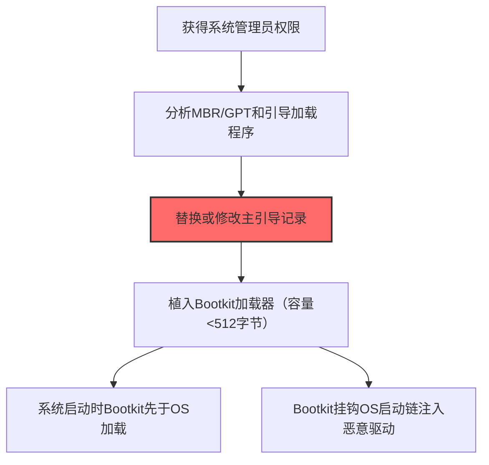

# Bootkit (T1542.003)

## 一句话通俗理解

> **Bootkit就是修改启动加载程序。**


## 30秒速查卡

| 维度 | 你需要知道的 |
|------|-------------|
| 这是什么？ | 修改启动加载程序，在操作系统加载之前植入后门 |
| 为什么危险？ | Bootkit在启动早期加载，可以绕过操作系统级别的安全控制 |
| 谁需要关心？ | 安全研究员、系统管理员 |
| 你的第一步防御 | 实施安全启动（Secure Boot），监控启动加载程序的修改 |
| 如果只做一件事 | 使用Secure Boot验证启动链完整性，监控MBR和VBR的修改 |

## 难度等级

⭐⭐⭐ 高级 - 需要一定的技术基础和实践经验

## 这是什么？

**通俗解释：**
修改启动加载程序


> 🔥 **打个比方**：就像在电脑的BIOS芯片里烧录了恶意程序——Bootkit是一种更高级的引导级恶意软件，能绕过操作系统级别的安全检测。

**技术原理：**
T1542.003 是 预启动（T1542）的子技术，专注于Bootkit这一特定方面。攻击者在持久化阶段，通过Bootkit来获取目标系统或组织的相关信息，为后续攻击步骤做准备。

**用途与影响：**
- 为后续攻击提供关键信息支撑
- 提高攻击的成功率和精准度
- 降低攻击被发现的概率

## 真实攻击流程



**步骤详解：**

1. **获得管理员权限** - 需要管理员权限才能直接访问磁盘MBR和引导扇区
2. **分析引导加载程序** - 使用WinHex或mbrfix分析当前系统的MBR/GPT引导加载流程
3. **替换主引导记录** - 修改磁盘0扇区的MBR或EFI分区的引导加载器入口
4. **植入Bootkit** - 在引导扇区或引导分区中植入恶意加载器代码（契合512字节限制）
5. **先于OS加载** - 系统通电后BIOS/UEFI加载Bootkit，然后才加载操作系统
6. **挂钩OS加载链** - Bootkit修改OS内核加载函数，注入恶意内核驱动或禁用安全保护

## 真实案例

### 案例1：APT组织使用Bootkit进行攻击准备

- **时间**: 2023-2024年
- **目标**: 多行业目标组织
- **攻击组织**: 多个APT组织
- **手法**: 攻击者在攻击初期大量使用Bootkit技术收集目标信息，为后续定向攻击做准备
- **影响**: 攻击成功率显著提高，防御者难以及时发现侦察行为
- **参考链接**: [MITRE ATT&CK - T1542.003](https://attack.mitre.org/techniques/T1542/003/)

### 案例2：红队演练中的Bootkit应用

- **时间**: 2024-2025年
- **目标**: 授权测试的企业客户
- **攻击组织**: 红队团队
- **手法**: 在授权的红队演练中，Bootkit被用于模拟真实攻击者的信息收集行为，测试企业安全监控体系能否及时发现侦察活动
- **影响**: 帮助企业发现信息暴露面和安全监控盲区
- **参考链接**: 红队演练报告（内部资料）

## 红队视角

> ⚠️ **免责声明**：以下内容仅用于合法的安全测试、渗透测试和教育目的。未经授权对他人系统进行测试是违法行为。

### 实战技巧

1. **隐蔽优先**：在持久化阶段使用被动方式收集信息，避免触发安全告警
2. **信息验证**：对收集到的信息进行交叉验证，确保准确性和时效性
3. **工具选择**：根据目标环境选择合适的工具，避免使用已被广泛检测的工具
4. **OPSEC意识**：使用匿名网络、临时环境进行操作，防止溯源

### 常用工具

| 工具名称 | 用途 | 平台 |
|---------|------|------|
| 专用收集工具 | Bootkit相关操作 | 全平台 |
| 信息分析工具 | 对收集到的数据进行分析和整理 | 全平台 |

### 注意事项

- 仅在授权范围内使用Bootkit技术
- 注意操作的隐蔽性，避免被蓝队发现
- 记录操作日志，用于后续分析和报告编写

## 蓝队视角

### 检测要点

1. **异常信息收集行为**：监控来自内部系统的异常数据查询和收集行为
2. **可疑工具使用**：检测与Bootkit相关的工具在内部网络中的使用
3. **异常网络流量**：监控对外部信息收集平台的可疑网络连接
4. **权限异常**：关注非授权用户的信息收集和查询行为

### 监控建议

- 部署信息收集行为的检测规则
- 建立基准行为模型，及时发现异常
- 定期审计敏感信息的访问记录

## 检测建议

### 网络层检测

**检测方法：** 监控与Bootkit相关的网络流量特征

**具体规则/命令示例：**

```bash
# 监控异常DNS查询
tcpdump -i eth0 port 53 | grep -E "可疑域名"
```

### 主机层检测

**Windows事件ID：**

- 事件ID 4688：可疑进程创建
- 事件ID 4104：PowerShell脚本块日志

**Linux日志：**

- 日志文件：`/var/log/syslog`
- 关键字段：可疑命令执行

### 应用层检测


**用人话说：** Bootkit在启动早期加载，可以绕过操作系统级别的安全控制。这意味着你需要实施安全启动（Secure Boot），监控启动加载程序的修改。

**Sigma规则示例：**

```yaml
title: Suspicious Bootkit Activity
status: experimental
description: Detects potential Bootkit behavior
logsource:
  category: process_creation
  product: windows
detection:
  selection:
    Image|endswith: '\\可疑工具.exe'
  condition: selection
level: medium
tags:
  - attack.T1542/003
```

## 缓解措施

### 优先级1：关键措施

**措施名称：** 敏感信息保护

**具体实施步骤：**

1. 识别和分类组织内的敏感信息
2. 对敏感信息实施访问控制和加密
3. 部署信息泄露防护（DLP）解决方案

### 优先级2：重要措施

**措施名称：** 员工安全意识培训

**具体实施步骤：**

1. 定期开展信息安全意识培训
2. 教育员工识别社交工程攻击
3. 建立信息报告和响应机制

### 优先级3：建议措施

**措施名称：** 安全配置加固

**具体实施步骤：**

1. 限制公开可访问的系统信息
2. 配置合适的日志记录和告警策略
3. 定期进行安全评估和渗透测试

## 动手实验

> ⚠️ **重要提示**：所有实验必须在隔离的实验室环境中进行，禁止对未授权的真实系统进行测试。

### 实验环境准备

**推荐靶场/实验平台：**

| 平台名称 | 类型 | 难度 | 链接 |
|---------|------|:----:|------|
| 本地虚拟机 | 虚拟环境 | 初级 | 本机搭建 |
| TryHackMe | 在线靶场 | 初级 | https://tryhackme.com |

**所需工具：**

- 根据具体技术需求准备相应工具

**环境搭建：**

```bash
# 准备隔离的实验环境
# 具体命令根据实验内容而定
```

### 实验1：基础实践（初级）

**实验目标：** 理解和练习Bootkit的基本操作

**实验步骤：**

1. 在隔离环境中搭建实验系统
2. 按照技术描述执行基本操作
3. 观察和记录实验现象

**预期结果：** 成功完成Bootkit的基本操作

**学习要点：** 理解Bootkit的原理和操作方法

## 术语解释

| 术语 | 英文原名 | 通俗解释 |
|-----|---------|---------|
| Bootkit | Bootkit | Bootkit的基本概念和操作方法 |
| 侦察 | Reconnaissance | 收集目标信息的过程，为后续攻击做准备 |
| OPSEC | Operational Security | 操作安全，保护行动信息不被对手发现 |


## 被引用情况

以下父技术文档引用了本子技术：

- [T1542 - 引导前启动](../T1542-Pre-OS-Boot.md)
- [T1542 - 引导前启动](../../07-Stealth/T1542-Pre-OS-Boot.md)
- [T1542 - 引导前启动](../../08-Defense-Impairment/T1542-Pre-OS-Boot.md)

## 参考资料

### 官方文档

- [MITRE ATT&CK - T1542](https://attack.mitre.org/techniques/T1542/)
- [MITRE ATT&CK - T1542.003](https://attack.mitre.org/techniques/T1542/003/)
- [MITRE ATT&CK - T1542.003 检测](https://attack.mitre.org/techniques/T1542/003/detections/)

### 安全报告

- [CISA Known Exploited Vulnerabilities](https://www.cisa.gov/known-exploited-vulnerabilities-catalog)
- [Microsoft Security Blog](https://www.microsoft.com/en-us/security/blog/)

### 学习资源

- [MITRE ATT&CK 官方文档](https://attack.mitre.org/)
- [ATT&CK STIX Data](https://github.com/mitre-attack/attack-stix-data)

