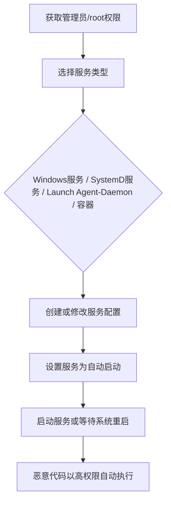

# 创建或修改系统进程 (T1543)

## 一句话通俗理解

> 就像在你家雇了一个"假管家"——看起来是正规的服务人员（系统服务），实际上却是小偷安插的眼线，每次你回家（系统启动）他都在监视你。

## 难度等级

⭐⭐ 中等（需要管理员/root权限）

## 技术描述

攻击者可能创建或修改系统级进程以重复执行恶意payload作为持久性的一部分。当操作系统启动时，它们会自动启动服务、守护进程和代理来执行后台任务。通过安装新服务或修改现有服务，攻击者可以使他们的代码在每次系统启动时执行，同时还能以具有高权限的系统账户运行。

操作系统的服务管理器是启动、停止和监控服务的中央机构。在Windows上，这是服务控制管理器（SCM）。在Linux上，它是systemd（主流init系统）或较旧的SysV init。在macOS上，它是launchd。每个平台都提供标准工具和API来管理服务，攻击者滥用这些工具。基于服务的持久性的关键优势是服务通常在用户登录之前运行，这意味着恶意代码在启动过程的早期执行，通常具有SYSTEM或root权限。

## 子技术列表

| 子技术ID | 名称 | 说明 | 平台 |
|----------|------|------|------|
| T1543.001 | Launch Agent | macOS用户级自动启动代理 | macOS |
| T1543.002 | SystemD服务 | Linux系统服务 | Linux |
| T1543.003 | Windows服务 | Windows系统服务 | Windows |
| T1543.004 | Launch Daemon | macOS系统级守护进程 | macOS |
| T1543.005 | 容器 | Docker/Kubernetes容器持久化 | 容器 |

## 攻击流程



```
1. 获取管理员/root权限
    ↓
2. 选择服务类型：
   - Windows服务（sc.exe、PowerShell）
   - SystemD服务（.service文件）
   - Launch Agent/Daemon（plist文件）
   - 容器（Docker、Kubernetes）
    ↓
3. 创建或修改服务配置
    ↓
4. 设置服务为自动启动
    ↓
5. 启动服务或等待系统重启
    ↓
6. 恶意代码以高权限自动执行
```

## 真实案例

### 案例1：APT41使用Windows服务进行持久化
- **时间**: 2017-2021年
- **目标**: 全球医疗、科技和电信行业
- **手法**: APT41创建伪装成合法系统服务的恶意服务，服务二进制被设置为自动启动。APT41还使用`sc`命令远程创建服务，在横向移动过程中部署后门至其他系统。
- **链接**: https://cloud.google.com/blog/topics/threat-intelligence/apt41-arisen-from-dust

### 案例2：Conti勒索软件使用SystemD服务
- **时间**: 2020-2021年
- **目标**: 全球医疗机构、政府和企业
- **手法**: Conti勒索软件相关的初始访问组织在Linux服务器上创建SystemD服务（T1543.002）来确保持久化。这些服务伪装成系统维护或监控服务，在服务器启动时启动加密payload。
- **链接**: https://attack.mitre.org/software/S0575/

### 案例3：OceanLotus (APT32) 使用Launch Agent针对macOS
- **时间**: 2018-2020年
- **目标**: 东南亚政府、外资企业和记者
- **手法**: APT32专门针对macOS用户部署使用Launch Agent持久化的后门。plist文件被命名为`com.apple.softwareupdate.plist`，伪装成合法的系统更新代理。
- **链接**: https://attack.mitre.org/groups/G0050/

### 案例4：TeamTNT利用容器持久化
- **时间**: 2020-2021年
- **目标**: 未受保护的Docker和Kubernetes环境
- **手法**: TeamTNT创建具有`--restart=always`策略的恶意容器，确保挖矿容器在被终止后自动重启。还利用Kubernetes DaemonSets确保挖矿容器在每个集群节点上运行。
- **链接**: https://attack.mitre.org/groups/G0139/

## 红队视角

> ⚠️ **免责声明**：以下内容仅用于合法的安全测试、渗透测试和教育目的。未经授权对他人系统进行测试是违法行为。

**攻击优势**：
- 服务在系统启动时自动运行，无需用户交互
- 以SYSTEM/root权限执行
- 服务名称可以伪装成合法服务

**常用命令**：
```cmd
REM Windows服务
sc create "Windows Update Service" binPath= "C:\temp\malware.exe" start= auto
sc start "Windows Update Service"

REM SystemD服务
sudo systemctl enable malicious.service
sudo systemctl start malicious.service

REM macOS Launch Agent
sudo launchctl load /Library/LaunchAgents/com.malware.plist
```

**实战技巧**：
- 使用与合法服务相似的名称
- 将服务二进制放在看似合法的目录（如`C:\Program Files`）
- 配合T1574（劫持执行流）使用，替换合法服务的二进制

## 蓝队视角

**防御重点**：
- 监控服务创建和修改事件
- 审计服务二进制路径
- 使用Autoruns等工具扫描服务

**常见盲点**：
- 只关注Windows服务，忽略Linux/macOS
- 未监控容器环境中的服务
- 缺乏对服务二进制文件的完整性检查

## 检测建议

### 网络层检测

**检测方法：** 监控新创建系统服务的异常网络连接行为，检测服务运行的可疑出站通信。

**具体规则/命令示例：**
```bash
# Suricata规则检测服务进程的异常外连
alert tcp $HOME_NET any -> $EXTERNAL_NET $HTTP_PORTS (msg:"New Service Process Beaconing"; flow:to_server,established; content:"User-Agent|3a|"; http_user_agent; content!:"Windows"; http_user_agent; sid:1000214; rev:1;)
```

### 主机层检测

**检测方法：** 监控系统服务的创建和修改事件，审计服务二进制路径和启动类型。

**Windows事件ID：**
- 事件ID 7045：服务创建
- 事件ID 7034：服务意外终止
- 事件ID 7036：服务状态变化（启动/停止）
- Sysmon事件ID 1：sc.exe、powershell.exe创建服务的进程创建事件

**Linux日志：**
- 日志文件：`/var/log/messages` 或 `/var/log/syslog`
- 关键字段：systemd service文件创建（/etc/systemd/system/目录）
- 关键字段：systemctl enable/start命令执行
- 关键字段：macOS中LaunchDaemon/LaunchAgent的plist文件创建

**具体命令示例：**
```bash
# 列出所有Windows服务
sc query type= service state= all

# 检查服务可执行文件路径
sc qc ServiceName

# 列出所有systemd服务
systemctl list-units --type=service --all

# 检查macOS LaunchDaemons
ls -la /Library/LaunchDaemons/
ls -la /Library/LaunchAgents/
```

### 应用层检测

**Sigma规则示例：**
```yaml
title: Windows服务创建检测
status: experimental
description: 检测使用sc.exe创建新系统服务的行为
logsource:
    category: process_creation
    product: windows
detection:
    selection:
        Image|endswith: '\sc.exe'
        CommandLine|contains|all:
            - 'create'
            - 'binPath'
    condition: selection
level: high
tags:
    - attack.t1543.003
```

## 缓解措施

### 优先级1：关键措施

**措施名称：** 服务创建权限限制

**具体实施步骤：**
1. 实施最小特权原则，严格限制谁有权创建或修改系统服务（仅限服务管理员）
2. 使用AppLocker或WDAC限制可以加载为服务的可执行文件来源，阻止从Temp目录加载服务
3. 保护SystemD服务目录（/etc/systemd/system/）的写入权限，仅允许root修改
4. 限制用户级systemd服务的创建能力，通过配置`/etc/systemd/system.control`权限

### 优先级2：重要措施

**措施名称：** 服务审计与合规检查

**具体实施步骤：**
1. 启用Windows服务创建审计（事件ID 7045），实时转发至SIEM
2. 使用Sysinternals Autoruns定期检查异常系统服务（特别是非Microsoft签名的服务）
3. 建立服务基线清单，定期与当前服务列表比较，检测新增或修改的服务
4. 在容器化环境中使用Kubernetes RBAC限制DaemonSet和Deployment的创建

**配置示例：**
```bash
# 启用服务创建审计（通过域组策略）
# 计算机配置 -> Windows设置 -> 安全设置 -> 系统服务 -> 安全设置

# 使用PowerShell定期检查新服务
$baseline = Import-Csv -Path "service_baseline.csv"
$current = Get-Service | Select-Object Name, DisplayName, Status
Compare-Object $baseline $current -Property Name | Where-Object { $_.SideIndicator -eq "=>" }

# Linux监控systemd服务文件变更
auditctl -w /etc/systemd/system/ -p wa -k systemd_changes
```

## 动手实验

> ⚠️ **重要提示**：所有实验必须在隔离的实验室环境中进行，禁止对未授权的真实系统进行测试。

### 实验1：Windows服务创建
```cmd
REM 创建测试服务（需要管理员权限）
sc create "TestService" binPath= "C:\Windows\System32\cmd.exe /c echo test > C:\temp\service_test.txt" start= auto

REM 启动服务
sc start "TestService"

REM 查看服务状态
sc query "TestService"

REM 清理
sc stop "TestService"
sc delete "TestService"
```

### 实验2：SystemD服务创建
```bash
# 创建服务文件
sudo tee /etc/systemd/system/test.service <<EOF
[Unit]
Description=Test Service
After=network.target

[Service]
Type=simple
ExecStart=/bin/bash -c "echo 'Service started' >> /tmp/service_test.log"
Restart=always

[Install]
WantedBy=multi-user.target
EOF

# 启用并启动服务
sudo systemctl daemon-reload
sudo systemctl enable test.service
sudo systemctl start test.service

# 清理
sudo systemctl stop test.service
sudo systemctl disable test.service
sudo rm /etc/systemd/system/test.service
```

### 实验3：使用Atomic Red Team测试
```powershell
# 执行T1543测试
Invoke-AtomicTest T1543
```

## 术语解释

| 术语 | 英文原名 | 通俗解释 |
|------|----------|----------|
| 服务 | Service | 在后台运行的系统程序，无需用户交互 |
| SystemD | SystemD | Linux系统和服务管理器 |
| Launch Agent | Launch Agent | macOS用户级自动启动代理 |
| Launch Daemon | Launch Daemon | macOS系统级守护进程 |
| SCM | Service Control Manager | 服务控制管理器（Windows），管理所有系统服务 |
| DaemonSet | DaemonSet | Kubernetes中确保每个节点运行一个Pod的控制器 |

## 参考资料

- [MITRE ATT&CK T1543 创建或修改系统进程](https://attack.mitre.org/techniques/T1543/)
- [APT41分析 - Google Cloud](https://cloud.google.com/blog/topics/threat-intelligence/apt41-arisen-from-dust)
- [Conti勒索软件分析](https://attack.mitre.org/software/S0575/)
- [SystemD服务文档](https://www.freedesktop.org/software/systemd/man/systemd.service.html)
- [macOS Launch Agent文档](https://developer.apple.com/library/archive/documentation/MacOSX/Conceptual/BPSystemStartup/Chapters/CreatingLaunchdJobs.html)
- [Atomic Red Team - T1543](https://github.com/redcanaryco/atomic-red-team/tree/master/atomics/T1543)
