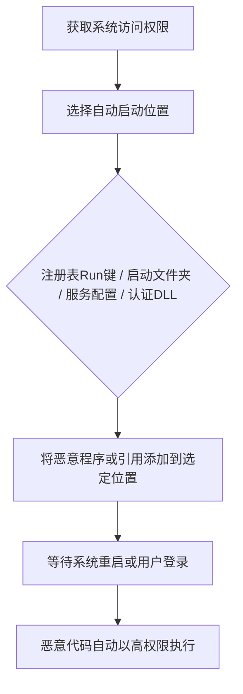

# 启动或登录自动执行 (T1547)

## 一句话通俗理解

> 就像在你家的"自动播放列表"里偷偷加了一首歌——每次你打开音乐播放器（开机/登录），恶意代码就会自动运行，根本不需要你手动操作。

## 难度等级

⭐⭐ 中等（需要管理员权限或用户级访问）

## 技术描述

攻击者可能配置系统设置，使其在系统启动或用户登录时自动执行程序，以维持持久性或在受损系统上获得更高权限。操作系统可能具有在系统启动或账户登录时自动运行程序的机制。这些机制可能包括自动执行放置在特别指定目录中的程序，或引用存储配置信息的存储库，如Windows注册表。

攻击者可能通过修改或扩展内核的功能来实现相同的目标。

由于某些启动或登录自动启动程序以更高权限运行，攻击者可能利用这些来提升权限。

## 子技术列表

| 子技术ID | 名称 | 说明 | 难度 |
|----------|------|------|------|
| T1547.001 | 注册表Run键/启动文件夹 | 最常见的自动启动位置 | ⭐ 简单 |
| T1547.002 | 认证包 | 加载到LSASS进程中的DLL | ⭐⭐⭐ 较高 |
| T1547.003 | 时间提供者 | 系统时间同步相关的DLL | ⭐⭐⭐ 较高 |
| T1547.004 | Winlogon辅助DLL | 用户登录时加载的DLL | ⭐⭐ 中等 |
| T1547.005 | 安全支持提供者 | 认证相关的安全DLL | ⭐⭐⭐ 较高 |
| T1547.006 | 内核模块和扩展 | Linux内核模块（.ko文件） | ⭐⭐⭐⭐ 高 |
| T1547.007 | 重新打开的应用程序 | macOS应用恢复功能 | ⭐ 简单 |
| T1547.008 | LSASS驱动程序 | LSASS进程加载的驱动 | ⭐⭐⭐⭐ 高 |
| T1547.009 | 快捷方式修改 | 修改桌面快捷方式指向恶意程序 | ⭐ 简单 |
| T1547.010 | 端口监视器 | 打印相关的系统DLL | ⭐⭐⭐ 较高 |
| T1547.012 | 打印处理器 | 打印处理相关的DLL | ⭐⭐⭐ 较高 |
| T1547.013 | XDG自动启动条目 | Linux桌面环境自动启动 | ⭐⭐ 中等 |
| T1547.014 | Active Setup | Windows组件自动安装机制 | ⭐⭐ 中等 |
| T1547.015 | 登录项 | macOS登录时自动启动的应用 | ⭐ 简单 |

## 攻击流程



```
1. 获取对系统的访问权限（通常需要管理员/root权限）
    ↓
2. 选择自动启动位置：
   - 注册表Run/RunOnce键
   - 启动文件夹
   - 服务配置
   - 认证相关DLL
    ↓
3. 将恶意程序或引用添加到选定位置
    ↓
4. 等待系统重启或用户登录
    ↓
5. 恶意代码自动以高权限执行
```

## 真实案例

### 案例1：APT29 SolarWinds 攻击中的注册表持久化
- **时间**: 2020年
- **目标**: 全球政府机构、科技公司和关键基础设施
- **手法**: APT29在SolarWinds Orion软件中植入SUNBURST后门，通过修改Windows注册表中的Run键（T1547.001）实现持久性。在`HKEY_LOCAL_MACHINE\Software\Microsoft\Windows\CurrentVersion\Run`下添加了指向恶意DLL的条目，确保每次系统启动时自动执行。
- **链接**: https://www.cisa.gov/news-events/cybersecurity-advisories/aa24-057a

### 案例2：Conti勒索软件使用多种自动启动机制
- **时间**: 2020-2021年
- **目标**: 全球企业、医院和政府机构
- **手法**: Conti勒索软件使用注册表Run键（T1547.001）和启动文件夹来确保持久性。在加密完成前，恶意软件会修改注册表以在每次系统启动时重新加载自身，即使用户尝试删除主程序文件。
- **链接**: https://attack.mitre.org/software/S0575/

### 案例3：Lazarus Group利用端口监视器和打印处理器
- **时间**: 2022年
- **目标**: 全球银行和金融机构
- **手法**: Lazarus Group使用较少见的子技术——端口监视器（T1547.010）和打印处理器（T1547.012）来逃避检测。这些位置很少被安全工具监控，提供了隐蔽的持久化机制。
- **链接**: https://attack.mitre.org/groups/G0032/

### 案例4：BlackCat勒索软件的启动持久化
- **时间**: 2023-2024年
- **目标**: 全球企业网络
- **手法**: BlackCat（ALPHV）勒索软件使用注册表Run键和启动文件夹来维持持久性。攻击者在加密过程中创建多个持久化点，确保即使部分被清除，勒索软件仍能重新启动。
- **链接**: https://www.cisa.gov/news-events/cybersecurity-advisories/aa23-353a

## 红队视角

> ⚠️ **免责声明**：以下内容仅用于合法的安全测试、渗透测试和教育目的。未经授权对他人系统进行测试是违法行为。

**攻击优势**：
- 注册表Run键是最经典的持久化方式，兼容性好
- 启动文件夹简单直观，适合快速部署
- 认证包和SSP等高级技术难以被常规安全工具检测

**常用工具**：
```cmd
REM 注册表Run键
reg add "HKLM\Software\Microsoft\Windows\CurrentVersion\Run" /v "Windows Update" /d "C:\temp\malware.exe" /f

REM 启动文件夹
copy malware.exe "%APPDATA%\Microsoft\Windows\Start Menu\Programs\Startup\"

REM 使用Sysinternals Autoruns查看所有自动启动位置
autoruns.exe
```

**实战技巧**：
- 使用看似合法的名称（如"Windows Update"、"Security Health"）
- 优先选择不常见的自动启动位置（如端口监视器、打印处理器）
- 配合T1546（事件触发执行）使用，增加冗余

## 蓝队视角

**防御重点**：
- 监控注册表Run/RunOnce键的修改
- 审计启动文件夹中的新增文件
- 使用Autoruns等工具定期扫描自动启动位置

**常见盲点**：
- 只关注Run键，忽略认证包、SSP等高级位置
- 未监控用户级启动文件夹（HKCU）
- 缺乏对Linux/macOS自动启动位置的监控

## 检测建议

### 网络层检测

**检测方法：** 监控自动启动程序（如Run键启动的进程）的异常出站网络连接，检测后门回连。

**具体规则/命令示例：**
```bash
# Suricata规则检测启动项进程外连
alert tcp $HOME_NET any -> $EXTERNAL_NET $HTTP_PORTS (msg:"Autostart Program Beaconing"; flow:to_server,established; detection_filter:track by_src, count 5, seconds 3600; sid:1000216; rev:1;)
```

### 主机层检测

**检测方法：** 监控Windows注册表Run键、启动文件夹以及Linux/macOS自动启动配置的修改。

**Windows事件ID：**
- Sysmon事件ID 12/13：注册表Run/RunOnce键修改
- Sysmon事件ID 11：文件创建（监控启动文件夹新文件）
- 事件ID 4657：注册表值修改（认证包、SSP注册）
- Sysmon事件ID 1：启动文件夹中的程序执行

**Linux日志：**
- 日志文件：`/etc/init.d/`和`/etc/systemd/system/`目录文件变更
- 关键字段：XDG自动启动配置文件（~/.config/autostart/）修改
- 关键字段：macOS LaunchAgent和LaunchDaemon plist文件创建

**具体命令示例：**
```bash
# 列出所有Registro Run键条目
reg query "HKLM\Software\Microsoft\Windows\CurrentVersion\Run"
reg query "HKCU\Software\Microsoft\Windows\CurrentVersion\Run"

# 检查启动文件夹
dir "%APPDATA%\Microsoft\Windows\Start Menu\Programs\Startup"
dir "C:\ProgramData\Microsoft\Windows\Start Menu\Programs\Startup"

# 检查Linux XDG自动启动
ls -la ~/.config/autostart/

# 检查macOS自动启动
ls -la /Library/LaunchAgents/
ls -la /Library/LaunchDaemons/
```

### 应用层检测

**Sigma规则示例：**
```yaml
title: 注册表Run键添加检测
status: experimental
description: 检测在HKLM Run键中添加新条目的事件
logsource:
    category: registry_event
    product: windows
detection:
    selection:
        TargetObject|startswith: 'HKLM\Software\Microsoft\Windows\CurrentVersion\Run'
    condition: selection
level: high
tags:
    - attack.t1547.001
```

## 缓解措施

### 优先级1：关键措施

**措施名称：** 自动启动位置访问控制

**具体实施步骤：**
1. 使用应用程序控制策略（WDAC/AppLocker）限制自动启动位置的可执行文件执行
2. 限制用户对系统级自动启动位置（HKLM Run键、系统启动文件夹）的写入权限
3. 对认证包（Authentication Packages）和SSP注册实施严格的变更控制
4. 在Linux系统上限制XDG自动启动目录（`/etc/xdg/autostart/`）的写入权限

### 优先级2：重要措施

**措施名称：** 自动启动审计与基线管理

**具体实施步骤：**
1. 使用Sysinternals Autoruns定期扫描所有自动启动位置（包括Run键、启动文件夹、服务、驱动程序、计划任务等）
2. 建立企业级自动启动白名单，监控所有未在白名单中的自动启动条目
3. 配置Sysmon监控注册表Run/RunOnce键的修改和启动文件夹的新增文件
4. 在Linux/macOS系统上监控systemd服务、LaunchDaemons和XDG自动启动配置的创建

**配置示例：**
```bash
# 使用Autoruns生成自动启动报告
autoruns.exe /accepteula /a * /c /h /s /o autoruns_report.csv

# 监控启动文件夹变更
auditctl -w "/home/%USER%/.config/autostart/" -p wa -k xdg_autostart

# PowerShell监控Run键变更
Register-WmiEvent -Query "SELECT * FROM RegistryKeyChangeEvent WHERE Hive='HKLM' AND KeyPath='Software\\Microsoft\\Windows\\CurrentVersion\\Run'" -Action { Write-EventLog ... }
```

## 动手实验

> ⚠️ **重要提示**：所有实验必须在隔离的实验室环境中进行，禁止对未授权的真实系统进行测试。

### 实验1：注册表Run键持久化
```cmd
REM 添加Run键（需要管理员权限）
reg add "HKLM\Software\Microsoft\Windows\CurrentVersion\Run" /v "TestPersistence" /d "C:\Windows\System32\cmd.exe /c echo Persistence Test > C:\temp\test.txt" /f

REM 验证添加
reg query "HKLM\Software\Microsoft\Windows\CurrentVersion\Run"

REM 清理
reg delete "HKLM\Software\Microsoft\Windows\CurrentVersion\Run" /v "TestPersistence" /f
```

### 实验2：启动文件夹持久化
```cmd
REM 复制脚本到启动文件夹
echo echo Persistence Test > "%APPDATA%\Microsoft\Windows\Start Menu\Programs\Startup\test.bat"

REM 验证
dir "%APPDATA%\Microsoft\Windows\Start Menu\Programs\Startup\"

REM 清理
del "%APPDATA%\Microsoft\Windows\Start Menu\Programs\Startup\test.bat"
```

### 实验3：使用Autoruns检测
```cmd
REM 下载并运行Autoruns
autoruns.exe /accepteula /a * /c > autoruns_output.csv

REM 检查输出中的可疑条目
```

## 术语解释

| 术语 | 英文原名 | 通俗解释 |
|------|----------|----------|
| 注册表Run键 | Registry Run Key | Windows注册表中用于自动启动程序的键值，就像系统的"自动播放列表" |
| LSASS | Local Security Authority Subsystem Service | 本地安全机构子系统服务，Windows中负责认证的核心进程 |
| SSP | Security Support Provider | 安全支持提供者，Windows中处理不同认证协议的模块 |
| Winlogon | Windows Logon | Windows登录进程，负责处理用户登录和退出 |
| 内核模块 | Kernel Module | Linux内核中可加载的代码模块（.ko文件），可以动态扩展内核功能 |
| LaunchAgent | Launch Agent | macOS用户级自动启动代理，用户登录时自动运行 |
| XDG | X Desktop Group | Linux桌面环境标准，定义了应用程序的自动启动规范 |

## 参考资料

- [MITRE ATT&CK T1547 启动或登录自动执行](https://attack.mitre.org/techniques/T1547/)
- [CISA 启动或登录自动执行防御指南](https://www.cisa.gov/eviction-strategies-tool/info-attack/T1547)
- [Windows注册表Run键文档 - Microsoft](https://learn.microsoft.com/en-us/windows/win32/setupapi/run-and-runonce-registry-keys)
- [APT29 SolarWinds Advisory - CISA](https://www.cisa.gov/news-events/cybersecurity-advisories/aa24-057a)
- [Conti勒索软件分析](https://attack.mitre.org/software/S0575/)
- [Atomic Red Team - T1547](https://github.com/redcanaryco/atomic-red-team/tree/master/atomics/T1547)
