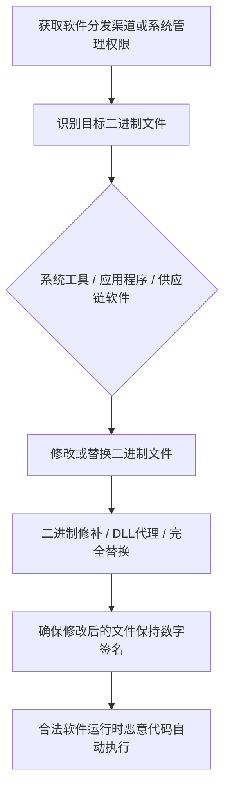

# 篡改客户端软件二进制 (T1554)

## 一句话通俗理解

> 就像把正版软件偷偷换成了夹带私货的"山寨版"——你运行的是看起来完全一样的软件，但里面已经藏了后门，每次启动都会执行恶意代码。

## 难度等级

⭐⭐⭐ 较高（需要供应链访问或系统管理员权限）

## 技术描述

攻击者可能修改系统软件二进制文件或组件以建立对系统的持久访问。该技术涉及修补、替换或以其他方式篡改作为操作系统或常见应用程序一部分的合法软件二进制文件。通过入侵受信任的二进制文件，攻击者确保其恶意代码在合法软件运行时执行，能够经受重启和不替换被篡改二进制文件的软件更新。

该攻击可以针对广泛的二进制文件，包括系统实用程序、驱动程序、固件组件和应用程序可执行文件。与引入新文件或修改配置的技术不同，入侵现有二进制文件将恶意代码混入受信任且预期的文件中，使检测更加困难。常见方法包括二进制修补（修改可执行文件中的特定字节）、DLL代理（用转发调用的恶意DLL替换合法DLL）和整个二进制文件替换。

## 子技术列表

该技术无子技术。

## 攻击流程



```
1. 获取对软件分发渠道的访问（供应链攻击）或系统管理权限
    ↓
2. 识别目标二进制文件：
   - 系统工具（如svchost.exe、lsass.exe）
   - 应用程序（如浏览器、办公软件）
   - 供应链中的软件（如更新服务器）
    ↓
3. 修改或替换二进制文件：
   - 二进制修补（修改特定字节）
   - DLL代理（替换为恶意DLL）
   - 完全替换
    ↓
4. 确保修改后的二进制文件保持数字签名（如可能）
    ↓
5. 当合法软件运行时，恶意代码自动执行
```

## 真实案例

### 案例1：SolarWinds Orion供应链攻击（SUNBURST）
- **时间**: 2020年3月（最早可追溯到2019年9月）
- **目标**: 全球政府机构、科技公司和关键基础设施
- **手法**: 攻击者入侵SolarWinds的构建系统，将恶意代码注入到SolarWinds.Orion.Core.BusinessLayer.dll中。该DLL被数字签名并随Orion产品分发给约18,000个客户。受害者包括美国联邦机构和多家财富500强企业。
- **链接**: https://attack.mitre.org/software/S0559/

### 案例2：CCleaner供应链攻击
- **时间**: 2017年9月
- **目标**: 全球科技公司用户
- **手法**: 攻击者入侵Piriform的构建环境，将恶意代码植入CCleaner 5.33版本中。被篡改的CCleaner.exe保持原有的数字签名，通过官方分发渠道分发给约227万用户。第二阶段payload针对Microsoft、Google等科技公司的特定系统。
- **链接**: https://attack.mitre.org/software/S0487/

### 案例3：3CX桌面应用供应链攻击
- **时间**: 2023年3月
- **目标**: 全球使用3CX VoIP软件的企业
- **手法**: 攻击者（归因于Lazarus Group）入侵3CX的构建环境，在3CX桌面应用的更新中植入恶意代码。被篡改的应用通过官方更新渠道分发给超过60万客户。恶意代码从GitHub仓库下载后续payload，建立C2通信。
- **链接**: https://attack.mitre.org/groups/G0032/

### 案例4：XZ Utils后门事件
- **时间**: 2024年3月
- **目标**: Linux生态系统
- **手法**: 攻击者通过长期的社会工程学渗透XZ Utils项目，在xz 5.6.0和5.6.1版本中植入后门。该后门修改了liblzma库，允许通过SSH进行未授权访问。由于XZ Utils被几乎所有Linux发行版使用，该后门可能影响数百万系统。
- **链接**: https://www.openwall.com/lists/oss-security/2024/03/29/4

## 红队视角

> ⚠️ **免责声明**：以下内容仅用于合法的安全测试、渗透测试和教育目的。未经授权对他人系统进行测试是违法行为。

**攻击优势**：
- 恶意代码在受信任进程中运行，难以被检测
- 可以经受系统重启和软件更新（如果更新不替换被篡改文件）
- 数字签名可能保持有效

**常用技术**：
```cmd
REM DLL代理示例
REM 1. 导出原始DLL的所有函数
REM 2. 创建恶意DLL，转发调用到原始DLL
REM 3. 替换目标目录中的DLL

REM 二进制修补
REM 使用十六进制编辑器修改可执行文件的特定字节
```

**实战技巧**：
- 优先选择不经常更新的软件
- 确保修改后的二进制文件功能正常，避免引起用户怀疑
- 配合T1574（劫持执行流）使用，将恶意DLL放在搜索顺序优先位置

## 蓝队视角

**防御重点**：
- 实施文件完整性监控（FIM）
- 验证所有软件更新的数字签名
- 保护构建环境和分发渠道

**常见盲点**：
- 信任所有带数字签名的软件
- 未监控CI/CD管道的安全
- 缺乏对软件二进制文件的基线比较

## 检测建议

### 网络层检测

**检测方法：** 监控被篡改的合法进程（如svchost.exe、lsass.exe、浏览器进程）的异常网络行为。

**具体规则/命令示例：**
```bash
# Suricata规则检测被篡改的浏览器进程外连
alert tcp $HOME_NET any -> $EXTERNAL_NET any (msg:"Compromised Browser Binary - Unusual Outbound"; flow:to_server,established; content!("google.com|/|microsoft.com|/|bing.com"); http_host; sid:1000217; rev:1;)
```

### 主机层检测

**检测方法：** 使用文件完整性监控检测关键二进制文件的哈希值变化，验证数字签名有效性。

**Windows事件ID：**
- 事件ID 6281：代码完整性检查检测到无效的代码
- 事件ID 5038：代码完整性检测到无效的签名哈希
- Sysmon事件ID 11：文件创建/修改（监控系统目录中的文件变更）
- 事件ID 4688：进程创建（监控已知合法进程的异常行为）

**Linux日志：**
- 日志文件：`/var/log/audit/audit.log`
- 关键字段：关键系统二进制文件（/bin/ls、/usr/bin/sshd等）的inode变更
- 关键字段：包管理器一致性检查（rpm -Va或debsums）

**具体命令示例：**
```bash
# 使用Sigcheck验证Windows系统文件
sigcheck.exe -a -s C:\Windows\System32

# 检查特定文件的数字签名
Get-AuthenticodeSignature -FilePath C:\Windows\System32\notepad.exe

# Linux验证软件包完整性
rpm -Va | grep -E "S\.5\.\.\.\.\.\."

# 计算关键二进制文件哈希
Get-FileHash C:\Windows\System32\svchost.exe | Format-List
```

### 应用层检测

**Sigma规则示例：**
```yaml
title: 系统二进制文件哈希变更检测
status: experimental
description: 检测关键系统二进制文件的哈希值变化
logsource:
    category: file_event
    product: windows
detection:
    selection:
        TargetFile|contains:
            - '\Windows\System32\'
            - '\Windows\SysWOW64\'
        IntegrityLevel: 'Unknown'
    condition: selection
level: critical
tags:
    - attack.t1554
```

## 缓解措施

### 优先级1：关键措施

**措施名称：** 应用程序控制与代码完整性

**具体实施步骤：**
1. 实施应用程序控制策略（WDAC/AppLocker），仅允许经过数字签名的二进制文件执行
2. 对所有软件更新实施数字签名验证，启用Windows Defender 应用程序控制（Device Guard）
3. 对内部构建环境实施严格的访问控制和审计，保护代码签名密钥
4. 使用硬件安全模块（HSM）保护代码签名密钥，防止私钥泄露

### 优先级2：重要措施

**措施名称：** 文件完整性监控与供应链安全

**具体实施步骤：**
1. 对系统关键目录（Windows\System32、关键应用程序安装目录）实施文件完整性监控（FIM）
2. 建立系统关键进程的行为基线（正常网络连接、DLL加载、子进程创建模式）
3. 实施软件物料清单（SBOM）管理，追踪所有软件组件的来源和版本
4. 对CI/CD管道实施安全控制，防止构建环境被篡改

**配置示例：**
```bash
# 使用Tripwire或AIDE监控Linux二进制文件完整性
tripwire --check --twrfiles /var/lib/tripwire/report

# Windows文件完整性规则（通过Azure Sentinel FIM）
# 在Azure Policy中配置文件完整性监控

# 使用PowerShell定期检查关键系统文件
$files = Get-ChildItem "C:\Windows\System32\*.dll" | Where-Object { $_.LastWriteTime -gt (Get-Date).AddDays(-1) }
$files | ForEach-Object { Get-AuthenticodeSignature -FilePath $_.FullName }
```

## 动手实验

> ⚠️ **重要提示**：所有实验必须在隔离的实验室环境中进行，禁止对未授权的真实系统进行测试。

### 实验1：DLL代理
```cpp
// 原始DLL: legitimate.dll
// 恶意DLL: malicious.dll（重命名为legitimate.dll）

// malicious.dll代码示例
#pragma comment(linker, "/export:OriginalFunction=real_legitimate.OriginalFunction")

// 在DLL_PROCESS_ATTACH中执行恶意代码
BOOL APIENTRY DllMain(HMODULE hModule, DWORD reason, LPVOID lpReserved) {
    if (reason == DLL_PROCESS_ATTACH) {
        // 恶意代码
        CreateThread(NULL, 0, MaliciousThread, NULL, 0, NULL);
    }
    return TRUE;
}
```

### 实验2：使用Atomic Red Team测试
```powershell
# 执行T1554测试
Invoke-AtomicTest T1554
```

## 术语解释

| 术语 | 英文原名 | 通俗解释 |
|------|----------|----------|
| 二进制修补 | Binary Patching | 修改可执行文件中的特定字节以改变其行为 |
| DLL代理 | DLL Proxying | 用恶意DLL替换合法DLL，同时转发原始调用保持功能正常 |
| 供应链攻击 | Supply Chain Attack | 通过入侵软件开发或分发渠道来攻击最终用户 |
| 数字签名 | Digital Signature | 用于验证软件来源和完整性的加密签名 |
| CI/CD | Continuous Integration/Continuous Deployment | 持续集成/持续部署，软件开发自动化流程 |
| FIM | File Integrity Monitoring | 文件完整性监控，检测文件是否被篡改 |

## 参考资料

- [MITRE ATT&CK T1554 篡改客户端软件二进制](https://attack.mitre.org/techniques/T1554/)
- [SolarWinds供应链攻击分析 - Mandiant](https://www.mandiant.com/resources/evasive-attacker-leverages-solarwinds-supply-chain-compromises)
- [CCleaner供应链攻击分析 - Cisco Talos](https://blog.talosintelligence.com/ccleaner-malware/)
- [3CX供应链攻击分析](https://attack.mitre.org/groups/G0032/)
- [XZ Utils后门分析](https://www.openwall.com/lists/oss-security/2024/03/29/4)
- [Atomic Red Team - T1554](https://github.com/redcanaryco/atomic-red-team/tree/master/atomics/T1554)
