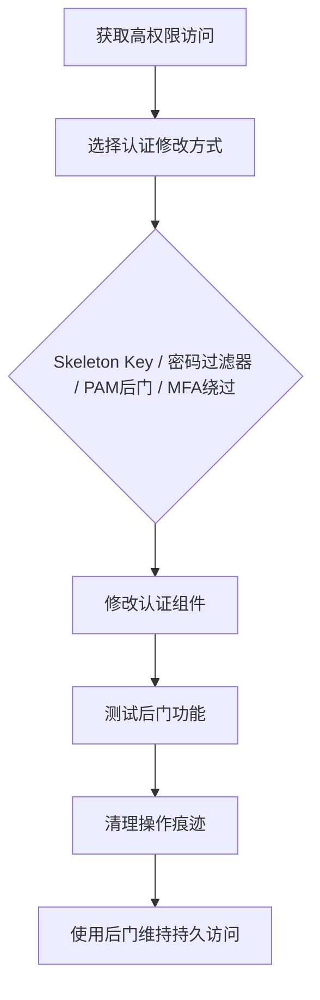

# 修改认证流程 (T1556)

## 一句话通俗理解

> 就像小偷偷偷修改了你家的门禁系统——现在不仅他的假钥匙能开门，你换了多少次锁都没用，因为门禁系统本身已经被"内鬼"控制了。

## 难度等级

⭐⭐⭐⭐ 高（需要深入的系统知识和高权限）

## 技术描述

攻击者可能修改操作系统、网络设备和云服务的认证流程，以维持对受害者环境的持久访问。通过篡改认证凭据的存储、验证或确认方式，攻击者可以绕过正常的认证机制、捕获凭据以供以后重用，或创建无需有效凭据即可访问的后门。

认证修改在多个层面运作。在操作系统层面，攻击者可以替换或钩住认证库（如Windows的winlogon.exe、lsass.exe或Linux PAM模块）、修改密码验证逻辑或安装恶意凭据提供程序。在网络层面，攻击者可以操纵RADIUS、LDAP或Kerberos认证服务以接受伪造的凭据。在云环境中，攻击者可以修改联合信任、添加流氓身份提供者或更改SAML断言验证。

该技术特别隐蔽，因为认证失败很常见且经常被忽略，而成功的认证（即使是通过后门）看起来像合法访问。

## 子技术列表

| 子技术ID | 名称 | 说明 | 难度 |
|----------|------|------|------|
| T1556.001 | 域控制器认证 | 修改DC认证机制（Skeleton Key） | ⭐⭐⭐⭐ 高 |
| T1556.002 | 密码过滤器 | 安装恶意密码过滤器DLL | ⭐⭐⭐ 较高 |
| T1556.003 | PAM | 修改Linux/macOS认证模块 | ⭐⭐⭐ 较高 |
| T1556.004 | 网络设备认证 | 修改路由器/交换机认证 | ⭐⭐⭐⭐ 高 |
| T1556.005 | 多因素认证 | 绕过或操纵MFA | ⭐⭐ 中等 |
| T1556.006 | 混合身份 | 修改AD FS联合认证 | ⭐⭐⭐⭐ 高 |
| T1556.007 | 混合身份同步 | 修改Azure AD Connect | ⭐⭐⭐⭐ 高 |
| T1556.008 | 网络提供程序DLL | 注册恶意网络认证DLL | ⭐⭐⭐ 较高 |
| T1556.009 | 条件访问策略 | 修改云环境条件访问策略 | ⭐⭐⭐ 较高 |

## 攻击流程



```
1. 获取高权限访问（域管理员、root等）
    ↓
2. 选择认证修改方式：
   - Skeleton Key（域控制器）
   - 密码过滤器（捕获密码）
   - PAM后门（Linux）
   - MFA绕过
    ↓
3. 修改认证组件
    ↓
4. 测试后门功能
    ↓
5. 清理操作痕迹
    ↓
6. 使用后门维持持久访问
```

## 真实案例

### 案例1：APT29利用Skeleton Key攻击域控制器
- **时间**: 2015年
- **目标**: 政府机构和金融机构
- **手法**: APT29使用Skeleton Key恶意软件修改域控制器的LSASS进程，使得一个主密码（skeleton key）可以用于任何域账户的认证。Skeleton Key在内存中运行，不写入磁盘。
- **链接**: https://attack.mitre.org/techniques/T1556/001/

### 案例2：LAPSUS$利用MFA Fatigue攻击
- **时间**: 2022年
- **目标**: Microsoft、CrowdStrike、NVIDIA、Okta
- **手法**: LAPSUS$使用MFA Fatigue攻击（T1556.005）绕过多因素认证。攻击者触发大量Microsoft Authenticator推送通知，目标用户在频繁通知骚扰下错误批准请求。
- **链接**: https://attack.mitre.org/techniques/T1556/005/

### 案例3：APT29利用AD FS伪造SAML Token
- **时间**: 2020年
- **目标**: 美国联邦政府机构（SolarWinds攻击）
- **手法**: APT29获取了目标组织的AD FS签名证书，利用该证书伪造SAML令牌，可以冒充任何用户访问任何依赖Azure AD进行认证的云应用。
- **链接**: https://attack.mitre.org/techniques/T1556/006/

### 案例4：Volt Typhoon利用认证后门
- **时间**: 2023-2024年
- **目标**: 美国关键基础设施
- **手法**: Volt Typhoon在受感染系统上修改认证流程，包括安装密码过滤器和修改PAM模块，以维持对Linux和Windows系统的持久访问。
- **链接**: https://www.cisa.gov/news-events/cybersecurity-advisories/aa24-038a

## 红队视角

> ⚠️ **免责声明**：以下内容仅用于合法的安全测试、渗透测试和教育目的。未经授权对他人系统进行测试是违法行为。

**攻击优势**：
- 后门深度集成到认证系统中
- 可以捕获所有用户的凭据
- 即使密码被更改，后门仍然有效

**常用工具**：
```powershell
# Skeleton Key（Mimikatz）
mimikatz # misc::skeleton

# 密码过滤器安装
reg add "HKLM\SYSTEM\CurrentControlSet\Control\Lsa" /v "Notification Packages" /t REG_MULTI_SZ /d "scecli\0malicious_filter" /f

# PAM后门
# 修改/etc/pam.d/common-auth
```

**实战技巧**：
- 优先使用内存技术（如Skeleton Key）减少磁盘痕迹
- 配合T1078（有效账户）使用，捕获的凭据可用于横向移动
- 修改MFA策略而非完全禁用，减少被注意的可能

## 蓝队视角

**防御重点**：
- 监控LSASS进程的异常模块加载
- 审计PAM配置文件的完整性
- 监控MFA策略的变更

**常见盲点**：
- 只关注密码更改，忽略认证流程的修改
- 未监控域控制器上的SSP安装
- 缺乏对AD FS证书使用的审计

## 检测建议

### 网络层检测

**检测方法：** 监控域控制器和AD FS服务器的异常网络认证流量，检测Skeleton Key等后门认证模式。

**具体规则/命令示例：**
```bash
# Suricata规则检测异常Kerberos认证
alert tcp $HOME_NET any -> $HOME_NET 88 (msg:"Suspicious Kerberos Authentication"; flow:to_server,established; content:"|a2 82|"; depth:2; detection_filter:track by_dst, count 50, seconds 60; sid:1000218; rev:1;)
```

### 主机层检测

**检测方法：** 监控LSASS进程的异常模块加载、PAM配置文件修改和密码过滤器DLL注册。

**Windows事件ID：**
- Sysmon事件ID 7：DLL加载（监控LSASS.exe加载的异常模块）
- 事件ID 4657：注册表值修改（监控Notification Packages等认证相关键值）
- 事件ID 4688：进程创建（监控认证相关进程的异常子进程）
- 事件ID 4776：域控制器认证尝试

**Linux日志：**
- 日志文件：`/var/log/auth.log`
- 关键字段：PAM配置文件（/etc/pam.d/）的修改事件
- 关键字段：/etc/security/目录下文件的变更
- 关键字段：sshd的PAM认证日志

**具体命令示例：**
```bash
# 检查LSASS加载的SSP
reg query "HKLM\SYSTEM\CurrentControlSet\Control\Lsa" /v "Security Packages"

# 检查密码过滤器
reg query "HKLM\SYSTEM\CurrentControlSet\Control\Lsa" /v "Notification Packages"

# Linux检查PAM配置
cat /etc/pam.d/common-auth
ls -la /etc/pam.d/

# 检查认证模块完整性
rpm -V pam
```

### 应用层检测

**Sigma规则示例：**
```yaml
title: 密码过滤器DLL注册检测
status: experimental
description: 检测Windows密码过滤器DLL的注册表写入
logsource:
    category: registry_event
    product: windows
detection:
    selection:
        TargetObject|contains: '\Control\Lsa\Notification Packages'
    condition: selection
level: critical
tags:
    - attack.t1556.002
```

## 缓解措施

### 优先级1：关键措施

**措施名称：** 认证基础设施加固

**具体实施步骤：**
1. 对域控制器启用Credential Guard和LSA保护（RunAsPPL），防止LSASS凭据提取
2. 保护AD FS和域控制器的物理及逻辑安全，严格限制管理访问
3. 使用硬件安全模块（HSM）保护AD FS签名证书
4. 限制条件访问策略的管理权限，监控Azure AD中条件访问策略的创建和修改

### 优先级2：重要措施

**措施名称：** 认证组件完整性监控

**具体实施步骤：**
1. 监控LSASS进程的异常DLL加载事件，使用Sysmon监控lsass.exe加载的可疑模块
2. 在Linux系统上监控PAM配置文件（/etc/pam.d/）的修改，使用auditd或AIDE
3. 审计域控制器上安装的Security Support Providers（SSP）和密码过滤器DLL
4. 实施MFA防疲劳策略，设置MFA提示次数限制和要求额外的地理位置验证

**配置示例：**
```bash
# 启用LSA保护（RunAsPPL）
reg add "HKLM\SYSTEM\CurrentControlSet\Control\Lsa" /v "RunAsPPL" /t REG_DWORD /d 1 /f

# 配置Credential Guard
# 通过组策略：计算机配置 -> 管理模板 -> 系统 -> Device Guard -> 打开基于虚拟化的安全

# Linux监控PAM配置变更
auditctl -w /etc/pam.d/ -p wa -k pam_changes
```

## 动手实验

> ⚠️ **重要提示**：所有实验必须在隔离的实验室环境中进行，禁止对未授权的真实系统进行测试。

### 实验1：Mimikatz Skeleton Key
```powershell
# 需要域管理员权限
mimikatz # privilege::debug
mimikatz # misc::skeleton

# 测试：使用"skeleton"作为密码登录任何域账户
```

### 实验2：密码过滤器（概念验证）
```cpp
// malicious_filter.dll
BOOL WINAPI InitializeChangeNotify(void) { return TRUE; }
DWORD WINAPI PasswordFilter(PUNICODE_STRING Password, ULONG Type, ULONG Operation) { 
    // 记录密码
    return TRUE; 
}
BOOL WINAPI PasswordChangeNotify(PUNICODE_STRING UserName, ULONG RelativeId, PUNICODE_STRING Password) {
    // 将密码发送到C2
    return TRUE;
}
```

### 实验3：使用Atomic Red Team测试
```powershell
# 执行T1556测试
Invoke-AtomicTest T1556
```

## 术语解释

| 术语 | 英文原名 | 通俗解释 |
|------|----------|----------|
| Skeleton Key | Skeleton Key | 域控制器内存补丁，允许使用主密码认证任何账户 |
| LSASS | Local Security Authority Subsystem Service | 本地安全机构子系统服务，Windows中处理登录认证的核心进程 |
| PAM | Pluggable Authentication Modules | 可插拔认证模块，Linux/Unix系统中灵活的认证机制 |
| AD FS | Active Directory Federation Services | 微软的联合认证服务，实现单点登录 |
| SAML | Security Assertion Markup Language | 安全断言标记语言，用于交换认证和授权数据 |
| MFA | Multi-Factor Authentication | 多因素认证，需要两种以上验证方式的认证方法 |
| SSP | Security Support Provider | 安全支持提供者，提供不同认证协议的Windows模块 |

## 参考资料

- [MITRE ATT&CK T1556 修改认证流程](https://attack.mitre.org/techniques/T1556/)
- [Skeleton Key分析 - Mandiant](https://www.mandiant.com/resources/skeleton-key-malware-analysis)
- [LAPSUS$活动分析 - CrowdStrike](https://www.crowdstrike.com/blog/who-is-lapsus/)
- [Volt Typhoon Advisory - CISA](https://www.cisa.gov/news-events/cybersecurity-advisories/aa24-038a)
- [Atomic Red Team - T1556](https://github.com/redcanaryco/atomic-red-team/tree/master/atomics/T1556)
