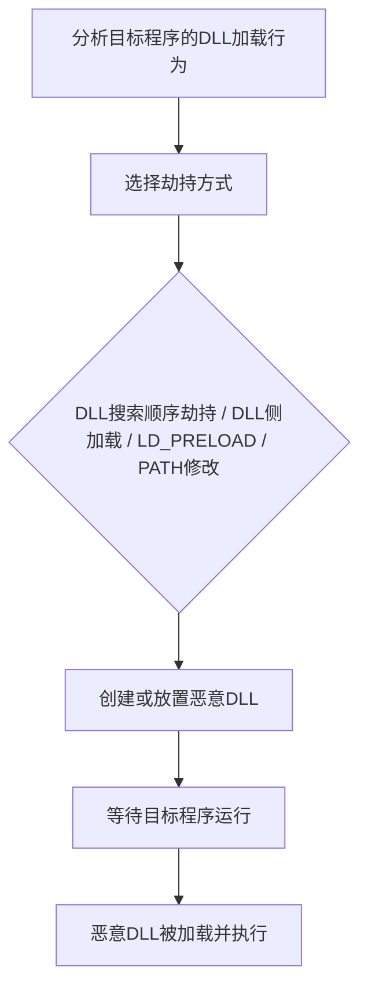

# 劫持执行流 (T1574)

## 一句话通俗理解

> 就像在你回家的路上设了个"假路标"——程序以为自己在加载正版DLL，实际上加载的是攻击者的恶意版本，就像你以为走进了正规餐厅，结果进了黑店。

## 难度等级

⭐⭐⭐ 较高（需要对系统DLL加载机制有深入理解）

## 技术描述

攻击者可能通过劫持操作系统运行程序和加载库的方式来执行自己的恶意payload。劫持执行流涉及控制程序或操作系统在加载或执行代码时执行的正常操作序列。这可以通过利用操作系统搜索和加载可执行文件、库或其他资源的方式来实现。

这些技术利用DLL搜索顺序、环境变量、动态链接器行为和文件权限弱点等特性。通过将恶意文件放置在受信任程序将加载它的位置（而不是合法文件），攻击者可以实现持久性（每当受信任程序运行时恶意代码就会运行）和权限提升（如果受信任程序以更高权限运行）。

## 子技术列表

| 子技术ID | 名称 | 说明 | 平台 |
|----------|------|------|------|
| T1574.001 | DLL搜索顺序劫持 | 利用Windows DLL搜索顺序 | Windows |
| T1574.002 | DLL侧加载 | 利用合法程序加载恶意DLL | Windows |
| T1574.004 | Dylib劫持 | macOS动态库劫持 | macOS |
| T1574.005 | 可执行安装程序文件权限弱点 | 利用安装程序弱权限 | Windows |
| T1574.006 | 动态链接器劫持 | 利用LD_PRELOAD等机制 | Linux |
| T1574.007 | PATH环境变量路径拦截 | 修改PATH变量 | 全平台 |
| T1574.008 | 搜索顺序路径拦截 | 利用应用搜索顺序 | 全平台 |
| T1574.009 | 未引用路径路径拦截 | 利用路径中的空格 | Windows |
| T1574.010 | 服务文件权限弱点 | 利用服务二进制弱权限 | Windows |
| T1574.011 | PLAT（Android） | Android系统级加载劫持 | Android |
| T1574.012 | COR_PROFILER | .NET CLR配置劫持 | Windows |

## 攻击流程



```
1. 分析目标程序的DLL加载行为
    ↓
2. 选择劫持方式：
   - DLL搜索顺序劫持（放置在优先搜索目录）
   - DLL侧加载（替换合法DLL）
   - LD_PRELOAD注入（Linux）
   - PATH变量修改
    ↓
3. 创建或放置恶意DLL
    ↓
4. 等待目标程序运行
    ↓
5. 恶意DLL被加载并执行
```

## 真实案例

### 案例1：APT41利用DLL Side-Loading攻击AhnLab用户
- **时间**: 2019年
- **目标**: 亚洲地区的AhnLab安全软件用户
- **手法**: APT41将恶意DLL放置在AhnLab安全软件的安装目录中，当签名的AhnLab可执行文件运行时，系统加载了恶意DLL而非原始DLL。
- **链接**: https://attack.mitre.org/groups/G0016/

### 案例2：Wizard Spider利用DLL Side-Loading
- **时间**: 2020年
- **目标**: 全球金融机构
- **手法**: Wizard Spider使用DLL Side-Loading技术将TrickBot负载伪装成合法的Windows组件，使用合法的Microsoft签名的二进制文件来加载恶意DLL。
- **链接**: https://attack.mitre.org/software/S0266/

### 案例3：Volt Typhoon利用DLL搜索顺序劫持
- **时间**: 2023-2024年
- **目标**: 美国关键基础设施
- **手法**: Volt Typhoon使用DLL搜索顺序劫持技术，将恶意DLL放置在合法应用程序的搜索路径中，利用合法程序加载恶意代码。
- **链接**: https://www.cisa.gov/news-events/cybersecurity-advisories/aa24-038a

### 案例4：Emotet利用搜索顺序劫持
- **时间**: 2018年
- **目标**: 全球企业和政府网络
- **手法**: Emotet恶意软件在其传播机制中利用DLL搜索顺序劫持，将恶意DLL设计为由系统组件在搜索顺序中较早加载。
- **链接**: https://attack.mitre.org/software/S0367/

## 红队视角

> ⚠️ **免责声明**：以下内容仅用于合法的安全测试、渗透测试和教育目的。未经授权对他人系统进行测试是违法行为。

**攻击优势**：
- 利用合法程序加载恶意代码，难以被检测
- 可以在受信任进程的上下文中执行
- 可以绕过应用程序白名单

**常用技术**：
```cmd
REM DLL搜索顺序劫持
REM 1. 分析目标程序加载的DLL
REM 2. 创建同名恶意DLL
REM 3. 放置在程序目录或PATH优先位置

REM 使用Process Monitor分析DLL加载
procmon.exe /AcceptEula /BackingFile dll_load.pml
```

**实战技巧**：
- 优先选择广泛使用的合法程序作为"载体"
- 使用合法的DLL导出函数转发，保持程序正常功能
- 配合T1547（自动启动）使用增加持久性

## 蓝队视角

**防御重点**：
- 监控DLL加载事件
- 检查服务二进制文件权限
- 审计PATH环境变量

**常见盲点**：
- 只关注恶意文件，忽略DLL劫持
- 未监控非标准位置的DLL加载
- 缺乏对服务二进制文件权限的检查

## 检测建议

### 网络层检测

**检测方法：** 监控被劫持进程的异常网络行为，检测DLL侧加载后建立的C2连接。

**具体规则/命令示例：**
```bash
# Suricata规则检测异常DLL加载后的C2通信
alert tcp $HOME_NET any -> $EXTERNAL_NET $HTTP_PORTS (msg:"DLL Hijack - Process Beaconing"; flow:to_server,established; detection_filter:track by_src, count 3, seconds 60; sid:1000219; rev:1;)
```

### 主机层检测

**检测方法：** 使用Sysmon监控DLL加载事件，检测从非标准位置加载DLL和异常的环境变量设置。

**Windows事件ID：**
- Sysmon事件ID 7：DLL加载（检测从Temp、Downloads等非标准路径加载的DLL）
- Sysmon事件ID 1：进程创建（检测异常环境变量的进程启动）
- 事件ID 4657：注册表值修改（监控PATH、KnownDLLs等键值）
- 事件ID 4688：进程创建

**Linux日志：**
- 日志文件：`/var/log/messages`
- 关键字段：LD_PRELOAD、LD_LIBRARY_PATH环境变量的使用
- 关键字段：动态链接器（ld.so）的配置修改（/etc/ld.so.preload、/etc/ld.so.conf）
- 关键字段：COR_PROFILER环境变量的异常设置

**具体命令示例：**
```bash
# 检查正在运行的进程加载的非标准DLL
# 使用Process Explorer或ListDLLs工具

# 检查LD_PRELOAD设置
echo $LD_PRELOAD

# 检查/etc/ld.so.preload内容
cat /etc/ld.so.preload

# 检查PATH环境变量
echo $PATH | tr ':' '\n'

# 检查已知DLL列表
reg query "HKLM\SYSTEM\CurrentControlSet\Control\Session Manager\KnownDLLs"
```

### 应用层检测

**Sigma规则示例：**
```yaml
title: 非标准DLL加载检测
status: experimental
description: 检测从非标准位置加载DLL的事件
logsource:
    product: windows
    service: sysmon
detection:
    selection:
        EventID: 7  # DLL加载
        ImageLoaded|contains:
            - '\Temp\'
            - '\Users\*\AppData\Local\Temp\'
            - '\Downloads\'
    condition: selection
level: high
tags:
    - attack.t1574.001
```

## 缓解措施

### 优先级1：关键措施

**措施名称：** 应用程序控制与安全加载模式

**具体实施步骤：**
1. 实施应用程序控制策略（WDAC/AppLocker），限制DLL的加载来源，阻止从用户可写路径加载DLL
2. 启用Safe DLL Search Mode，确保系统目录优先于当前工作目录加载DLL
3. 修复服务二进制文件的弱权限，防止非授权用户修改服务可执行文件或DLL
4. 限制环境变量（PATH、LD_PRELOAD、COR_PROFILER）的修改权限

### 优先级2：重要措施

**措施名称：** DLL加载监控与审计

**具体实施步骤：**
1. 使用Sysmon事件ID 7监控从非标准位置加载DLL的行为（如从Temp、Downloads、AppData目录）
2. 定期使用Process Explorer、ListDLLs或Autoruns审计所有进行中进程的DLL加载情况
3. 监控LD_PRELOAD、DYLD_INSERT_LIBRARIES和COR_PROFILER环境变量的异常设置
4. 审计服务和可执行文件的二进制文件路径，修复未引用路径（空格问题）的文件权限

**配置示例：**
```bash
# 启用SafeDllSearchMode
reg add "HKLM\SYSTEM\CurrentControlSet\Control\Session Manager" /v "SafeDllSearchMode" /t REG_DWORD /d 1 /f

# 监控LD_PRELOAD使用（Linux auditd）
auditctl -a exit,always -S execve -F key=LD_PRELOAD -F env=LD_PRELOAD

# 使用PowerShell定期检查非标准DLL加载
Get-WinEvent -FilterHashtable @{LogName='Microsoft-Windows-Sysmon/Operational'; ID=7} | Where-Object { $_.Properties[2].Value -match 'Temp|Downloads' }
```

## 动手实验

> ⚠️ **重要提示**：所有实验必须在隔离的实验室环境中进行，禁止对未授权的真实系统进行测试。

### 实验1：DLL搜索顺序劫持
```cpp
// malicious.dll - 导出与legitimate.dll相同的函数
#pragma comment(linker, "/export:TargetFunction=real_legitimate.TargetFunction")

BOOL APIENTRY DllMain(HMODULE hModule, DWORD reason, LPVOID lpReserved) {
    if (reason == DLL_PROCESS_ATTACH) {
        // 恶意代码
    }
    return TRUE;
}
```

### 实验2：LD_PRELOAD（Linux）
```bash
# 创建恶意共享库
cat > malicious.c << EOF
#include <stdio.h>
__attribute__((constructor))
void init() {
    system("echo 'LD_PRELOAD hijack successful' >> /tmp/hijack.log");
}
EOF

gcc -shared -fPIC -o malicious.so malicious.c

# 使用LD_PRELOAD加载
LD_PRELOAD=./malicious.so /usr/bin/ls
```

### 实验3：使用Atomic Red Team测试
```powershell
# 执行T1574测试
Invoke-AtomicTest T1574
```

## 术语解释

| 术语 | 英文原名 | 通俗解释 |
|------|----------|----------|
| DLL | Dynamic Link Library | 动态链接库，Windows中可被多个程序共享的代码库 |
| DLL搜索顺序 | DLL Search Order | Windows查找DLL的目录优先级顺序 |
| 侧加载 | Side-loading | 利用合法程序从其目录加载DLL的行为 |
| LD_PRELOAD | LD_PRELOAD | Linux环境变量，指定优先加载的共享库 |
| COR_PROFILER | COR_PROFILER | .NET CLR配置变量，用于加载性能分析器 |
| PATH | PATH | 系统环境变量，指定可执行文件搜索路径 |

## 参考资料

- [MITRE ATT&CK T1574 劫持执行流](https://attack.mitre.org/techniques/T1574/)
- [APT41分析 - Mandiant](https://www.mandiant.com/resources/apt41-worldwide-espionage)
- [Volt Typhoon Advisory - CISA](https://www.cisa.gov/news-events/cybersecurity-advisories/aa24-038a)
- [Abusing COR_PROFILER - Elastic](https://www.elastic.co/security-labs/exploring-the-t1546-012-execution-via-cor-profiler)
- [Atomic Red Team - T1574](https://github.com/redcanaryco/atomic-red-team/tree/master/atomics/T1574)
