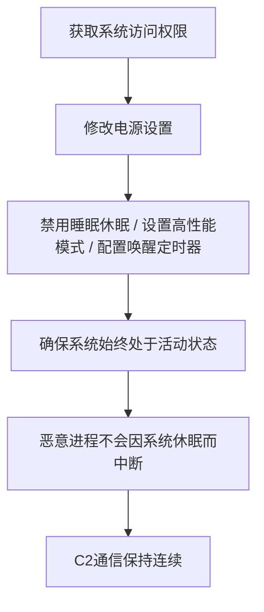

# 电源设置 (T1653)

## 一句话通俗理解

> 就像小偷把你家的"自动关灯"功能关掉了——确保你家灯一直亮着，这样他就能在黑暗中自由活动，而你以为灯坏了。

## 难度等级

⭐ 简单（需要用户级或管理员权限）

## 技术描述

攻击者可能滥用操作系统的电源设置和电源管理功能来维持持久性。电源管理控制系统何时进入低功耗状态（睡眠、休眠）、何时唤醒以及唤醒时发生什么操作。通过操纵这些设置，攻击者可以防止系统进入睡眠（确保恶意进程继续运行）或配置唤醒定时器和开机事件来触发恶意代码执行。

在Windows上，电源方案通过`powercfg.exe`命令行工具和PowerShell cmdlet（如`Set-PowerPlan`和`Set-PowerSetting`）定义。移动操作系统（Android、iOS及其企业管理变体）有额外的电源管理API，应用程序可以使用这些API请求设备保持唤醒状态以进行后台处理。

该技术经常被防御者忽视，因为电源设置很少出于安全目的进行审计。电源设置的更改可能被归因于用户偏好更改或IT维护活动。

## 子技术列表

该技术无子技术。

## 攻击流程



```
1. 获取系统访问权限
    ↓
2. 修改电源设置：
   - 禁用睡眠/休眠
   - 设置高性能模式
   - 配置唤醒定时器
    ↓
3. 确保系统始终处于活动状态
    ↓
4. 恶意进程不会因系统休眠而中断
    ↓
5. C2通信保持连续
```

## 真实案例

### 案例1：AdLoad恶意软件修改macOS电源设置
- **时间**: 2020年
- **目标**: macOS用户
- **手法**: AdLoad广告软件通过修改macOS系统的电源管理设置来防止系统进入休眠状态。攻击者使用`pmset`命令禁用睡眠模式，确保恶意广告软件持续运行。
- **链接**: https://attack.mitre.org/software/S0593/

### 案例2：XCSSET macOS恶意软件利用电源管理
- **时间**: 2020年
- **目标**: macOS开发者
- **手法**: XCSSET恶意软件修改了系统的电源设置以防止计算机进入休眠状态，使用`pmset`命令禁用休眠，同时通过`caffeinate`命令保持系统处于活跃状态。
- **链接**: https://attack.mitre.org/software/S0523/

### 案例3：加密货币挖矿恶意软件修改电源设置
- **时间**: 2018-2023年
- **目标**: 全球范围内的个人计算机和企业服务器
- **手法**: 多种加密货币挖矿恶意软件家族使用`powercfg`命令禁用待机和休眠，将电源计划设置为高性能模式以确保CPU以最高频率运行。
- **链接**: https://attack.mitre.org/techniques/T1653/

### 案例4：Volt Typhoon利用电源设置
- **时间**: 2023-2024年
- **目标**: 美国关键基础设施
- **手法**: Volt Typhoon修改受感染系统的电源设置，确保系统始终处于活动状态以维持C2通信和数据外传。
- **链接**: https://www.cisa.gov/news-events/cybersecurity-advisories/aa24-038a

## 红队视角

> ⚠️ **免责声明**：以下内容仅用于合法的安全测试、渗透测试和教育目的。未经授权对他人系统进行测试是违法行为。

**攻击优势**：
- 电源设置很少被安全监控
- 确保恶意进程不被系统休眠中断
- 可以配置唤醒定时器在特定时间执行恶意代码

**常用命令**：
```cmd
REM Windows - 禁用睡眠
powercfg /change standby-timeout-ac 0
powercfg /change standby-timeout-dc 0
powercfg /change hibernate-timeout-ac 0

REM macOS - 禁用休眠
sudo pmset -a sleep 0
sudo pmset -a hibernatemode 0

REM Linux - 使用systemd
sudo systemctl mask sleep.target suspend.target hibernate.target hybrid-sleep.target
```

**实战技巧**：
- 使用组策略批量部署电源设置修改
- 配合T1053（计划任务）使用唤醒定时器
- 在服务器环境中修改BIOS电源管理设置

## 蓝队视角

**防御重点**：
- 监控电源设置的异常修改
- 审计powercfg和pmset命令的使用
- 使用组策略强制电源管理标准

**常见盲点**：
- 认为电源设置是"用户偏好"而忽略监控
- 未审计macOS的pmset命令使用
- 缺乏对唤醒定时器的监控

## 检测建议

### 网络层检测

**检测方法：** 电源设置修改本身不产生直接网络流量，但可监控修改电源设置后持续运行的后门进程的网络活动。

**具体规则/命令示例：**
```bash
# Suricata规则检测电源设置修改后的持续C2通信
alert tcp $HOME_NET any -> $EXTERNAL_NET any (msg:"Persistent C2 After Power Config Change"; flow:to_server,established; detection_filter:track by_src, count 24, seconds 86400; sid:1000220; rev:1;)
```

### 主机层检测

**检测方法：** 监控powercfg.exe、pmset等电源管理工具的异常使用，以及电源计划注册表的修改。

**Windows事件ID：**
- Sysmon事件ID 1：进程创建（监控powercfg.exe的执行）
- 事件ID 4657：注册表值修改（监控电源策略键值变更）
- 事件ID 4688：进程创建

**Linux日志：**
- 日志文件：`/var/log/messages` 或 `journalctl`
- 关键字段：systemctl mask/umask sleep.target（禁用休眠）
- 关键字段：pmset命令执行日志（macOS）

**具体命令示例：**
```bash
# 查看当前电源方案
powercfg /query

# 查看唤醒定时器
powercfg /waketimers

# macOS查看电源设置
pmset -g

# 检查电源策略注册表
reg query "HKLM\Software\Microsoft\Windows\CurrentVersion\Power"

# Linux检查休眠设置
systemctl status sleep.target
```

### 应用层检测

**Sigma规则示例：**
```yaml
title: 电源配置修改检测
status: experimental
description: 检测使用powercfg.exe修改电源设置的行为
logsource:
    category: process_creation
    product: windows
detection:
    selection:
        Image|endswith: '\powercfg.exe'
        CommandLine|contains: '/change'
    condition: selection
level: low
tags:
    - attack.t1653
```

## 缓解措施

### 优先级1：关键措施

**措施名称：** 电源管理权限控制

**具体实施步骤：**
1. 限制powercfg.exe和电源管理PowerShell cmdlet的使用权限，仅允许管理员执行
2. 通过组策略强制执行企业电源管理标准，防止非授权修改
3. 在macOS上限制pmset命令的root权限使用，仅在需要时授权
4. 在Linux上使用安全策略阻止非root用户修改systemd电源管理目标

### 优先级2：重要措施

**措施名称：** 电源设置审计与监控

**具体实施步骤：**
1. 配置进程审计规则监控powercfg.exe、pmset、systemctl等电源管理命令的执行
2. 实施端点检测规则（EDR）监控电源配置的异常更改，与用户工作模式基线比对
3. 定期审计系统电源设置，使用组策略评估工具检查偏移
4. 监控唤醒定时器的注册（powercfg /waketimers），确认合法来源

**配置示例：**
```bash
# 通过组策略强制执行电源方案
# 计算机配置 -> Windows设置 -> 安全模板 -> 系统服务 -> 电源

# 使用auditd监控powercfg
auditctl -w /usr/bin/powercfg -p x -k power_changes

# 定期记录电源设置基线
powercfg /query > power_baseline_$(Get-Date -Format yyyyMMdd).txt
```

## 动手实验

> ⚠️ **重要提示**：所有实验必须在隔离的实验室环境中进行，禁止对未授权的真实系统进行测试。

### 实验1：Windows电源设置修改
```cmd
REM 查看当前电源设置
powercfg /list
powercfg /query

REM 禁用睡眠（需要管理员权限）
powercfg /change standby-timeout-ac 0
powercfg /change standby-timeout-dc 0

REM 设置唤醒定时器
powercfg /setacvalueindex SCHEME_CURRENT SUB_SLEEP RTCWAKE 1
powercfg /setactive SCHEME_CURRENT

REM 清理 - 恢复默认
powercfg /restoredefaultschemes
```

### 实验2：macOS电源设置
```bash
# 查看当前设置
pmset -g

# 禁用睡眠（需要root权限）
sudo pmset -a sleep 0
sudo pmset -a hibernatemode 0

# 使用caffeinate保持唤醒
caffeinate -i &

# 清理
sudo pmset -a sleep 10
sudo pmset -a hibernatemode 3
```

### 实验3：使用Atomic Red Team测试
```powershell
# 执行T1653测试
Invoke-AtomicTest T1653
```

## 术语解释

| 术语 | 英文原名 | 通俗解释 |
|------|----------|----------|
| 电源方案 | Power Plan | Windows中定义电源行为的配置集合 |
| 唤醒定时器 | Wake Timer | 在特定时间唤醒系统的机制 |
| sleep | Sleep | 系统低功耗状态，RAM保持供电 |
| hibernate | Hibernate | 将RAM内容写入磁盘后完全断电 |
| pmset | pmset | macOS电源管理命令行工具 |
| caffeinate | caffeinate | macOS防止系统睡眠的命令 |

## 参考资料

- [MITRE ATT&CK T1653 电源设置](https://attack.mitre.org/techniques/T1653/)
- [Windows Powercfg命令行工具](https://docs.microsoft.com/en-us/windows-hardware/design/device-experiences/powercfg-command-line-options)
- [macOS pmset命令参考](https://support.apple.com/guide/terminal/change-power-settings-aprl1d0d74a/mac)
- [Volt Typhoon Advisory - CISA](https://www.cisa.gov/news-events/cybersecurity-advisories/aa24-038a)
- [Atomic Red Team - T1653](https://github.com/redcanaryco/atomic-red-team/tree/master/atomics/T1653)
