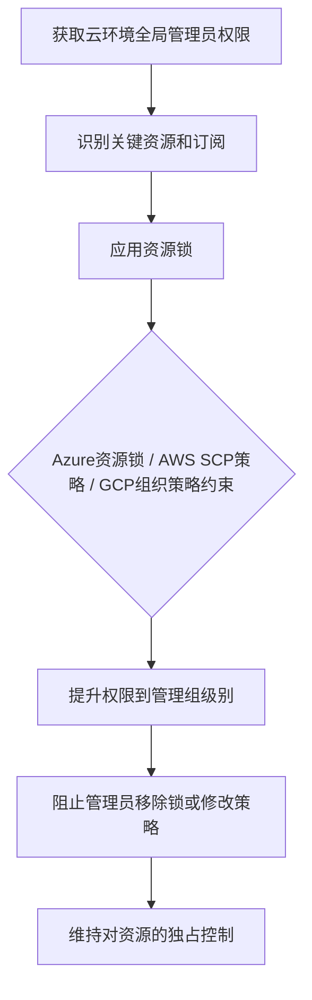

# 独占控制 (T1668)

## 一句话通俗理解

> 就像小偷不仅住了你的房子，还换了锁、改了门禁密码，甚至在物业系统里把自己登记成了"唯一业主"——让你这个真正的主人连自己的房子都进不去。

## 难度等级

⭐⭐⭐ 较高（需要云环境全局管理员权限）

## 技术描述

攻击者可能锁定云资源或修改其访问策略，以防止合法管理员撤销或更改其访问权限。在云环境中，资源所有权、管理角色和委派层次结构可以被利用来创建一种情况，即攻击者的访问权限无法通过正常的管理程序轻松移除。通过在订阅、资源组或资源级别应用锁，攻击者可以阻止将驱逐他们的管理操作。

云服务提供商提供资源锁机制以防止关键资源的意外删除或修改。在Azure中，资源锁（CanNotDelete、ReadOnly）可以应用于订阅、资源组或单个资源级别。AWS通过IAM策略、S3存储桶策略和服务控制策略（SCP）提供类似功能。当攻击者获得足够的权限时，他们可以将这些保护机制应用于被入侵的资源，有效地将防御者锁定在自己的环境之外。

该技术代表了从简单持久化到主动拒绝管理控制的升级。面对独占控制的防御者可能需要联系云提供商支持以进行紧急破解程序，这可能既耗时又具有破坏性。

## 子技术列表

该技术无子技术。

## 攻击流程



```
1. 获取云环境全局管理员权限
    ↓
2. 识别关键资源和订阅
    ↓
3. 应用资源锁：
   - Azure：CanNotDelete、ReadOnly锁
   - AWS：SCP策略拒绝IAM操作
   - GCP：组织策略约束
    ↓
4. 提升权限到管理组级别
    ↓
5. 阻止管理员移除锁或修改策略
    ↓
6. 维持对资源的独占控制
```

## 真实案例

### 案例1：Azure环境的独占控制攻击
- **时间**: 2022年
- **目标**: 使用Azure的企业组织
- **手法**: 攻击者获取Azure AD全局管理员权限后，在关键订阅和资源组上应用CanNotDelete和ReadOnly资源锁，阻止安全团队删除或修改攻击者部署的恶意资源。
- **链接**: https://attack.mitre.org/techniques/T1668/

### 案例2：AWS SCP滥用实施持久控制
- **时间**: 2021年
- **目标**: AWS多云环境
- **手法**: 攻击者获取AWS Organizations管理账户权限后，创建恶意的Service Control Policies（SCPs）来阻止安全团队执行特定的IAM操作，如`iam:DeleteUser`、`iam:DeleteAccessKey`等。
- **链接**: https://attack.mitre.org/techniques/T1668/

### 案例3：LAPSUS$利用云资源锁定
- **时间**: 2022年
- **目标**: 科技公司
- **手法**: LAPSUS$在入侵云环境后，应用资源锁和策略来阻止受害者恢复访问，同时部署加密货币挖矿资源。
- **链接**: https://www.microsoft.com/en-us/security/blog/2022/03/22/dev-0537-criminal-actor-targeting-organizations-for-data-exfiltration-and-destruction/

### 案例4：利用管理组层次结构锁定订阅
- **时间**: 2023年
- **目标**: 使用Azure的大型企业
- **手法**: 攻击者创建新的管理组并将目标订阅移入，然后在管理组级别应用拒绝策略，阻止所有非攻击者控制的身份对订阅执行写入操作。
- **链接**: https://attack.mitre.org/techniques/T1668/

## 红队视角

> ⚠️ **免责声明**：以下内容仅用于合法的安全测试、渗透测试和教育目的。未经授权对他人系统进行测试是违法行为。

**攻击优势**：
- 阻止防御者移除恶意资源
- 增加事件响应的难度和时间
- 可以在锁定状态下继续数据外传

**常用命令**：
```powershell
# Azure - 创建资源锁
New-AzResourceLock -LockLevel CanNotDelete -LockName "ProtectionLock" -ResourceGroupName "TargetRG" -Force

# Azure - 创建管理组
New-AzManagementGroup -GroupName "MaliciousGroup"
New-AzManagementGroupSubscription -GroupName "MaliciousGroup" -SubscriptionId <subscription-id>

# AWS - 创建SCP
aws organizations create-policy --name "DenyIAMChanges" --type SERVICE_CONTROL_POLICY --content file://scp.json
```

**实战技巧**：
- 先在资源级别应用锁，再提升到管理组级别
- 使用多个锁嵌套增加移除难度
- 配合T1098（账户操纵）使用，添加多个管理员账户

## 蓝队视角

**防御重点**：
- 监控资源锁和策略的创建
- 审计管理组的变更
- 建立break-glass紧急账户

**常见盲点**：
- 只监控资源级别，忽略管理组级别的锁
- 未建立紧急访问程序
- 缺乏对SCP和组织策略的审计

## 检测建议

### 网络层检测

**检测方法：** 监控云管理API的访问流量，检测异常的锁创建和策略修改操作。

**具体规则/命令示例：**
```bash
# Suricata规则检测Azure Management API操作
alert tcp $HOME_NET any -> $EXTERNAL_NET 443 (msg:"Azure Resource Lock Created"; content:"management.azure.com"; http_host; content:"/providers/Microsoft.Authorization/locks"; http_uri; sid:1000221; rev:1;)
```

### 主机层检测

**检测方法：** 监控云平台审计日志中的资源锁创建、SCP修改和管理组变更事件。

**Windows事件ID：**
- Windows本地事件不直接适用于云环境，但Azure AD审计日志可通过PowerShell获取
- Azure Activity Log或AWS CloudTrail作为主要检测源

**Linux日志：**
- AWS CLI审计日志：CloudTrail日志中的CreatePolicy、AttachPolicy事件
- Azure审计日志：Activity Log中的Microsoft.Authorization/locks/write操作
- GCP日志：Cloud Audit Logs中的SetIamPolicy事件

**具体命令示例：**
```bash
# Azure - 列出所有资源锁
Get-AzResourceLock | Select-Object LockName, LockLevel, ResourceGroupName

# AWS - 列出所有SCP
aws organizations list-policies --filter SERVICE_CONTROL_POLICY

# Azure - 检查管理组结构
Get-AzManagementGroup | Select-Object Name, DisplayName

# AWS - 检查IAM策略变更
aws cloudtrail lookup-events --lookup-attributes AttributeKey=EventName,AttributeValue=CreatePolicy
```

### 应用层检测

**Sigma规则示例：**
```yaml
title: Azure资源锁创建检测
status: experimental
description: 检测Azure订阅中资源锁的创建
logsource:
    service: activity_log
    product: azure
detection:
    selection:
        operationName: 'Microsoft.Authorization/locks/write'
    condition: selection
level: high
tags:
    - attack.t1668
```

## 缓解措施

### 优先级1：关键措施

**措施名称：** 云资源锁权限控制

**具体实施步骤：**
1. 实施管理组和管理订阅的严格访问控制，限制谁有权限创建和删除资源锁
2. 使用特权身份管理（PIM）和即时（JIT）访问，按需授予云管理权限
3. 建立break-glass紧急管理账户，确保在锁定情况下仍有恢复途径
4. 对所有云管理操作强制MFA（多因素认证）

### 优先级2：重要措施

**措施名称：** 云策略变更监控

**具体实施步骤：**
1. 配置Azure Activity Log和AWS CloudTrail审计日志，对所有资源锁、SCP和组织策略变更实施实时告警
2. 定期审查和验证所有订阅上的资源锁和策略，确认其来源的合法性
3. 与云提供商建立紧急支持联系流程，确保在锁定事件发生时能快速恢复
4. 实施最小权限原则，限制对订阅或资源组的权限提升操作

**配置示例：**
```bash
# Azure诊断设置 - 将Activity Log流式传输到Log Analytics
Set-AzDiagnosticSetting -ResourceId $subscriptionId -Enabled $true -Category Administrative -ResourceGroupName "myRG"

# Azure Policy - 限制资源锁的创建
$policy = @"
{
    "if": {
        "field": "type",
        "equals": "Microsoft.Authorization/locks"
    },
    "then": {
        "effect": "deny"
    }
}
"@

# AWS - 配置SCP审计
aws cloudtrail create-trail --name scp-audit-trail --s3-bucket-name my-audit-bucket
```

## 动手实验

> ⚠️ **重要提示**：所有实验必须在隔离的实验室环境中进行，禁止对未授权的真实系统进行测试。

### 实验1：Azure资源锁
```powershell
# 连接Azure
Connect-AzAccount

# 创建资源锁
New-AzResourceLock -LockLevel CanNotDelete -LockName "TestLock" -ResourceGroupName "TestRG" -Force

# 查看锁
Get-AzResourceLock -ResourceGroupName "TestRG"

# 清理
Remove-AzResourceLock -LockName "TestLock" -ResourceGroupName "TestRG" -Force
```

### 实验2：AWS SCP策略
```json
{
  "Version": "2012-10-17",
  "Statement": [
    {
      "Effect": "Deny",
      "Action": [
        "iam:DeleteUser",
        "iam:DeleteAccessKey",
        "iam:DetachUserPolicy"
      ],
      "Resource": "*"
    }
  ]
}
```

### 实验3：使用Atomic Red Team测试
```powershell
# 执行T1668测试
Invoke-AtomicTest T1668
```

## 术语解释

| 术语 | 英文原名 | 通俗解释 |
|------|----------|----------|
| 资源锁 | Resource Lock | Azure中防止资源被删除或修改的机制 |
| SCP | Service Control Policy | AWS服务控制策略，在组织层面控制权限的策略 |
| 管理组 | Management Group | Azure中用于组织订阅的层次结构 |
| PIM | Privileged Identity Management | 特权身份管理，Azure中的权限管理服务 |
| JIT | Just-In-Time | 即时访问，按需临时授予权限 |
| break-glass | Break-Glass | 紧急访问程序，用于在紧急情况下恢复访问 |

## 参考资料

- [MITRE ATT&CK T1668 独占控制](https://attack.mitre.org/techniques/T1668/)
- [Azure资源锁文档](https://docs.microsoft.com/en-us/azure/azure-resource-manager/management/lock-resources)
- [AWS服务控制策略](https://docs.aws.amazon.com/organizations/latest/userguide/orgs_manage_policies_scps.html)
- [LAPSUS$活动分析 - Microsoft](https://www.microsoft.com/en-us/security/blog/2022/03/22/dev-0537-criminal-actor-targeting-organizations-for-data-exfiltration-and-destruction/)
- [Atomic Red Team - T1668](https://github.com/redcanaryco/atomic-red-team/tree/master/atomics/T1668)
