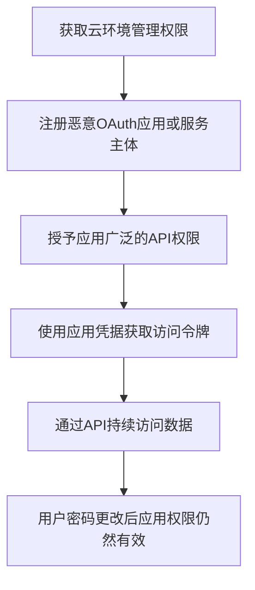

# 云应用集成 (T1671)

## 一句话通俗理解

> 就像在你的云平台上安装了一个"合法"的间谍应用——它有正式的API权限，可以随时读取你的邮件、文件和数据，即使你改了密码也无法阻止它。

## 难度等级

⭐⭐⭐ 较高（需要云环境管理权限）

## 技术描述

攻击者可能滥用云应用集成和第三方连接来在云环境中建立持久性。现代云平台和SaaS应用提供广泛的集成能力，允许外部应用通过API、webhook、OAuth令牌和服务主体来访问数据和功能。通过创建或入侵这些集成，攻击者可以维持对云数据和服务的持久访问，即使用户账户已被保护。

该技术利用了云应用与第三方服务之间的信任关系。当用户授予OAuth应用访问其云资源（如邮件、文件或日历数据）的权限时，该应用会收到一个令牌，该令牌可以独立于用户的身份验证状态来访问这些资源。这些令牌通常具有较长的生命周期并且可以刷新，提供了能够经受密码更改和MFA重新注册的持久访问。

## 子技术列表

该技术无子技术。

## 攻击流程



```
1. 获取云环境管理权限（通过凭据窃取、漏洞利用等）
    ↓
2. 注册恶意OAuth应用或服务主体
    ↓
3. 授予应用广泛的API权限（如Mail.ReadWrite、Files.ReadWrite.All）
    ↓
4. 使用应用凭据（客户端密钥/证书）获取访问令牌
    ↓
5. 通过Microsoft Graph API等持续访问数据
    ↓
6. 即使用户密码被更改，应用权限仍然有效
```

## 真实案例

### 案例1：APT29利用OAuth应用持续访问Microsoft 365
- **时间**: 2020-2021年
- **目标**: 美国联邦政府机构、科技公司和智库
- **手法**: APT29在SolarWinds供应链攻击中创建了恶意的OAuth应用注册（服务主体）来维持对受害者Microsoft 365环境的持久访问。攻击者注册了恶意应用程序并授予了广泛的数据访问权限（如Mail.Read、Mail.Send、Files.ReadWrite.All），即使初始用户凭据被吊销，这些OAuth应用仍然保持访问。
- **链接**: https://attack.mitre.org/techniques/T1671/

### 案例2：Midnight Blizzard Teams钓鱼攻击中的集成滥用
- **时间**: 2022年
- **目标**: 欧洲和北美外交机构、研发组织
- **手法**: APT29通过Microsoft Teams实施社会工程学攻击，利用受感染租户的合法Teams集成向目标发送恶意邀请，建立新的OAuth应用集成以确保持久访问。
- **链接**: https://www.microsoft.com/en-us/security/blog/2022/10/18/midnight-blizzard-conducts-targeted-social-engineering-over-teams/

### 案例3：Scattered Spider利用SaaS集成
- **时间**: 2023年
- **目标**: MGM Resorts、Caesars Entertainment等大型企业
- **手法**: Scattered Spider创建恶意的OAuth应用注册，使用客户端凭证认证流程，不依赖任何具体用户账户，即使初始账户被禁用仍能保持访问。攻击者还配置了webhook转发规则将安全日志重定向到攻击者控制的服务器。
- **链接**: https://www.crowdstrike.com/blog/scattered-spider-delivers-ransomware-at-warp-speed/

### 案例4：Storm-0558利用Microsoft账户签名密钥
- **时间**: 2023年5月-7月
- **目标**: 美国政府机构和企业
- **手法**: 攻击者获取了Microsoft账户消费者签名密钥，使用该密钥伪造Azure AD令牌，访问了Exchange Online邮箱。这种利用云身份联邦信任的攻击展示了云应用集成的潜在风险。
- **链接**: https://www.microsoft.com/en-us/security/blog/2023/07/14/analysis-of-storm-0558-techniques-for-unauthorized-email-access/

## 红队视角

> ⚠️ **免责声明**：以下内容仅用于合法的安全测试、渗透测试和教育目的。未经授权对他人系统进行测试是违法行为。

**攻击优势**：
- OAuth应用权限独立于用户凭据，密码更改无效
- 应用层访问难以与正常API调用区分
- 可以配置webhook实现实时数据外传

**常用命令**：
```powershell
# Azure AD - 注册恶意应用
Import-Module AzureAD
Connect-AzureAD
$app = New-AzureADApplication -DisplayName "Legit App" -ReplyUrls "https://attacker.com/callback"
$secret = New-AzureADApplicationPasswordCredential -ObjectId $app.ObjectId

# 授予高权限
Add-AzureADServicePrincipalAppRoleAssignment -ObjectId $sp.ObjectId -PrincipalId $sp.ObjectId -ResourceId $graph.ObjectId -Id $permissionId
```

**实战技巧**：
- 使用看似合法的应用名称
- 请求最小必要权限以减少告警
- 使用客户端证书而非密钥（更难被检测）

## 蓝队视角

**防御重点**：
- 监控OAuth应用注册和权限授予
- 审计高权限应用的API调用
- 实施应用同意策略

**常见盲点**：
- 只监控用户活动，忽略应用级访问
- 未审计webhook订阅
- 缺乏对刷新令牌使用的监控

## 检测建议

### 网络层检测

**检测方法：** 监控OAuth令牌使用和Microsoft Graph API的异常访问流量。

**具体规则/命令示例：**
```bash
# Suricata规则检测OAuth令牌滥用
alert tcp $HOME_NET any -> $EXTERNAL_NET 443 (msg:"OAuth Token Usage - Unusual Resource Access"; content:"graph.microsoft.com"; http_host; content:"/v1.0/users"; http_uri; content:"Authorization|3a 20|Bearer"; http_header; sid:1000222; rev:1;)
```

### 主机层检测

**检测方法：** 监控Azure AD审计日志中的OAuth应用注册、服务主体创建和API权限授予事件。

**Windows事件ID：**
- Azure AD审计日志（非Windows本地事件）：
  - `Add service principal`：新服务主体创建
  - `Add OAuth2PermissionGrant`：OAuth权限授予
  - `Consent to application`：用户同意应用权限
  - `Add application`：新应用注册

**Linux日志：**
- 云应用集成主要涉及SaaS和云API访问，本地系统日志有限

**具体命令示例：**
```bash
# Azure AD - 列出所有应用程序注册
Get-AzureADApplication | Select-Object DisplayName, AppId, PublisherDomain

# 列出所有服务主体
Get-AzureADServicePrincipal | Select-Object DisplayName, AppId

# 列出高权限OAuth授权
Get-AzureADOAuth2PermissionGrant | Where-Object { $_.Scope -match "Mail.Read|Files.ReadWrite|Directory.ReadWrite" }

# 检查应用程序的API权限
Get-AzureADServicePrincipal -ObjectId $sp.ObjectId | Select -ExpandProperty Oauth2Permissions
```

### 应用层检测

**Sigma规则示例：**
```yaml
title: Azure AD OAuth应用注册检测
status: experimental
description: 检测Azure AD中新的OAuth应用注册
logsource:
    service: audit_log
    product: azure
detection:
    selection:
        operationName: 'Add service principal'
    condition: selection
level: high
tags:
    - attack.t1671
```

## 缓解措施

### 优先级1：关键措施

**措施名称：** OAuth应用同意策略管控

**具体实施步骤：**
1. 实施OAuth应用程序同意策略，限制用户可同意的应用权限级别（如仅允许管理员同意）
2. 禁用用户自助服务应用注册，所有应用注册需经过审批流程
3. 使用条件访问策略限制应用程序的访问范围（如仅限特定IP范围或合规设备）
4. 定期审计Azure AD中的应用程序注册和服务主体，清理不再需要的应用

### 优先级2：重要措施

**措施名称：** 应用权限审计与监控

**具体实施步骤：**
1. 监控Azure AD审计日志中的`Add service principal`和`Consent to application`事件
2. 审计授予Microsoft Graph API权限的应用，特别关注高权限范围（如Mail.ReadWrite、Files.ReadWrite.All、Directory.ReadWrite.All）
3. 使用Microsoft Defender for Cloud Apps检测异常的OAuth行为（如不寻常的令牌刷新模式）
4. 监控webhook订阅注册和异常刷新令牌使用，检测数据外传行为

**配置示例：**
```bash
# 通过Azure AD PowerShell禁用用户应用注册
Set-MsolCompanySettings -UsersPermissionToCreateAppsEnabled $false

# 配置应用同意策略（通过Azure AD管理门户）
# Azure AD -> 企业应用程序 -> 安全性 -> 同意和权限 -> 用户同意设置
# 选择"禁止用户同意"

# 使用Microsoft Graph API审计高权限应用
# GET https://graph.microsoft.com/v1.0/servicePrincipals?$filter=appRoles/any()
```

## 动手实验

> ⚠️ **重要提示**：所有实验必须在隔离的实验室环境中进行，禁止对未授权的真实系统进行测试。

### 实验1：注册Azure AD应用
```powershell
# 连接Azure AD
Connect-AzureAD

# 创建应用注册
$app = New-AzureADApplication -DisplayName "TestApp" -AvailableToOtherTenants $false

# 创建服务主体
New-AzureADServicePrincipal -AppId $app.AppId

# 创建客户端密钥
$secret = New-AzureADApplicationPasswordCredential -ObjectId $app.ObjectId

# 查看应用信息
Get-AzureADApplication -ObjectId $app.ObjectId
```

### 实验2：使用Atomic Red Team测试
```powershell
# 执行T1671测试
Invoke-AtomicTest T1671
```

## 术语解释

| 术语 | 英文原名 | 通俗解释 |
|------|----------|----------|
| OAuth | OAuth | 开放授权协议，允许第三方应用访问用户资源 |
| 服务主体 | Service Principal | Azure AD中代表应用程序的身份，就像应用的"用户账户" |
| Microsoft Graph | Microsoft Graph | Microsoft 365的统一API端点 |
| webhook | Webhook | 当特定事件发生时向URL发送HTTP通知的机制 |
| B2B协作 | B2B Collaboration | Azure AD的跨租户协作功能 |
| 客户端凭证 | Client Credentials | 应用程序用于认证自身的密钥或证书 |

## 参考资料

- [MITRE ATT&CK T1671 云应用集成](https://attack.mitre.org/techniques/T1671/)
- [OAuth应用同意框架 - Microsoft](https://docs.microsoft.com/en-us/azure/active-directory/develop/consent-framework)
- [Storm-0558分析 - Microsoft](https://www.microsoft.com/en-us/security/blog/2023/07/14/analysis-of-storm-0558-techniques-for-unauthorized-email-access/)
- [Midnight Blizzard Teams钓鱼 - Microsoft](https://www.microsoft.com/en-us/security/blog/2022/10/18/midnight-blizzard-conducts-targeted-social-engineering-over-teams/)
- [Atomic Red Team - T1671](https://github.com/redcanaryco/atomic-red-team/tree/master/atomics/T1671)
