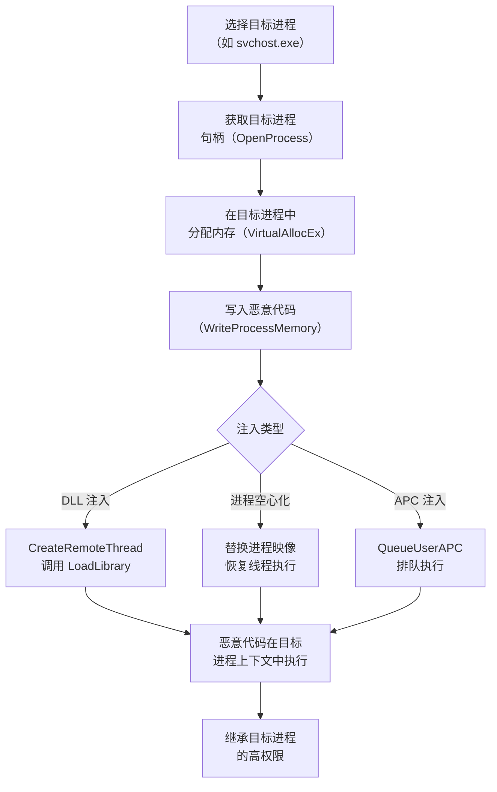

# 进程注入 (T1055)

## 一句话通俗理解

就像把恶意代码"寄生"在合法的高权限程序里——攻击者把自己的代码塞进系统进程（如 svchost.exe），让它借用系统进程的权限偷偷运行。

## 难度等级

⭐⭐⭐ **高级** - 需要深入理解操作系统进程机制和内存管理，是最复杂的提权技术之一。

## 技术描述

进程注入是一种将恶意代码注入到合法进程中执行的技术。系统里有很多"大人物"进程（如 svchost.exe、lsass.exe），它们拥有很高的权限。攻击者把自己的恶意代码"塞"进这些进程里，恶意代码就继承了这些进程的高权限，同时因为运行在合法进程内部，安全软件很难发现。

**通俗解释：**
就像犯罪分子把自己的同伙伪装成政府官员的随行人员。检查站看到"官员"就直接放行了，不会仔细检查随行人员是否真的是官员的团队。恶意代码在系统进程的内部运行，安全软件看到的是"svchost.exe"这个合法进程在活动，不会深究它里面是否藏了恶意代码。

**技术原理：**

1. **打开目标进程**：使用 OpenProcess 获取目标进程（如 explorer.exe、svchost.exe）的句柄
2. **分配内存**：在目标进程的地址空间中通过 VirtualAllocEx 分配内存空间
3. **写入代码**：使用 WriteProcessMemory 将恶意代码写入分配的内存
4. **执行代码**：通过 CreateRemoteThread 创建远程线程来执行注入的代码

**用途与影响：**
进程注入是最隐蔽的提权技术之一。它不仅可以提升权限（注入到 SYSTEM 进程中），还可以绕过应用程序白名单、逃避安全软件的检测。被多个知名恶意软件家族（如 TrickBot、Cobalt Strike、Lazarus Group）广泛使用。

## 子技术列表

**该技术共有 14 个子技术：**

| 子技术ID | 中文名称 | 通俗解释 |
|----------|----------|----------|
| T1055.001 | DLL 注入 | 让系统进程加载恶意的动态链接库 |
| T1055.002 | PE 注入 | 直接把完整的恶意程序塞进目标进程内存 |
| T1055.003 | 线程执行劫持 | 劫持目标进程的线程，让它执行恶意代码 |
| T1055.004 | 异步过程调用 (APC) | 利用系统的"排队执行"机制注入代码 |
| T1055.005 | 线程本地存储 (TLS) | 利用线程存储回调机制执行恶意代码 |
| T1055.007 | Ptrace 系统调用 | Linux 上的进程调试接口，被滥用来注入代码 |
| T1055.008 | VDSO 劫持 | 覆盖 Linux 的虚拟动态共享对象 |
| T1055.009 | Proc 内存 | 通过 /proc 文件系统直接修改进程内存 |
| T1055.010 | 进程空心化 | 创建合法进程然后替换其内存内容 |
| T1055.011 | 额外窗口内存注入 | 利用 Windows 窗口机制存储恶意代码 |
| T1055.012 | 进程重影 | 利用 NTFS 事务功能创建"隐形"进程 |
| T1055.013 | ProcMem Linux | Linux 上通过 /proc/mem 注入代码 |
| T1055.014 | VDSO Linux | 覆盖 Linux VDSO 页面执行恶意代码 |

<details>
<summary><strong>展开查看各子技术详细说明</strong></summary>

### T1055.001 - DLL 注入

**通俗理解：** 让系统进程加载一个恶意的 DLL 文件。

**详细说明：** DLL 注入是最经典的进程注入方式。攻击者使用 `CreateRemoteThread` 在目标进程中调用 `LoadLibrary` 来加载恶意 DLL。这种方法实现简单，但会触发 `LoadLibrary` 的 `DLL_PROCESS_ATTACH` 通知，容易被安全软件 Hook 检测。

### T1055.004 - 异步过程调用 (APC)

**通俗理解：** 把恶意代码"排队"到目标进程的执行队列中，等它有空时自动执行。

**详细说明：** APC 注入利用 Windows 的异步过程调用机制。每个线程都有一个 APC 队列，通过 `QueueUserAPC` 可以将恶意代码排队到目标线程的 APC 队列中。当目标线程进入可报警等待状态时，系统会执行队列中的 APC 例程。

### T1055.010 - 进程空心化

**通俗理解：** 创建一个合法的空壳程序（如 svchost.exe），然后把它的内部替换成恶意代码。

**详细说明：** 进程空心化是最隐蔽的注入技术之一。攻击者创建一个挂起状态的合法进程，卸载其原始映像，写入恶意代码，然后恢复执行。从外部看，运行的是一个合法的系统进程，但实际执行的是恶意代码。

</details>

## 攻击流程



### DLL 注入流程

```
1. 选择目标进程（如 explorer.exe）
   ↓
2. 使用 OpenProcess 打开目标进程
   ↓
3. 使用 VirtualAllocEx 在目标进程中分配内存
   ↓
4. 使用 WriteProcessMemory 写入 DLL 路径
   ↓
5. 使用 CreateRemoteThread 调用 LoadLibrary 加载 DLL
   ↓
6. 恶意 DLL 在目标进程的上下文中执行
```

### 进程空心化流程

```
1. 创建挂起状态的合法进程（如 svchost.exe）
   ↓
2. 使用 NtUnmapViewOfSection 卸载原始映像
   ↓
3. 使用 VirtualAllocEx 分配新内存
   ↓
4. 使用 WriteProcessMemory 写入恶意代码
   ↓
5. 修改线程上下文指向新代码入口点
   ↓
6. 恢复线程执行，恶意代码在合法进程名下运行
```

## 真实案例

### 案例1：Lazarus Group 使用多种进程注入技术

- **时间**: 2020-2023年
- **目标**: 加密货币交易所、国防工业
- **攻击组织**: Lazarus Group
- **手法**: Lazarus Group 广泛使用 DLL 注入、进程空心化和 APC 注入。在 Operation DreamJob 攻击中，他们使用进程空心化将恶意负载注入合法的 Windows 进程（如 svchost.exe）中。攻击者通过伪装成招聘信息的社会工程攻击获得初始访问，然后使用注入的恶意代码窃取加密货币资产。
- **影响**: 窃取价值数亿美元的加密货币
- **参考链接**: [CISA - Lazarus Group Analysis](https://www.cisa.gov/news-events/analysis-reports/ar21-126s)

### 案例2：Cobalt Strike 的进程注入功能

- **时间**: 持续活跃
- **目标**: 广泛目标
- **攻击组织**: 多个 APT 组织
- **手法**: Cobalt Strike 的 Beacon 负载使用 DLL 注入、PE 注入和进程空心化技术。经典模式是创建被挂起的 rundll32.exe 进程，将 Beacon DLL 注入其中然后恢复执行。被 Ryuk、Conti、Darkside 等多个勒索软件组织广泛使用。
- **影响**: 被多个顶级勒索软件组织使用，造成数十亿美元损失
- **参考链接**: [Cobalt Strike Blog](https://www.cobaltstrike.com/blog/)

### 案例3：2024-2025年新型进程注入技术演进

- **时间**: 2024-2025年
- **目标**: 全球企业组织
- **手法**: 2024-2025年出现了多种新型进程注入技术：Early Bird Injection（在进程完全初始化前排队 APC）、Module Stomping（加载合法 DLL 后覆盖其内容）、Threadless Injection（不创建新线程的注入技术）、直接系统调用绕过 EDR 的用户态 API 钩子。这些新技术使传统的基于 API Hook 的检测方法失效。
- **影响**: 推动安全检测技术向行为分析和 AI 检测方向发展
- **参考链接**: [MITRE ATT&CK T1055](https://attack.mitre.org/techniques/T1055/)

### 案例4：TrickBot 使用 APC 注入

- **时间**: 2020年
- **目标**: 金融机构
- **攻击组织**: TrickBot
- **手法**: TrickBot 银行木马使用 APC 注入技术将恶意 DLL 注入到 svchost.exe 或 lsass.exe 进程中，通过将 APC 对象排队到目标线程来触发代码执行，绕过传统杀毒软件的扫描。
- **影响**: 全球金融机构大量客户数据被盗
- **参考链接**: [Microsoft - TrickBot Evolution](https://www.microsoft.com/en-us/security/blog/2020/10/15/trickbot-banking-malware-evolves-with-new-modules-and-techniques/)

## 红队视角

> ⚠️ **免责声明**：以下内容仅用于合法的安全测试、渗透测试和教育目的。未经授权对他人系统进行测试是违法行为。

### 实战技巧

1. **优先注入系统关键进程**
   svchost.exe、lsass.exe、explorer.exe 等系统进程是首选目标。它们以 SYSTEM 或高权限运行，且数量和种类众多，注入后不易被察觉。

2. **进程空心化比 DLL 注入更隐蔽**
   进程空心化不涉及 DLL 文件落地，不会触发 LoadLibrary 的加载通知，更难被传统杀毒软件检测。

3. **使用直接系统调用绕过 EDR**
   传统的 EDR 通过 Hook ntdll.dll 中的 API 函数来监控进程注入行为。使用直接系统调用（如 SysWhispers、Hell's Gate）可以绕过这些 Hook。

4. **避免创建新线程**
   Threadless Injection 等技术不创建新线程，因此不会触发 CreateRemoteThread 的检测规则。

### 常用工具

| 工具名称 | 用途 | 平台 | 链接 |
|----------|------|------|------|
| Cobalt Strike | 商业渗透测试工具，内置多种注入技术 | Windows | https://www.cobaltstrike.com |
| Metasploit | 开源漏洞利用框架，migrate 命令实现进程迁移 | 跨平台 | https://www.metasploit.com |
| SysWhispers | 直接系统调用生成工具，绕过 EDR Hook | Windows | [GitHub](https://github.com/jthuraisamy/SysWhispers) |
| Process Hacker | 进程管理和分析工具，查看进程令牌和句柄 | Windows | https://processhacker.sourceforge.io |

### 注意事项

- 进程注入在高版本 Windows（Win10+）上受到越来越多的保护限制
- 注入到关键系统进程（如 lsass.exe）可能导致系统不稳定或蓝屏
- 现代 EDR 解决方案对经典的 DLL 注入检测率很高，推荐使用进程空心化或直接系统调用
- 所有实验必须在隔离的实验室环境中进行

## 蓝队视角

### 检测要点

1. **异常跨进程 API 调用**
   - 日志来源：Sysmon、EDR 传感器
   - 关注字段：`CreateRemoteThread`、`OpenProcess`、`VirtualAllocEx`、`WriteProcessMemory` 调用序列
   - 异常特征：低权限进程打开高权限进程（如 SYSTEM 进程）并写入数据

2. **进程空心化检测**
   - 日志来源：Sysmon 事件 ID 25（ProcessTampering）
   - 关注字段：进程映像路径与内存内容不匹配
   - 异常特征：svchost.exe 等进程的内存映像被替换

3. **异常父子进程关系**
   - 日志来源：Windows 安全事件 ID 4688、Sysmon ID 1
   - 关注字段：父进程和子进程的路径、用户上下文
   - 异常特征：不常见的父子进程关系（如 Word 启动 cmd.exe）

### 监控建议

- 部署 EDR 解决方案监控跨进程活动，重点关注 `CreateRemoteThread` 和 `WriteProcessMemory` 的组合使用
- 启用 Sysmon 事件 ID 8（CreateRemoteThread）和 ID 25（ProcessTampering）
- 配置 Windows Defender ASR 规则阻止 Office 应用程序创建子进程
- 在 Linux 上监控 ptrace 系统调用和 `/proc/mem` 的异常访问

## 检测建议

### 网络层检测

**检测方法：** 监控从注入后进程（如 svchost.exe）发起的异常网络连接。

**具体规则/命令示例：**
```
# 检测 svchost.exe 发起的异常出站连接
alert tcp $HOME_NET any -> $EXTERNAL_NET !80,!443 (msg:"Svchost outbound to non-HTTP port - possible injection"; flow:to_server,established; sid:1000003; rev:1;)
```

### 主机层检测

**检测方法：** 监控进程注入相关的 API 调用和异常进程行为。

**Windows 事件ID：**
- 事件 ID 8 (Sysmon)：CreateRemoteThread 检测
- 事件 ID 10 (Sysmon)：进程跨访问
- 事件 ID 25 (Sysmon)：进程伪造检测

**Linux 日志：**
- 日志文件：通过 auditd 监控 ptrace 系统调用
- 关键字段：`syscall=ptrace`、`auid!=0`

**具体命令示例：**
```bash
# 监控 ptrace 系统调用
sudo auditctl -a always,exit -S ptrace -k ptrace_trace
```

### 应用层检测

**Sigma规则示例：**
```yaml
title: Suspicious CreateRemoteThread Detection
status: experimental
description: Detects suspicious remote thread creation in non-system processes
logsource:
    category: process_access
    product: windows
detection:
    selection:
        EventID: 8
        SourceImage|endswith: '\powershell.exe'
        TargetImage|endswith: '\svchost.exe'
    condition: selection
level: high
tags:
    - attack.t1055
```

## 缓解措施

### 优先级1：关键措施

**措施名称：** 启用 Windows Defender 攻击面减少（ASR）规则

**具体实施步骤：**
1. 启用 ASR 规则 "Block Office applications from creating child processes" (GUID: `D4F940AB-401B-4EFC-AADC-AD5F3C50688A`)
2. 启用 "Block Win32 API calls from Office macros" 规则
3. 测试并在生产环境中部署 ASR 规则

### 优先级2：重要措施

**措施名称：** 限制调试权限和进程访问

**具体实施步骤：**
1. 审查并限制具有 `SeDebugPrivilege` 的账户数量
2. 启用 Credential Guard 保护 lsass.exe 进程
3. 部署基于虚拟化的安全（VBS）和 HVCI 阻止内核级注入

### 优先级3：建议措施

**措施名称：** 部署行为监控和 EDR

**具体实施步骤：**
1. 部署 EDR 解决方案启用行为监控
2. 配置 Sysmon 详细记录进程创建和跨进程操作
3. 定期审计和测试检测规则的有效性

### MITRE ATT&CK 缓解措施映射

| 缓解措施ID | 缓解措施名称 | 适用性 | 说明 |
|------------|-------------|--------|------|
| M1040 | Behavior Prevention on Endpoint | 适用 | EDR 解决方案检测异常跨进程行为 |
| M1025 | Privileged Process Integrity | 适用 | 保护关键系统进程免受注入攻击 |
| M1038 | Execution Prevention | 部分适用 | ASR 规则限制 Office 创建子进程 |
| M1033 | Limit Software Installation | 不适用 | - |

## 动手实验

> ⚠️ **重要提示**：所有实验必须在隔离的实验室环境中进行，禁止对未授权的真实系统进行测试。

### 实验环境准备

**推荐靶场/实验平台：**

| 平台名称 | 类型 | 难度 | 链接 |
|----------|------|------|------|
| Hack The Box | 虚拟靶场 | 高级 | https://www.hackthebox.com |
| TryHackMe | 虚拟靶场 | 中级 | https://tryhackme.com |

### 实验1：Windows DLL 注入演示（中级）

**实验目标：** 理解 DLL 注入的基本原理和 API 调用。

**实验步骤：**
1. 打开记事本（notepad.exe），记录 PID
2. 使用 PowerShell 脚本获取目标进程句柄
3. 在目标进程中分配内存
4. 写入 DLL 路径并创建远程线程

**预期结果：** PowerShell 脚本成功在 notepad.exe 进程中创建远程线程。

**学习要点：** 理解 Windows 进程注入的核心 API 调用序列。

### 实验2：Linux ptrace 注入演示（中级）

**实验目标：** 理解 Linux 上的 ptrace 注入原理。

**实验步骤：**
1. 编写 ptrace 附加程序
2. 编译并附加到目标进程
3. 观察注入过程

**预期结果：** ptrace 成功附加到目标进程。

**学习要点：** 理解 Linux 的 `ptrace` 系统调用机制和进程调试原理。

### 实验3：检测进程注入行为（高级）

**实验目标：** 使用 Sysmon 检测进程注入行为。

**实验步骤：**
1. 安装并配置 Sysmon
2. 执行 DLL 注入测试
3. 查看 Sysmon 事件 ID 8 日志

**预期结果：** Sysmon 事件日志中记录 CreateRemoteThread 调用。

**学习要点：** 掌握 Sysmon 在检测进程注入中的应用。

## 术语解释

| 术语 | 英文原名 | 通俗解释 |
|------|----------|----------|
| DLL 注入 | DLL Injection | 让一个正在运行的程序加载攻击者指定的动态链接库，就像给正在吃饭的人塞一颗糖 |
| 进程空心化 | Process Hollowing | 创建一个合法的空白程序（如记事本），把它的内部掏空换成恶意代码 |
| APC | Asynchronous Procedure Call | Windows 的异步执行机制，像排队叫号系统——把任务排到队伍的队列里，到了就会执行 |
| CreateRemoteThread | - | Windows API，在指定进程中创建新线程，是进程注入的核心函数 |
| ptrace | - | Linux 系统调用，允许一个进程观察和控制另一个进程，类似于一个警察可以监视另一个人的行动 |
| EDR | Endpoint Detection and Response | 端点检测与响应，安装在电脑上的安全监控系统，监控异常行为 |
| ASR | Attack Surface Reduction | Windows Defender 的攻击面减少规则，限制常见攻击手法 |
| VDSO | Virtual Dynamic Shared Object | Linux 内核映射到用户空间的共享库，用于加速系统调用 |

## 参考资料

### 官方文档

- [MITRE ATT&CK T1055 - Process Injection](https://attack.mitre.org/techniques/T1055/)
- [MITRE ATT&CK T1055.001 - DLL Injection](https://attack.mitre.org/techniques/T1055/001/)
- [MITRE ATT&CK T1055.010 - Process Hollowing](https://attack.mitre.org/techniques/T1055/010/)

### 安全报告

- [CISA - Lazarus Group Analysis](https://www.cisa.gov/news-events/analysis-reports/ar21-126s)
- [Microsoft - TrickBot Evolution](https://www.microsoft.com/en-us/security/blog/2020/10/15/trickbot-banking-malware-evolves-with-new-modules-and-techniques/)
- [Red Canary - Process Injection Detection](https://redcanary.com/blog/process-injection-detection-and-response/)

### 学习资料

- [Elastic - Process Hollowing Explained](https://www.elastic.co/blog/process-hollowing-and-how-to-detect-it)
- [CrowdStrike - DarkSide TTPs](https://www.crowdstrike.com/blog/darkside-ransomware-tactics-techniques-and-procedures/)
- [Atomic Red Team - T1055 Tests](https://github.com/redcanaryco/atomic-red-team/tree/master/atomics/T1055)
