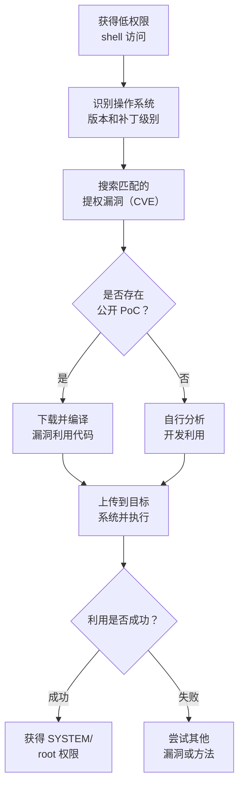

# 利用漏洞提升权限 (T1068)

## 一句话通俗理解

就像找到了大楼的隐藏后门——攻击者利用操作系统或软件中的安全漏洞，直接突破权限限制获取最高控制权。

## 难度等级

⭐⭐⭐ **高级** - 需要深入理解操作系统内核和漏洞利用技术，但公开的漏洞利用代码降低了门槛。

## 技术描述

利用漏洞提升权限是攻击者通过软件中的安全缺陷来获取更高权限的技术。这些漏洞存在于操作系统内核、驱动程序、应用程序或云/容器平台中。

**通俗解释：**
就像一栋大楼的保安系统有一个设计缺陷——某个侧门的锁看起来很正常，但用力一推就开了。攻击者不需要钥匙（密码），只需要知道这个"用力推"的技巧（漏洞利用方法），就能进入本该需要高级门禁才能进入的区域。

**技术原理：**

1. **收集信息**：确定目标操作系统的版本、补丁级别，找到已知的提权漏洞（如 CVE-2024-1086、CVE-2024-49138）
2. **获取利用代码**：从 GitHub、Exploit-DB 等渠道下载或编写漏洞利用（Exploit/PoC）
3. **执行利用**：在目标系统上运行漏洞利用代码，触发漏洞
4. **获得提升权限**：漏洞成功利用后，攻击者获得 SYSTEM（Windows）或 root（Linux）权限

**用途与影响：**
提权漏洞是最直接的权限提升方式——从普通用户直接到最高权限，一步到位。一个公开的提权漏洞 PoC 可以大幅降低攻击门槛。特别是 BYOVD（自带漏洞驱动）技术，攻击者使用合法签名的有漏洞驱动程序来获得内核级权限，使得防御极其困难。

## 子技术列表

T1068 没有定义子技术。这是一个通用的漏洞利用技术，涵盖所有类型的提权漏洞。

## 攻击流程



### 内核漏洞提权流程

```
1. 获得低权限 shell（如通过钓鱼邮件、Web 漏洞）
   ↓
2. 识别目标系统的操作系统版本和补丁级别
   ↓
3. 搜索匹配的提权漏洞（如 CVE-2024-1086、CVE-2024-49138）
   ↓
4. 下载或编写漏洞利用代码
   ↓
5. 在目标系统上执行漏洞利用
   ↓
6. 获得 SYSTEM/root 权限的 shell
```

### BYOVD 攻击流程

```
1. 获得管理员权限的初始访问
   ↓
2. 将存在漏洞的合法签名驱动程序部署到目标系统
   ↓
3. 加载该漏洞驱动程序
   ↓
4. 利用驱动程序的漏洞获取内核级权限
   ↓
5. 使用内核权限禁用安全软件或执行任意代码
```

## 真实案例

### 案例1：CVE-2024-1086 Linux 内核提权漏洞

- **时间**: 2024年1月
- **目标**: Linux 服务器（影响内核 3.15 至 6.7.x）
- **攻击组织**: 多个勒索软件组织
- **手法**: CVE-2024-1086 是 Linux 内核 nf_tables 子系统中的释放后使用（use-after-free）漏洞，CVSS 评分 7.8。攻击者通过操纵 nftables 规则触发漏洞，从普通用户提升到 root 权限。该漏洞的 PoC 代码已在 GitHub 公开发布，被多个勒索软件组织纳入攻击工具包。
- **影响**: 广泛影响 Linux 服务器，PoC 公开后被大规模利用
- **参考链接**: [GitHub - CVE-2024-1086 PoC](https://github.com/Notselwyn/CVE-2024-1086)

### 案例2：CVE-2024-49138 Windows CLFS 驱动提权漏洞

- **时间**: 2024年12月
- **目标**: Windows 10/11 系统
- **攻击组织**: 未知
- **手法**: CVE-2024-49138 是 Windows 通用日志文件系统（CLFS）驱动中的提权漏洞，CVSS 评分 7.8。该漏洞在补丁发布前已被作为零日漏洞在野外利用。攻击者利用 CLFS 驱动中的缺陷从低权限提升到 SYSTEM 级别。CLFS 子系统近年来成为攻击者的热门目标，类似漏洞包括 CVE-2024-38193、CVE-2023-36424 等。
- **影响**: 在补丁发布前已在野外被积极利用
- **参考链接**: [Microsoft CVE-2024-49138](https://msrc.microsoft.com/update-guide/vulnerability/CVE-2024-49138)

### 案例3：Dirty Frag - 2026年 Linux 内核提权漏洞

- **时间**: 2026年5月
- **目标**: 所有主流 Linux 发行版（Ubuntu、RHEL、Fedora、CentOS Stream、AlmaLinux、openSUSE）
- **攻击组织**: 安全研究人员 Hyunwoo Kim 发现
- **手法**: Dirty Frag 是 Linux 内核中的本地提权漏洞，通过链式利用 xfrm-ESP 页面缓存写入漏洞和 RxRPC 页面缓存写入漏洞实现 root 提权。与 Dirty Pipe 和 Copy Fail 属于同一漏洞类别，是一种确定性的逻辑漏洞，不依赖竞态条件，成功率高。PoC 已在 GitHub 公开发布，目前尚无补丁。
- **影响**: 影响所有主流 Linux 发行版，被称为"通用 LPE"
- **参考链接**: [The Hacker News - Dirty Frag](https://thehackernews.com/2026/05/linux-kernel-dirty-frag-lpe-exploit.html)

### 案例4：RedSun - 2026年 Windows Defender 提权漏洞

- **时间**: 2026年4月
- **目标**: Windows 10/11、Windows Server 2019+
- **攻击组织**: 安全研究人员 "Chaotic Eclipse" 发现
- **手法**: RedSun 是 Windows Defender 云文件处理机制中的逻辑漏洞。当 Defender 检测到带有云标签的恶意文件时，会错误地将文件写回原始位置。攻击者通过构造 EICAR 测试文件、使用机会锁暂停 Defender 操作、并结合 NTFS 目录连接点将写入重定向到 `C:\Windows\System32`，从而在完全修补的 Windows 系统上从无特权用户提升到 SYSTEM 权限。这是 2026 年 4 月披露的第二个 Defender LPE 漏洞（第一个是 BlueHammer/CVE-2026-33825）。
- **影响**: 影响所有完全修补的 Windows 系统，尚无补丁
- **参考链接**: [Cyber Security News - RedSun](https://cybersecuritynews.com/defender-0-day-redsun/)

### 案例5：Lazarus Group 利用 CVE-2024-21338 部署 Rootkit

- **时间**: 2024年2月
- **目标**: 金融机构和加密货币交易所
- **攻击组织**: Lazarus Group
- **手法**: Lazarus Group 利用 Windows AppLocker 驱动（appid.sys）中的零日漏洞 CVE-2024-21338 获取内核级权限，部署 FudModule rootkit。该 rootkit 通过直接内核对象操作（DKOM）禁用安全软件，使攻击者能够在目标系统上隐蔽运行。
- **影响**: 金融机构和加密货币交易所长期处于间谍活动中
- **参考链接**: [Avast - Lazarus FudModule Rootkit](https://www.avast.com/c/lazarus-fudmodule-rootkit)

## 红队视角

> ⚠️ **免责声明**：以下内容仅用于合法的安全测试、渗透测试和教育目的。未经授权对他人系统进行测试是违法行为。

### 实战技巧

1. **优先使用已知被积极利用的漏洞**
   查看 CISA KEV（已知被利用漏洞）目录，优先选择已经被 APT 组织验证过的提权漏洞。这些漏洞的可靠性通常更高。

2. **检查目标系统的补丁级别**
   使用 `systeminfo`（Windows）或 `uname -a`（Linux）查看系统版本，选择与补丁级别匹配的漏洞利用。已经打过补丁的系统需要换用其他漏洞。

3. **BYOVD 攻击配合其他提权技术效果更佳**
   BYOVD 本身是一个强大的内核级攻击手段。它可以用于禁用安全软件，为其他提权技术（如进程注入、令牌操纵）创造更宽松的执行环境。

4. **在测试环境中验证 PoC**
   在真实目标上执行任何漏洞利用之前，先在与目标配置相同的测试环境中验证 PoC 的稳定性和效果。

### 常用工具

| 工具名称 | 用途 | 平台 | 链接 |
|----------|------|------|------|
| Metasploit | 包含大量提权漏洞利用模块 | 跨平台 | https://www.metasploit.com |
| Exploit-DB | 公开漏洞利用代码的数据库 | 网页 | https://www.exploit-db.com |
| Windows Exploit Suggester | 根据系统补丁级别推荐提权漏洞 | Windows | [GitHub](https://github.com/GDSSecurity/Windows-Exploit-Suggester) |
| linux-exploit-suggester | Linux 提权漏洞检测脚本 | Linux | [GitHub](https://github.com/mzet-/linux-exploit-suggester) |
| EDRSandBleed | BYOVD 攻击自动化工具 | Windows | [GitHub](https://github.com/SpookySec/EDRSandBleed) |

### 注意事项

- 内核漏洞利用可能导致系统崩溃或蓝屏（BSOD），在目标系统上执行时有风险
- 漏洞利用代码的质量参差不齐，部分 PoC 可能包含后门或被篡改
- 在目标系统上下载和编译漏洞利用代码本身可能触发安全警报
- 法律合规要求：未经授权对他人系统进行测试是违法行为

## 蓝队视角

### 检测要点

1. **内核级异常行为**
   - 日志来源：Windows 系统事件日志、Linux kern.log
   - 关注字段：异常的内核模式操作、意外的 SYSTEM 级进程创建
   - 异常特征：非管理员账户以 SYSTEM 身份执行命令

2. **异常驱动程序加载**
   - 日志来源：Windows 驱动程序加载事件（Sysmon ID 6）
   - 关注字段：已知有漏洞的驱动程序名（如 RTCore64.sys、VBoxDrv.sys、zam64.sys）
   - 异常特征：非标准目录加载的驱动程序、最近未安装的驱动

3. **线程和内存模式异常**
   - 日志来源：EDR 传感器
   - 关注字段：堆喷射（Heap Spray）、ROP 链、shellcode 执行
   - 异常特征：异常的内存分配模式、执行权限异常提升

### 监控建议

- 监控已知 BYOVD 驱动的加载（创建已知有漏洞驱动的黑名单）
- 启用 Windows Defender 攻击面减少（ASR）规则阻止 BYOVD
- 部署 EDR 解决方案检测堆喷射、ROP 链和 shellcode 执行模式
- 在 Linux 上监控内核模块的异常加载和内核内存访问模式
- 使用 HVCI（虚拟机管理程序保护的代码完整性）阻止内核级漏洞利用

## 检测建议

### 网络层检测

**检测方法：** 监控 BYOVD 攻击中驱动文件的分发和加载流量。

**具体规则/命令示例：**
```
# 检测已知漏洞驱动的下载
alert tcp $EXTERNAL_NET $HTTP_PORTS -> $HOME_NET any (msg:"Suspicious driver download - RTCore64.sys"; content:"RTCore64.sys"; sid:1000004; rev:1;)
```

### 主机层检测

**检测方法：** 监控异常进程创建和驱动加载事件。

**Windows 事件ID：**
- 事件 ID 6 (Sysmon)：驱动程序加载
- 事件 ID 4688：进程创建（检测以 SYSTEM 运行的异常进程）
- 事件 ID 11 (Sysmon)：文件创建（检测漏洞利用工具的上传）

**Linux 日志：**
- 日志文件：`/var/log/kern.log`、`/var/log/messages`
- 关键字段：`kernel`、`BUG`、`OOPS`、`segfault`

**具体命令示例：**
```bash
# 检查已加载的内核模块
lsmod

# 使用 linux-exploit-suggester 检测系统
./linux-exploit-suggester.sh
```

### 应用层检测

**Sigma规则示例：**
```yaml
title: Suspicious Driver Load - BYOVD
status: experimental
description: Detects loading of known vulnerable drivers
logsource:
    category: driver_load
    product: windows
detection:
    selection:
        EventID: 6
        ImageLoaded|endswith:
            - '\RTCore64.sys'
            - '\gdrv.sys'
            - '\zam64.sys'
            - '\dbutil_2_3.sys'
    condition: selection
level: critical
tags:
    - attack.t1068
```

## 缓解措施

### 优先级1：关键措施

**措施名称：** 及时应用安全补丁

**具体实施步骤：**
1. 建立漏洞管理和补丁管理流程，优先修补已知被利用的漏洞
2. 关注 CISA KEV 目录和 MSRC 安全公告，在补丁发布后 48 小时内安排部署
3. 对无法及时修补的系统实施虚拟补丁（如 WAF、IDS 规则）

### 优先级2：重要措施

**措施名称：** 启用内核级安全保护

**具体实施步骤：**
1. 启用 HVCI（Hypervisor-Protected Code Integrity）阻止内核级代码注入
2. 启用 Windows Defender 驱动程序签名强制，阻止未签名驱动加载
3. 部署 WDAC（Windows Defender Application Control）限制可执行的二进制文件

### 优先级3：建议措施

**措施名称：** 实施漏洞管理计划

**具体实施步骤：**
1. 部署漏洞扫描器定期扫描和修补已知漏洞
2. 在 Linux 系统上配置 KASLR 和执行权限限制
3. 使用 EPP 和 EDR 解决方案检测和阻止提权漏洞利用行为

### MITRE ATT&CK 缓解措施映射

| 缓解措施ID | 缓解措施名称 | 适用性 | 说明 |
|------------|-------------|--------|------|
| M1051 | Update Software | 适用 | 及时修补操作系统和应用程序漏洞 |
| M1044 | Restrict Driver Installation | 适用 | 限制未签名或已知有漏洞的驱动加载 |
| M1025 | Privileged Process Integrity | 适用 | HVCI 保护内核进程完整性 |
| M1038 | Execution Prevention | 部分适用 | WDAC 限制可执行的文件 |

## 动手实验

> ⚠️ **重要提示**：所有实验必须在隔离的实验室环境中进行，禁止对未授权的真实系统进行测试。

### 实验环境准备

**推荐靶场/实验平台：**

| 平台名称 | 类型 | 难度 | 链接 |
|----------|------|------|------|
| Hack The Box | 虚拟靶场 | 高级 | https://www.hackthebox.com |
| VulnHub | 虚拟靶场 | 中级-高级 | https://www.vulnhub.com |

### 实验1：Linux 提权漏洞检测（初级）

**实验目标：** 学习如何检测 Linux 系统上潜在的提权漏洞。

**实验步骤：**
1. 检查系统内核版本：`uname -r`
2. 使用 linux-exploit-suggester 扫描：`./linux-exploit-suggester.sh`
3. 查看建议的漏洞利用列表

**预期结果：** 脚本列出系统内核版本对应的潜在提权漏洞。

**学习要点：** 掌握漏洞检测的基本方法和工具。

### 实验2：Windows 提权漏洞检测（初级）

**实验目标：** 学习如何识别 Windows 系统的潜在提权漏洞。

**实验步骤：**
1. 导出系统信息：`systeminfo > systeminfo.txt`
2. 使用 Windows Exploit Suggester：`python wes.py systeminfo.txt`
3. 查看结果，寻找匹配的提权漏洞

**预期结果：** 工具列出系统未修补的安全漏洞。

**学习要点：** 掌握 Windows 系统漏洞检测的基本方法。

### 实验3：BYOVD 检测实验（中级）

**实验目标：** 学习如何检测已知有漏洞的驱动程序加载。

**实验步骤：**
1. 配置 Sysmon 监控驱动加载事件
2. 使用 PowerShell 检查已加载的驱动列表
3. 与已知的漏洞驱动黑名单对比

**预期结果：** 能够识别系统中是否存在已知有漏洞的驱动程序。

**学习要点：** 理解 BYOVD 攻击的检测方法。

## 术语解释

| 术语 | 英文原名 | 通俗解释 |
|------|----------|----------|
| CVE | Common Vulnerabilities and Exposures | 通用漏洞披露，每个安全漏洞的"身份证号"，格式为 CVE-年份-编号 |
| PoC | Proof of Concept | 概念验证代码，证明某个漏洞可以被利用的示例程序 |
| BYOVD | Bring Your Own Vulnerable Driver | 自带漏洞驱动，攻击者部署有合法签名但存在漏洞的驱动来获取内核权限 |
| 零日漏洞 | Zero-day | 尚未被厂商修补或公开披露的漏洞，攻击者在防御措施部署前利用 |
| CLFS | Common Log File System | Windows 的通用日志文件系统驱动，近年来多次发现提权漏洞 |
| HVCI | Hypervisor-enforced Code Integrity | 虚拟机管理程序保护的代码完整性，阻止内核级恶意代码执行 |
| DKOM | Direct Kernel Object Manipulation | 直接内核对象操作，攻击者直接修改内核数据结构来隐藏进程或文件 |
| KEV | Known Exploited Vulnerabilities | CISA 维护的已知被利用漏洞目录，要求联邦机构在指定时间内修补 |
| Dirty Pipe/Frag | - | Linux 内核中特定类别的提权漏洞命名惯例，通过覆盖受保护文件实现 root |

## 参考资料

### 官方文档

- [MITRE ATT&CK T1068 - Exploitation for Privilege Escalation](https://attack.mitre.org/techniques/T1068/)
- [CISA Known Exploited Vulnerabilities Catalog](https://www.cisa.gov/known-exploited-vulnerabilities-catalog)
- [NVD - National Vulnerability Database](https://nvd.nist.gov/)

### 安全报告

- [CVE-2024-1086 - Linux nf_tables PoC](https://github.com/Notselwyn/CVE-2024-1086)
- [Microsoft CVE-2024-49138 Advisory](https://msrc.microsoft.com/update-guide/vulnerability/CVE-2024-49138)
- [Avast - Lazarus Group FudModule Rootkit](https://www.avast.com/c/lazarus-fudmodule-rootkit)
- [The Hacker News - Dirty Frag 2026](https://thehackernews.com/2026/05/linux-kernel-dirty-frag-lpe-exploit.html)
- [Cyber Security News - RedSun 2026](https://cybersecuritynews.com/defender-0-day-redsun/)

### 工具与资源

- [Windows Exploit Suggester](https://github.com/GDSSecurity/Windows-Exploit-Suggester)
- [linux-exploit-suggester](https://github.com/mzet-/linux-exploit-suggester)
- [Dirty Pipe - CVE-2022-0847](https://dirtypipe.cm4all.com/)
- [UACME - UAC Bypass Collection](https://github.com/hfiref0x/UACME)

### 学习资料

- [Trend Micro - BYOVD Attacks 2024](https://www.trendmicro.com/en_us/research/2024/bring-your-own-vulnerable-driver.html)
- [Atomic Red Team - T1068 Tests](https://github.com/redcanaryco/atomic-red-team/tree/master/atomics/T1068)
