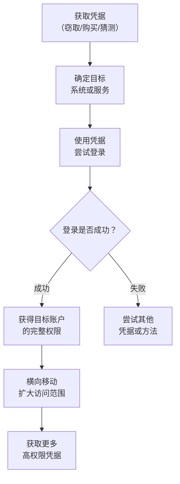

# 有效账户 (T1078)

## 一句话通俗理解

就像直接拿了别人的钥匙开门——攻击者不破解密码，而是用偷来、买来或猜到的真实账号密码直接登录高权限账户。

## 难度等级

⭐ **初级** - 获取凭据的方式多种多样，从简单的密码喷洒到购买泄露凭据，技术门槛相对较低。

## 技术描述

有效账户攻击是所有攻击技术中最基础也最有效的一种。攻击者不需要发现或利用软件漏洞，只需要获取到一个真实用户的账号密码就能登录系统。

**通俗解释：**
就像你不撬锁，而是偷看邻居的日记本找到他家门锁密码，然后大摇大摆地走进去。因为没有撬锁的痕迹，邻居的家人甚至不会觉得有人入侵了。攻击者使用有效的高权限账户凭据（用户名+密码）登录，系统认为这就是合法用户在操作，不会产生任何告警。

**技术原理：**

1. **凭据获取**：通过窃取、购买、猜测等方式获得高权限账户的登录信息
2. **登录验证**：使用获取的凭据登录目标系统或服务
3. **权限行使**：登录成功后，攻击者拥有该账户的所有权限
4. **横向扩展**：利用获得的权限进一步获取更多凭据，扩大控制范围

**用途与影响：**
有效账户攻击是最难防御的攻击方式之一。因为攻击者使用的是合法凭据，与正常用户登录没有区别，传统的基于签名的检测完全无效。2024 年的 Snowflake 数据泄露事件就是典型例子——攻击者使用之前泄露的有效凭据直接登录云平台，数百万客户数据被窃取。

## 子技术列表

**该技术共有 4 个子技术：**

| 子技术ID | 中文名称 | 通俗解释 |
|----------|----------|----------|
| T1078.001 | 默认账户 | 使用设备或软件的出厂默认用户名和密码（如 admin/admin） |
| T1078.002 | 域账户 | 使用 Active Directory 域中的账户凭据登录域资源 |
| T1078.003 | 本地账户 | 使用操作系统本地账户的凭据登录计算机 |
| T1078.004 | 云账户 | 使用云平台（AWS、Azure、GCP）的账户凭据访问云资源 |

<details>
<summary><strong>展开查看各子技术详细说明</strong></summary>

各子技术详细说明请参阅独立文档：

- [T1078.001 - 默认账户](./T1078/T1078.001-Default-Accounts.md) — 使用厂家设定的默认密码（如 admin/password）登录设备或软件。
- [T1078.002 - 域账户](./T1078/T1078.002-Domain-Account.md) — 使用公司网络域中的账户登录各种资源。
- [T1078.003 - 本地账户](./T1078/T1078.003-Local-Account.md) — 使用电脑本地的账户登录单台计算机。
- [T1078.004 - 云账户](./T1078/T1078.004-Cloud-Account.md) — 使用云服务（AWS、Azure、Google Cloud）的账户登录云控制台。

</details>

## 攻击流程



### 凭据窃取到域管理员提权流程

```
1. 通过钓鱼或漏洞获得普通域用户凭据
   ↓
2. 使用 Mimikatz 等工具从内存中提取更多凭据
   ↓
3. 进行 Kerberoasting 攻击获取服务账户哈希
   ↓
4. 离线破解服务账户密码
   ↓
5. 使用服务账户凭据访问更多系统
   ↓
6. 最终获取域管理员凭据
   ↓
7. 以域管理员身份登录，获得整个域的控制权
```

### 云账户提权流程

```
1. 通过信息窃取恶意软件获取员工的云平台凭据
   ↓
2. 使用凭据登录云控制台（如 Azure Portal、AWS Console）
   ↓
3. 检查当前账户的 IAM 权限
   ↓
4. 利用配置不当的 IAM 策略提升权限
   ↓
5. 创建新的管理员账户或修改现有账户权限
   ↓
6. 获得云环境的完全控制权
```

## 真实案例

### 案例1：Snowflake 数据泄露事件（2024年）

- **时间**: 2024年4-6月
- **目标**: Ticketmaster (Live Nation)、AT&T、Santander Bank 等多家大型企业
- **攻击组织**: UNC5537
- **手法**: 威胁组织 UNC5537 使用之前数据泄露中获取的有效凭据登录 Snowflake 云存储平台。受影响的客户账户未启用多因素认证（MFA），攻击者使用窃取的用户名和密码直接访问了数百万人的数据。Ticketmaster 约 5.6 亿客户数据被窃取，AT&T 几乎所有手机用户的通话和短信元数据被泄露。这是 2024 年最大的凭据滥用事件之一。
- **影响**: 约 5.6 亿客户数据被窃取，多家财富 500 强企业受影响
- **参考链接**: [Mandiant - Snowflake Breach](https://www.mandiant.com/resources/blog/snowflake-customer-data-breach)

### 案例2：Midnight Blizzard (APT29) 入侵 Microsoft 企业邮件（2024年）

- **时间**: 2024年1月
- **目标**: Microsoft 企业邮件系统
- **攻击组织**: Midnight Blizzard (APT29)
- **手法**: 俄罗斯国家背景的攻击组织 Midnight Blizzard 使用密码喷洒攻击入侵了 Microsoft 的一个遗留测试租户账户。该账户未启用 MFA。攻击者从该账户获取的信息被用于进一步访问 Microsoft 高级领导层和网络安全团队的邮箱，窃取了邮件和附件。随后攻击者利用获取的信息访问了 Microsoft 的源代码仓库，并操纵 OAuth 应用程序来扩大访问范围。
- **影响**: Microsoft 高级管理层和网络安全团队的邮件泄露
- **参考链接**: [Microsoft - Midnight Blizzard Email Breach](https://msrc.microsoft.com/blog/2024/01/midnight-blizzard-targeted-microsoft-corporate-email/)

### 案例3：Scattered Spider 利用社会工程获取云管理员凭据（2023-2024年）

- **时间**: 2023-2024年
- **目标**: MGM Resorts、Caesars Entertainment 等大型企业
- **攻击组织**: Scattered Spider (G1015)
- **手法**: Scattered Spider 通过针对 IT 帮助台的社会工程学攻击获取了高权限云账户凭据。攻击者冒充 IT 人员致电帮助台，说服工作人员重置管理员密码或提供管理员访问令牌。利用这些凭据，他们获得了 Azure AD 全局管理员和 AWS 管理账户的访问权限，从有限的用户级访问提升到对云基础设施的完全控制。MGM Resorts 因此遭受了约 1 亿美元的损失。
- **影响**: MGM Resorts 损失约 1 亿美元
- **参考链接**: [MITRE ATT&CK - Scattered Spider](https://attack.mitre.org/groups/G1015/)

### 案例4：Volt Typhoon 利用窃取凭据在关键基础设施中横向移动（2024年）

- **时间**: 2023-2024年
- **目标**: 美国关键基础设施
- **攻击组织**: Volt Typhoon
- **手法**: Volt Typhoon 在入侵网络后，通过 `lsass.exe` 内存转储窃取凭据，然后使用这些有效凭据在网络中横向移动。攻击者特别关注本地管理员和域管理员账户的凭据，利用这些凭据访问更多系统并维持持久化。由于他们使用的是合法凭据，所有操作都混在正常的认证流量中，极难检测。
- **影响**: 在美国关键基础设施网络中潜伏数年
- **参考链接**: [CISA - Volt Typhoon Advisory](https://www.cisa.gov/news-events/cybersecurity-advisories/aa24-038a)

## 红队视角

> ⚠️ **免责声明**：以下内容仅用于合法的安全测试、渗透测试和教育目的。未经授权对他人系统进行测试是违法行为。

### 实战技巧

1. **优先尝试密码喷洒**
   使用少量常见密码（如 `Password1!`、`Company2024!`、`Spring2024`）大量尝试账户，避免触发账户锁定策略。

2. **检查暗网泄露数据库**
   在暗网数据泄露市场中搜索目标组织是否已有泄露凭据。许多员工在多个平台上使用相同密码。

3. **从内存中提取凭据后在多系统上重用**
   使用 Mimikatz 从一台机器内存中提取的凭据，往往可以在内网的其他系统上成功使用（密码复用）。

4. **利用服务账户**
   服务账户通常有强密码但很少轮换，且权限很高。通过 Kerberoasting 获取服务账户哈希并离线破解。

### 常用工具

| 工具名称 | 用途 | 平台 | 链接 |
|----------|------|------|------|
| Mimikatz | 从 Windows 内存中提取密码和哈希 | Windows | [GitHub](https://github.com/gentilkiwi/mimikatz) |
| Rubeus | Kerberos 攻击工具，用于 Kerberoasting 和票据操作 | Windows | [GitHub](https://github.com/GhostPack/Rubeus) |
| CrackMapExec | 网络级凭据验证和喷洒工具 | Linux/Windows | [GitHub](https://github.com/byt3bl33d3r/CrackMapExec) |
| Hydra | 在线密码暴力破解工具 | 跨平台 | [GitHub](https://github.com/vanhauser-thc/thc-hydra) |

### 注意事项

- 密码喷洒攻击需要考虑账户锁定策略，通常每 30 分钟尝试 2-3 次
- 使用窃取的凭据登录时，考虑地理位置异常检测
- 云平台的 MFA 可以通过会话令牌窃取来绕过
- 法律合规要求：未经授权测试他人系统的凭据强度是违法的

## 蓝队视角

### 检测要点

1. **异常特权账户登录**
   - 日志来源：Windows 安全事件日志、云平台审计日志
   - 关注字段：事件 ID 4624（成功登录）、登录类型、源 IP 地址
   - 异常特征：域管理员从非预期地理位置或设备登录

2. **密码喷洒指示**
   - 日志来源：Windows 安全事件日志
   - 关注字段：事件 ID 4625（登录失败）
   - 异常特征：多个账户在短时间内出现少量失败登录后成功登录

3. **lsass.exe 异常访问**
   - 日志来源：Sysmon
   - 关注字段：事件 ID 10（ProcessAccess）
   - 异常特征：非标准工具（如 Mimikatz）访问 lsass.exe 进程

### 监控建议

- 对所有特权账户强制启用防钓鱼 MFA（如 FIDO2 硬件密钥）
- 实施条件访问策略，限制异常位置和设备的登录
- 部署身份威胁检测和响应（ITDR）解决方案
- 监控暗网上是否有组织凭据泄露
- 定期审计和轮换高权限凭据

## 检测建议

### 网络层检测

**检测方法：** 监控异常的认证流量模式。

**具体规则/命令示例：**
```
# 检测来自异常国家/地区的管理员登录
alert tcp $EXTERNAL_NET any -> $HOME_NET 443 (msg:"Admin login from unusual geo-location"; content:"/login"; sid:1000005; rev:1;)
```

### 主机层检测

**检测方法：** 监控凭据窃取和异常登录事件。

**Windows 事件ID：**
- 事件 ID 4624：成功登录（关注登录类型 3 网络登录、类型 10 远程交互登录）
- 事件 ID 4625：失败登录（密码喷洒指示）
- 事件 ID 10 (Sysmon)：lsass.exe 进程访问

**Linux 日志：**
- 日志文件：`/var/log/auth.log`、`/var/log/secure`
- 关键字段：`sshd`、`sudo`、`su`

**具体命令示例：**
```bash
# 查看最近的 SSH 登录尝试
grep "sshd" /var/log/auth.log | grep "Failed"

# 查看成功的 sudo 执行
grep "sudo" /var/log/auth.log | grep "COMMAND"
```

**用人话说：** 有效账户提权是指攻击者使用已经拥有或窃取到的高权限账户直接登录系统。比如得到了管理员Administrator的密码、拿到了域管理员的NTLM哈希、或者发现了云平台root用户的AccessKey。攻击者不需要任何漏洞利用，直接用合法账号登录就是最高效的提权方式。这就像小偷不撬锁，而是直接偷到了管理员口袋里的钥匙——大大方方从正门走进去，监控都认为这是合法行为。

**Sigma规则示例：**
```yaml
title: Suspicious LSASS Access
status: experimental
description: Detects suspicious access to lsass.exe process
logsource:
    category: process_access
    product: windows
detection:
    selection:
        EventID: 10
        TargetImage|endswith: '\lsass.exe'
        SourceImage|endswith:
            - '\mimikatz.exe'
            - '\procdump64.exe'
    condition: selection
level: critical
tags:
    - attack.t1078
```

## 缓解措施

### 优先级1：关键措施

**措施名称：** 对所有特权账户实施多因素认证（MFA）

**具体实施步骤：**
1. 对所有管理员账户强制启用防钓鱼 MFA（推荐 FIDO2 硬件密钥）
2. 对远程访问（VPN、RDP）实施 MFA 要求
3. 在云平台中对敏感操作（角色提升、API 密钥创建）增加 MFA 确认

### 优先级2：重要措施

**措施名称：** 实施最小权限和 JIT 访问

**具体实施步骤：**
1. 实施最小权限原则，限制高权限账户的数量和使用
2. 对特权账户实施 Just-In-Time (JIT) 访问（如 Azure AD PIM）
3. 使用 Jump Server（跳板机）管理和审计特权访问

### 优先级3：建议措施

**措施名称：** 凭据管理和监控

**具体实施步骤：**
1. 实施条件访问策略限制从异常位置登录
2. 部署 ITDR（身份威胁检测和响应）解决方案
3. 定期审查和轮换高权限凭据

### MITRE ATT&CK 缓解措施映射

| 缓解措施ID | 缓解措施名称 | 适用性 | 说明 |
|------------|-------------|--------|------|
| M1032 | Multi-factor Authentication | 适用 | 对所有特权账户启用防钓鱼 MFA |
| M1026 | Privileged Account Management | 适用 | 实施最小权限和 JIT 访问 |
| M1018 | User Account Management | 适用 | 限制高权限账户的数量和使用 |
| M1017 | User Training | 部分适用 | 培训员工识别凭据窃取和社会工程攻击 |

## 动手实验

> ⚠️ **重要提示**：所有实验必须在隔离的实验室环境中进行，禁止对未授权的真实系统进行测试。

### 实验环境准备

**推荐靶场/实验平台：**

| 平台名称 | 类型 | 难度 | 链接 |
|----------|------|------|------|
| Hack The Box | 虚拟靶场 | 初级 | https://www.hackthebox.com |
| TryHackMe | 虚拟靶场 | 初级 | https://tryhackme.com |

### 实验1：密码喷洒攻击模拟（初级）

**实验目标：** 理解密码喷洒攻击的工作原理。

**实验步骤：**
1. 准备用户名列表
2. 使用 CrackMapExec 进行密码喷洒
3. 检查成功登录的账户

**预期结果：** 工具返回成功登录的账户信息。

**学习要点：** 掌握密码喷洒攻击的基本概念和操作方法。

### 实验2：从内存提取凭据演示（中级）

**实验目标：** 理解凭据窃取的基本原理。

**实验步骤：**
1. 使用 Mimikatz 提取凭据（需要管理员权限）
2. 查看提取到的凭据信息
3. 分析提取结果

**预期结果：** Mimikatz 从 lsass.exe 内存中提取出缓存的凭据信息。

**学习要点：** 理解 Windows 凭据管理机制和凭据窃取的风险。

### 实验3：检测异常登录（中级）

**实验目标：** 学习如何通过事件日志检测异常登录行为。

**实验步骤：**
1. 查看 Windows 安全日志中的登录事件
2. 过滤出失败的登录尝试
3. 分析成功登录的地理位置异常

**预期结果：** 能够识别和筛选出异常的登录事件。

**学习要点：** 掌握 Windows 安全日志在登录审计中的应用。

## 术语解释

| 术语 | 英文原名 | 通俗解释 |
|------|----------|----------|
| 有效账户 | Valid Account | 真实存在的、可正常使用的用户账户，攻击者通过合法凭据使用这些账户 |
| 密码喷洒 | Password Spraying | 用少量常见密码尝试大量账户，像用一把通用钥匙试很多锁，避免触发锁死机制 |
| 凭据窃取 | Credential Theft | 从系统内存、文件或网络流量中提取用户名和密码的技术 |
| Kerberoasting | - | 针对 Active Directory 服务账户的攻击，通过请求服务票据并离线破解获取密码 |
| MFA | Multi-Factor Authentication | 多因素认证，要求用户提供两种以上验证方式（密码+手机验证码+指纹等） |
| ITDR | Identity Threat Detection and Response | 身份威胁检测和响应，专注于保护身份基础设施的安全方案 |
| 条件访问 | Conditional Access | 根据用户位置、设备状态等条件动态控制访问权限的安全策略 |
| IAM | Identity and Access Management | 身份和访问管理，云平台中的权限管理框架 |

## 参考资料

### 官方文档

- [MITRE ATT&CK T1078 - Valid Accounts](https://attack.mitre.org/techniques/T1078/)
- [MITRE ATT&CK T1078.001 - Default Accounts](https://attack.mitre.org/techniques/T1078/001/)
- [MITRE ATT&CK T1078.002 - Domain Accounts](https://attack.mitre.org/techniques/T1078/002/)
- [MITRE ATT&CK T1078.004 - Cloud Accounts](https://attack.mitre.org/techniques/T1078/004/)

### 安全报告

- [Mandiant - Snowflake Customer Data Breach](https://www.mandiant.com/resources/blog/snowflake-customer-data-breach)
- [Microsoft - Midnight Blizzard Email Breach](https://msrc.microsoft.com/blog/2024/01/midnight-blizzard-targeted-microsoft-corporate-email/)
- [CISA - Volt Typhoon Advisory (AA24-038A)](https://www.cisa.gov/news-events/cybersecurity-advisories/aa24-038a)

### 学习资料

- [Atomic Red Team - T1078 Tests](https://github.com/redcanaryco/atomic-red-team/tree/master/atomics/T1078)
- [Microsoft - Midnight Blizzard Social Engineering](https://www.microsoft.com/en-us/security/blog/2022/10/18/midnight-blizzard-conducts-targeted-social-engineering-over-teams/)
