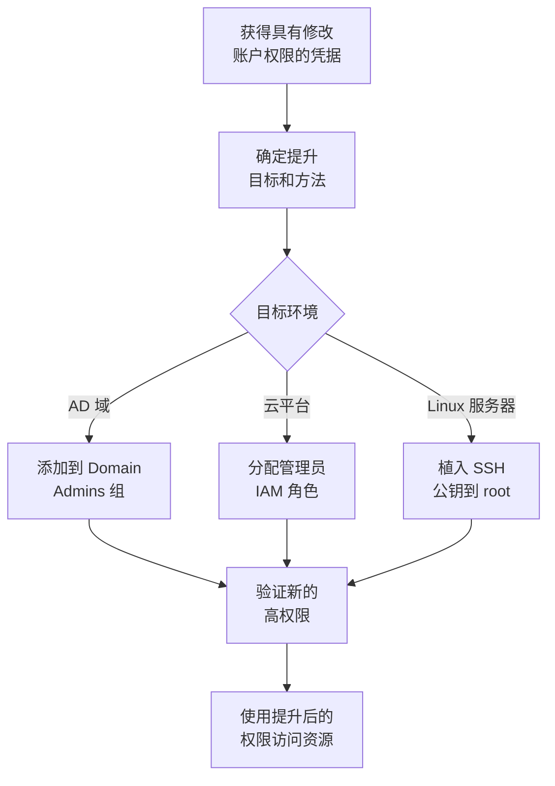

# 账户操纵 (T1098)

## 一句话通俗理解

就像偷偷给自己升职加薪——攻击者修改账户的权限、角色或凭据，把自己从普通员工变成管理员。

## 难度等级

⭐⭐ **中级** - 需要先获得足够的权限来修改账户属性，但操纵方式相对直接。

## 技术描述

账户操纵是指攻击者通过修改账户属性来提升自己或同伙的权限。与直接窃取凭据不同，账户操纵是主动修改账户配置——比如把自己加入管理员组、给自己的云账户分配管理员角色、或者在服务器上植入自己的 SSH 密钥。

**通俗解释：**
普通员工无法自己给自己升职——但如果你偷到了 HR 主管的账号密码，就可以登录 HR 系统把自己加进"高管名单"。攻击者就是通过这种方式，利用获得的修改权限来提升自己账户的级别。

**技术原理：**

1. **获取修改权限**：首先通过其他漏洞或凭据窃取获得能修改账户属性的权限
2. **提升账户权限**：将自己的低权限账户加入高权限组，或分配高权限角色
3. **创建后门**：在系统中植入持久化的后门账户或凭据（如 SSH 密钥、OAuth 应用）
4. **维持访问**：即使最初的漏洞被修复，修改后的账户权限仍然有效

**用途与影响：**
账户操纵的可怕之处在于"持久化效果"——一旦攻击者把自己加入管理员组，即使最初的漏洞被修复，他仍然是管理员。在云环境中，一次账户操纵可以让攻击者拥有整个云环境的完全控制权。

## 子技术列表

**该技术共有 7 个子技术：**

| 子技术ID | 中文名称 | 通俗解释 |
|----------|----------|----------|
| T1098.001 | 额外云凭据 | 为云账户创建额外的 API 密钥或访问令牌 |
| T1098.002 | 额外电子邮件委派权限 | 给自己授予访问他人邮箱的权限 |
| T1098.003 | 额外云角色 | 为云账户分配高权限的 IAM 角色 |
| T1098.004 | SSH 授权密钥 | 在服务器上植入自己的 SSH 公钥实现免密 root 登录 |
| T1098.005 | 设备注册 | 在身份提供商中注册受控设备 |
| T1098.006 | 额外容器集群角色 | 为 Kubernetes 服务账户绑定高权限角色 |
| T1098.007 | 额外本地或域组 | 将用户添加到本地管理员或域管理员组 |

<details>
<summary><strong>展开查看各子技术详细说明</strong></summary>

### T1098.001 - 额外云凭据

**通俗理解：** 给云账户搞一把"备用钥匙"——虽然主钥匙可能被换，但备用钥匙仍然有效。

**详细说明：** 云平台（AWS、Azure、GCP）支持为 IAM 用户创建多个访问密钥。攻击者如果获得了云账户的修改权限，可以创建额外的访问密钥，即使管理员轮换了主密钥，攻击者仍然可以使用额外的密钥访问云资源。

### T1098.004 - SSH 授权密钥

**通俗理解：** 在服务器管理员家的门垫下放一把自己的钥匙——每次来都不用敲门。

**详细说明：** SSH 密钥认证机制允许用户无需输入密码就能登录服务器。攻击者如果获得了对服务器上某个用户（特别是 root）的 `authorized_keys` 文件的写入权限，就可以将自己的公钥添加进去，从而随时以该用户身份远程登录。

### T1098.007 - 额外本地或域组

**通俗理解：** 把自己加进公司的"核心高管群"——拿到管理员团队的成员资格。

**详细说明：** 在 Windows 域环境中，用户的权限由所属的组决定。攻击者如果拥有修改组成员身份的权限，可以将自己的账户添加到 Domain Admins（域管理员）组，从而获得对整个域的控制权。

</details>

## 攻击流程



### Windows 域账户提权流程

```
1. 获得具有修改 AD 用户属性权限的账户凭据
   ↓
2. 使用 net 命令将目标用户添加到 Domain Admins 组
   net group "Domain Admins" attacker_user /add /domain
   ↓
3. 或使用 PowerShell 修改组成员身份
   Add-ADGroupMember -Identity "Domain Admins" -Members "attacker_user"
   ↓
4. 验证新的权限
   whoami /groups
   ↓
5. 以域管理员身份访问域控制器
```

### SSH 密钥植入提权流程

```
1. 获得对服务器的低权限访问
   ↓
2. 生成 SSH 密钥对
   ssh-keygen -t rsa -b 4096
   ↓
3. 将公钥写入 root 用户的 authorized_keys
   echo "ssh-rsa AAAA..." >> /root/.ssh/authorized_keys
   ↓
4. 使用私钥以 root 身份 SSH 登录
   ssh -i id_rsa root@target-server
   ↓
5. 获得完全的 root 访问权限
```

## 真实案例

### 案例1：Midnight Blizzard (APT29) 操纵 Microsoft OAuth 应用（2024年）

- **时间**: 2024年1-3月
- **目标**: Microsoft 企业系统和其他组织
- **攻击组织**: Midnight Blizzard (APT29)
- **手法**: Midnight Blizzard 在入侵 Microsoft 企业邮件后，利用获取的信息操纵 OAuth 应用程序。攻击者创建了新的 OAuth 应用并为其授予了高权限（如邮箱读取、文件访问），然后使用这些应用访问 Microsoft 的源代码仓库和内部系统。攻击者还修改了现有 OAuth 应用的凭据，确保即使最初的访问被切断，仍能通过操纵后的应用维持访问。这是账户操纵技术在云环境中的典型应用。
- **影响**: Microsoft 源代码仓库和内部系统遭受长期访问
- **参考链接**: [Microsoft - Midnight Blizzard Email Breach](https://msrc.microsoft.com/blog/2024/01/midnight-blizzard-targeted-microsoft-corporate-email/)

### 案例2：Scattered Spider 操纵 Azure AD 角色分配（2023-2024年）

- **时间**: 2023-2024年
- **目标**: MGM Resorts、Caesars Entertainment 等大型企业
- **攻击组织**: Scattered Spider
- **手法**: Scattered Spider 在获得初始访问后，通过社会工程学手段操纵云账户的角色分配。攻击者在 Azure AD 中为受损的云用户分配了特权角色（如全局管理员和条件访问管理员），将标准用户权限提升为完全管理访问权限。他们还添加了额外的 IAM 策略到 AWS 账户中，创建了具有管理员权限的新 IAM 用户和角色。
- **影响**: MGM Resorts 损失约 1 亿美元
- **参考链接**: [MITRE ATT&CK - Scattered Spider](https://attack.mitre.org/groups/G1015/)

### 案例3：Lazarus Group 利用 SSH 密钥植入提权（2021-2024年）

- **时间**: 2021-2024年
- **目标**: 全球金融机构和加密货币交易所
- **攻击组织**: Lazarus Group
- **手法**: Lazarus Group 在攻击 Linux 服务器时，通过修改 SSH authorized_keys 文件（T1098.004）来提升和维持访问权限。攻击者在获得低权限 shell 访问后，将自身的公钥写入 root 用户的 authorized_keys 文件，从而获得 root 级别的 SSH 登录权限。这种技术允许攻击者绕过密码认证，以最高权限远程访问受感染的系统。即使管理员更改了 root 密码，只要公钥文件未被清理，攻击者仍能登录。
- **影响**: 金融机构和加密货币交易所长期处于高风险状态
- **参考链接**: [MITRE ATT&CK - Lazarus Group](https://attack.mitre.org/software/S0392/)

### 案例4：Akamai 发现 BadSuccessor dMSA 提权攻击（2025年）

- **时间**: 2025年5月
- **目标**: 运行 Windows Server 2025 的 Active Directory 环境
- **攻击组织**: 安全研究人员发现
- **手法**: Akamai 安全研究人员发现 Windows Server 2025 新增的委托托管服务账户（dMSA）功能中存在提权漏洞。通过滥用 dMSA 的迁移机制，攻击者可以在默认配置下接管域中的任何用户。Akamai 调查发现，在 91% 的 AD 环境中都存在具有执行此攻击所需权限的用户。Microsoft 确认了该问题但尚未发布补丁。
- **影响**: 影响 91% 的 Active Directory 环境
- **参考链接**: [Akamai - BadSuccessor](https://www.akamai.com/blog/security-research/abusing-dmsa-for-privilege-escalation-in-active-directory)

## 红队视角

> ⚠️ **免责声明**：以下内容仅用于合法的安全测试、渗透测试和教育目的。未经授权对他人系统进行测试是违法行为。

### 实战技巧

1. **在 AD 中检查委派权限**
   使用 BloodHound 分析 AD 权限关系，寻找可以从当前账户到达高权限组的委派路径。很多环境存在"链式提升"路径。

2. **SSH 密钥植入后即使密码被更改也能保持访问**
   root 密码被更改不会影响 SSH 密钥认证。这是 Linux 系统上最持久的后门方式之一。

3. **创建多个后门账户**
   不要只创建一个后门账户，在域中创建多个具有不同权限级别的后门账户，确保单一账户被发现后仍有备用访问。

4. **在云环境中检查 IAM 委派**
   使用 CloudGoat 或 Pacu 等工具检查云 IAM 配置，寻找可以附加策略到其他用户的权限。

### 常用工具

| 工具名称 | 用途 | 平台 | 链接 |
|----------|------|------|------|
| PowerView | PowerShell AD 枚举和操纵工具 | Windows | [GitHub](https://github.com/PowerShellMafia/PowerSploit/tree/master/Recon) |
| BloodHound | AD 权限关系分析和可视化 | Windows/Linux | [GitHub](https://github.com/BloodHoundAD/BloodHound) |
| AWS CLI / Azure CLI | 云平台命令行管理工具 | 跨平台 | 官方工具 |
| ssh-keygen | SSH 密钥对生成工具 | Linux/Windows/macOS | 内置 |
| Nuclei | 自动化漏洞扫描，含 IAM 配置检查 | Linux | [GitHub](https://github.com/projectdiscovery/nuclei) |

### 注意事项

- 将用户添加到 Domain Admins 等高权限组会产生事件 ID 4728 等日志
- 在云环境中创建新的 IAM 用户或角色会被 CloudTrail 等审计服务记录
- SSH 密钥植入后需要确保密钥文件的权限设置正确（600）
- 创建的后门账户应避免使用过于明显的用户名

## 蓝队视角

### 检测要点

1. **特权组成员变更**
   - 日志来源：Windows 安全事件日志
   - 关注字段：事件 ID 4728（全局组成员添加）、4732（本地组成员添加）、4756（通用组成员添加）
   - 异常特征：非管理员账户将用户添加到 Domain Admins、Enterprise Admins 等高权限组

2. **云 IAM 策略附加**
   - 日志来源：AWS CloudTrail、Azure 审计日志
   - 关注字段：`AttachUserPolicy`、`CreatePolicy`、`AddRoleAssignment`
   - 异常特征：非管理员用户为其他用户分配管理员策略

3. **SSH authorized_keys 修改**
   - 日志来源：Linux auditd、文件完整性监控
   - 关注字段：`/root/.ssh/authorized_keys` 修改事件
   - 异常特征：非 root 用户向 root 的 authorized_keys 写入公钥

### 监控建议

- 配置实时告警：任何将用户添加到高权限组的事件立即通知
- 使用 SIEM 关联分析云 IAM 变更事件，检测异常模式
- 部署 FIM 监控 SSH authorized_keys 文件
- 定期审计所有特权组成员和角色分配

## 检测建议

### 网络层检测

**检测方法：** 监控 SSH 密钥认证的异常登录。

**具体规则/命令示例：**
```
# 检测来自新 SSH 密钥的 root 登录
alert tcp $EXTERNAL_NET any -> $HOME_NET 22 (msg:"Root SSH login with new key"; flow:to_server,established; content:"ssh-rsa"; sid:1000006; rev:1;)
```

### 主机层检测

**检测方法：** 监控组成员变更和 SSH 密钥修改。

**Windows 事件ID：**
- 事件 ID 4728：域全局组成员添加
- 事件 ID 4732：本地组成员添加
- 事件 ID 4738：用户账户属性变更

**Linux 日志：**
- 日志文件：`/var/log/auth.log`、`/var/log/audit/audit.log`
- 关键字段：`authorized_keys`、`groupadd`、`usermod`

**具体命令示例：**
```bash
# 监控 SSH authorized_keys 文件
sudo auditctl -w /root/.ssh/authorized_keys -p wa -k ssh_key_change

# 检查所有用户的 authorized_keys
for user in $(ls /home); do echo "User: $user"; cat /home/$user/.ssh/authorized_keys 2>/dev/null; done
```

### 应用层检测

**Sigma规则示例：**
```yaml
title: Domain Admins Group Membership Change
status: experimental
description: Detects when a user is added to the Domain Admins group
logsource:
    category: process_creation
    product: windows
detection:
    selection:
        EventID: 4728
        TargetUserName: '*Domain Admins*'
    condition: selection
level: high
tags:
    - attack.t1098
```

## 缓解措施

### 优先级1：关键措施

**措施名称：** 实施 Privileged Identity Management (PIM)

**具体实施步骤：**
1. 对特权角色实施 Just-In-Time (JIT) 访问，要求审批才能激活
2. 限制直接将用户分配到高权限组，改为使用 PIM 的临时角色激活
3. 配置 Azure AD PIM 或第三方 PAM 解决方案

### 优先级2：重要措施

**措施名称：** 定期审计特权账户和角色

**具体实施步骤：**
1. 使用 BloodHound 或 PingCastle 定期评估 AD 权限关系
2. 使用 IAM Access Analyzer（AWS）或 Azure AD 访问审查审计云角色
3. 清理不用的特权账户和角色

### 优先级3：建议措施

**措施名称：** 加强 SSH 密钥管理

**具体实施步骤：**
1. 使用集中式 SSH 密钥管理系统（如 Teleport、Boundary）
2. 对 SSH authorized_keys 实施文件完整性监控
3. 定期审计所有 SSH 密钥的有效性

### MITRE ATT&CK 缓解措施映射

| 缓解措施ID | 缓解措施名称 | 适用性 | 说明 |
|------------|-------------|--------|------|
| M1026 | Privileged Account Management | 适用 | PIM/JIT 控制特权角色分配 |
| M1018 | User Account Management | 适用 | 限制可修改账户属性的用户数量 |
| M1022 | Restrict File and Directory Permissions | 适用 | 保护 SSH authorized_keys 文件 |
| M1032 | Multi-factor Authentication | 适用 | 对特权角色启用 MFA |

## 动手实验

> ⚠️ **重要提示**：所有实验必须在隔离的实验室环境中进行，禁止对未授权的真实系统进行测试。

### 实验1：Windows 域账户组成员修改（中级）

**实验目标：** 理解 AD 域中组成员修改的基本操作和影响。

**实验步骤：**
1. 查看当前用户的组成员身份：`whoami /groups`
2. 查看本地 Administrators 组成员：`net localgroup Administrators`
3. 添加用户到 Administrators 组：`net localgroup Administrators testuser /add`

**预期结果：** 用户成功被添加到本地管理员组。

**学习要点：** 掌握 Windows 组成员管理的基本命令。

### 实验2：SSH 密钥植入（初级）

**实验目标：** 理解 SSH 密钥认证机制和密钥植入的原理。

**实验步骤：**
1. 生成 SSH 密钥对：`ssh-keygen -t ed25519 -f ~/.ssh/backdoor_key -N ""`
2. 查看公钥：`cat ~/.ssh/backdoor_key.pub`
3. 将公钥添加到 authorized_keys
4. 使用私钥登录

**预期结果：** 使用 SSH 密钥无需密码即可登录。

**学习要点：** 掌握 SSH 密钥认证的配置方法。

### 实验3：检测账户操纵（中级）

**实验目标：** 学习通过事件日志检测组成员变更。

**实验步骤：**
1. 查看成员添加事件：`Get-WinEvent -FilterHashtable @{LogName='Security'; ID=4728,4732,4756}`
2. 查看用户属性变更：`Get-WinEvent -FilterHashtable @{LogName='Security'; ID=4738}`
3. 分析事件详情

**预期结果：** 事件日志显示组成员变更的详细信息。

**学习要点：** 掌握 Windows 安全日志在账户审计中的应用。

## 术语解释

| 术语 | 英文原名 | 通俗解释 |
|------|----------|----------|
| 账户操纵 | Account Manipulation | 攻击者修改账户属性（权限、角色、凭据）来提升或维持访问权限 |
| IAM | Identity and Access Management | 云平台中管理用户身份和权限的框架，像公司的门禁系统 |
| OAuth | Open Authorization | 开放授权协议，允许第三方应用在用户授权下访问其资源 |
| PIM | Privileged Identity Management | 特权身份管理，Azure AD 中的特权角色审批和 JIT 激活方案 |
| authorized_keys | - | SSH 中存储授权公钥的文件，像允许进入的"VIP名单" |
| 域管理员 | Domain Administrator | Active Directory 中拥有整个域管理权限的最高等级账户 |
| dMSA | delegated Managed Service Account | Windows Server 2025 引入的委托托管服务账户，用于简化服务账户管理 |
| BloodHound | - | AD 权限关系分析工具，像权限关系的"谷歌地图" |

## 参考资料

### 官方文档

- [MITRE ATT&CK T1098 - Account Manipulation](https://attack.mitre.org/techniques/T1098/)
- [MITRE ATT&CK T1098.004 - SSH Authorized Keys](https://attack.mitre.org/techniques/T1098/004/)
- [MITRE ATT&CK T1098.007 - Additional Local or Domain Group](https://attack.mitre.org/techniques/T1098/007/)

### 安全报告

- [Microsoft - Midnight Blizzard Email Breach](https://msrc.microsoft.com/blog/2024/01/midnight-blizzard-targeted-microsoft-corporate-email/)
- [Microsoft - Storm-0558 Token Signing Key](https://msrc.microsoft.com/blog/2023/07/microsoft-365-authentication-token-theft-investigation/)
- [Akamai - BadSuccessor dMSA Privilege Escalation](https://www.akamai.com/blog/security-research/abusing-dmsa-for-privilege-escalation-in-active-directory)

### 学习资料

- [CISA Account Manipulation (T1098)](https://www.cisa.gov/eviction-strategies-tool/info-attack/T1098)
- [APT29 Cloud Attack Tactics - Five Eyes Report](https://cybersecuritynews.com/russian-apt29-cloud-attack-tactis/)
- [Atomic Red Team - T1098 Tests](https://github.com/redcanaryco/atomic-red-team/tree/master/atomics/T1098)
