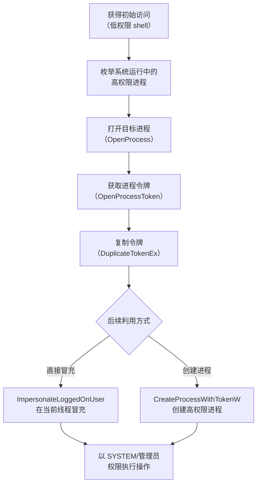

# 访问令牌操纵 (T1134)

## 一句话通俗理解

就像偷了管理员的工牌，戴着它到处走——攻击者窃取或伪造高权限用户的"身份令牌"，冒充他们执行操作。

## 难度等级

⭐⭐⭐ **高级** - 需要深入理解 Windows 令牌机制和 API 调用，技术门槛较高。

## 技术描述

在 Windows 系统中，每个用户登录后都会获得一个"访问令牌"（Access Token），类似于公司的工牌。这个令牌记录了你的身份、权限级别和所属组。当你运行程序时，程序会"佩戴"你的令牌，系统根据令牌来决定程序能做什么。

**通俗解释：**
想象一家公司，每个员工都有一张工牌，上面写着职位和权限级别。攻击者不偷密码，而是直接从管理员那里"借"工牌——趁管理员把工牌放在桌上时偷偷拿去刷一下门禁，或者用复印机伪造一张。系统看到工牌上写着"CEO"，就认为是 CEO 本人在操作，不会要求密码验证。

**技术原理：**

1. **令牌窃取**：从高权限进程（如 SYSTEM 服务）中打开并复制令牌
2. **令牌冒充**：使用窃取的令牌假装是高权限用户执行操作
3. **令牌创建**：使用窃取的令牌创建新进程，新进程继承高权限
4. **特权利用**：利用 `SeImpersonatePrivilege` 或 `SeAssignPrimaryTokenPrivilege` 等特权进行令牌操作

**用途与影响：**
令牌操纵是 Windows 系统中最隐蔽的提权方式之一。攻击者不需要知道管理员密码，只需要能访问高权限进程的令牌。这使得它成为后渗透测试阶段的核心技术。

## 子技术列表

**该技术共有 5 个子技术：**

| 子技术ID | 中文名称 | 通俗解释 |
|----------|----------|----------|
| T1134.001 | 令牌冒充/盗取 | 从高权限进程"偷"令牌来冒充管理员 |
| T1134.002 | 使用令牌创建进程 | 用偷来的令牌启动新进程，新进程也有高权限 |
| T1134.003 | 制作并冒充令牌 | 自己伪造一个高权限令牌 |
| T1134.004 | 父进程ID欺骗 | 伪装进程的"父进程"，让系统以为是合法程序启动的 |
| T1134.005 | SID-History 注入 | 在域中注入虚假的历史身份信息 |

<details>
<summary><strong>展开查看各子技术详细说明</strong></summary>

各子技术详细说明请参阅独立文档：

- [T1134.001 - 令牌冒充/盗取](./T1134/T1134.001-Token-Impersonation-Theft-令牌冒充.md) — 趁管理员不注意，"借"他的工牌用一下。
- [T1134.002 - 使用令牌创建进程](./T1134/T1134.002-Create-Process-with-Token.md) — 用偷来的工牌去注册一个新员工，这个新员工也是管理员。
- [T1134.004 - 父进程ID欺骗](./T1134/T1134.004-Parent-PID-Spoofing.md) — 让新进程假装是系统合法程序（如 explorer.exe）的儿子。

</details>

## 攻击流程



### 令牌窃取与冒充流程

```
1. 获得管理员权限的初始访问
   ↓
2. 枚举运行中的高权限进程（如 lsass.exe、svchost.exe）
   ↓
3. 使用 OpenProcess 打开目标进程
   ↓
4. 使用 OpenProcessToken 获取进程的令牌句柄
   ↓
5. 使用 DuplicateTokenEx 复制令牌
   ↓
6. 使用 ImpersonateLoggedOnUser 冒充该令牌
   ↓
7. 以 SYSTEM 权限执行命令
```

## 真实案例

### 案例1：APT29 使用令牌冒充提升权限

- **时间**: 2021年
- **目标**: 政府和科技组织
- **攻击组织**: APT29 (Cozy Bear)
- **手法**: APT29 通过鱼叉式网络钓鱼获得初始访问后，使用 Windows API 函数（OpenProcessToken、DuplicateTokenEx）从 SYSTEM 进程窃取令牌，然后使用 ImpersonateLoggedOnUser 冒充这些令牌，以 SYSTEM 权限执行恶意代码。
- **影响**: 政府和科技组织的敏感数据被长期窃取
- **参考链接**: [CISA - APT29 Eviction Strategies](https://www.cisa.gov/eviction-strategies-tool/info-attack/T1134)

### 案例2：BlackCat (ALPHV) 勒索软件使用令牌操纵

- **时间**: 2022-2024年
- **目标**: 全球多个行业
- **攻击组织**: BlackCat (ALPHV)
- **手法**: BlackCat 勒索软件使用令牌操纵技术提升权限到 SYSTEM 级别，从而能够禁用安全软件、修改系统配置并加密文件。攻击者通过访问高权限进程的令牌，将其复制到自己的进程上下文，获得 SYSTEM 权限后的加密操作可以绕过许多基于用户权限的访问控制。
- **影响**: 全球多行业企业遭受勒索攻击
- **参考链接**: [MITRE ATT&CK T1134](https://attack.mitre.org/techniques/T1134/)

### 案例3：Lazarus Group 利用 CVE-2024-21338 进行内核级令牌操纵（2024年）

- **时间**: 2024年2月
- **目标**: 金融机构和加密货币交易所
- **攻击组织**: Lazarus Group
- **手法**: Lazarus Group 利用 Windows AppLocker 驱动（appid.sys）中的漏洞 CVE-2024-21338 获取内核级权限，部署 FudModule rootkit 来操纵内核对象和令牌。该漏洞允许攻击者修改进程令牌的特权属性，将低权限进程提升为 SYSTEM 级别，同时禁用安全软件。
- **影响**: 金融机构和加密货币交易所遭受高级间谍活动
- **参考链接**: [Avast - Lazarus FudModule Rootkit](https://www.avast.com/c/lazarus-fudmodule-rootkit)

### 案例4：JuicyPotato 系列工具滥用（持续活跃）

- **时间**: 2019-2025年
- **目标**: Windows 服务器
- **攻击组织**: 多个勒索软件组织
- **手法**: JuicyPotato、RoguePotato、SweetPotato 等工具系列利用 Windows COM 激活和 DCOM 服务的令牌窃取机制。这些工具特别针对具有 `SeImpersonatePrivilege` 或 `SeAssignPrimaryTokenPrivilege` 的账户（如 IIS 应用程序池账户、MSSQL 服务账户），通过触发高权限 COM 对象并窃取其令牌，在低权限上下文中获得 SYSTEM 权限。
- **影响**: 广泛用于 Windows 服务器提权
- **参考链接**: [GitHub - JuicyPotato](https://github.com/ohpe/juicy-potato)

## 红队视角

> ⚠️ **免责声明**：以下内容仅用于合法的安全测试、渗透测试和教育目的。未经授权对他人系统进行测试是违法行为。

### 实战技巧

1. **优先寻找 SYSTEM 权限的服务进程**
   svchost.exe、lsass.exe、services.exe 等进程以 SYSTEM 权限运行，是令牌窃取的首选目标。

2. **利用 SeImpersonatePrivilege**
   具有 `SeImpersonatePrivilege` 的账户（如 IIS 应用程序池账户、MSSQL 服务账户）天生适合进行令牌操作。使用 JuicyPotato 系列工具可以从这些账户直接提升到 SYSTEM。

3. **令牌窃取后创建新进程更稳定**
   使用窃取的令牌创建新进程（`CreateProcessWithTokenW`）比直接在当前线程中冒充（`ImpersonateLoggedOnUser`）更稳定，不容易出现令牌丢失。

### 常用工具

| 工具名称 | 用途 | 平台 | 链接 |
|----------|------|------|------|
| Mimikatz | 经典的 Windows 凭据和令牌操作工具 | Windows | [GitHub](https://github.com/gentilkiwi/mimikatz) |
| Incognito | Metasploit 中的令牌冒充模块 | Windows | Metasploit 内置 |
| Cobalt Strike | 商业 C2 框架，内置令牌窃取和冒充功能 | Windows | https://www.cobaltstrike.com |
| JuicyPotato | COM 令牌窃取提权工具 | Windows | [GitHub](https://github.com/ohpe/juicy-potato) |
| RoguePotato | Windows 10/11 版本令牌窃取 | Windows | [GitHub](https://github.com/antonioCoco/RoguePotato) |

### 注意事项

- 令牌操纵需要 `SeImpersonatePrivilege` 或 `SeAssignPrimaryTokenPrivilege` 特权
- 在 Windows Server 2019+ 上，JuicyPotato 的经典方法可能不适用，需要使用 RoguePotato 或 SweetPotato
- 高版本 Windows 通过 Credential Guard 和 LSA 保护限制了 lsass.exe 的访问
- 所有实验必须在隔离的实验室环境中进行

## 蓝队视角

### 检测要点

1. **异常跨进程令牌操作**
   - 日志来源：Sysmon、EDR
   - 关注字段：`OpenProcessToken`、`DuplicateTokenEx`、`ImpersonateLoggedOnUser` API 调用
   - 异常特征：非管理员进程打开 SYSTEM 进程的句柄

2. **异常进程创建上下文**
   - 日志来源：Windows 安全事件 ID 4688
   - 关注字段：进程以不同的用户上下文创建（如 cmd.exe 以 SYSTEM 运行但父进程是 explorer.exe）
   - 异常特征：非特权进程启动 SYSTEM 级进程

3. **特权异常行使**
   - 日志来源：Windows 安全事件日志
   - 关注字段：`SeImpersonatePrivilege`、`SeAssignPrimaryTokenPrivilege` 的启用和行使
   - 异常特征：通常不具有这些特权的账户突然启用它们

### 监控建议

- 使用 Sysmon 事件 ID 10（ProcessAccess）监控对高权限进程的异常访问
- 监控进程创建中的用户上下文异常（父进程和子进程用户不同）
- 限制具有 `SeImpersonatePrivilege` 和 `SeAssignPrimaryTokenPrivilege` 的账户数量
- 定期审计服务账户和应用程序池账户的特权配置

## 检测建议

### 网络层检测

**检测方法：** 监控从令牌窃取后创建的高权限进程出站的异常连接。

**具体规则/命令示例：**
```
# 检测以 SYSTEM 权限运行的异常 shell
alert tcp $HOME_NET any -> $EXTERNAL_NET 4444 (msg:"SYSTEM shell outbound connection"; sid:1000007; rev:1;)
```

### 主机层检测

**检测方法：** 监控异常进程创建和跨进程访问。

**Windows 事件ID：**
- 事件 ID 10 (Sysmon)：异常进程访问
- 事件 ID 4688：进程创建（关注用户上下文变更）
- 事件 ID 4672：特殊特权分配

**Linux 日志：**
- Windows 令牌操纵是 Windows 特有的技术，Linux 上无直接对应

**具体命令示例：**
```powershell
# 查看最近以 SYSTEM 权限创建的进程
Get-WinEvent -FilterHashtable @{LogName='Security'; ID=4688} | 
    Where-Object {$_.Properties[4].Value -eq "SYSTEM"} |
    Select-Object -First 10 | Format-List
```

**用人话说：** 访问令牌操纵是Windows平台上的核心提权技术。Windows中的访问令牌（Access Token）包含了用户的安全标识和权限信息，攻击者通过窃取高权限令牌、伪造令牌或利用令牌继承机制提升权限。最著名的工具有Mimikatz的token::elevate和Windows API的ImpersonateLoggedOnUser。这就像在机场偷了一张VIP的登机牌——安检系统认牌不认人，拿到谁的令牌就拥有谁的权限。

**Sigma规则示例：**
```yaml
title: Suspicious Token Manipulation via SeImpersonatePrivilege
status: experimental
description: Detects use of SeImpersonatePrivilege by non-standard accounts
logsource:
    category: process_creation
    product: windows
detection:
    selection:
        EventID: 4672
        PrivilegeList: '*SeImpersonatePrivilege*'
    condition: selection
level: high
tags:
    - attack.t1134
```

## 缓解措施

### 优先级1：关键措施

**措施名称：** 限制具有敏感特权的账户

**具体实施步骤：**
1. 审计所有具有 `SeImpersonatePrivilege` 和 `SeAssignPrimaryTokenPrivilege` 的账户
2. 移除不必要的服务账户和应用池账户的这些特权
3. 使用最小权限原则配置服务账户

### 优先级2：重要措施

**措施名称：** 保护高权限进程

**具体实施步骤：**
1. 启用 Windows Defender Credential Guard 保护 lsass.exe
2. 启用基于虚拟化的安全（VBS）保护系统进程
3. 配置 Windows Defender System Guard 运行时验证

### 优先级3：建议措施

**措施名称：** 部署行为监控和 EDR

**具体实施步骤：**
1. 部署 EDR 解决方案监控异常跨进程操作
2. 配置 Sysmon 详细记录进程创建和跨进程访问
3. 建立异常进程创建的行为基线

### MITRE ATT&CK 缓解措施映射

| 缓解措施ID | 缓解措施名称 | 适用性 | 说明 |
|------------|-------------|--------|------|
| M1026 | Privileged Account Management | 适用 | 限制具有敏感特权的账户数量 |
| M1025 | Privileged Process Integrity | 适用 | Credential Guard 保护 lsass 和令牌 |
| M1040 | Behavior Prevention on Endpoint | 适用 | EDR 检测异常令牌操作 |
| M1018 | User Account Management | 部分适用 | 审计服务账户特权配置 |

## 动手实验

> ⚠️ **重要提示**：所有实验必须在隔离的实验室环境中进行，禁止对未授权的真实系统进行测试。

### 实验环境准备

**推荐靶场/实验平台：**

| 平台名称 | 类型 | 难度 | 链接 |
|----------|------|------|------|
| Hack The Box | 虚拟靶场 | 高级 | https://www.hackthebox.com |
| TryHackMe | 虚拟靶场 | 中级 | https://tryhackme.com |

### 实验1：查看进程令牌和特权（初级）

**实验目标：** 理解 Windows 进程令牌和特权的概念。

**实验步骤：**
1. 查看当前进程的权限：`whoami /priv`
2. 使用 Process Explorer 查看进程的令牌信息
3. 查看 SYSTEM 权限进程的令牌属性

**预期结果：** 看到当前用户的权限列表，以及 SYSTEM 进程拥有的高级权限。

**学习要点：** 理解 Windows 访问令牌的基本概念。

### 实验2：使用 Incognito 进行令牌冒充（中级）

**实验目标：** 学习使用 Metasploit 的 Incognito 模块进行令牌操作。

**实验步骤：**
1. 在 Metasploit 会话中加载 incognito
2. 列出可用的令牌
3. 模拟 SYSTEM 令牌

**预期结果：** 成功冒充 SYSTEM 令牌。

**学习要点：** 掌握令牌冒充的基本操作流程。

### 实验3：检测令牌操纵（高级）

**实验目标：** 学习通过 Sysmon 检测令牌操纵行为。

**实验步骤：**
1. 安装并配置 Sysmon
2. 执行令牌窃取操作
3. 查看 Sysmon 事件 ID 10 日志

**预期结果：** Sysmon 记录下对 SYSTEM 进程的异常访问事件。

**学习要点：** 掌握 Sysmon 在令牌操纵检测中的应用。

## 术语解释

| 术语 | 英文原名 | 通俗解释 |
|------|----------|----------|
| 访问令牌 | Access Token | Windows 中代表用户身份和权限的数据结构，像公司的工牌记录你的职位和权限 |
| SYSTEM | - | Windows 中最高权限的本地账户，相当于公司的"董事长" |
| SeImpersonatePrivilege | - | 允许进程冒充其他用户身份的特权，像拿到了可以假装任何人的"变身器" |
| SeDebugPrivilege | - | 允许进程调试其他进程的特权，可用于访问高权限进程的内存 |
| SID | Security Identifier | Windows 中用于唯一标识用户、组和计算机的安全标识符，像每个人的身份证号 |
| SID-History | - | AD 中存储的用户历史 SID 信息，用于迁移场景，攻击者可利用此属性获得额外权限 |
| 令牌句柄 | Token Handle | 引用访问令牌的系统句柄，用于在 API 调用中指定要操作的令牌 |
| 冒充 | Impersonation | 一个线程在另一个用户的安全上下文中执行操作的能力，像借别人的身份办事 |
| Potato 系列 | JuicyPotato/RoguePotato | 利用 COM 激活机制窃取 SYSTEM 令牌的提权工具系列 |

## 参考资料

### 官方文档

- [MITRE ATT&CK T1134 - Access Token Manipulation](https://attack.mitre.org/techniques/T1134/)
- [MITRE ATT&CK T1134.001 - Token Impersonation/Theft](https://attack.mitre.org/techniques/T1134/001/)
- [MITRE ATT&CK T1134.002 - Create Process with Token](https://attack.mitre.org/techniques/T1134/002/)

### 安全报告

- [CISA - Access Token Manipulation](https://www.cisa.gov/eviction-strategies-tool/info-attack/T1134)
- [Avast - Lazarus Group FudModule Rootkit](https://www.avast.com/c/lazarus-fudmodule-rootkit)
- [Elastic - How attackers abuse Access Token Manipulation](https://www.elastic.co/blog/how-attackers-abuse-access-token-manipulation)

### 工具与资源

- [JuicyPotato - COM Token Stealing](https://github.com/ohpe/juicy-potato)
- [RoguePotato - Win10/11 Token Stealing](https://github.com/antonioCoco/RoguePotato)
- [Incognito - Metasploit Token Module](https://github.com/rapid7/metasploit-framework)

### 学习资料

- [ManageEngine - Detecting Access Token Manipulation](https://www.manageengine.com/log-management/mitre-attack/privilege-escalation/access-token-manipulation.html)
- [Atomic Red Team - T1134 Tests](https://github.com/redcanaryco/atomic-red-team/tree/master/atomics/T1134)
