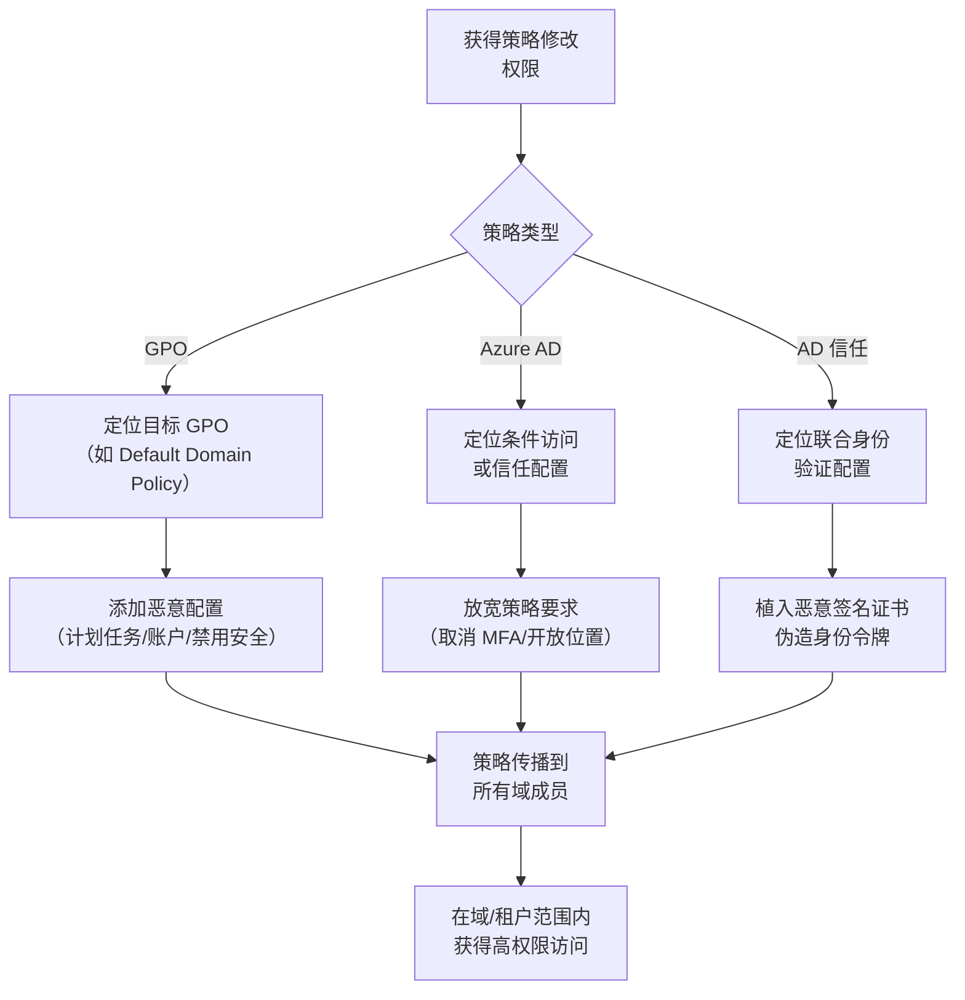

# 域或租户策略修改 (T1484)

## 一句话通俗理解

就像修改公司的规章制度让自己为所欲为——攻击者修改域策略或云租户配置，绕过安全控制并提升整个组织的权限。

## 难度等级

⭐⭐⭐ **高级** - 需要对 Active Directory、Azure AD 或云平台的策略体系有深入理解，且需要高权限账户才能修改策略。

## 技术描述

域或租户策略是组织 IT 环境的"法律"——它定义了谁能访问什么、安全要求是什么、密码策略如何设置。攻击者通过修改这些策略，可以从根本上改变安全规则。

**通俗解释：**
想在一栋大楼里为所欲为？与其逐个撬门（攻击每台计算机），不如直接修改大楼的安保规定——比如"从现在起所有门都不需要刷卡进入"。攻击者修改一次策略，就能影响整个组织中的所有系统，实现"批量提权"。

**技术原理：**

1. **获取策略修改权限**：需要获得域管理员或云管理员的凭据
2. **修改策略配置**：在 GPO、Azure AD 条件访问或 IAM 策略中添加恶意配置
3. **策略传播**：修改后的策略通过 AD 复制或云同步传播到所有受影响的系统
4. **利用提权**：利用放宽的策略获得高权限访问

**用途与影响：**
策略修改是一种"高回报"的攻击方式——一次修改可以影响成百上千台计算机。攻击者可以通过修改 GPO 禁用所有计算机的杀毒软件、添加本地管理员账户、或修改云平台的认证策略为伪造身份令牌打开大门。

## 子技术列表

**该技术共有 4 个子技术：**

| 子技术ID | 中文名称 | 通俗解释 |
|----------|----------|----------|
| T1484.001 | 组策略修改 | 修改 Windows 域的 GPO，影响域内所有计算机 |
| T1484.002 | 信任修改 | 修改 AD 信任关系或联合身份验证配置，伪造身份令牌 |
| T1484.003 | 云策略修改 | 修改 Azure AD/Office 365 的条件访问和安全策略 |
| T1484.004 | 云隐式信任修改 | 修改云环境中的隐式信任关系 |

<details>
<summary><strong>展开查看各子技术详细说明</strong></summary>

### T1484.001 - 组策略修改

**通俗理解：** 修改公司总部下发的"统一规定"，所有分公司都会执行。

**详细说明：** 组策略对象（GPO）是 Windows 域环境中用于集中管理配置的机制。攻击者如果获得了修改 GPO 的权限，可以向 GPO 中添加恶意配置，如创建以 SYSTEM 运行的计划任务、添加本地管理员账户、禁用安全软件等。修改后的策略会通过 AD 复制到所有域控制器，在下次策略刷新时影响域内所有计算机。

### T1484.002 - 信任修改

**通俗理解：** 在大楼的认证系统中植入一个"万能钥匙"——可以打开所有的门。

**详细说明：** Active Directory 信任关系和 Azure AD 联合身份验证配置定义了不同域或组织之间的信任关系。攻击者如果能够修改这些信任配置，可以植入自己控制的 SAML 签名证书，从而伪造任意用户的身份令牌，包括全局管理员。

### T1484.003 - 云策略修改

**通俗理解：** 修改云平台的"安保策略"，取消所有安全限制。

**详细说明：** 云平台的条件访问策略和 IAM 策略控制着谁可以在什么条件下访问哪些资源。攻击者如果获得了云管理权限，可以修改这些策略来放宽安全要求，如取消 MFA 要求、允许来自任意位置的访问。

</details>

## 攻击流程



### GPO 修改域范围提权流程

```
1. 获取具有 GPO 修改权限的域管理员凭据
   ↓
2. 使用 Group Policy Management Console 或 PowerShell 定位目标 GPO
   ↓
3. 修改 GPO 添加恶意配置：
   - 创建以 SYSTEM 运行的计划任务
   - 添加本地管理员账户
   - 修改安全策略禁用防火墙
   ↓
4. 等待 GPO 刷新（默认 90 分钟）或强制刷新：gpupdate /force
   ↓
5. 域内所有计算机应用新策略，恶意配置生效
   ↓
6. 在整个域范围内获得 SYSTEM 权限或管理员访问
```

### Azure AD 信任修改提权流程

```
1. 获取具有 Azure AD 管理权限的凭据
   ↓
2. 添加攻击者控制的 SAML 签名证书到信任存储
   ↓
3. 使用该证书伪造任意用户的身份令牌
   ↓
4. 绕过 MFA 和条件访问策略
   ↓
5. 以任意用户（包括全局管理员）的身份访问资源
```

## 真实案例

### 案例1：BlackBasta 勒索软件利用 GPO 禁用安全工具并部署勒索软件（2024年）

- **时间**: 2024年
- **目标**: 全球医疗、制造和金融行业
- **攻击组织**: BlackBasta
- **手法**: BlackBasta 勒索软件组织在获得域管理员权限后，利用组策略修改（T1484.001）在域范围内禁用安全工具并部署勒索软件。攻击者修改了默认域策略 GPO，添加了禁用 Windows Defender 实时保护、关闭防篡改保护、修改防火墙规则的配置。然后通过 GPO 推送勒索软件加密器到域内所有计算机。CISA 在 2024 年发布的 advisory (AA24-109A) 中详细记录了这种技术。
- **影响**: 全球多行业遭受大规模勒索攻击
- **参考链接**: [CISA - BlackBasta Advisory (AA24-109A)](https://www.cisa.gov/news-events/cybersecurity-advisories/aa24-109a)

### 案例2：Nobelium (APT29) 修改 Azure AD 联合身份验证信任（2021-2024年）

- **时间**: 2021-2024年
- **目标**: 美国政府机构、IT 公司、智库
- **攻击组织**: Nobelium (APT29)
- **手法**: Nobelium (APT29) 在 SolarWinds 供应链攻击后，利用被盗的认证凭据访问 Azure AD 租户，修改了联合身份验证信任配置（T1484.002）。攻击者添加了自行控制的 SAML 签名证书到 Azure AD 信任存储中，可以伪造任意用户的身份令牌。通过这种信任修改，APT29 能够伪装成任何 Azure AD 用户，包括全局管理员，绕过 MFA 和条件访问策略的限制。
- **影响**: 美国政府机构和科技公司遭受重大数据泄露
- **参考链接**: [CISA - APT29 Advisory (AA24-057A)](https://www.cisa.gov/news-events/cybersecurity-advisories/aa24-057a)

### 案例3：Scattered Spider 修改云条件访问策略（2023-2024年）

- **时间**: 2023-2024年
- **目标**: MGM Resorts、Caesars Entertainment 等大型企业
- **攻击组织**: Scattered Spider
- **手法**: Scattered Spider 在获得云管理凭据后，修改了受害组织的 Azure AD 条件访问策略（T1484.003）。攻击者创建了放宽的多因素认证要求策略，将现有安全策略替换为允许来自任意地理位置和设备的访问策略。然后他们利用放宽的策略将自己添加为全局管理员，确保其高权限访问不会被 MFA 要求所阻断。
- **影响**: MGM Resorts 遭受约 1 亿美元损失
- **参考链接**: [MITRE ATT&CK - Scattered Spider](https://attack.mitre.org/groups/G1015/)

### 案例4：Akira 勒索软件利用 GPO 横向传播（2024年）

- **时间**: 2024年
- **目标**: 全球多个行业的企业网络
- **攻击组织**: Akira
- **手法**: Akira 勒索软件在利用 VPN 漏洞（特别是 Cisco ASA/FTD）获得初始访问后，使用 GPO 修改来禁用安全工具和横向传播。攻击者修改了组策略对象，部署了禁用 Windows Defender、删除卷影副本、停止备份服务的配置，然后通过 GPO 在域内所有计算机上部署勒索软件加密器。
- **影响**: 全球多行业企业遭受数据加密勒索
- **参考链接**: [MITRE ATT&CK - Akira](https://attack.mitre.org/software/S1087/)

## 红队视角

> ⚠️ **免责声明**：以下内容仅用于合法的安全测试、渗透测试和教育目的。未经授权对他人系统进行测试是违法行为。

### 实战技巧

1. **修改 GPO 前备份原始配置**
   在修改 GPO 前先导出原始配置，以便在测试后恢复。使用 `Get-GPOBackup` 或 Group Policy Management Console 进行备份。

2. **优先修改链接到目标 OU 的 GPO**
   避免修改"Default Domain Policy"这样影响整个域的 GPO，优先修改链接到特定 OU（如"服务器"OU）的 GPO，减少被检测到的概率。

3. **使用 `gpupdate /force` 强制立即应用**
   不要等待默认的 90 分钟刷新间隔，使用 `gpupdate /force` 让策略立即生效。

4. **在 Azure AD 中检查委派权限**
   即使不是全局管理员，具有 "Privileged Role Administrator" 或 "Conditional Access Administrator" 角色的用户也可以修改敏感策略。

### 常用工具

| 工具名称 | 用途 | 平台 | 链接 |
|----------|------|------|------|
| SharpGPOAbuse | 自动化 GPO 滥用工具 | Windows | [GitHub](https://github.com/FSecureLABS/SharpGPOAbuse) |
| PowerView | PowerShell AD 枚举和操纵工具 | Windows | [GitHub](https://github.com/PowerShellMafia/PowerSploit) |
| StandIn | AD 攻击工具集 | Windows | [GitHub](https://github.com/FuzzySecurity/StandIn) |
| BloodHound | AD 权限关系分析工具 | 跨平台 | [GitHub](https://github.com/BloodHoundAD/BloodHound) |

### 注意事项

- 修改域范围的 GPO 影响很大，容易被 SOC 检测到
- Azure AD 审计日志会记录所有策略修改操作，考虑使用合法的委派账户
- 修改信任关系是高风险操作，可能导致认证服务中断
- 测试环境中验证后再在生产环境中使用

## 蓝队视角

### 检测要点

1. **GPO 异常修改**
   - 日志来源：Windows 安全事件日志
   - 关注字段：事件 ID 5136（目录服务更改）、5137（对象创建）、5141（对象删除）
   - 异常特征：非授权账户在非工作时间修改 GPO，特别是默认域策略

2. **Azure AD 联合身份验证配置更改**
   - 日志来源：Azure AD 审计日志
   - 关注字段：SAML 签名证书更新、信赖方信任创建
   - 异常特征：来自非预期 IP 地址的联合身份验证配置修改

3. **条件访问策略异常修改**
   - 日志来源：Azure AD 审计日志
   - 关注字段：条件访问策略创建或修改
   - 异常特征：策略从严格模式突然变为允许所有访问

### 监控建议

- 使用 Microsoft 365 Defender 监控 Azure AD 审计日志中的特权配置修改
- 配置实时告警：任何对 Default Domain Policy 的修改立即通知安全团队
- 使用 PingCastle 或 BloodHound 定期评估 AD 安全态势
- 设置 GPO 修改的审批流程和变更管理

## 检测建议

### 网络层检测

**检测方法：** 监控策略传播过程中的异常网络流量。

**具体规则/命令示例：**
```
# 检测 GPO 复制期间的异常文件访问
alert tcp $HOME_NET any -> $HOME_NET 445 (msg:"Suspicious GPO file access via SMB"; content:"|5c 00|SYSVOL|5c 00|"; sid:1000008; rev:1;)
```

### 主机层检测

**检测方法：** 监控 GPO 修改和策略应用事件。

**Windows 事件ID：**
- 事件 ID 5136：目录服务更改（GPO 修改）
- 事件 ID 5137：目录服务对象创建
- 事件 ID 5141：目录服务对象删除
- 事件 ID 8000-8006：组策略应用事件

**具体命令示例：**
```powershell
# 查看 GPO 修改事件
Get-WinEvent -FilterHashtable @{LogName='Security'; ID=5136,5137,5141} | 
    Where-Object {$_.Message -like "*groupPolicyContainer*"} |
    Select-Object -First 10 | Format-List

# 查看 AD 复制元数据
repadmin /showobjmeta * "CN={GPO-GUID},CN=Policies,CN=System,DC=domain,DC=com"
```

### 应用层检测

**Sigma规则示例：**
```yaml
title: Group Policy Object Modification
status: experimental
description: Detects modifications to Group Policy Objects
logsource:
    category: ds_change
    product: windows
detection:
    selection:
        EventID: 5136
        ObjectDN|contains: 'CN=Policies,CN=System'
    condition: selection
level: high
tags:
    - attack.t1484
```

## 缓解措施

### 优先级1：关键措施

**措施名称：** 严格控制 GPO 和策略修改权限

**具体实施步骤：**
1. 限制能够修改组策略的账户数量，实施审批流程
2. 对 Azure AD 中全局管理员和特权角色管理员实施 PIM
3. 限制对联合身份验证配置的修改权限

### 优先级2：重要措施

**措施名称：** 变更管理和审计

**具体实施步骤：**
1. 为所有策略修改实施变更管理流程
2. 使用 Microsoft 365 Defender 监控 Azure AD 审计日志
3. 定期审计 GPO 配置和 Azure AD 条件访问策略

### 优先级3：建议措施

**措施名称：** 安全加固

**具体实施步骤：**
1. 使用 Privileged Identity Management (PIM) 管理特权角色
2. 从 GPO 中审计移除已知的风险策略配置
3. 使用条件访问策略检测和阻止异常的信任修改

### MITRE ATT&CK 缓解措施映射

| 缓解措施ID | 缓解措施名称 | 适用性 | 说明 |
|------------|-------------|--------|------|
| M1026 | Privileged Account Management | 适用 | PIM 控制 GPO/策略修改权限 |
| M1028 | Operating System Configuration | 适用 | 组策略安全配置基线 |
| M1018 | User Account Management | 部分适用 | 限制可修改策略的账户 |
| M1037 | Filter Network Traffic | 不适用 | - |

## 动手实验

> ⚠️ **重要提示**：所有实验必须在隔离的实验室环境中进行，禁止对未授权的真实系统进行测试。

### 实验环境准备

**推荐靶场/实验平台：**

| 平台名称 | 类型 | 难度 | 链接 |
|----------|------|------|------|
| Hack The Box | 虚拟靶场 | 高级 | https://www.hackthebox.com |
| TryHackMe | 虚拟靶场 | 中级 | https://tryhackme.com |

### 实验1：查看和导出组策略（初级）

**实验目标：** 理解 GPO 的基本概念和操作方法。

**实验步骤：**
1. 查看当前应用的组策略：`gpresult /r /scope computer`
2. 查看用户策略：`gpresult /r /scope user`
3. 查看域 GPO 列表：`Get-GPO -All | Select-Object DisplayName`

**预期结果：** 显示当前应用的组策略配置。

**学习要点：** 掌握 GPO 的基本操作和查询方法。

### 实验2：检测 GPO 修改（中级）

**实验目标：** 学习通过事件日志检测 GPO 修改。

**实验步骤：**
1. 创建测试 GPO
2. 查看 GPO 修改事件
3. 分析事件详情

**预期结果：** 安全日志中记录 GPO 创建和修改事件。

**学习要点：** 掌握 GPO 修改的审计方法。

### 实验3：Azure AD 条件访问策略审计（中级）

**实验目标：** 学习审计 Azure AD 策略配置。

**实验步骤：**
1. 连接 Microsoft Graph PowerShell
2. 列出所有条件访问策略
3. 查看策略详情

**预期结果：** 显示 Azure AD 中的所有条件访问策略。

**学习要点：** 掌握 Azure AD 策略审计方法。

## 术语解释

| 术语 | 英文原名 | 通俗解释 |
|------|----------|----------|
| GPO | Group Policy Object | Windows 域中用于集中管理配置的组策略对象，像公司的统一规章制度手册 |
| 条件访问 | Conditional Access | Azure AD 中根据用户、设备、位置等条件动态控制访问权限的策略 |
| 联合身份验证 | Federation | 允许用户使用一组凭据访问多个组织资源的身份验证机制，类似"一卡通" |
| SAML | Security Assertion Markup Language | 用于交换认证和授权数据的 XML 标准，联合身份验证的基础协议 |
| OU | Organizational Unit | AD 中用于组织用户、计算机和组的容器，像公司的部门划分 |
| 信任关系 | Trust Relationship | 两个域或林之间的身份验证信任，允许一个域的用户访问另一个域的资源 |
| IAM 策略 | IAM Policy | 云平台中定义用户或角色权限的 JSON 文档，像每个职位的岗位职责说明 |
| AD 复制 | AD Replication | Active Directory 在域控制器之间同步数据的机制，像公司总部向分公司传达通知 |

## 参考资料

### 官方文档

- [MITRE ATT&CK T1484 - Domain or Tenant Policy Modification](https://attack.mitre.org/techniques/T1484/)
- [MITRE ATT&CK T1484.001 - Group Policy Modification](https://attack.mitre.org/techniques/T1484/001/)
- [MITRE ATT&CK T1484.003 - Cloud Policy Modification](https://attack.mitre.org/techniques/T1484/003/)

### 安全报告

- [CISA - BlackBasta Advisory (AA24-109A)](https://www.cisa.gov/news-events/cybersecurity-advisories/aa24-109a)
- [CISA - APT29 SolarWinds Advisory (AA24-057A)](https://www.cisa.gov/news-events/cybersecurity-advisories/aa24-057a)
- [MITRE ATT&CK - Scattered Spider](https://attack.mitre.org/groups/G1015/)

### 学习资料

- [Microsoft - Azure AD Federation](https://docs.microsoft.com/en-us/azure/active-directory/hybrid/how-to-connect-fed-whatis)
- [Microsoft - Group Policy Overview](https://docs.microsoft.com/en-us/windows/win32/srvgroup/group-policy)
- [Atomic Red Team - T1484 Tests](https://github.com/redcanaryco/atomic-red-team/tree/master/atomics/T1484)
- [SharpGPOAbuse Tool](https://github.com/FSecureLABS/SharpGPOAbuse)
