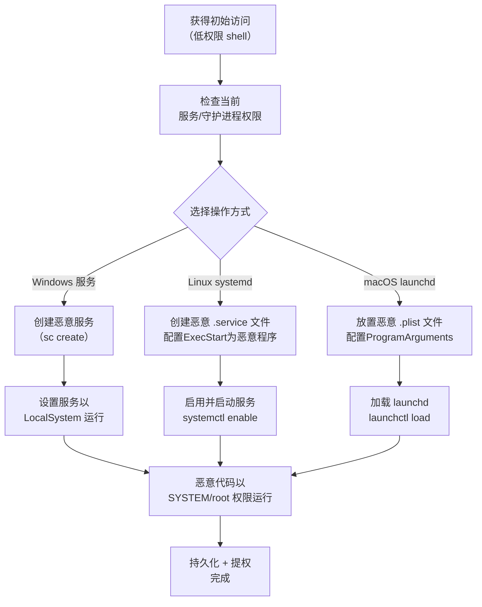

# 创建或修改系统进程 (T1543)

## 一句话通俗理解

就像在你当前住的公寓里，给大楼的管理系统注册一个"永远自动启动的清洁服务"——攻击者创建或修改系统服务/守护进程，以确保恶意负载随系统启动自动运行且具有高权限。

## 难度等级

⭐⭐ **中级** - 需要理解操作系统服务机制，但技术门槛适中，攻击工具成熟。

## 技术描述

系统进程（在 Windows 中称为"服务"，在 Linux/Mac 中称为"守护进程"）是操作系统在后台运行核心功能的程序。它们通常在系统启动时自动运行，并且往往具有高权限。攻击者通过创建新的恶意服务或修改现有服务配置，实现持久化和提权。

**通俗解释：**
大楼里有专门的"维修服务"——比如电工每天定时巡检、清洁工每天早上打扫。这些服务由物业管理处（操作系统）统一管理，不需要住户（普通用户）操心。攻击者想做的是：要么给大楼注册一个看起来合法的维修服务（但实际上是伪装的小偷），要么把已有的电工服务"承包"给同伙，让同伙佩戴电工的工牌自由进入任何房间。

**技术原理：**

1. **创建新服务/守护进程**：使用系统工具（如 sc、systemctl）或 API（CreateService、xfce4-session）注册新服务
2. **修改现有服务/守护进程**：篡改已有系统服务的二进制路径、启动参数或配置，使其执行恶意代码
3. **设置自动启动**：配置服务在系统启动时自动运行
4. **利用高权限服务**：以 SYSTEM 或 root 权限运行的服务可以被利用来提权

**用途与影响：**
服务/守护进程是高级持久化的核心手段。一旦攻击者以低权限账户注册了一个以 SYSTEM 身份运行的服务，就能立即获得系统最高权限，并在每次重启后保持控制。

## 子技术列表

**该技术共有 4 个子技术：**

| 子技术ID | 中文名称 | 通俗解释 |
|----------|----------|----------|
| T1543.001 | Windows 服务 | 创建或修改 Windows 服务，使其以 SYSTEM 权限自动运行 |
| T1543.002 | 系统守护进程 | 在 Linux/Mac 上创建或修改系统守护进程（systemd/launchd） |
| T1543.003 | Windows 服务（另一视角） | IOC 视野下关注的 Windows 服务异常行为 |
| T1543.004 | launchd | 在 macOS 上创建或修改 launchd 守护进程或代理 |

<details>
<summary><strong>展开查看各子技术详细说明</strong></summary>

### T1543.001 - Windows 服务

**通俗理解：** 给 Windows 注册一个"永远开机自启的程序"。

**详细说明：** 攻击者使用 `sc create`、`net start` 命令或 `CreateService` API 创建恶意 Windows 服务。配置为以 LocalSystem（最高本地权限）身份运行，服务指向恶意可执行文件。这样恶意代码在系统启动时自动加载，并在后台以 SYSTEM 权限持续运行。

### T1543.002 - 系统守护进程

**通俗理解：** 在 Linux 上注册一个"系统级别"的自启脚本。

**详细说明：** 攻击者创建 systemd 服务单元文件（.service）或使用 init.d 脚本注册持久化服务。配置为在系统引导时启动，以 root 权限运行恶意进程。在 macOS 上使用 launchd plist 文件注册守护进程。

### T1543.004 - launchd

**通俗理解：** 在 Mac 上注册一个"系统级"的后台程序。

**详细说明：** macOS 使用 launchd 管理守护进程（系统级）和代理（用户级）。攻击者在 `/Library/LaunchDaemons/` 或 `/Library/LaunchAgents/` 目录放置 plist 配置文件，注册恶意程序在系统启动时自动执行。以 root 权限运行的恶意守护进程可以持续控制 macOS 系统。

</details>

## 攻击流程



### Windows 服务创建流程

```
1. 获取足够的权限（管理员或服务控制权限）
   ↓
2. 准备恶意可执行文件（如 reverse shell payload）
   ↓
3. 创建服务指定恶意程序路径：
   sc create MaliciousService binPath= "C:\path\to\malware.exe" start= auto
   ↓
4. 配置服务以 LocalSystem 身份运行：
   sc config MaliciousService obj= "LocalSystem"
   ↓
5. 启动服务立即执行恶意代码：
   net start MaliciousService
   ↓
6. 恶意程序以 SYSTEM 权限运行（持久化+提权）
```

### Linux systemd 服务创建流程

```
1. 获得 root 或 sudo 权限
   ↓
2. 创建 systemd 服务单元文件 /etc/systemd/system/malicious.service
   ↓
3. 编写 service 文件配置 ExecStart 指向恶意脚本
   ↓
4. 启用服务自动启动：systemctl enable malicious.service
   ↓
5. 启动服务执行恶意代码：systemctl start malicious.service
   ↓
6. 恶意脚本以 root 权限运行
```

## 真实案例

### 案例1：Raspberry Robin 蠕虫利用 Windows 服务持久化（2022-2024年）

- **时间**: 2022-2024年
- **目标**: 全球制造业和科技公司
- **攻击组织**: Raspberry Robin（关联到多个勒索软件组织）
- **手法**: Raspberry Robin 蠕虫在感染 USB 设备后，通过创建 Windows 服务（T1543.001）实现持久化。恶意服务以 LocalSystem 身份自动启动，指向蠕虫的可执行文件。该服务配置为即使在安全模式（Safe Mode）下也能启动。Raspberry Robin 随后通过 c2 通信下载第二阶段 payload，包括 Clop 和 LockBit 等勒索软件。
- **影响**: 全球数千台设备被感染，多个行业遭受勒索攻击
- **参考链接**: [Microsoft - Raspberry Robin Worm](https://www.microsoft.com/en-us/security/blog/2022/10/27/raspberry-robin-worm-part-of-larger-ecosystem-enabling-pre-ransomware-activity/)

### 案例2：BlackCat (ALPHV) 勒索软件创建恶意服务（2022-2024年）

- **时间**: 2022-2024年
- **目标**: 全球各行业企业
- **攻击组织**: BlackCat (ALPHV)
- **手法**: BlackCat 勒索软件在加密阶段创建 Windows 服务来部署加密器。攻击者利用域管理员权限，在域控制器上创建恶意服务，配置为以 SYSTEM 权限运行勒索软件二进制文件。该服务包含命令行参数指定加密选项，确保恶意操作在系统启动级别执行，绕过普通用户上下文的安全限制。
- **影响**: 全球多行业遭受勒索攻击
- **参考链接**: [MITRE ATT&CK - ALPHV BlackCat](https://attack.mitre.org/software/S0665/)

### 案例3：APT29 利用 Windows 服务实现长期持久化（持续活跃）

- **时间**: 2020-2025年
- **目标**: 政府机构、智库、IT 公司
- **攻击组织**: APT29 (Cozy Bear / NOBELIUM)
- **手法**: APT29 在获得高权限访问后，使用合法的 Windows 服务作为"诱饵"加载恶意 DLL。攻击者修改合法服务的配置（如 Windows Time 服务 w32time），通过服务配置中的 ServiceDLL 注册表项指向恶意 DLL，而不是修改服务二进制本身。这种旁路加载方式使得服务看起来正常运行，但实际恶意 DLL 在每个服务启动时被加载到 SYSTEM 进程上下文中。
- **影响**: 美国政府机构和科技公司的长期间谍活动
- **参考链接**: [CISA - APT29 Detection and Response](https://www.cisa.gov/news-events/cybersecurity-advisories/aa24-057a)

### 案例4：Vivek Ramachandran 演示恶意 systemd 服务（教育演示，2024年）

- **时间**: 2024年
- **目标**: 教育演示
- **攻击组织**: 安全研究者
- **手法**: 安全研究者演示了通过创建伪装成系统服务的 systemd 单元文件实现 Linux 持久化的技术。恶意服务名称伪装成常见的系统服务（如 systemd-networkd），但 ExecStart 指向后门程序。该服务配置为在系统进入 multi-user.target 时自动启动，并通过 Alias 和 WantedBy 指令确保在各种运行级别都被激活。
- **影响**: 教育目的，向安全社区展示威胁
- **参考链接**: [Linux Privilege Escalation and Persistence Techniques](https://www.pentesteracademy.com/)

## 红队视角

> ⚠️ **免责声明**：以下内容仅用于合法的安全测试、渗透测试和教育目的。未经授权对他人系统进行测试是违法行为。

### 实战技巧

1. **服务名称伪装为合法系统服务**
   使用类似 "WindowsUpdateService" 或 "MicrosoftSecurityCenter" 的名称，避免引起注意。

2. **利用 SVC 漏洞**
   当某个目录（如 C:\ProgramData）具有弱权限时，将恶意文件放置到合法服务可执行文件的路径中，替换或劫持服务启动。

3. **使用 PowerShell 的 New-Service**
   PowerShell 提供了更灵活的服务创建方式：`New-Service -Name "Backdoor" -BinaryPathName "C:\path\to\malware.exe" -StartupType Automatic`

4. **服务 Dll 劫持（ServiceDLL）**
   在注册表 `HKLM\SYSTEM\CurrentControlSet\Services\<Service>\Parameters` 中修改 `ServiceDll` 值，比直接修改服务二进制更隐蔽。

### 常用工具

| 工具名称 | 用途 | 平台 | 链接 |
|----------|------|------|------|
| sc.exe | Windows 内置服务控制工具 | Windows | 系统内置 |
| PowerShell | New-Service、Set-Service | Windows | 系统内置 |
| systemctl | Linux 服务管理工具 | Linux | 系统内置 |
| launchctl | macOS 服务管理工具 | macOS | 系统内置 |
| PowerSploit | 持久化模块集合 | Windows | [GitHub](https://github.com/PowerShellMafia/PowerSploit) |

### 注意事项

- 创建服务通常需要管理员权限，低权限账户无法执行
- Windows 服务路径必须引用有效的可执行文件（binPath）
- 修改系统关键服务（如 wuauserv）风险高，可能导致系统不稳定
- 创建的服务会在 Windows 服务管理控制台和事件日志中留下记录
- Linux/Unix 上创建守护进程需要 root 权限

## 蓝队视角

### 检测要点

1. **异常服务创建**
   - 日志来源：Windows 安全事件 ID 4697（服务已安装）
   - 关注字段：服务名称、服务可执行文件路径、启动类型
   - 异常特征：非标准的服务名称、从临时目录启动的服务、配置为 AutoStart 的恶意服务

2. **服务配置修改**
   - 日志来源：Windows 安全事件 
   - 关注字段：服务二进制路径修改、服务账户变更
   - 异常特征：合法服务的二进制路径更改到可疑目录

3. **systemd 单元文件创建/修改**
   - 日志来源：Linux auditd、systemd journal
   - 关注字段：/etc/systemd/system/ 和 /lib/systemd/system/ 目录变化
   - 异常特征：非管理员用户创建单元文件、服务二进制指向非标准路径

### 监控建议

- 使用 Sysmon 事件 ID 1（进程创建）监控从服务启动的进程
- 配置 Windows 事件日志收集和管理事件 4697
- 使用 auditd 监控 /etc/systemd/system/ 目录的文件创建事件
- 定期审计已安装的服务列表，与基线比较发现新增服务

## 检测建议

### 网络层检测

**检测方法：** 监控服务进程的异常出站连接。

**具体规则/命令示例：**
```
# 检测服务进程的异常网络连接
alert tcp $HOME_NET any -> $EXTERNAL_NET $HTTP_PORTS (msg:"Service process connecting to external IP"; flow:to_server,established; sid:1000009; rev:1;)
```

### 主机层检测

**检测方法：** 监控服务创建、修改和异常行为。

**Windows 事件ID：**
- 事件 ID 4697：服务已安装（服务创建的关键事件）
- 事件 ID 7040：服务启动类型改变
- 事件 ID 7045：服务已安装（旧版 Windows）
- 事件 ID 1 (Sysmon)：进程创建

**具体命令示例：**
```powershell
# 查看最近创建的服务
Get-WinEvent -FilterHashtable @{LogName='System'; ID=7045} | 
    Select-Object -First 10 | Format-List

# 查看服务完整性并检查可疑服务
Get-Service | Where-Object {$_.StartType -eq 'Automatic' -and $_.Name -notlike "Microsoft*"}
```

### 应用层检测

**Sigma规则示例：**
```yaml
title: Suspicious Service Installation
status: experimental
description: Detects installation of new services by non-standard accounts
logsource:
    category: service_installation
    product: windows
detection:
    selection:
        EventID: 4697
        ServiceFileName|contains:
            - '\Temp\'
            - '\Users\'
            - '\AppData\'
    condition: selection
level: high
tags:
    - attack.t1543
```

## 缓解措施

### 优先级1：关键措施

**措施名称：** 最小权限原则控制服务创建

**具体实施步骤：**
1. 限制非管理员账户的 SeServiceLogonRight 特权
2. 使用 AppLocker 控制可执行文件的运行权限
3. 通过 GPO 限制非授权用户可以安装的服务类型

### 优先级2：重要措施

**措施名称：** 系统服务完整性监控

**具体实施步骤：**
1. 建立服务基线并定期对比审计
2. 启用 Windows Defender 应用程序控制（WDAC）
3. 监控 /etc/systemd/system/ 目录的变更

### 优先级3：建议措施

**措施名称：** 行为检测

**具体实施步骤：**
1. 部署 EDR 解决方案检测异常服务行为
2. 配置 Sysmon 详细记录进程树
3. 定期审查服务账户权限

### MITRE ATT&CK 缓解措施映射

| 缓解措施ID | 缓解措施名称 | 适用性 | 说明 |
|------------|-------------|--------|------|
| M1026 | Privileged Account Management | 适用 | 限制服务创建和修改权限 |
| M1047 | Audit | 适用 | 审计服务创建和修改事件 |
| M1018 | User Account Management | 适用 | 最小化服务账户权限 |
| M1024 | Restrict Registry Permissions | 适用 | 保护服务相关的注册表项 |

## 动手实验

> ⚠️ **重要提示**：所有实验必须在隔离的实验室环境中进行，禁止对未授权的真实系统进行测试。

### 实验环境准备

**推荐靶场/实验平台：**

| 平台名称 | 类型 | 难度 | 链接 |
|----------|------|------|------|
| Hack The Box | 虚拟靶场 | 中级 | https://www.hackthebox.com |
| TryHackMe | 虚拟靶场 | 初级 | https://tryhackme.com |

### 实验1：创建和操作 Windows 服务（初级）

**实验目标：** 学习使用 sc.exe 和 PowerShell 管理 Windows 服务。

**实验步骤：**
1. 使用 sc.exe 创建测试服务：`sc create TestService binPath= "C:\Windows\System32\calc.exe" start= auto`
2. 查看服务属性：`sc query TestService`
3. 启动和停止服务：`net start TestService` / `net stop TestService`
4. 删除服务：`sc delete TestService`

**预期结果：** 服务成功创建、启动、停止和删除。

**学习要点：** 掌握 Windows 服务的基本操作。

### 实验2：创建和操作 Linux systemd 服务（初级）

**实验目标：** 学习创建和管理 Linux systemd 服务。

**实验步骤：**
1. 创建测试服务单元文件
2. 启用并启动服务
3. 查看服务状态：`systemctl status test.service`
4. 停止并禁用服务

**预期结果：** systemd 服务成功运行并管理。

**学习要点：** 掌握 systemd 服务的基本操作。

### 实验3：检测恶意服务创建（中级）

**实验目标：** 学习通过事件日志检测服务创建。

**实验步骤：**
1. 清理事件日志：`wevtutil cl System`
2. 创建测试服务
3. 查看 4697 和 7045 事件
4. 分析事件内容识别恶意服务特征

**预期结果：** 安全日志和系统日志记录服务创建事件。

**学习要点：** 掌握服务创建的检测方法。

## 术语解释

| 术语 | 英文原名 | 通俗解释 |
|------|----------|----------|
| Windows 服务 | Windows Service | 在 Windows 后台运行的程序，不依赖用户登录，像大楼的中央空调系统——不需要有人按开关就自动运行 |
| 守护进程 | Daemon | Linux/Unix 系统中后台运行的程序，相当于 Windows 服务的"表亲"，也像大楼的自动门禁系统 |
| systemd | - | 现代 Linux 系统的服务管理器，像大楼的智能化物业管理系统 |
| launchd | - | macOS 系统的服务管理器，类似 Mac 电脑的"大管家" |
| binPath | - | Windows 服务中指定服务程序路径的配置项，像告诉大楼"清洁服务在哪个办公室" |
| LocalSystem | - | Windows 最高权限的服务账户，像大楼的"总工程师"——可以进入任何房间 |
| 服务DLL | ServiceDLL | Windows 服务以 DLL 形式加载的入口点，像清洁服务的"委托合同"由另一家公司执行 |
| 单元文件 | Unit File | systemd 服务的配置文件（.service 文件），定义了服务的启动方式和执行命令，像一份详细的"值班安排表" |

## 参考资料

### 官方文档

- [MITRE ATT&CK T1543 - Create or Modify System Process](https://attack.mitre.org/techniques/T1543/)
- [MITRE ATT&CK T1543.001 - Windows Service](https://attack.mitre.org/techniques/T1543/001/)
- [MITRE ATT&CK T1543.002 - Systemd Service](https://attack.mitre.org/techniques/T1543/002/)

### 安全报告

- [Microsoft - Raspberry Robin Worm](https://www.microsoft.com/en-us/security/blog/2022/10/27/raspberry-robin-worm-part-of-larger-ecosystem-enabling-pre-ransomware-activity/)
- [CISA - APT29 Detection and Response](https://www.cisa.gov/news-events/cybersecurity-advisories/aa24-057a)
- [MITRE ATT&CK - ALPHV BlackCat](https://attack.mitre.org/software/S0665/)

### 学习资料

- [Microsoft - Windows Service](https://docs.microsoft.com/en-us/windows/win32/services/services)
- [systemd - Creating and modifying systemd unit files](https://www.freedesktop.org/software/systemd/man/systemd.unit.html)
- [Atomic Red Team - T1543 Tests](https://github.com/redcanaryco/atomic-red-team/tree/master/atomics/T1543)
- [PowerSploit - Persistence Module](https://github.com/PowerShellMafia/PowerSploit)
