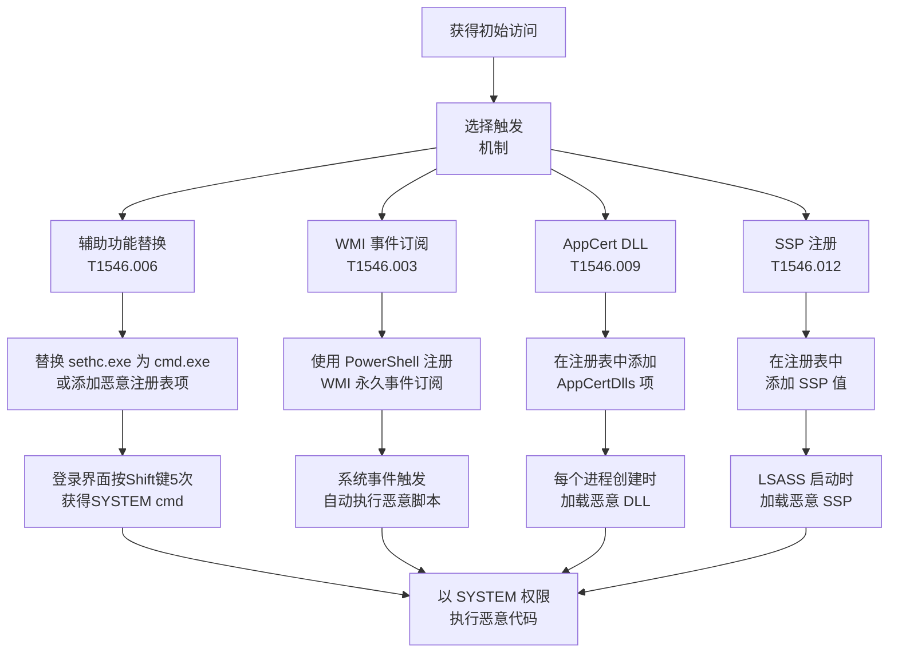

# 事件触发执行 (T1546)

## 一句话通俗理解

就像在电路中加装了一个"连环开关"——当指定的"事件"（如用户登录、程序启动、U盘插入）发生时，自动触发恶意代码运行。攻击者利用系统的各种触发机制，在特定条件下自动执行恶意代码。

## 难度等级

⭐⭐ **中级** - 攻击手法种类繁多，但每种手法的具体技术门槛不高，关键在于选择合适的触发机制。

## 技术描述

操作系统提供了丰富的"事件触发"机制——当特定事件发生时，系统可以自动执行指定的程序。这些机制本意是用于合法用途（如软件更新、驱动程序加载），但攻击者可以将这些机制武器化。

**通俗解释：**
就像家里装了各种"智能传感器"——门开了自动亮灯、有人经过自动开摄像头。攻击者做的事情是一样的：在系统中安装"传感器"（修改注册表或配置），当某个事件发生时（比如用户登录、U盘插入），自动触发恶意程序。这样攻击者不需要一直盯着系统，恶意代码会在最合适的时机自动执行。

**技术原理：**

1. **选择触发机制**：确定使用哪种系统事件触发机制
2. **注册恶意代码**：将恶意程序注册到事件的触发配置中
3. **等待事件触发**：合法用户或系统操作触发事件
4. **自动执行恶意代码**：事件触发时恶意程序以触发进程的权限自动运行

**用途与影响：**
事件触发是最隐蔽的持久化和提权方式之一。攻击者可以在低权限状态下注册事件，等待高权限用户操作（如管理员登录）时触发恶意代码，从而实现提权。由于触发者是合法操作，很难被检测为异常。

## 子技术列表

**该技术共有 12 种子技术：**

| 子技术ID | 中文名称 | 通俗解释 |
|----------|----------|----------|
| T1546.001 | 更改默认文件关联 | 改修文件类型默认打开程序，点击.tx t文件变成启动恶意软件 |
| T1546.002 | 屏幕保护程序 | 设置恶意程序为屏保程序，屏幕锁定时触发 |
| T1546.003 | Windows 管理规范事件订阅 | 注册 WMI 事件，系统条件满足时触发恶意脚本 |
| T1546.004 | .bash_profile 和 .bashrc | 修改 Linux 用户的 shell 配置文件，登录时触发 |
| T1546.005 | 应用程序初始化 | 修改 DLL 劫持配置，程序启动时加载恶意 DLL |
| T1546.006 | 辅助功能 | 替换登录界面的辅助功能程序（如放大镜），在登录前以 SYSTEM 运行 |
| T1546.007 | Netsh 帮助程序 DLL | 通过 netsh 加载恶意 DLL，在管理员上下文中执行 |
| T1546.008 | 访问功能 | 修改登录界面的访问功能，类似辅助功能 |
| T1546.009 | AppCert DLL | 通过 AppCert DLL 注册，所有调用 CreateProcess 的进程都加载恶意 DLL |
| T1546.010 | AppInit DLL | 通过 AppInit DLL 注入，所有加载 user32.dll 的进程加载恶意 DLL |
| T1546.011 | 应用程序关闭 | 设置程序退出时的自动执行逻辑 |
| T1546.012 | 安全支持提供器 | 注册 SSP 在 LSASS 启动后自动加载，监控所有认证事件 |

<details>
<summary><strong>展开查看各子技术详细说明</strong></summary>

### T1546.001 - 更改默认文件关联

**通俗理解：** 把"双击打开.txt文件"偷偷改成"双击先运行恶意软件，再打开文本文件"。

**详细说明：** 攻击者修改注册表中与文件类型关联的设置（如 `HKEY_CLASSES_ROOT\txtfile\shell\open\command`），将默认打开程序替换为恶意程序。当用户双击特定类型文件时，恶意程序先运行，然后才打开实际文件。

### T1546.006 - 辅助功能

**通俗理解：** 在登录界面按"放大镜"快捷键时，弹出一个管理员权限的黑客工具。

**详细说明：** 这是攻击者常用的在登录界面获得 SYSTEM 权限的技术。攻击者将登录界面的辅助功能（如屏幕键盘、放大镜）替换为 cmd.exe 或恶意程序。在登录界面（不需要输入密码）激活辅助功能时，恶意程序以 SYSTEM 权限执行。

### T1546.012 - 安全支持提供器

**通俗理解：** 在认证系统中安装一个"窃听器"，每个输入密码的记录都被复制一份发给攻击者。

**详细说明：** SSP（Security Support Provider）是 Windows LSASS 进程加载的 DLL，用于处理认证。攻击者注册恶意的 SSP DLL，该 DLL 随 LSASS 启动自动加载，并开始记录所有明文密码。由于 LSASS 以 SYSTEM 权限运行，恶意 SSP 也具有 SYSTEM 权限。

</details>

## 攻击流程



### 辅助功能劫持流程（最经典的提权方式）

```
1. 获得管理员权限（非 SYSTEM）
   ↓
2. 替换登录界面的辅助功能程序：
   copy cmd.exe C:\Windows\System32\sethc.exe
   （或修改注册表 Image File Execution Options）
   ↓
3. 锁定或注销当前用户回到登录界面
   ↓
4. 在登录界面连续按 Shift 键 5 次
   ↓
5. 触发 sethc.exe（已被替换为 cmd.exe）
   ↓
6. 获得 SYSTEM 权限的命令提示符（不需要任何密码）
```

### WMI 事件订阅流程

```
1. 获得初始访问
   ↓
2. 使用 PowerShell 创建 WMI 事件过滤器
   ↓
3. 注册事件消费者（ActiveScriptEventConsumer）
   ↓
4. 将过滤器和消费者绑定
   ↓
5. 等待触发事件发生（如用户登录、CPU 使用率等）
   ↓
6. 恶意脚本在 SYSTEM 上下文中自动执行
```

## 真实案例

### 案例1：Nobelium (APT29) 使用 WMI 事件订阅持久化（2021-2024年）

- **时间**: 2021-2024年
- **目标**: 美国政府机构和科技公司
- **攻击组织**: Nobelium (APT29)
- **手法**: Nobelium 在 SolarWinds 供应链攻击后使用 WMI 事件订阅（T1546.003）实现持久化。攻击者注册了 __InstanceCreationEvent 事件，监控 C 盘根目录下的特定文件创建。当出现特定文件时，触发了 ActiveScriptEventConsumer 执行 VBScript 代码。这种持久化隐藏在 WMI 存储库中，没有文件残留，极难检测。
- **影响**: 美国政府机构和科技公司的长期潜伏和间谍活动
- **参考链接**: [Mandiant - NOBELIUM WMI Persistence](https://www.mandiant.com/resources/blog/nobelium-wmi-persistence)

### 案例2：LockBit 勒索软件使用辅助功能劫持（2022-2024年）

- **时间**: 2022-2024年
- **目标**: 全球各行业企业
- **攻击组织**: LockBit
- **手法**: LockBit 勒索软件在横向传播过程中，利用辅助功能劫持（T1546.006）在目标系统上创建后门。攻击者在远程目标上修改了注册表项 `HKLM\SOFTWARE\Microsoft\Windows NT\CurrentVersion\Image File Execution Options\sethc.exe`，将 Debugger 设置为 cmd.exe 或恶意程序。这允许攻击者在物理接触或通过 RDP 登录到目标时，按 5 次 Shift 获得 SYSTEM 权限的命令提示符。
- **影响**: LockBit 在 2022-2024 年成为全球最活跃的勒索软件之一
- **参考链接**: [CISA - LockBit Advisory](https://www.cisa.gov/news-events/cybersecurity-advisories/aa24-123a)

### 案例3：Scattered Spider 利用辅助功能绕过 RDP 认证（2024年）

- **时间**: 2024年
- **目标**: 大型企业
- **攻击组织**: Scattered Spider
- **手法**: Scattered Spider 在使用社会工程学获得初始访问后，利用 RDP 会话中的辅助功能劫持绕过认证限制。攻击者通过修改注册表将 utilman.exe（屏幕键盘）替换为 cmd.exe，在 RDP 登录界面按快捷键获得 SYSTEM 权限 shell，用于横向移动到其他关键系统。
- **影响**: 大型企业遭受数据泄露和勒索
- **参考链接**: [MITRE ATT&CK - Scattered Spider](https://attack.mitre.org/groups/G1015/)

### 案例4：APT28 使用恶意 SSP 获取凭证（2023-2025年）

- **时间**: 2023-2025年
- **目标**: 欧洲政府和军方组织
- **攻击组织**: APT28 (Fancy Bear)
- **手法**: APT28 在获得高权限访问后，注册了恶意 SSP DLL 到注册表项 `HKLM\SYSTEM\CurrentControlSet\Control\Lsa\Security Packages` 中。恶意的 SSP DLL 在 LSASS 进程中以 SYSTEM 权限运行，实时捕获所有用户认证的明文密码。Microsoft 在 2023 年的一份报告中详细描述了这种技术被用于针对乌克兰和欧洲组织的攻击。
- **影响**: 欧洲政府和军方组织用户凭证的长期泄露
- **参考链接**: [Microsoft Digital Defense Report 2023](https://www.microsoft.com/en-us/security/blog/)

## 红队视角

> ⚠️ **免责声明**：以下内容仅用于合法的安全测试、渗透测试和教育目的。未经授权对他人系统进行测试是违法行为。

### 实战技巧

1. **辅助功能劫持是最稳定的提权方法之一**
   即使在 Windows 11 上仍然有效，不需要绕过 UAC，直接在登录界面获得 SYSTEM 权限。

2. **WMI 事件订阅难以取证**
   事件订阅存储在 WMI 存储库中，没有传统文件残留。使用 `Get-WmiObject -Namespace root\subscription -Class __FilterToConsumerBinding` 可列出。

3. **SSP 注入获取所有明文密码**
   注册恶意 SSP 后，所有域用户在本机认证时输入密码都会被记录。使用 Mimikatz 的 `misc::memssp` 功能。

### 常用工具

| 工具名称 | 用途 | 平台 | 链接 |
|----------|------|------|------|
| Mimikatz | SSP 注入、凭据提取 | Windows | [GitHub](https://github.com/gentilkiwi/mimikatz) |
| PowerSploit | WMI 持久化模块 | Windows | [GitHub](https://github.com/PowerShellMafia/PowerSploit) |
| SharpWMI | WMI 操作 C# 工具集 | Windows | [GitHub](https://github.com/GhostPack/SharpWMI) |
| Invoke-WMIMethod | PowerShell WMI 操作 | Windows | PowerShell 内置 |
| Sticky Keys | 辅助功能劫持脚本 | Windows | 内置命令 |

### 注意事项

- 替换 sethc.exe 可能需要 TrustedInstaller 权限，建议使用 Image File Execution Options 注册表方法
- WMI 事件订阅在系统重启后持久存在，但只能在触发事件时执行，无法主动控制
- SSP 注入需要重启 LSASS 进程或系统才能生效

## 蓝队视角

### 检测要点

1. **辅助功能替换检测**
   - 日志来源：Sysmon、Windows 安全日志
   - 关注字段：sethc.exe、utilman.exe 等辅助功能文件被修改
   - 异常特征：这些文件不应被频繁修改，非系统进程访问这些文件

2. **WMI 事件订阅检测**
   - 日志来源：WMI 活动日志（Microsoft-Windows-WMI-Activity/Operational）
   - 关注字段：__FilterToConsumerBinding 创建事件
   - 异常特征：ActiveScriptEventConsumer 或 CommandLineEventConsumer 被注册

3. **SSP 注册检测**
   - 日志来源：注册表审计
   - 关注字段：HKLM\SYSTEM\CurrentControlSet\Control\Lsa\Security Packages
   - 异常特征：非微软签名的 DLL 添加到 Security Packages 列表中

### 监控建议

- 监控 System32 目录下辅助功能文件（sethc.exe、utilman.exe、osk.exe 等）的修改
- 使用 WMI 监控工具的 WMI 活动日志检测事件订阅创建
- 定期审计 `HKLM\SYSTEM\CurrentControlSet\Control\Lsa\Security Packages` 中的值
- 启用 CIM 事件审计记录 WMI 持久化

## 检测建议

### 网络层检测

**检测方法：** 监控由事件触发创建的进程的出站连接。

**具体规则/命令示例：**
```
# 检测辅助功能进程出站连接
alert tcp $HOME_NET any -> $EXTERNAL_NET $HTTP_PORTS (msg:"sethc.exe making outbound connection"; content:"|73 65 74 68 63 2e 65 78 65|"; sid:1000010; rev:1;)
```

### 主机层检测

**检测方法：** 监控辅助功能文件和注册表变更。

**Windows 事件ID：**
- 事件 ID 11 (Sysmon)：文件创建（监控 sethc.exe 修改）
- 事件 ID 13 (Sysmon)：注册表修改
- 事件 ID 5861 (WMI-Activity)：WMI 事件消费者注册
- 事件 ID 4657：注册表值修改

**具体命令示例：**
```powershell
# 检查辅助功能文件是否被篡改
Get-ChildItem C:\Windows\System32\sethc.exe, C:\Windows\System32\utilman.exe |
    ForEach-Object { $_.VersionInfo }

# 检查 WMI 事件订阅
Get-WmiObject -Namespace root\subscription -Class __FilterToConsumerBinding *
```

### 应用层检测

**Sigma规则示例：**
```yaml
title: Sticky Keys Backdoor Detection
status: experimental
description: Detects when sethc.exe has been replaced with cmd.exe or other binary
logsource:
    category: registry_event
    product: windows
detection:
    selection:
        EventID: 13
        TargetObject|contains: 'Image File Execution Options\sethc.exe'
    condition: selection
level: critical
tags:
    - attack.t1546
    - attack.t1546.006
```

## 缓解措施

### 优先级1：关键措施

**措施名称：** 保护辅助功能文件不被篡改

**具体实施步骤：**
1. 使用 SFC（系统文件检查器）保护系统文件完整性
2. 启用 Windows Defender 受控文件夹访问保护 System32
3. 配置 GPO 禁用登录界面的辅助功能

### 优先级2：重要措施

**措施名称：** WMI 审计和控制

**具体实施步骤：**
1. 启用 WMI 活动审计日志
2. 监控 WMI 持久性（__FilterToConsumerBinding 创建）
3. 使用 Windows Defender for Endpoint 检测异常 WMI 使用

### 优先级3：建议措施

**措施名称：** SSP 监控

**具体实施步骤：**
1. 定期审计 Security Packages 注册表
2. 监控 LSASS 进程加载的 DLL
3. 启用 Credential Guard 防止 LSASS 被篡改

### MITRE ATT&CK 缓解措施映射

| 缓解措施ID | 缓解措施名称 | 适用性 | 说明 |
|------------|-------------|--------|------|
| M1025 | Privileged Process Integrity | 适用 | Credential Guard 保护 LSASS |
| M1026 | Privileged Account Management | 部分适用 | 限制辅助功能劫持的传播 |
| M1038 | Execution Prevention | 适用 | AppLocker 防止非授权程序运行 |
| M1042 | Disable or Remove Feature or Program | 适用 | 禁用不必要的辅助功能 |
| M1047 | Audit | 适用 | WMI 事件订阅审计 |

## 动手实验

> ⚠️ **重要提示**：所有实验必须在隔离的实验室环境中进行，禁止对未授权的真实系统进行测试。

### 实验环境准备

**推荐靶场/实验平台：**

| 平台名称 | 类型 | 难度 | 链接 |
|----------|------|------|------|
| Hack The Box | 虚拟靶场 | 中级 | https://www.hackthebox.com |
| TryHackMe | 虚拟靶场 | 初级 | https://tryhackme.com |

### 实验1：辅助功能劫持（初级）

**实验目标：** 理解辅助功能劫持的原理和操作。

**实验步骤：**
1. 使用 Image File Execution Options 注册辅助功能劫持
2. 按 Shift 5 次触发
3. 观察 SYSTEM 权限的 cmd.exe

**预期结果：** 成功在登录界面获得 SYSTEM 权限的命令行。

**学习要点：** 掌握最经典的 Windows 提权方法之一。

### 实验2：WMI 事件订阅（中级）

**实验目标：** 学习创建 WMI 事件订阅实现持久化。

**实验步骤：**
1. 使用 PowerShell 创建 WMI 事件过滤器
2. 注册事件消费者
3. 绑定过滤器和消费者
4. 触发事件验证

**预期结果：** 特定事件触发后，恶意脚本自动执行。

**学习要点：** 掌握无文件持久化技术。

### 实验3：检测事件触发持久化（中级）

**实验目标：** 学习检测系统中已存在的事件触发后门。

**实验步骤：**
1. 枚举系统上的 WMI 事件订阅
2. 检查辅助功能文件完整性
3. 审计注册表中的持久化配置

**预期结果：** 发现并识别系统中的各种事件触发后门。

**学习要点：** 掌握事件触发后门的检测方法。

## 术语解释

| 术语 | 英文原名 | 通俗解释 |
|------|----------|----------|
| WMI | Windows Management Instrumentation | Windows 的系统管理接口，可以理解为 Windows 的"神经系统"——实时监控系统状态并响应事件 |
| 事件订阅 | Event Subscription | WMI 中注册的事件监听器，设置"当 X 发生时执行 Y"，像设定一个"自动报警规则" |
| 辅助功能 | Accessibility / Sticky Keys | Windows 为残障人士设计的特殊键盘功能，被攻击者滥用于登录界面提权 |
| SSP | Security Support Provider | Windows 处理用户认证的安全支持提供器，像大楼的"前台验证系统" |
| LSASS | Local Security Authority Subsystem Service | Windows 负责用户认证的核心服务，存储登录凭据，相当于"保安队长" |
| AppCert DLL | - | Windows 中被所有调用 CreateProcess 的进程会自动加载的 DLL |
| AppInit DLL | - | Windows 中被所有加载 user32.dll 的进程自动加载的 DLL，类似"每个应用程序都自带的插件" |
| IFEO | Image File Execution Options | Windows 的映像劫持注册表配置，可以在目标程序启动前先运行调试器（或恶意程序） |

## 参考资料

### 官方文档

- [MITRE ATT&CK T1546 - Event Triggered Execution](https://attack.mitre.org/techniques/T1546/)
- [MITRE ATT&CK T1546.003 - WMI Event Subscription](https://attack.mitre.org/techniques/T1546/003/)
- [MITRE ATT&CK T1546.006 - Accessibility Features](https://attack.mitre.org/techniques/T1546/006/)
- [MITRE ATT&CK T1546.012 - Security Support Provider](https://attack.mitre.org/techniques/T1546/012/)

### 安全报告

- [Mandiant - NOBELIUM WMI Persistence](https://www.mandiant.com/resources/blog/nobelium-wmi-persistence)
- [CISA - LockBit Advisory](https://www.cisa.gov/news-events/cybersecurity-advisories/aa24-123a)
- [Microsoft Digital Defense Report 2023](https://www.microsoft.com/en-us/security/blog/)
- [MITRE ATT&CK - Scattered Spider](https://attack.mitre.org/groups/G1015/)

### 学习资料

- [Microsoft - WMI Event Subscription](https://docs.microsoft.com/en-us/windows/win32/wmisdk/subscribing-to-events)
- [Microsoft - Security Support Providers](https://docs.microsoft.com/en-us/windows/win32/secauthn/ssp)
- [Atomic Red Team - T1546 Tests](https://github.com/redcanaryco/atomic-red-team/tree/master/atomics/T1546)
- [PowerSploit - Persistence Module](https://github.com/PowerShellMafia/PowerSploit)
