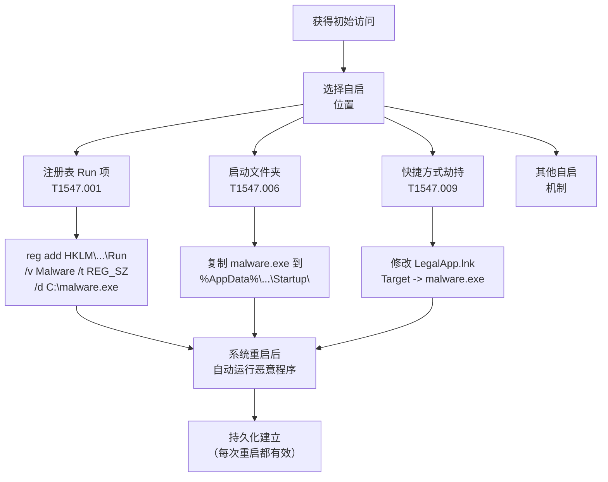

# 启动或登录自动启动执行 (T1547)

## 一句话通俗理解

就像把恶意的"小程序"注册为电脑开机时自动启动的"正经软件"——攻击者在系统启动或用户登录时自动运行恶意程序，确保每次重启后控制权不丢失。

## 难度等级

⭐ **基础** - 理解门槛低，操作简单，各种攻击工具和教程丰富，但检测也相对容易。

## 技术描述

操作系统为合法软件提供了多种"开机自启"机制——注册表启动项、开始菜单启动文件夹、计划任务等。攻击者正是利用这些机制，将恶意程序注册为自动启动项。

**通俗解释：**
你的电脑上有QQ、微信等软件，安装后它们设置了"开机自动启动"——这样每次你打开电脑，它们就自己运行了。攻击者做的事情完全一样：把恶意程序放进"启动文件夹"或添加到注册表的启动项中。唯一不同的是，恶意程序通常是"开机自启后门"，等待连接 C2 服务器接收命令。

**技术原理：**

1. **选择自启动位置**：注册表启动项、启动文件夹、服务、驱动等
2. **注册恶意程序**：将恶意程序路径写入自启动配置
3. **系统重启/用户登录触发**：操作系统在启动或登录时自动加载
4. **恶意程序获得高权限**：触发时以当前用户权限或 SYSTEM 权限运行

**用途与影响：**
自动启动执行是最基础的持久化方法。虽然容易被检测，但也是最广泛使用的——几乎所有恶意软件都会使用至少一种自启动方法。从提权角度看，如果自启动配置在 SYSTEM 上下文中执行，攻击者可以从低权限账户触发高权限操作。

## 子技术列表

**该技术共有 14 种子技术：**

| 子技术ID | 中文名称 | 通俗解释 |
|----------|----------|----------|
| T1547.001 | 注册表自启项 | 在注册表 Run/RunOnce 中添加启动项，最经典的自动启动方法 |
| T1547.002 | 身份验证包 | 注册身份验证包 DLL，在 LSASS 中加载 |
| T1547.003 | 时间提供程序 | 注册 Windows 时间服务扩展 DLL |
| T1547.004 | Winlogon 辅助 DLL | 注册 Winlogon 通知包，在用户登录时加载 |
| T1547.005 | 内核模块和扩展 | 加载恶意的内核驱动程序或内核模块 |
| T1547.006 | 启用启动文件夹 | 在开始菜单启动文件夹中放置快捷方式 |
| T1547.007 | 重新打开应用程序 | 利用 Windows 10/11 的自动重新打开应用功能 |
| T1547.008 | LSASS 驱动 | 在 LSASS 中加载恶意驱动程序 |
| T1547.009 | 快捷方式修改 | 修改系统启动自动加载的快捷方式目标路径 |
| T1547.010 | 端口监视器 | 注册端口监视器 DLL，打印子系统加载时自动执行 |
| T1547.011 | 打印机进程 | 利用打印子系统加载恶意 DLL |
| T1547.012 | 打印处理器 | 注册打印处理器组件 |
| T1547.013 | 启动代理 | macOS 启动代理（LaunchAgent）持久化 |
| T1547.014 | 活动设置修改 | 修改活动设置实现持久化 |

<details>
<summary><strong>展开查看各子技术详细说明</strong></summary>

各子技术详细说明请参阅独立文档：

- [T1547.001 - 注册表自启项](./T1547/T1547.001-Registry-Auto-start-Entry.md) — 在系统的"开机启动清单"上加一行恶意程序的路径。
- [T1547.006 - 启动文件夹](./T1547/T1547.006-Enable-Startup-Folder.md) — 在"启动"文件夹中贴一张"自启纸条"。
- [T1547.009 - 快捷方式修改](./T1547/T1547.009-Shortcut-Modification.md) — 把"开机自启程序"的快捷方式偷偷改成指向恶意软件。

</details>

## 攻击流程



### 注册表自启项注册流程

```
1. 获得足够权限（用户权限即可添加 HKCU，需要管理员添加 HKLM）
   ↓
2. 将恶意程序复制到目标系统（如 C:\Windows\Temp\malware.exe）
   ↓
3. 在注册表中添加自启项：
   reg add "HKCU\Software\Microsoft\Windows\CurrentVersion\Run" /v "WindowsUpdate" /t REG_SZ /d "C:\Windows\Temp\malware.exe"
   ↓
4. 重启系统或注销后重新登录
   ↓
5. malware.exe 自动以当前用户权限启动
   ↓
6. 恶意程序连接 C2 建立控制
```

### 启动文件夹放置流程

```
1. 获得初始访问
   ↓
2. 创建恶意程序的快捷方式
   ↓
3. 将快捷方式复制到启动文件夹：
   copy "C:\Users\victim\AppData\Roaming\Microsoft\Windows\Start Menu\Programs\Startup\LegitApp.lnk"
   ↓
4. 用户下次登录时自动运行恶意程序
   ↓
5. 快捷方式可能伪装成用户安装的合法应用
```

## 真实案例

### 案例1：Emotet 木马使用注册表自启项持久化（持续活跃）

- **时间**: 2018-2025年
- **目标**: 全球各行业
- **攻击组织**: Emotet
- **手法**: Emotet 木马在感染后，在注册表 Run 项中添加自启条目确保持久化。Emotet 使用随机生成的服务名称和路径字符串，增加了签名检测的难度。例如在 `HKCU\Software\Microsoft\Windows\CurrentVersion\Run` 中添加指向 `%AppData%\Roaming\randomstring\malware.exe` 的条目。Emotet 的自启配置在 2024 年被观察到使用基于时间的触发条件，避免在沙箱环境中注册启动项。
- **影响**: 全球数百万台设备感染，多次波次爆发
- **参考链接**: [CISA - Emotet Technical Analysis](https://www.cisa.gov/news-events/cybersecurity-advisories/aa24-001a)

### 案例2：QakBot 使用快捷方式和注册表自启（2023-2024年）

- **时间**: 2023-2024年
- **目标**: 全球金融、制造等行业
- **攻击组织**: QakBot (QBot)
- **手法**: QakBot（QBot）木马在 2023 年使用多阶段自启动策略。初始阶段通过 phishing 邮件传播的 LNK 快捷方式文件触发，感染后将恶意 DLL 注册到注册表 Run 项中。2024 年 QakBot 变种开始使用 Windows 任务计划程序作为辅助自启机制，确保如果注册表自启被清理，恶意软件在下次系统启动时仍能通过计划任务重新安装。
- **影响**: 金融机构遭受大量凭证窃取和数据泄露
- **参考链接**: [Microsoft - QakBot Threats](https://www.microsoft.com/en-us/security/blog/2023/12/15/qakbot-threat-analysis/)

### 案例3：Latrodectus 木马使用启动文件夹持久化（2024年）

- **时间**: 2024年
- **目标**: 北美和欧洲企业
- **攻击组织**: Latrodectus
- **手法**: Latrodectus 木马于 2024 年出现，作为 IcedID 的继承者。感染后在用户启动文件夹中放置恶意的 `.lnk` 快捷方式。该快捷方式指向 PowerShell 命令，PowerShell 从远程服务器下载并执行第二阶段 payload。这种技术利用了快捷方式可以配置图标和描述的特点，将恶意快捷方式伪装成 Microsoft Office 或 PDF 阅读器等合法应用。
- **影响**: 北美和欧洲企业网络渗透
- **参考链接**: [Proofpoint - Latrodectus Malware](https://www.proofpoint.com/us/blog/threat-insight/latrodectus-malware-analysis)

### 案例4：Vidar Stealer 窃密木马使用注册表自启（持续活跃）

- **时间**: 2022-2025年
- **目标**: 全球个人用户和企业
- **攻击组织**: Vidar
- **手法**: Vidar 是专注于浏览器凭证和加密货币钱包的窃密木马。感染后在 `HKCU\Software\Microsoft\Windows\CurrentVersion\RunOnce` 中注册自启，RunOnce 确保在下次登录时执行一次。这种一次性自启机制与 Vidar 的作业型性质匹配——它只需要运行一次即可完成所有数据窃取，不需要长期持久化。
- **影响**: 大量用户的浏览器密码和加密货币被盗
- **参考链接**: [Malwarebytes - Vidar Stealer](https://www.malwarebytes.com/blog/threats/vidar-stealer)

## 红队视角

> ⚠️ **免责声明**：以下内容仅用于合法的安全测试、渗透测试和教育目的。未经授权对他人系统进行测试是违法行为。

### 实战技巧

1. **HKLM vs HKCU**
   HKLM 自启项对所有用户生效（需要管理员权限），HKCU 只对当前用户生效（不需要管理员权限）。攻击低权限用户时使用 HKCU。

2. **伪装合法应用名称**
   在注册表中使用类似 "Microsoft Security Health"、"Windows Update Assistant" 的名称，避免被用户和管理员发现。

3. **使用启动文件夹而不是注册表**
   启动文件夹同样可以实现自启，但不易被脚本化扫描发现。

4. **Run vs RunOnce**
   Run 在每次登录时执行，RunOnce 只在下次登录时执行一次。RunOnce 更隐蔽（执行后自动删除），但不如 Run 持久。

### 常用工具

| 工具名称 | 用途 | 平台 | 链接 |
|----------|------|------|------|
| reg.exe | Windows 注册表操作工具 | Windows | 系统内置 |
| PowerShell | Set-ItemProperty 操作注册表 | Windows | 系统内置 |
| Sysinternals AutoRuns | 查看所有自启配置 | Windows | [Microsoft](https://docs.microsoft.com/en-us/sysinternals/downloads/autoruns) |
| PowerSploit | Persistence 模块 | Windows | [GitHub](https://github.com/PowerShellMafia/PowerSploit) |

### 注意事项

- HKLM 自启需要管理员权限，但提权后使用 HKLM 可以保留更长时间
- 启动文件夹中的文件可以定时清理，但注册表自启更隐蔽
- 安全软件（如 Windows Defender）会监控 Run 和 RunOnce 的变化

## 蓝队视角

### 检测要点

1. **注册表自启项异常添加**
   - 日志来源：Sysmon 事件 ID 13、Windows 安全事件 4657
   - 关注字段：`Run`/`RunOnce` 注册表项的新增或修改
   - 异常特征：非标准名称的自启项、从可疑目录启动、启动项指向临时目录

2. **启动文件夹异常文件**
   - 日志来源：Sysmon 事件 ID 11
   - 关注字段：%AppData%\Microsoft\Windows\Start Menu\Programs\Startup 目录的文件创建
   - 异常特征：可疑的 .lnk 或 .exe 文件出现在启动文件夹

### 监控建议

- 使用 AutoRuns 或类似工具定期审计自启配置
- 监控 Run、RunOnce、Startup 文件夹的变化
- 启用 PowerShell 脚本块日志记录检测注册表修改
- 使用 Windows Defender for Endpoint 监控自启动异常

## 检测建议

### 网络层检测

**检测方法：** 监控自启动进程的异常出站连接。

**具体规则/命令示例：**
```
# 检测启动文件夹中的异常程序出站
alert tcp $HOME_NET any -> $EXTERNAL_NET $HTTP_PORTS (msg:"Startup folder process outbound"; flow:to_server,established; sid:1000011; rev:1;)
```

### 主机层检测

**检测方法：** 监控自启配置变化。

**Windows 事件ID：**
- 事件 ID 13 (Sysmon)：注册表修改
- 事件 ID 11 (Sysmon)：文件创建
- 事件 ID 4657：注册表值修改

**具体命令示例：**
```powershell
# 检查所有注册表自启项
Get-ItemProperty "HKCU:\Software\Microsoft\Windows\CurrentVersion\Run"
Get-ItemProperty "HKLM:\Software\Microsoft\Windows\CurrentVersion\Run"

# 检查启动文件夹
Get-ChildItem "$env:AppData\Microsoft\Windows\Start Menu\Programs\Startup"
```

**用人话说：** 启动或登录自动启动执行是一大类持久化技术的总称，攻击者在系统启动或用户登录时自动执行恶意代码。包括注册表Run键、启动文件夹、Winlogon辅助DLL、内核模块加载、LSASS驱动等。这些机制的共同点是：每次系统启动或用户登录时，恶意代码自动以当前用户的权限或更高权限运行，无需攻击者手动干预。这就像在汽车的点火系统上加装了一个外挂装置——每次打火启动时，外挂自动开始工作。

**Sigma规则示例：**
```yaml
title: Registry Run Key Modification
status: experimental
description: Detects suspicious registry run key modification
logsource:
    category: registry_event
    product: windows
detection:
    selection:
        EventID: 13
        TargetObject|contains: 
            - '\CurrentVersion\Run'
            - '\CurrentVersion\RunOnce'
        Image|contains:
            - '\Temp\'
            - '\Users\'
    condition: selection
level: high
tags:
    - attack.t1547
    - attack.t1547.001
```

## 缓解措施

### 优先级1：关键措施

**措施名称：** 监控和审计自启动配置

**具体实施步骤：**
1. 建立自启动基线并每周审计差异
2. 使用 AppLocker 控制启动文件夹和 Run 项的执行权限
3. 配置 Sysmon 监控 Run/RunOnce 注册表变化

### 优先级2：重要措施

**措施名称：** 最小权限和用户培训

**具体实施步骤：**
1. 限制非管理员用户的软件安装权限
2. 教育用户不轻易启动不明下载的程序
3. 禁用 HKCU Run 项的自动执行（通过 GPO）

### 优先级3：建议措施

**措施名称：** 端点保护

**具体实施步骤：**
1. 部署 EDR 检测异常自启动
2. 启用 Windows Defender 实时保护
3. 使用 AutoRuns 定期审计自启动项目

### MITRE ATT&CK 缓解措施映射

| 缓解措施ID | 缓解措施名称 | 适用性 | 说明 |
|------------|-------------|--------|------|
| M1022 | Restrict File and Directory Permissions | 适用 | 保护启动文件夹 |
| M1026 | Privileged Account Management | 适用 | 限制 Run 项的写入 |
| M1038 | Execution Prevention | 适用 | AppLocker 控制执行权限 |
| M1047 | Audit | 适用 | 审计自启配置变化 |

## 动手实验

> ⚠️ **重要提示**：所有实验必须在隔离的实验室环境中进行，禁止对未授权的真实系统进行测试。

### 实验环境准备

**推荐靶场/实验平台：**

| 平台名称 | 类型 | 难度 | 链接 |
|----------|------|------|------|
| Hack The Box | 虚拟靶场 | 初级 | https://www.hackthebox.com |
| TryHackMe | 虚拟靶场 | 初级 | https://tryhackme.com |

### 实验1：注册表自启项设置（初级）

**实验目标：** 学习添加和移除注册表自启项。

**实验步骤：**
1. 在 HKCU Run 中添加记事本自启：`reg add "HKCU\Software\Microsoft\Windows\CurrentVersion\Run" /v "TestNote" /t REG_SZ /d "notepad.exe"`
2. 重启或注销重新登录
3. 确认记事本自动启动
4. 移除自启项：`reg delete "HKCU\Software\Microsoft\Windows\CurrentVersion\Run" /v "TestNote" /f`

**预期结果：** 登录后记事本自动打开。

**学习要点：** 掌握注册表自启项的基本操作。

### 实验2：启动文件夹操作（初级）

**实验目标：** 学习使用启动文件夹实现自启。

**实验步骤：**
1. 创建记事本的快捷方式：`$WScriptShell = New-Object -ComObject WScript.Shell; $Shortcut = $WScriptShell.CreateShortcut("$env:AppData\Microsoft\Windows\Start Menu\Programs\Startup\Notepad.lnk"); $Shortcut.TargetPath = "notepad.exe"; $Shortcut.Save()`
2. 注销重新登录
3. 确认记事本自动启动
4. 删除启动文件夹中的快捷方式

**预期结果：** 登录后记事本自动打开。

**学习要点：** 掌握启动文件夹的持久化操作。

### 实验3：检测和分析（初级）

**实验目标：** 学习检测系统中的自启项。

**实验步骤：**
1. 使用 reg query 查看所有自启项
2. 使用 Sysinternals AutoRuns 分析自启配置
3. 对比现状与已知基线

**预期结果：** 发现并识别系统中的自启动项。

**学习要点：** 掌握自启项的检测和分析方法。

## 术语解释

| 术语 | 英文原名 | 通俗解释 |
|------|----------|----------|
| 注册表 | Registry | Windows 的系统配置数据库，像大楼的总控制台——记录了所有设置和配置 |
| Run 键 | Run Key | 注册表中指定登录时自动启动程序的配置项，像大楼的"自动启动开关列表" |
| RunOnce 键 | RunOnce Key | 注册表中指定下次登录时运行一次的配置项，执行后自动删除，像"一次性定时任务" |
| 启动文件夹 | Startup Folder | Windows 开始菜单中的一个特殊文件夹，放入的程序会在登录时自动启动 |
| 快捷方式 | Shortcut (.lnk) | 指向程序或文件的快捷图标，像指向某个办公室的"路标" |
| HKCU | HKEY_CURRENT_USER | 当前用户的注册表配置，只影响当前登录的用户 |
| HKLM | HKEY_LOCAL_MACHINE | 所有用户的注册表配置，影响整个系统 |
| 自动启动 | Autostart Execution | 系统启动或用户登录时自动运行程序的行为 |

## 参考资料

### 官方文档

- [MITRE ATT&CK T1547 - Boot or Logon Autostart Execution](https://attack.mitre.org/techniques/T1547/)
- [MITRE ATT&CK T1547.001 - Registry Run Keys](https://attack.mitre.org/techniques/T1547/001/)
- [MITRE ATT&CK T1547.006 - Startup Folder](https://attack.mitre.org/techniques/T1547/006/)
- [MITRE ATT&CK T1547.009 - Shortcut Modification](https://attack.mitre.org/techniques/T1547/009/)

### 安全报告

- [CISA - Emotet Technical Analysis](https://www.cisa.gov/news-events/cybersecurity-advisories/aa24-001a)
- [Microsoft - QakBot Threat Analysis](https://www.microsoft.com/en-us/security/blog/2023/12/15/qakbot-threat-analysis/)
- [Proofpoint - Latrodectus Malware](https://www.proofpoint.com/us/blog/threat-insight/latrodectus-malware-analysis)
- [Malwarebytes - Vidar Stealer](https://www.malwarebytes.com/blog/threats/vidar-stealer)

### 学习资料

- [Microsoft - Run and RunOnce Registry Keys](https://docs.microsoft.com/en-us/windows/win32/setupapi/run-and-runonce-registry-keys)
- [Sysinternals AutoRuns](https://docs.microsoft.com/en-us/sysinternals/downloads/autoruns)
- [Atomic Red Team - T1547 Tests](https://github.com/redcanaryco/atomic-red-team/tree/master/atomics/T1547)
- [PowerSploit - Persistence Module](https://github.com/PowerShellMafia/PowerSploit)
