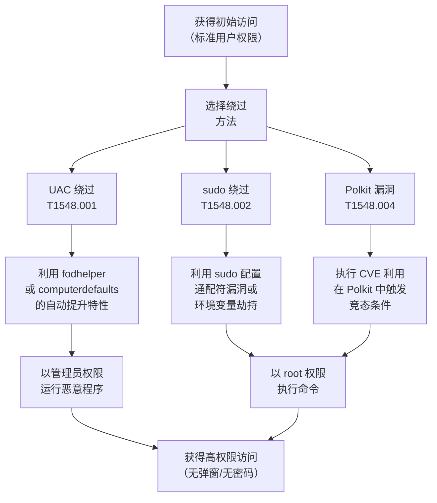

# 滥用权限提升控制机制 (T1548)

## 一句话通俗理解

就像骗过大楼的安保系统，让保安以为你是 VIP——攻击者绕过或利用系统的权限提升控制机制（UAC、sudo），在不被系统阻止的情况下获得管理员权限。

## 难度等级

⭐⭐ **中级** - 需要对 UAC 机制和 sudo 配置有深入理解，但利用工具成熟，具体操作不复杂。

## 技术描述

操作系统有内置的"权限提升控制机制"——在 Windows 上是 UAC（用户账户控制），在 Linux/Mac 上是 sudo 和 su。这些机制的目的是防止恶意程序未经授权就获得管理员权限。攻击者通过绕过或滥用这些机制来提升权限。

**通俗解释：**
在一座高级写字楼里，进入 VIP 区域需要刷卡验证（UAC 弹窗）。攻击者用的方法不是伪造卡，而是：
1. **绕过**：假装"我只是普通的快递员，但送货地址在安保室里面"——使用不需要验证的特殊路径
2. **滥用**：发现某个 VIP 的卡"没锁门"（sudo 配置错误），直接推门进去
3. **欺骗**：在弹窗验证时用一个假的确认框替换真的

**技术原理：**

1. **UAC 绕过**：利用标记为自动提升（auto-elevate）的 COM 对象或微软签名程序，避免 UAC 弹窗
2. **sudo 滥用**：利用 sudo 配置中的安全漏洞（如不安全的 PATH 环境变量、通配符漏洞）提升到 root
3. **BypassUAC**：使用特定的 DLL 注入或注册表修改，使恶意程序在管理员权限下运行而不触发 UAC 弹窗

**用途与影响：**
滥用权限提升控制机制是攻击链条中的关键一步。许多攻击向量只能在低权限下运行，但需要管理员权限才能完成核心目标（如安装持久化后门、修改系统配置）。UAC 绕过技术使得攻击者可以在不触发安全警报（弹窗）的情况下获得管理员权限。

## 子技术列表

**该技术共有 4 个子技术：**

| 子技术ID | 中文名称 | 通俗解释 |
|----------|----------|----------|
| T1548.001 | 绕过 UAC | 欺骗 Windows 让恶意程序以管理员权限运行而不弹窗确认 |
| T1548.002 | 绕过 sudo | 利用 sudo 配置错误在 Linux/Mac 上以 root 权限运行 |
| T1548.003 | Sudo 权限缓存 | 利用 sudo 的"记住密码"特性，在缓存过期前使用 root 权限 |
| T1548.004 | 绕过系统授权组件 | 绕过系统的授权验证框架（如 Polkit） |

<details>
<summary><strong>展开查看各子技术详细说明</strong></summary>

各子技术详细说明请参阅独立文档：

- [T1548.001 - 绕过 UAC](./T1548/T1548.001-Bypass-User-Account-Control.md) — 让 Windows 的"管理员确认弹窗"不弹出来——但程序已经以管理员身份运行了。
- [T1548.002 - 绕过 sudo](./T1548/T1548.002-Bypass-sudo.md) — 发现 sudo 允许的"白名单"程序中有漏洞，利用它偷偷执行其他命令。
- [T1548.003 - Sudo 权限缓存](./T1548/T1548.003-Sudo-Caching.md) — 趁别人刚输入过 sudo 密码的"缓存期"，直接执行 sudo 命令不需要密码。
- [T1548.004 - 绕过系统授权组件](./T1548/T1548.004-Bypass-System-Authorization-Components.md) — 发现大楼的"VIP 认证系统"本身有安全漏洞，利用它获得 VIP 权限。

</details>

## 攻击流程



### UAC 绕过流程（使用 fodhelper.exe）

```
1. 以标准用户身份获得初始访问
   ↓
2. 修改注册表设置恶意命令到特定位置：
   HKCU\Software\Classes\ms-settings\shell\open\command
   ↓
3. 设置 DelegateExecute 为空值
   ↓
4. 启动 fodhelper.exe（微软签名程序，自动提升）
   ↓
5. fodhelper.exe 以管理员权限启动，读取注册表配置
   ↓
6. 触发恶意命令以管理员权限运行
   ↓
7. 整个过程无 UAC 弹窗（完全隐蔽）
```

### sudo 绕过流程

```
1. 获得标准用户 shell 访问
   ↓
2. 检查 sudo 配置：sudo -l
   ↓
3. 找到允许以 root 运行的程序（如 vi、less、more）
   ↓
4. 利用程序漏洞执行 shell 命令：
   sudo vi -c '!bash'
   ↓
5. 获得 root 权限 shell
```

## 真实案例

### 案例1：高级持续性威胁利用 UAC 绕过投递恶意软件（2024年）

- **时间**: 2024年
- **目标**: 多个行业
- **攻击组织**: 多个 APT 组织
- **手法**: 2024 年，多个 APT 组织使用了不同的 UAC 绕过技术来投递恶意软件。一种常见的方法是使用 CMSTP（Microsoft Connection Manager Profile Installer）绕过 UAC——利用微软签名的 CMSTP 程序加载恶意 INF 文件，以管理员权限安装 DLL 后门，整个过程无需用户交互。这种方法利用了 Windows 内置的自动提升程序，是 2024 年 UAC 绕过的主流手法之一。
- **影响**: 多个 APT 组织能够绕过端点保护进行无弹窗提权
- **参考链接**: [Mandiant - UAC Bypass Techniques 2024](https://www.mandiant.com/resources/blog/uac-bypass-techniques-2024)

### 案例2：CVE-2021-3560 - Polkit 授权绕过漏洞（2021-2024年持续活跃）

- **时间**: 2021-2024年
- **目标**: 所有运行 Polkit 的 Linux 系统
- **攻击组织**: 多个攻击组织
- **手法**: CVE-2021-3560 是 Polkit 授权框架中的内存损坏漏洞，允许非特权用户在标准 Linux 系统上获得 root 权限。攻击者利用 polkitd 服务在检查授权时的竞态条件，通过发送部分完成的 D-Bus 消息，绕过授权检查。该漏洞影响多个 Linux 发行版（Ubuntu、RHEL、Debian 等）。2022-2024 年间又有类似漏洞被发现（CVE-2022-22645、CVE-2024-21819），继续影响未修补的系统。
- **影响**: 数百万台 Linux 系统面临本地提权风险
- **参考链接**: [Red Hat - CVE-2021-3560](https://access.redhat.com/security/cve/cve-2021-3560)

### 案例3：sudo 通配符漏洞被用于提权（持续活跃）

- **时间**: 2018-2025年
- **目标**: Linux 服务器配置不当的 sudo 规则
- **攻击组织**: 多个攻击者
- **手法**: 当 sudoers 配置文件中使用通配符（如 `*`）来授权特定命令时，攻击者可以通过命令行参数注入或环境变量操纵来绕过限制。例如，如果 sudoers 文件允许 `sudo /usr/bin/vim`，攻击者可以通过 `sudo vim -c '!bash'` 获得 root shell。类似的技术也适用于其他编辑器、文件管理器和压缩工具。
- **影响**: 大量配置不当的 Linux 服务器被攻击者用于提权
- **参考链接**: [Sudo - Security Advisories](https://www.sudo.ws/security/advisories/)

### 案例4：FodHelper UAC 绕过被广泛采用（2019-2025年）

- **时间**: 2019-2025年
- **目标**: Windows 10/11 系统
- **攻击组织**: 多个恶意软件和红队
- **手法**: FodHelper（Windows Features on Demand helper）是 Windows 自带的一个微软签名程序，具有自动提升特性。攻击者通过修改注册表 `HKCU\Software\Classes\ms-settings\shell\open\command` 指定要执行的恶意命令，然后启动 fodhelper.exe。由于 fodhelper 是微软签名程序，UAC 自动允许其以管理员权限运行，恶意命令也随之以管理员权限执行。这种方法自 2019 年被公开后，至今仍被广泛使用。
- **影响**: 几乎所有未打补丁的 Windows 系统都可能被绕过 UAC
- **参考链接**: [Red Canary - Common UAC Bypass Techniques](https://redcanary.com/blog/uac-bypass-techniques/)

## 红队视角

> ⚠️ **免责声明**：以下内容仅用于合法的安全测试、渗透测试和教育目的。未经授权对他人系统进行测试是违法行为。

### 实战技巧

1. **fodhelper.exe 是最稳定的 UAC 绕过方法**
   适用于 Windows 10 及 Windows 11，操作简单，不需要额外的 DLL 或驱动。

2. **检查 sudo 配置文件**
   使用 `sudo -l` 列出当前用户的 sudo 权限，寻找可以滥用的程序。

3. **利用环境变量劫持 sudo**
   如果 sudo 允许运行的程序通过相对路径调用其他程序（如脚本中使用 `cp` 而不是 `/bin/cp`），可以通过修改 `PATH` 环境变量替换为恶意程序。

4. **Polkit 漏洞利用**
   使用公开的 PoC 脚本来检测 Polkit 漏洞，但注意这些漏洞已被大多数 Linux 发行版修补。

### 常用工具

| 工具名称 | 用途 | 平台 | 链接 |
|----------|------|------|------|
| UACME | UAC 绕过工具集合 | Windows | [GitHub](https://github.com/hfiref0x/UACME) |
| PowerSploit | UAC 绕过 PowerShell 模块 | Windows | [GitHub](https://github.com/PowerShellMafia/PowerSploit) |
| LinPEAS | Linux 提权枚举脚本 | Linux | [GitHub](https://github.com/carlospolop/PEASS-ng) |
| WinPEAS | Windows 提权枚举脚本 | Windows | [GitHub](https://github.com/carlospolop/PEASS-ng) |

### 注意事项

- UAC 绕过仅适用于 Windows 10/11 的默认 UAC 级别（Notify me only when apps try to make changes to my computer）
- 将 UAC 级别提高到最高可以阻止大多数绕过技术
- sudo 绕过需要先获得标准用户访问
- Polkit 漏洞利用可能触发系统稳定性问题

## 蓝队视角

### 检测要点

1. **UAC 绕过检测**
   - 日志来源：Windows 安全事件、Sysmon
   - 关注字段：异常的程序执行链（如从 fodhelper.exe 启动 cmd.exe）
   - 异常特征：标准用户账户触发了管理员权限的进程创建

2. **sudo 滥用检测**
   - 日志来源：Linux /var/log/auth.log、auditd
   - 关注字段：sudo 命令历史、异常的命令组合
   - 异常特征：sudo 调用了可以逃逸到 shell 的程序（vi、less、more 等）

3. **Polkit 漏洞利用检测**
   - 日志来源：Linux auditd、/var/log/syslog
   - 关注字段：polkitd 服务异常请求
   - 异常特征：Polkit 进程的崩溃日志、异常 D-Bus 消息

### 监控建议

- 监控信任的微软签名程序（fodhelper.exe、computerdefaults.exe）异常启动行为
- 审计 sudo 配置文件中通配符和不安全命令的使用
- 及时修补 Polkit 相关 CVE 漏洞
- 部署 EDR 检测 UAC 绕过行为模式

## 检测建议

### 网络层检测

**检测方法：** 监控 UAC 绕过后提权进程的异常出站连接。

**具体规则/命令示例：**
```
# 检测从 fodhelper.exe 启动的进程出站
alert tcp $HOME_NET any -> $EXTERNAL_NET $HTTP_PORTS (msg:"Fodhelper triggered admin process"; flow:to_server,established; content:"fodhelper"; sid:1000012; rev:1;)
```

### 主机层检测

**检测方法：** 监控 UAC 绕过相关的注册表和进程创建。

**Windows 事件ID：**
- 事件 ID 1 (Sysmon)：进程创建（监控 fodhelper 启动 cmd/powershell）
- 事件 ID 4688：进程创建（监控提权后进程）
- 事件 ID 13 (Sysmon)：注册表修改（监控 ms-settings 注册表）

**具体命令示例：**
```powershell
# 检查常见 UAC 绕过注册表位置
Get-ItemProperty "HKCU:\Software\Classes\ms-settings\shell\open\command"
Get-ItemProperty "HKCU:\Software\Classes\mscfile\shell\open\command"
Get-ItemProperty "HKCU:\Software\Classes\mshta\shell\open\command"
```

**用人话说：** 滥用提升控制机制是攻击者绕过操作系统权限验证机制的技术总称。包括绕过Windows UAC（用户账户控制）、绕过sudo密码验证、利用sudo缓存、以及绕过Polkit等系统授权组件。目标是以低权限用户的身份执行需要管理员/root权限的操作，而不弹出确认提示或输入密码。这就像骗过大楼的门卫让他以为你是VIP——不需要真正的VIP卡，只需要让门禁系统误判你的身份。

**Sigma规则示例：**
```yaml
title: FodHelper UAC Bypass
status: experimental
description: Detects FodHelper UAC bypass technique
logsource:
    category: registry_event
    product: windows
detection:
    selection:
        EventID: 13
        TargetObject|contains: 'ms-settings\shell\open\command'
    condition: selection
level: critical
tags:
    - attack.t1548
    - attack.t1548.001
```

## 缓解措施

### 优先级1：关键措施

**措施名称：** 提高 UAC 级别和配置安全策略

**具体实施步骤：**
1. 将 UAC 级别设置为最高（"Always notify"）
2. 配置本地安全策略限制自动提升的应用程序
3. 监控和限制 fodhelper.exe 等自动提升程序的异常使用

### 优先级2：重要措施

**措施名称：** sudo 安全配置

**具体实施步骤：**
1. 避免在 sudoers 中使用通配符和危险的程序（vi、less、more）
2. 使用绝对路径指定 sudo 允许的程序
3. 定期审计 sudo 配置文件：`sudo -l` 检查

### 优先级3：建议措施

**措施名称：** 系统补丁和漏洞管理

**具体实施步骤：**
1. 及时安装 Polkit 相关安全更新
2. 部署 Linux 安全补丁管理策略
3. 使用漏洞扫描工具检查关键系统

### MITRE ATT&CK 缓解措施映射

| 缓解措施ID | 缓解措施名称 | 适用性 | 说明 |
|------------|-------------|--------|------|
| M1026 | Privileged Account Management | 适用 | 限制管理员账户的日常使用 |
| M1028 | Operating System Configuration | 适用 | 高 UAC 级别和 sudo 安全配置 |
| M1054 | Software Configuration | 部分适用 | 控制自动提升应用程序列表 |
| M1051 | Update Software | 适用 | Polkit 和其他授权框架的补丁 |

## 动手实验

> ⚠️ **重要提示**：所有实验必须在隔离的实验室环境中进行，禁止对未授权的真实系统进行测试。

### 实验环境准备

**推荐靶场/实验平台：**

| 平台名称 | 类型 | 难度 | 链接 |
|----------|------|------|------|
| Hack The Box | 虚拟靶场 | 中级 | https://www.hackthebox.com |
| TryHackMe | 虚拟靶场 | 初级 | https://tryhackme.com |

### 实验1：检查 UAC 配置和绕过测试（初级）

**实验目标：** 理解 UAC 的工作机制和绕过原理。

**实验步骤：**
1. 查看当前 UAC 级别
2. 测试 fodhelper.exe UAC 绕过方法
3. 观察 UAC 绕过后的进程上下文

**预期结果：** 成功绕过 UAC 以管理员权限运行程序。

**学习要点：** 掌握 UAC 绕过的基本原理。

### 实验2：检查 Linux sudo 配置（初级）

**实验目标：** 学习检查和分析 sudoer 配置。

**实验步骤：**
1. 查看当前用户的 sudo 权限：`sudo -l`
2. 检查 sudoers 文件中的通配符和潜在误配置
3. 测试利用 sudo 逃逸到 shell

**预期结果：** 找出 sudo 配置中的安全问题。

**学习要点：** 掌握 sudo 安全配置和审计方法。

### 实验3：检测 UAC 绕过（中级）

**实验目标：** 学习通过 Sysmon 检测 UAC 绕过。

**实验步骤：**
1. 配置 Sysmon
2. 执行 UAC 绕过操作
3. 查看 Sysmon 日志检测异常进程

**预期结果：** Sysmon 记录下 fodhelper 启动 cmd.exe 的事件。

**学习要点：** 掌握 UAC 绕过的检测方法。

## 术语解释

| 术语 | 英文原名 | 通俗解释 |
|------|----------|----------|
| UAC | User Account Control | Windows 的用户账户控制，在程序请求管理员权限时弹出确认窗口，像大楼安保的"VIP 确认"流程 |
| 自动提升 | Auto Elevate | 微软签名程序自带的安全特性，允许直接获得管理员权限而不触发 UAC 弹窗 |
| sudo | Superuser Do | Linux/Unix 系统中以另一个用户（通常是 root）身份执行命令的机制 |
| sudoers | - | Linux 中配置 sudo 权限的文件（/etc/sudoers），像一份"谁可以用管理员权限做什么"的名单 |
| Polkit | - | Linux 系统的授权框架，控制非特权进程如何与特权进程交互，像大楼的"通用认证系统" |
| D-Bus | - | Linux 中进程间通信的消息总线系统，像大楼内部各部门之间的"对讲机" |
| fodhelper | Feature on Demand Helper | Windows 的系统功能管理工具，被攻击者滥用于 UAC 绕过 |
| 通配符漏洞 | Wildcard Injection | sudo 配置中使用 `*` 通配符导致的安全漏洞，攻击者可以利用它执行预期之外的命令 |

## 参考资料

### 官方文档

- [MITRE ATT&CK T1548 - Abuse Elevation Control Mechanism](https://attack.mitre.org/techniques/T1548/)
- [MITRE ATT&CK T1548.001 - Bypass UAC](https://attack.mitre.org/techniques/T1548/001/)
- [MITRE ATT&CK T1548.002 - Bypass and Abuse Sudo](https://attack.mitre.org/techniques/T1548/002/)
- [MITRE ATT&CK T1548.004 - Bypass System Authorisation Component](https://attack.mitre.org/techniques/T1548/004/)

### 安全报告

- [Mandiant - UAC Bypass Techniques 2024](https://www.mandiant.com/resources/blog/uac-bypass-techniques-2024)
- [Red Hat - CVE-2021-3560 Polkit](https://access.redhat.com/security/cve/cve-2021-3560)
- [Red Canary - Common UAC Bypass Techniques](https://redcanary.com/blog/uac-bypass-techniques/)
- [Sudo - Security Advisories](https://www.sudo.ws/security/advisories/)

### 学习资料

- [Microsoft - How User Account Control Works](https://docs.microsoft.com/en-us/windows/security/identity-protection/user-account-control/how-user-account-control-works)
- [Sudoers Manual](https://www.sudo.ws/man/1.8.15/sudoers.man.html)
- [Atomic Red Team - T1548 Tests](https://github.com/redcanaryco/atomic-red-team/tree/master/atomics/T1548)
- [UACME - UAC Bypass Tool Collection](https://github.com/hfiref0x/UACME)
