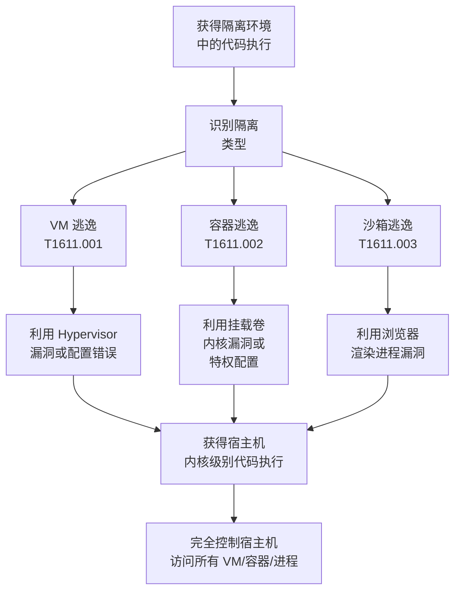

# 逃逸到宿主机 (T1611)

## 一句话通俗理解

就像住在监狱的牢房里，但发现了一个通风管道可以从牢房"逃到"监狱管理员的办公室——攻击者从虚拟机、容器或应用沙箱中"逃逸"出来，获得底层宿主机或操作系统的控制权。

## 难度等级

⭐⭐⭐ **高级** - 需要对虚拟化、容器化或应用程序沙箱底层技术有深入理解，通常需要利用零日漏洞或复杂的配置漏洞。

## 技术描述

逃逸到宿主机是攻击者从隔离环境中突破到宿主系统的一类技术。常见的隔离环境包括虚拟机（VM）、容器（Docker/容器运行时）、应用程序沙箱（如 Chromium sandbox、Cloudflare Workers）等。

**通俗解释：**
想象一下，你在一个高度安保的"隔离室"里——这个房间的墙壁、门、窗户都是加固的（这是虚拟机或容器的安全隔离）。但攻击者发现：
1. 通风管道连接到了管理员的办公室（利用虚拟化软件的漏洞）
2. 墙上的某块砖是可以推动的（容器配置错误）
3. 管道的尺寸正好可以爬过去（共享内核的漏洞）

一旦逃逸成功，攻击者从"囚犯"变成了"监狱长"——控制整个宿主机和上面的所有虚拟机/容器。

**技术原理：**

1. **虚拟化逃逸**：利用虚拟机管理程序（Hypervisor）的漏洞，在虚拟机内执行恶意代码并突破到宿主机
2. **容器逃逸**：利用共享内核、挂载卷或 Docker 配置错误，从容器突破到宿主机
3. **沙箱逃逸**：利用浏览器或应用程序沙箱的漏洞，突破进程隔离
4. **硬件逃逸**：利用 GPU、网卡等硬件虚拟化的漏洞

**用途与影响：**
逃逸是最严重的提权——攻击者从受限制的环境中完全突破，获得宿主机的最高控制权。在云环境中，一次成功的容器或 VM 逃逸可能导致多租户数据泄露（影响同宿主机的其他用户）。

## 子技术列表

**该技术共有 4 个子技术：**

| 子技术ID | 中文名称 | 通俗解释 |
|----------|----------|----------|
| T1611.001 | 虚拟机逃逸 | 从客户虚拟机突破到虚拟机管理程序或宿主机 |
| T1611.002 | 容器逃逸 | 从 Docker/容器运行时突破到宿主机 |
| T1611.003 | 应用程序沙箱逃逸 | 从浏览器或应用程序沙箱中逃逸到操作系统 |
| T1611.004 | 硬件/外设隔离逃逸 | 利用 GPU、USB、网络设备等硬件虚拟化漏洞逃逸 |

<details>
<summary><strong>展开查看各子技术详细说明</strong></summary>

### T1611.001 - 虚拟机逃逸

**通俗理解：** 从 VM 虚拟机中"钻出来"到宿主机上。

**详细说明：** 虚拟机管理程序（Hypervisor）是运行在宿主机上的软件层，负责管理虚拟机的 CPU、内存和 I/O 操作。虚拟机逃逸漏洞通常出现在 Hypervisor 处理特定指令或设备模拟时。最著名的例子是 CVE-2017-5715（Spectre）和 CVE-2023-20871（VMware Escape），攻击者在虚拟机中执行恶意代码，利用 Hypervisor 的内存处理漏洞突破隔离。

### T1611.002 - 容器逃逸

**通俗理解：** 从 Docker 容器中"走出来"，进入宿主机。

**详细说明：** 容器共享宿主机的内核，但通过命名空间和控制组（cgroups）隔离。容器逃逸通常利用：
1. 挂载卷越权（如将宿主机根目录挂载到容器中）
2. 内核漏洞（如 CVE-2022-0492、CVE-2024-1086）
3. 容器运行时配置错误（如 privileged 模式、cap_sys_admin）
4. 不安全的 Docker.sock 访问

### T1611.003 - 应用程序沙箱逃逸

**通俗理解：** 从浏览器的"安全牢笼"中跳出来，进入操作系统中。

**详细说明：** 浏览器沙箱通过进程隔离和限制系统调用来保护操作系统不被恶意网页代码影响。应用程序沙箱逃逸利用渲染进程或浏览器内核中的漏洞，绕过这些限制，执行系统级操作。

</details>

## 攻击流程



### 典型的容器逃逸流程

```
1. 在容器中获得代码执行权限（通常通过 Web 应用漏洞）
   ↓
2. 检查容器中的特权配置：
   - 是否以 --privileged 模式运行
   - 是否挂载了宿主机敏感目录（/var/run/docker.sock）
   - 是否有额外的 cap_sys_admin 能力
   ↓
3. 根据配置选择逃逸方法：
   - Docker.sock：在容器中创建新容器，挂载整个宿主机文件系统
   - Privileged 模式：使用 nsenter 或 mount 命令进入宿主机命名空间
   - 内核漏洞：利用 Linux 内核提权漏洞（如 CVE-2022-0492）
   ↓
4. 在宿主机上获得 root 权限 shell
   ↓
5. 访问宿主机上的所有内容
```

### 典型 VM 逃逸流程

```
1. 在 VM 中获得管理员权限
   ↓
2. 收集宿主机 Hypervisor 的信息（ESXi、Xen、KVM 等）
   ↓
3. 找到匹配的逃逸漏洞（0day 或未修补漏洞）
   ↓
4. 向 Hypervisor 发送恶意指令（如异常的 vCPU 指令）
   ↓
5. 触发 Hypervisor 漏洞，在宿主机内核中执行代码
   ↓
6. 破坏 VM 隔离，获得宿主机控制权
```

## 真实案例

### 案例1：CVE-2024-1086 容器逃逸（2024年）

- **时间**: 2024年1月
- **目标**: Linux 容器环境
- **攻击组织**: 安全研究者（公开 PoC）
- **手法**: CVE-2024-1086 是 Linux 内核 netfilter 子系统中的一个 use-after-free 漏洞，影响内核版本 3.15-6.8。攻击者通过构造恶意的 nftables 规则触发漏洞，获得内核级别的代码执行能力。在容器环境中，该漏洞允许攻击者突破容器的命名空间隔离，在宿主机内核中执行代码。公开的 PoC 利用工具可以被集成到容器攻击流程中。
- **影响**: 数百万个 Linux 容器环境面临逃逸风险
- **参考链接**: [NVD - CVE-2024-1086](https://nvd.nist.gov/vuln/detail/CVE-2024-1086)

### 案例2：CVE-2023-20871 VMware Workstation 逃逸（2023年）

- **时间**: 2023年8月
- **目标**: VMware Workstation 和 Fusion
- **攻击组织**: Alex Nikitin（安全研究者）
- **手法**: CVE-2023-20871 是 VMware Workstation 和 Fusion 中的一个严重漏洞，允许具有 VM 管理权限的攻击者通过虚拟机管理接口发送恶意指令，导致 out-of-bounds 读/写，进而从 VM 逃逸到宿主机。
- **影响**: 数千个 VMware 环境面临 VM 逃逸风险
- **参考链接**: [VMware Security Advisory VMSA-2023-0019](https://www.vmware.com/security/advisories/VMSA-2023-0019.html)

### 案例3：S3 Ep.12 利用 Docker.sock 进行容器逃逸（持续活跃）

- **时间**: 2019-2025年
- **目标**: 配置不当的 Docker 容器
- **攻击组织**: 多个攻击者和红队
- **手法**: 当 Docker 容器中的 /var/run/docker.sock 被挂载到容器中时，容器内的攻击者可以使用 Docker CLI 或 API 创建新容器。关键操作是创建挂载了宿主机根目录（/）的新容器，这样攻击者就可以在宿主机文件系统上执行任意操作。
- **影响**: 大量 CI/CD 环境、开发环境被利用
- **参考链接**: [Docker Security - Docker.sock](https://docs.docker.com/engine/security/security/#docker-socket)

### 案例4：GHOSTTRACKER - 云环境逃逸框架（2024年安全研究）

- **时间**: 2024年
- **目标**: AWS Nitro 和 GCP Shielded VM
- **攻击组织**: 安全研究者
- **手法**: 安全研究者在 2024 年 Black Hat 大会上展示了一个云环境逃逸框架，利用侧信道攻击（Side Channel）来推断和突破云虚拟化环境的隔离。该研究揭示了即使是最先进的云虚拟化（如 AWS Nitro）也可能受到基于缓存的侧信道攻击，从而在相邻 VM 之间传输信息。
- **影响**: 云服务提供商加强了侧信道缓解措施
- **参考链接**: [Black Hat 2024 - GHOSTTRACKER](https://www.blackhat.com/us-24/briefings/schedule/)

## 红队视角

> ⚠️ **免责声明**：以下内容仅用于合法的安全测试、渗透测试和教育目的。未经授权对他人系统进行测试是违法行为。

### 实战技巧

1. **容器逃逸首选 Docker.sock**
   Docker.sock 挂载是最简单的逃逸路径，在容器内运行 Docker 命令即可创建特权容器。

2. **使用 nsenter 从 Privileged 容器逃逸**
   特权模式（--privileged）容器拥有全部能力，可以使用 nsenter 进入宿主机命名空间。

3. **内核漏洞利用**
   使用公开的 Linux 内核提权漏洞（如 CVE-2024-1086、CVE-2022-0492）进行容器逃逸。

4. **VM 逃逸需要准备**
   VM 逃逸通常需要 0day 漏洞或特定版本的 VMware/VirtualBox，实战中不常见。

### 常用工具

| 工具名称 | 用途 | 平台 | 链接 |
|----------|------|------|------|
| CDK | 容器渗透和逃逸工具集 | Linux | [GitHub](https://github.com/cdk-team/CDK) |
| AmIcontained | 容器逃逸检测工具 | Linux | [GitHub](https://github.com/genuinetools/amicontained) |
| DeepCe | 容器逃逸枚举工具 | Linux | [GitHub](https://github.com/stealthcopter/deepce) |
| Container Escape Check | 容器逃逸检测 | Linux | [GitHub](https://github.com/gruntwork-io/container-escape-check) |

### 注意事项

- 容器逃逸在实际渗透测试中比 VM 逃逸更常见
- 大多数云服务商（AWS、Azure、GCP）已经配置了安全的容器运行时
- VM 逃逸漏洞的价值极高（通常价值 10 万-100 万美元的赏金）
- 逃逸操作可能触发云平台的异常检测，需要快速完成

## 蓝队视角

### 检测要点

1. **容器逃逸检测**
   - 日志来源：容器运行时审计日志、Linux 内核日志、auditd
   - 关注字段：异常的命名空间操作（nsenter、unshare）、容器创建事件
   - 异常特征：容器内进程访问了宿主机级别的资源路径

2. **VM 逃逸检测**
   - 日志来源：Hypervisor 日志、VM 控制台日志
   - 关注字段：异常的 VM 设备 I/O、Hypervisor 进程崩溃
   - 异常特征：VM 内部触发了 Hypervisor 级别的告警

3. **沙箱逃逸检测**
   - 日志来源：应用程序日志、操作系统安全审计
   - 关注字段：沙箱进程触发了意外的系统调用
   - 异常特征：低权限进程访问了高权限资源

### 监控建议

- 使用 Falco 或 Tracee 等容器运行时安全工具检测容器逃逸行为
- 配置 seccomp 策略限制容器可用的系统调用
- 监控异常的 nsenter、mount、unshare 命令使用
- 使用内核审计（auditd）跟踪 namespace 操作

## 检测建议

### 网络层检测

**检测方法：** 监控容器或 VM 逃逸后的横向移动流量。

**具体规则/命令示例：**
```
# 检测从容器中访问宿主机 Docker API
alert tcp $CONTAINER_NET any -> $DOCKER_HOST 2375 (msg:"Container accessing Docker API"; sid:1000013; rev:1;)
```

### 主机层检测

**检测方法：** 监控命名空间操作和容器创建事件。

**Linux 日志：**
- 检查 /var/log/syslog 和 /var/log/kern.log 中的异常
- 使用 auditd 监控 sched_process_exec 事件
- 内核检测：检查 namespace ID 的变化

**具体命令示例：**
```bash
# 检查容器中的挂载点
mount | grep -E "(docker|kubepods)"

# 检查内核日志中的异常
dmesg | grep -i "namespace\|container\|escape"

# 使用 Falco 检查逃逸行为（如果已安装）
falco --list
```

### 应用层检测

**Falco 规则示例：**
```yaml
title: Container Escape via Mount Namespace
description: Detects attempts to escape container by manipulating mount namespace
rules:
- rule: Container Escape Detected
  desc: Process in container attempted nsenter or mount namespace escape
  condition: >
    container and
    evt.type in (nsenter, mount, pivot_root) and
    not proc.name in (systemd, runc)
  output: "Container escape attempt (%user.name %proc.name %evt.type)"
  priority: CRITICAL
  tags: [container, mitre_escape]
```

### Sigma规则示例

```yaml
title: Container Escape via NSenter
status: experimental
description: Detects nsenter usage within containers for potential host escape
logsource:
    category: process_creation
    product: linux
detection:
    selection:
        Image|endswith: '/nsenter'
        CommandLine|contains:
            - '--target'
            - '--mount'
            - '--pid'
    condition: selection
level: high
tags:
    - attack.t1611
    - attack.privilege_escalation
```

```yaml
title: Docker Socket Mount Detection
status: experimental
description: Detects processes accessing Docker socket within containers
logsource:
    category: process_creation
    product: linux
detection:
    selection:
        Image|endswith:
            - '/docker'
            - '/kubectl'
        CommandLine|contains:
            - '/var/run/docker.sock'
            - '/run/docker.sock'
    condition: selection
level: critical
tags:
    - attack.t1611
    - attack.t1611.002
```

## 缓解措施

### 优先级1：关键措施

**措施名称：** 容器安全配置

**具体实施步骤：**
1. 禁止以 Privileged 模式运行容器
2. 不要将 Docker.sock 挂载到容器中
3. 使用只读根文件系统运行容器
4. 应用 seccomp、AppArmor 或 SELinux 限制容器能力

### 优先级2：重要措施

**措施名称：** 内核和安全更新

**具体实施步骤：**
1. 及时更新 Linux 内核以修补逃逸漏洞
2. 更新容器运行时（Docker、containerd 等）到最新版本
3. 更新虚拟化平台（VMware、Hyper-V、KVM）补丁

### 优先级3：建议措施

**措施名称：** 运行时安全监控

**具体实施步骤：**
1. 部署 Falco 或 Tracee 监控容器异常行为
2. 使用 Kubernetes Pod Security Standards
3. 配置容器镜像扫描和准入控制

### MITRE ATT&CK 缓解措施映射

| 缓解措施ID | 缓解措施名称 | 适用性 | 说明 |
|------------|-------------|--------|------|
| M1019 | Thrwart Container Escape | 适用 | 容器安全配置和运行时监控 |
| M1026 | Privileged Account Management | 适用 | 限制运行特权容器的能力 |
| M1030 | Network Segmentation | 适用 | 隔离不同安全等级的容器 |
| M1047 | Audit | 适用 | 容器运行时行为审计 |

## 动手实验

> ⚠️ **重要提示**：所有实验必须在隔离的实验室环境中进行，禁止对未授权的真实系统进行测试。

### 实验环境准备

**推荐靶场/实验平台：**

| 平台名称 | 类型 | 难度 | 链接 |
|----------|------|------|------|
| Hack The Box | 虚拟靶场 | 高级 | https://www.hackthebox.com |
| TryHackMe | 虚拟靶场 | 中级 | https://tryhackme.com |
| PortSwigger Web Security Academy | Web 安全 | 中级 | https://portswigger.net/web-security |

### 实验1：容器逃逸 - Docker.sock 挂载（中级）

**实验目标：** 理解 Docker.sock 挂载导致的容器逃逸原理。

**实验步骤：**
1. 启动一个挂载了 Docker.sock 的容器
2. 在容器内检查 Docker.sock 是否存在
3. 使用 Docker CLI 创建新容器
4. 挂载宿主机根目录到新容器中

**预期结果：** 成功访问宿主机的文件系统。

**学习要点：** 掌握 Docker.sock 逃逸机制。

### 实验2：容器逃逸 - 特权模式（中级）

**实验目标：** 理解特权模式容器的逃逸原理。

**实验步骤：**
1. 以 Privileged 模式启动一个测试容器
2. 在容器内检查能力列表
3. 使用 nsenter 进入宿主机命名空间
4. 在宿主机上执行命令

**预期结果：** 成功突破容器隔离进入宿主机。

**学习要点：** 掌握特权容器逃逸方法。

### 实验3：使用 Falco 检测容器逃逸（高级）

**实验目标：** 学习使用 Falco 检测容器逃逸行为。

**实验步骤：**
1. 安装 Falco 运行时安全工具
2. 配置 Falco 规则检测逃逸
3. 执行逃逸操作
4. 查看 Falco 告警

**预期结果：** Falco 成功检测并报告逃逸行为。

**学习要点：** 掌握容器逃逸的检测方法。

## 术语解释

| 术语 | 英文原名 | 通俗解释 |
|------|----------|----------|
| 容器逃逸 | Container Escape | 从 Docker/容器环境突破到宿主机的过程，像从公寓房间"逃到"楼道里 |
| VM 逃逸 | VM Escape | 从虚拟机突破到宿主机的过程，像从一间"模拟房间"真正出来到实体世界 |
| Hypervisor | - | 管理和运行虚拟机的软件层，像大楼的"物业管理软件"——管理每个单元 |
| 命名空间 | Namespace | Linux 内核隔离资源（进程、网络、挂载点）的机制，像每个房间的"独立区域" |
| 特权容器 | Privileged Container | 拥有几乎全部能力的容器，没有命名空间隔离，像没有门的房间 |
| Docker.sock | - | Docker 守护进程的 Unix 套接字，通过它可以控制 Docker，像物业管理处的"万能钥匙" |
| seccomp | Secure Computing Mode | Linux 限制系统调用的安全机制，像给程序设置了一个"允许说话的内容清单" |
| nsenter | Namespace Enter | Linux 命令，用于进入其他进程的命名空间，像"空间穿越器" |
| 沙箱 | Sandbox | 用于隔离不可信代码的执行环境，像"安全观察室"——让可疑代码在里面运行但不影响外面 |

## 参考资料

### 官方文档

- [MITRE ATT&CK T1611 - Escape to Host](https://attack.mitre.org/techniques/T1611/)
- [MITRE ATT&CK T1611.002 - Container Escape](https://attack.mitre.org/techniques/T1611/002/)
- [MITRE ATT&CK T1611.003 - Application Sandbox Escape](https://attack.mitre.org/techniques/T1611/003/)

### 安全报告

- [NVD - CVE-2024-1086 Netfilter Escape](https://nvd.nist.gov/vuln/detail/CVE-2024-1086)
- [VMware Security Advisory VMSA-2023-0019](https://www.vmware.com/security/advisories/VMSA-2023-0019.html)
- [Black Hat 2024 - GHOSTTRACKER Cloud Escape](https://www.blackhat.com/us-24/briefings/schedule/)

### 学习资料

- [Docker Security](https://docs.docker.com/engine/security/security/)
- [Container Escape Techniques](https://www.crowdstrike.com/blog/container-escape-techniques/)
- [Atomic Red Team - T1611 Tests](https://github.com/redcanaryco/atomic-red-team/tree/master/atomics/T1611)
- [Falco - Runtime Security](https://falco.org/)
- [CDK - Container Attack Toolkit](https://github.com/cdk-team/CDK)
